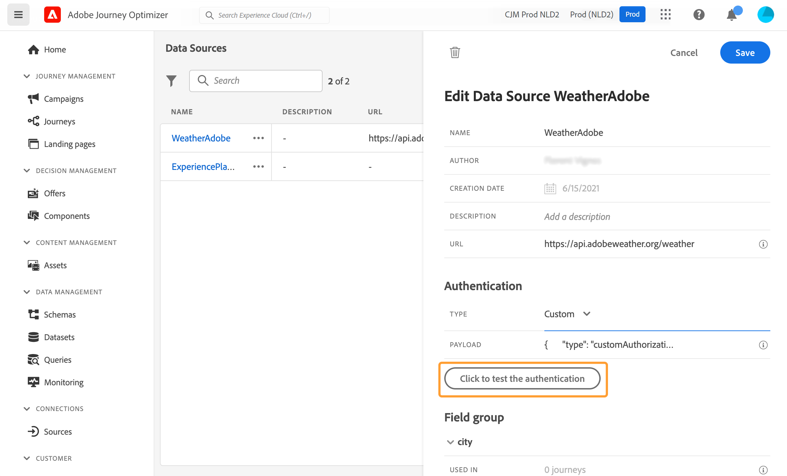
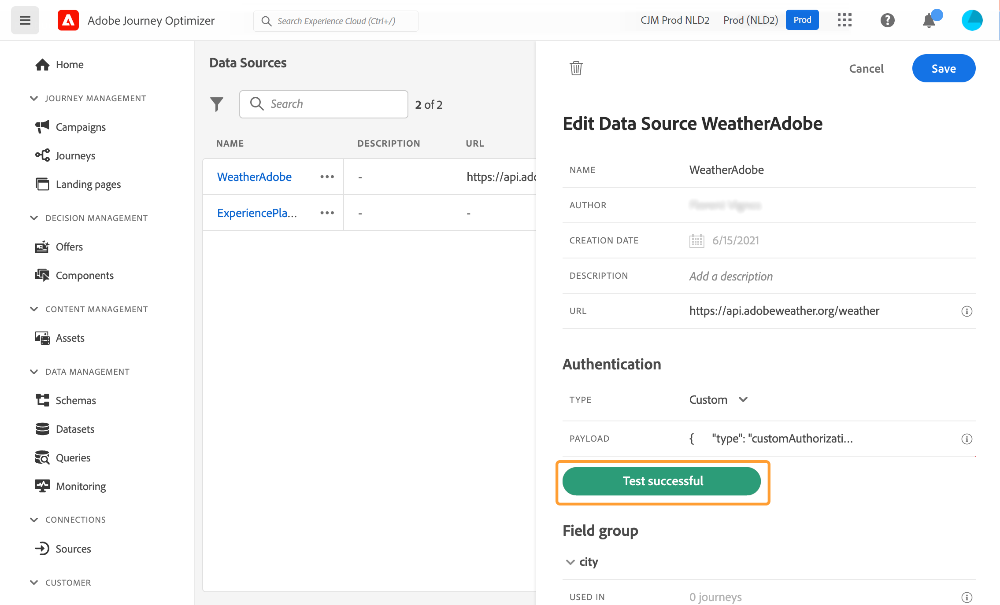

# Externe databronnen {#external-data-sources}

>[!CONTEXTUALHELP]
>id="ajo_journey_data_source_custom"
>title="Externe databronnen"
>abstract="Met externe gegevensbronnen kunt u een verbinding met systemen van derden definiëren, bijvoorbeeld als u een boekingssysteem voor hotels gebruikt om te controleren of de persoon een kamer heeft geregistreerd. In tegenstelling tot de ingebouwde Adobe Experience Platform-gegevensbron kunt u zoveel externe gegevensbronnen maken als u nodig hebt."

## Werken met externe gegevensbronnen {#gs-ext-data-sources}

Met externe gegevensbronnen kunt u een verbinding met systemen van derden definiëren, bijvoorbeeld als u een boekingssysteem voor hotels gebruikt om te controleren of de persoon een kamer heeft geregistreerd. In tegenstelling tot de ingebouwde Adobe Experience Platform-gegevensbron kunt u zoveel externe gegevensbronnen maken als u nodig hebt.

>[!NOTE]
>
>* De begeleiding wanneer het werken met externe systemen is vermeld op [ deze pagina ](../configuration/external-systems.md).
>
>* Aangezien de reacties nu worden gesteund, zou u douaneacties in plaats van gegevensbronnen voor externe gegevensbronnen moeten gebruiken-gevallen. Voor meer informatie over reacties, zie deze [ sectie ](../action/action-response.md)

REST-API’s die gebruikmaken van POST of GET en JSON retourneren, worden ondersteund. API-sleutel, standaard en aangepaste verificatiemodi worden ondersteund.

Laten we bijvoorbeeld kijken naar een API-weerservice die ik wil gebruiken om de gedragingen van mijn journey aan te passen aan real-timeweerdata.

Hier volgen twee voorbeelden van de API-aanroep:

* _https://api.adobeweather.org/weather?city=London,uk&amp;appid=1234_
* _https://api.adobeweather.org/weather?lat=35&amp;lon=139&amp;appid=1234_

De aanroep bestaat uit een hoofd-URL (_https://api.adobeweather.org/weather_), twee parameterreeksen (‘city’ voor de stad en ‘lat/long’ voor de breedtegraad en de lengtegraad) en de API-sleutel (appid).

>[!TIP]
>
>We raden u aan om minstens een buffer van één minuut te laten staan tussen de periode van de symbolische vervaldatum van de externe API en de Journey Optimizer-instelling [`cacheDuration` ](#custom-authentication-access-token) , met name bij zware werklasten, om te voorkomen dat de vervaldatumproblemen en 401 fouten niet worden opgelost.

## Een externe gegevensbron maken en configureren {#create-ext-data-sources}

Hieronder vindt u de belangrijkste stappen voor het maken en configureren van een nieuwe externe gegevensbron:

1. Klik in de lijst van databronnen op **[!UICONTROL Create Data Source]** om een nieuwe externe databron te maken.

   

   Hiermee opent u het configuratiedeelvenster voor de databron aan de rechterkant van het scherm.

   

1. Voer een naam in voor de databron.

Alleen alfanumerieke tekens en onderstrepingstekens zijn toegestaan. De maximumlengte is 30 tekens.

1. Voeg een beschrijving aan de databron toe. Deze stap is optioneel.
1. Voeg de URL van de externe service toe. In ons voorbeeld: _https://api.adobeweather.org/weather_.

   >[!CAUTION]
   >
   >We raden u uit beveiligingsoverwegingen sterk aan om HTTPS te gebruiken. Merk ook op dat wij niet het gebruik van de adressen van Adobe toestaan die niet openbaar beschikbaar en het gebruik van IP adressen zijn.

   

1. Configureer de verificatie afhankelijk van de externe serviceconfiguratie: **[!UICONTROL No authentication]**, **[!UICONTROL Basic]** , **[!UICONTROL Custom]** of **[!UICONTROL API key]** .

   Voor de basisauthentificatiemodus, moet u een gebruikersbenaming en een wachtwoord invullen.

   >[!NOTE]
   >
   >* Wanneer de verificatieaanroep wordt uitgevoerd, wordt de `<username>:<password>` -tekenreeks, gecodeerd in base64, toegevoegd aan de verificatieheader.
   >
   >* Adobe Journey Optimizer versleutelt automatisch geheimen die zijn gedefinieerd in aangepaste handelingen. De encryptiesleutels van elke organisatie worden veilig beheerd in een specifieke vault die aan hun organisatie wordt gebonden. Wanneer de geloofsbrieven in de interface worden getoond, worden zij gemaskeerd door gebrek om toevallige blootstelling te verhinderen.


   Voor meer informatie over de wijze van de douaneauthentificatie, zie [ deze sectie ](../datasource/external-data-sources.md#custom-authentication-mode). In ons voorbeeld kiezen we de API-sleutelverificatiemodus, zoals hieronder:

   * **[!UICONTROL Type]**: ‘API-sleutel’
   * **[!UICONTROL Name]**: ‘appid’ (dit is de parameternaam van de API-sleutel)
   * **[!UICONTROL Value]**: ‘1234’ (dit is de waarde van onze API-sleutel)
   * **[!UICONTROL Location]**: ‘Query-parameter’ (de API-sleutel bevindt zich in de URL)

     

1. Voeg een nieuwe veldengroep toe voor elke API-parameterreeks door te klikken op **[!UICONTROL Add a New Field Group]**. Alleen alfanumerieke tekens en onderstrepingstekens zijn toegestaan in de naam van de veldgroep. De maximumlengte is 30 tekens. In ons voorbeeld moeten we twee veldengroepen maken, één voor elke parameterreeks (city en long/lat).

Voor de parameterreeks ‘long/lat’ maken we een veldengroep met de volgende informatie:

* **[!UICONTROL Used in]**: geeft het aantal journey’s weer dat een veldengroep gebruikt. U kunt klikken op het pictogram **[!UICONTROL View journeys]** om de lijst weer te geven met journey’s die deze veldengroep gebruiken.
* **[!UICONTROL Method]**: selecteer de methode POST of GET. In ons geval selecteren we de methode GET.
* **[!UICONTROL Dynamic Values]**: voer de verschillende parameters in, gescheiden door een komma, in het voorbeeld ‘long,lat’. Aangezien de parameterwaarden afhankelijk zijn van de uitvoeringscontext, worden ze tijdens de journey’s gedefinieerd. [Meer informatie](../building-journeys/expression/expressionadvanced.md)
* **[!UICONTROL Response Payload]**: klik in het veld **[!UICONTROL Payload]** en plak een voorbeeld van de payload die door de aanroep is geretourneerd. Voor ons voorbeeld hebben we een payload gebruikt van een API-weerwebsite. Controleer of de veldtypen correct zijn. Telkens wanneer de API wordt aangeroepen, haalt het systeem alle velden op die in het payloadvoorbeeld zijn opgenomen. U kunt klikken op **[!UICONTROL Paste a new payload]** als u de huidige payload wilt wijzigen.
* **[!UICONTROL Sent Payload]**: dit veld staat niet in ons voorbeeld. Deze optie is alleen beschikbaar als u de methode POST selecteert. Plak de payload die naar het externe systeem wordt verzonden.

Bij een GET-aanroep die parameter(s) vereist, voert u de parameter(s) in het veld **[!UICONTROL Dynamic Values]** in en worden deze automatisch toegevoegd aan het eind van de aanroep. Bij een POST-aanroep doet u het volgende:

* geeft een lijst weer van de parameters die tijdens de aanroep moeten worden doorgegeven in het veld **[!UICONTROL Dynamic Values]** (in het onderstaande voorbeeld: &quot;identifier&quot;).
* geef ze ook volgens precies dezelfde syntaxis op in de hoofdtekst van de verzonden payload. Hiervoor moet u het volgende toevoegen: &quot;param&quot;: &quot;name of your parameter&quot; (in het onderstaande voorbeeld: &quot;identifier&quot;). Volg de onderstaande syntaxis:

```json
{"id":{"param":"identifier"}}
```


Zodra uw veranderingen worden bewaard, wordt de gegevensbron gevormd en klaar om in uw reizen, bijvoorbeeld in uw voorwaarden te worden gebruikt of een e-mail te personaliseren. Als de temperatuur boven 30 °C ligt, kunt u besluiten een bepaalde mededeling te sturen.

## Aangepaste verificatiemodus {#custom-authentication-mode}

>[!CONTEXTUALHELP]
>id="jo_authentication_payload"
>title="Aangepaste verificatie"
>abstract="De aangepaste verificatiemodus wordt gebruikt voor complexe verificatie om API-wrappingprotocollen aan te roepen zoals OAuth2. De uitvoering van de actie bestaat uit twee stappen. Eerst wordt een aanroep naar het eindpunt uitgevoerd om de toegangstoken te genereren. Vervolgens wordt de toegangstoken geïnjecteerd in de HTTP-aanvraag van de actie."

De wijze van de douaneauthentificatie wordt gebruikt voor complexe authentificatie, vaak gebruikt om API omsluitende protocollen zoals OAuth2 te roepen, om een toegangstoken terug te winnen dat in het echte HTTP- verzoek voor de actie moet worden ingespoten.

Wanneer u de douaneauthentificatie vormt, gebruik de **[!UICONTROL Click to check the authentication]** knoop om te controleren als de lading van de douaneauthentificatie correct wordt gevormd.



Wanneer de test succesvol is, wordt de knoop groen.



In deze verificatiemodus bestaat de uitvoering van de handeling uit twee stappen:

1. Roep het eindpunt aan om de toegangstoken te genereren.
1. Roep de REST-API aan door de toegangstoken op de juiste manier te injecteren.


>[!NOTE]
>
>**Deze authentificatie heeft twee delen.**

### Definitie van het eindpunt dat moet worden geroepen om het toegangstoken te produceren{#custom-authentication-endpoint}

* `endpoint`: URL om het eindpunt te genereren
* methode van het HTTP- verzoek op het eindpunt (`GET` of `POST`)
* `headers`: sleutel-waarde paren die als kopballen in deze vraag moeten worden geïnjecteerd indien vereist
* `body`: beschrijft de hoofdtekst van de aanroep als de methode POST is. Wij steunen een beperkte lichaamsstructuur, die in bodyParams (zeer belangrijke-waardeparen) wordt bepaald. Het bodyType beschrijft de indeling en versleuteling van de hoofdtekst in de aanroep:
   * `form`: betekent dat het inhoudstype application/x-www-form-urlencoded (charset UTF-8) zal zijn en de sleutel-waardeparen zullen in series worden vervaardigd zoals is: key1=value1&amp;key2=value2&amp;..
   * `json`: betekent dat het inhoudstype application/json (charset UTF-8) zal zijn en de sleutel-waardeparen als json voorwerp zullen in series worden vervaardigd zoals is: _{ &quot;key1&quot;: &quot;value1&quot;, &quot;key2&quot;: &quot;value2&quot;, ...}_

### Definitie van de manier waarop het toegangstoken in het HTTP- verzoek van de actie moet worden ingespoten{#custom-authentication-access-token}

* **authenticationType**: bepaalt hoe het geproduceerde toegangstoken in de vraag van HTTP voor de actie moet worden ingespoten. De mogelijke waarden zijn:

   * `bearer`: wijst erop dat het toegangstoken in de kopbal van de Vergunning moet worden ingespoten, zoals: _Vergunning: Drager &lt;access token>_
   * `header`: geeft aan dat het toegangstoken moet worden geïnjecteerd als een header, de headernaam gedefinieerd door de eigenschap `tokenTarget` . Bijvoorbeeld, als `tokenTarget` `myHeader` is, zal het toegangstoken als kopbal als worden ingespoten: _myHeader: &lt;access token>_
   * `queryParam`: wijst erop dat het toegangstoken als queryParam moet worden ingespoten, de naam van het vraagparam die door het bezit tokenTarget wordt bepaald. Als de tokenTarget bijvoorbeeld myQueryParam is, is de URL van de actieaanroep: _&lt;url>?myQueryParam=&lt;access token>_

* **tokenInResponse**: wijst erop hoe te om het toegangstoken uit de authentificatievraag te halen. Deze eigenschap kan zijn:
   * `response`: geeft aan dat het HTTP-antwoord het toegangstoken is
   * een kiezer in een json (ervan uitgaande dat de reactie een json is, ondersteunen we geen andere indelingen, zoals XML). De indeling van deze selector is _json://&lt;pad naar de toegangstoken-eigenschap>_. Als de reactie van de aanroep bijvoorbeeld _{ “access_token”: “theToken”, “timestamp”: 12323445656 }_ is, is de tokenInResponse: _json: //access_token_

De indeling van deze verificatie is:

```json
{
    "type": "customAuthorization",
    "endpoint": "<URL of the authentication endpoint>",
    "method": "<HTTP method to call the authentication endpoint, in 'GET' or 'POST'>",
    (optional) "headers": {
        "<header name>": "<header value>",
        ...
    },
    (optional, mandatory if method is 'POST') "body": {
        "bodyType": "<'form'or 'json'>,
        "bodyParams": {
            "param1": value1,
            ...
        }
    },
    "tokenInResponse": "<'response' or json selector in format 'json://<field path to access token>'",
    "cacheDuration": {
        (optional, mutually exclusive with 'duration') "expiryInResponse": "<json selector in format 'json://<field path to expiry>'",
        (optional, mutually exclusive with 'expiryInResponse') "duration": <integer value>,
        "timeUnit": "<unit in 'milliseconds', 'seconds', 'minutes', 'hours', 'days', 'months', 'years'>"
    },
    "authorizationType": "<value in 'bearer', 'header' or 'queryParam'>",
    (optional, mandatory if authorizationType is 'header' or 'queryParam') "tokenTarget": "<name of the header or queryParam if the authorizationType is 'header' or 'queryParam'>",
}
```

>[!NOTE]
>
>Encode64 is de enige functie beschikbaar in de authentificatielading.

U kunt de cachetermijn van de token wijzigen voor een databron met aangepaste verificatie. Hieronder ziet u een voorbeeld van een payload met aangepaste verificatie. De duur van de cache wordt gedefinieerd in de parameter `cacheDuration` . Hiermee wordt de retentieduur van de gegenereerde token in de cache opgegeven. De eenheid kan milliseconden, seconden, minuten, uren, dagen, maanden of jaren zijn.

Hier is een voorbeeld voor het dragerauthentificatietype:

```json
{
    "type": "customAuthorization",
    "endpoint": "https://<your_auth_endpoint>/epsilon/oauth2/access_token",
    "method": "POST",
    "headers": {
      "Authorization": "Basic EncodeBase64(<epsilon Client Id>:<epsilon Client Secret>)"
    },
    "body": {
      "bodyType": "form",
      "bodyParams": {
        "scope": "cn mail givenname uid employeeNumber",
        "grant_type": "password",
        "username": "<epsilon User Name>",
        "password": "<epsilon User Password>"
      }
    },
    "tokenInResponse": "json://access_token",
    "cacheDuration": {
      "duration": 5,
      "timeUnit": "minutes"
    },
  },
```

>[!NOTE]
>
>* Het verificatietoken wordt per reis in de cache opgeslagen: wanneer twee reizen dezelfde aangepaste handeling gebruiken, heeft elke reis een eigen token in de cache. Deze token wordt niet tussen deze reizen gedeeld.
>
>* De duur van het geheime voorgeheugen helpt om teveel vraag aan de authentificatieeindpunten te vermijden. Het symbolenbehoud van de authentificatie wordt caching in de diensten, er is geen persistentie. Als de dienst opnieuw wordt begonnen, begint het met een schone geheime voorgeheugen. De cache-duur is standaard 1 uur. In de lading van de douaneauthentificatie, kan het worden aangepast door een andere bewaarduur te specificeren.
>

Hier ziet u een voorbeeld van het type headerverificatie:

```json
{
  "type": "customAuthorization",
  "endpoint": "https://myapidomain.com/v2/user/login",
  "method": "POST",
  "headers": {
    "x-retailer": "any value"
  },
  "body": {
    "bodyType": "form",
    "bodyParams": {
      "secret": "any value",
      "username": "any value"
    }
  },
  "tokenInResponse": "json://token",
  "cacheDuration": {
    "expiryInResponse": "json://expiryDuration",
    "timeUnit": "minutes"
  },
  "authorizationType": "header",
  "tokenTarget": "x-auth-token"
} 
```

Hier is een voorbeeld van de reactie van de login API vraag:

```json
{
  "token": "xDIUssuYE9beucIE_TFOmpdheTqwzzISNKeysjeODSHUibdzN87S",
  "expiryDuration" : 5
}
```

>[!CAUTION]
>
>Wanneer het vormen van douaneauthentificatie voor een douaneactie, merk op dat de genestelde voorwerpen JSON (b.v., sub-voorwerpen binnen `bodyParams`) **worden gesteund**.