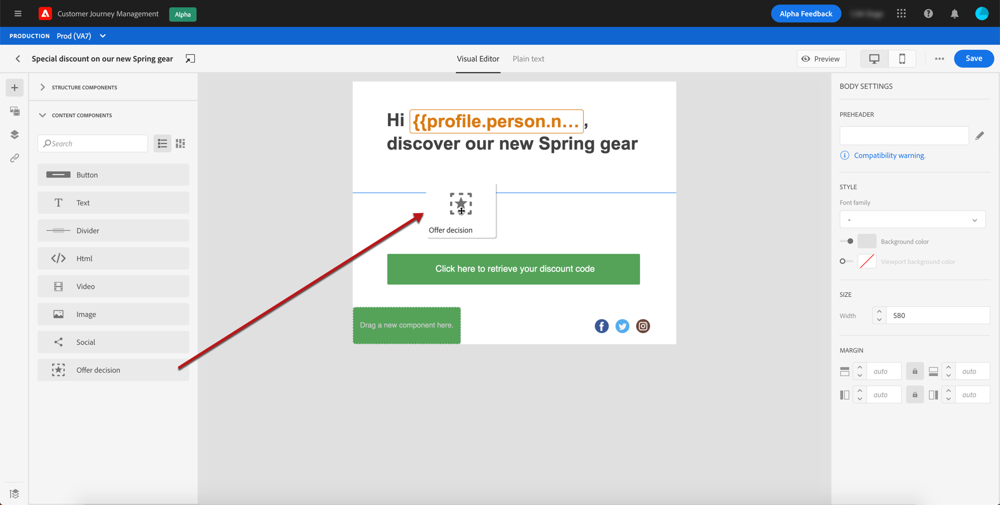

# Aangepaste aanbiedingen toevoegen {#deliver-personalized-offers}

## Informatie over Besluitbeheer {#about-offer-decisioning}

Met [!DNL Journey Optimizer] kunt u in uw e-mailberichten beslissingen invoegen (voorheen bekend als aanbiedingsactiviteiten) die gebruikmaken van de Offertenbeslissingsengine om de beste aanbieding te kiezen die u aan uw klanten kunt leveren.

U kunt bijvoorbeeld een besluit toevoegen dat in uw e-mail een speciale kortingsaanbieding weergeeft die afhankelijk is van het loyaliteitsniveau van de ontvanger.

Raadpleeg [deze sectie](offers/get-started/starting-offer-decisioning.md) voor meer informatie over het maken en beheren van aanbiedingen.

Voor een **volledig voorbeeld van begin tot eind** die toont hoe te om aanbiedingen te vormen, hen in een besluit te gebruiken en hefboomwerking dit besluit in een e-mail, controleer [dit sectie](offers/offers-e2e.md#insert-decision-in-email).

## Een beslissing invoegen in een e-mail {#insert-offers}

>[!CAUTION]
>
>Je moet eerst een beslissing over een voorstel definiëren. Leer hoe te om besluiten in [deze sectie](offers/offer-activities/create-offer-activities.md) tot stand te brengen.

Volg onderstaande stappen om een beslissing in te voegen in een e-mailbericht:

1. Maak uw e-mail en open vervolgens de e-mailontwerper om de inhoud ervan te configureren.

1. Voeg een **[!UICONTROL Offer decision]** inhoudscomponent toe.

   

   Leer hoe te om inhoudscomponenten in [deze sectie](content-components.md) te gebruiken.

1. Het tabblad **[!UICONTROL Offer decision]** wordt weergegeven in het rechterpalet. Klik op **[!UICONTROL Select Offer decision]**.

   

1. Selecteer in het venster dat wordt weergegeven de plaatsing die overeenkomt met de aanbiedingen die u wilt weergeven.

    Plaatsen zijn containers die worden gebruikt om uw aanbiedingen te tonen. In dit voorbeeld gebruiken we de plaatsing &quot;e-mail top image&quot;. Deze plaatsing is in de Bibliotheek van de Aanbieding gecreeerd om beeld-type aanbiedingen te tonen die zich aan de bovenkant van berichten bevinden.

1. Selecteer de aanbiedingsactiviteit om in de inhoudscomponent te gebruiken, dan klik **[!UICONTROL Add]**.

   >[!NOTE]
   >
   >Alleen beslissingen die compatibel zijn met de geselecteerde plaatsing worden weergegeven in de lijst. In dit voorbeeld komt slechts één aanbiedingsactiviteit overeen met de plaatsing van de &quot;e-mailtop image&quot;.

   

De aanbiedingsactiviteit wordt nu toegevoegd aan de component.

## Aanbiedingen voorvertonen in een e-mail {#preview-offers-in-email}

U kunt een voorvertoning weergeven van de verschillende aanbiedingen die deel uitmaken van de beslissing die aan de e-mail is toegevoegd met de sectie **[!UICONTROL Offers]** of de pijlen met de inhoudcomponenten.

Volg onderstaande stappen om de verschillende aanbiedingen die deel uitmaken van de beslissing, weer te geven met een klantprofiel.

1. Klik op **[!UICONTROL Preview]**.

   

   >[!NOTE]
   >
   >U hebt testprofielen nodig om een voorbeeld van uw berichten te kunnen bekijken. Leer hoe u testprofielen [maakt](building-journeys/creating-test-profiles.md).

1. Selecteer **[!UICONTROL Email]** in het veld **[!UICONTROL Identity namespace]** om de naamruimte te kiezen die u wilt gebruiken om testprofielen te identificeren.

   >[!NOTE]
   >
   >In dit voorbeeld gebruiken we de naamruimte **Email**. Meer informatie over Adobe Experience Platform-naamruimten [in deze sectie](https://experienceleague.adobe.com/docs/experience-platform/identity/namespaces.html?lang=en#getting-started).

1. Selecteer **[!UICONTROL Email]** in de lijst met naamruimten en klik op **[!UICONTROL Select]**.

1. Voer in het veld **[!UICONTROL Identity value]** de waarde in waarmee het testprofiel wordt geïdentificeerd. In dit voorbeeld voert u het e-mailadres van een testprofiel in.

   <!--For example enter smith@adobe.com and click the **[!UICONTROL Add profile]** button.-->

1. Voeg andere profielen toe zodat u verschillende varianten van het bericht afhankelijk van de profielgegevens kunt testen.

   

1. Klik op het tabblad **[!UICONTROL Preview]** om uw bericht te testen.

1. Selecteer een testprofiel. Het aanbod dat overeenkomt met het geselecteerde profiel (een vrouw) wordt weergegeven.

   

1. Selecteer andere testprofielen om een voorbeeld te bekijken van de e-mailinhoud voor elke variant van uw bericht. In de berichtinhoud wordt het aanbod dat overeenkomt met het geselecteerde testprofiel (nu een man) nu weergegeven.

   

Leer meer over de gedetailleerde stappen om de berichtvoorproef in [dit sectie](#preview-your-messages) te controleren.
