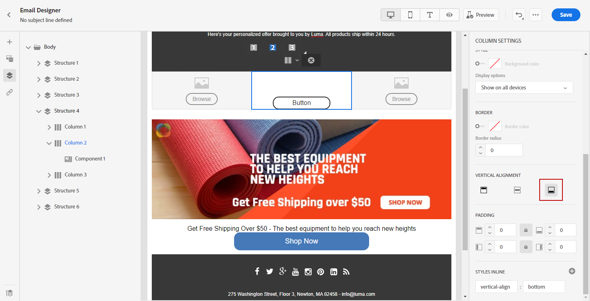

# Verticale uitlijning en opvulling aanpassen {#adjusting-vertical-alignment-and-padding}

In dit voorbeeld passen we opvulling en verticale uitlijning aan binnen een structuurcomponent die uit drie kolommen bestaat.

1. Selecteer de structuurcomponent rechtstreeks in de e-mail of met de opdracht **[!UICONTROL Navigation tree]** beschikbaar in het linkermenu.

   

1. Klik op de werkbalk op **[!UICONTROL Select a column]** en kiest u het bestand dat u wilt bewerken. U kunt deze ook selecteren in de boomstructuur.

   De bewerkbare parameters voor die kolom worden weergegeven in het dialoogvenster **[!UICONTROL Column settings]** -menu.

   

1. Selecteer onder **[!UICONTROL Vertical alignment]** de optie **[!UICONTROL Bottom]**.

   De inhoudscomponent wordt naar de onderkant van de kolom verplaatst.

   

1. Onder **[!UICONTROL Padding]** Definieer de opvulling boven in de kolom. Klik op het vergrendelingspictogram om de synchronisatie met de onderste opvulling te verbreken.

   Definieer de linker- en rechteropvulling voor die kolom.

   

1. Ga op dezelfde manier te werk om de uitlijning en opvulling van de andere kolommen aan te passen.

1. Sla uw wijzigingen op.