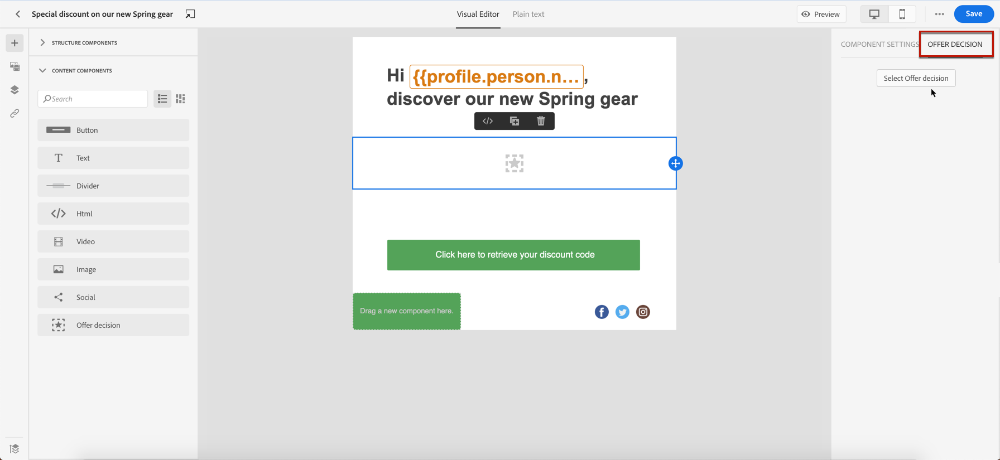

# Aangepaste aanbiedingen toevoegen {#deliver-personalized-offers}

In [!DNL Journey Optimizer] e-mails, kunt u besluiten opnemen die de Motor van het Besluit van het Voorstel zullen gebruiken om de beste aanbieding aan uw klanten te kiezen.

U kunt bijvoorbeeld een besluit toevoegen dat in uw e-mail een speciale kortingsaanbieding weergeeft die afhankelijk is van het loyaliteitsniveau van de ontvanger.

Raadpleeg voor meer informatie over het maken en beheren van aanbiedingen [deze sectie](../offers/get-started/starting-offer-decisioning.md).

Voor een **volledig end-to-end voorbeeld** tonen hoe te om aanbiedingen te vormen, hen in een besluit te gebruiken en dit besluit in een e-mail te gebruiken, controleer uit [deze sectie](../offers/offers-e2e.md#insert-decision-in-email).

➡️ [In deze video ziet u hoe u aanbiedingen als personalisatie toevoegt](#video-offers)

## Een beslissing invoegen in een e-mail {#insert-offers}

>[!CAUTION]
>
>Voordat u begint, moet u [een biedbesluit vaststellen](../offers/offer-activities/create-offer-activities.md).

Volg onderstaande stappen om een beslissing in te voegen in een e-mailbericht:

1. Maak uw e-mail en open vervolgens de e-mailontwerper om de inhoud ervan te configureren.

1. Een **[!UICONTROL Offer decision]** inhoudscomponent.

   

   Leer hoe u inhoudscomponenten kunt gebruiken in [deze sectie](content-components.md).

1. De **[!UICONTROL Offer decision]** wordt weergegeven in het rechterpalet. Klik op **[!UICONTROL Select Offer decision]**.

   

1. Selecteer in het venster dat wordt weergegeven de plaatsing die overeenkomt met de aanbiedingen die u wilt weergeven.

   [Plaatsen](../offers/offer-library/creating-placements.md) Dit zijn containers die worden gebruikt om je voorstellen onder de aandacht te brengen. In dit voorbeeld gebruiken we de plaatsing &quot;e-mail top image&quot;. Deze plaatsing is in de Bibliotheek van de Aanbieding gecreeerd om beeld-type aanbiedingen te tonen die zich aan de bovenkant van berichten bevinden.

1. Besluiten die overeenkomen met de geselecteerde plaatsingsweergave. Selecteer de beslissing die u in de inhoudcomponent wilt gebruiken en klik op **[!UICONTROL Add]**.

   >[!NOTE]
   >
   >Alleen beslissingen die compatibel zijn met de geselecteerde plaatsing worden weergegeven in de lijst. In dit voorbeeld komt slechts één aanbiedingsactiviteit overeen met de plaatsing van de &quot;e-mailtop image&quot;.

   

De aanbiedingsactiviteit wordt nu toegevoegd aan de component.

Nadat u uw wijzigingen hebt opgeslagen, kunt u uw aanbiedingen weergeven voor de relevante profielen wanneer u het bericht verzendt als onderdeel van een reis.

>[!NOTE]
>
>Wanneer u een aanbod, een fallback-aanbieding, een verzameling aanbiedingen of een besluit over een aanbieding bijwerkt waarnaar direct of indirect wordt verwezen in het bericht, worden de updates automatisch weergegeven in het bijbehorende bericht.

## Aanbiedingen voorvertonen in een e-mail {#preview-offers-in-email}

U kunt de verschillende aanbiedingen die deel uitmaken van de beslissing die aan de e-mail is toegevoegd, voorvertonen met de opdracht **[!UICONTROL Offers]** voor de inhoudcomponenten pijlen.

Volg onderstaande stappen om de verschillende aanbiedingen die deel uitmaken van de beslissing, weer te geven met een klantprofiel.

1. Klik op **[!UICONTROL Preview]**.

   

   >[!NOTE]
   >
   >U hebt testprofielen nodig om een voorbeeld van uw berichten te kunnen bekijken. Leer hoe u [testprofielen maken](../segment/creating-test-profiles.md).

1. Selecteer de naamruimte die u wilt gebruiken voor het identificeren van testprofielen **[!UICONTROL Email]** van de **[!UICONTROL Identity namespace]** veld.

   >[!NOTE]
   >
   >In dit voorbeeld gebruiken we de **E-mail** naamruimte. Meer informatie over naamruimten in Adobe Experience Platform [in deze sectie](../segment/get-started-identity.md).

1. Selecteer in de lijst met naamruimten de optie **[!UICONTROL Email]** en klik op **[!UICONTROL Select]**.

1. In de **[!UICONTROL Identity value]** voert u de waarde in die het testprofiel moet identificeren. In dit voorbeeld voert u het e-mailadres van een testprofiel in.

   <!--For example enter smith@adobe.com and click the **[!UICONTROL Add profile]** button.-->

1. Voeg andere profielen toe zodat u verschillende varianten van het bericht afhankelijk van de profielgegevens kunt testen.

   

1. Klik op de knop **[!UICONTROL Preview]** om uw bericht te testen.

1. Selecteer een testprofiel. Het aanbod dat overeenkomt met het geselecteerde profiel (een vrouw) wordt weergegeven.

   

1. Selecteer andere testprofielen om een voorbeeld te bekijken van de e-mailinhoud voor elke variant van uw bericht. In de berichtinhoud wordt het aanbod dat overeenkomt met het geselecteerde testprofiel (nu een man) nu weergegeven.

   

Meer informatie over de gedetailleerde stappen voor het controleren van de berichtvoorvertoning in [deze sectie](#preview-your-messages).

## Hoe kan ik-video{#video-offers}

Leer hoe u een component voor beslissingsbeheer aan berichten kunt toevoegen in [!DNL Journey Optimizer].

>[!VIDEO](https://video.tv.adobe.com/v/334088?quality=12)

