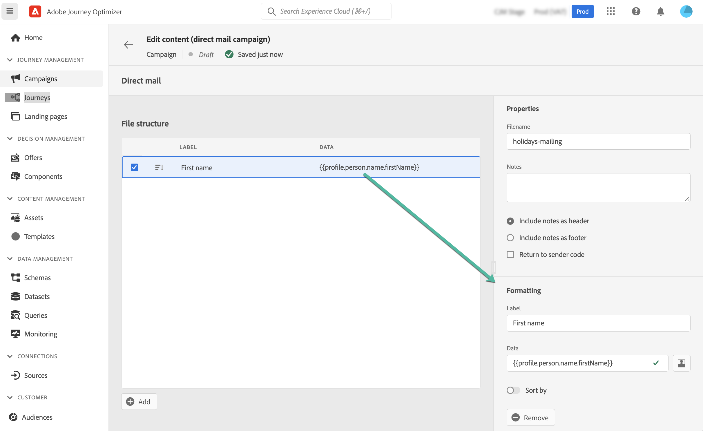

# Een direct-mailbericht maken {#create-direct}

>[!CONTEXTUALHELP]
>id="ajo_direct_mail"
>title="Direct mail maken"
>abstract="Maak direct-mailberichten in geplande campagnes en ontwerp de extractiedossiers die door directe postleveranciers worden vereist om post naar uw klanten te verzenden."

Directe post is een off-line kanaal dat u toestaat om de extractiedossiers te personaliseren en te produceren die door directe postleveranciers worden vereist om post naar uw klanten te verzenden.

Wanneer u een directe post creeert, produceert Journey Optimizer een dossier met alle gerichte profielen en de gekozen gegevens (postadres, profielattributen bijvoorbeeld). Uw direct-mailprovider kan dat bestand dan ophalen en zorgt voor de verzending zelf.

Directe-mailberichten kunnen alleen worden gemaakt in het kader van geplande campagnes. Ze zijn niet beschikbaar voor gebruik in API-getriggerde campagnes of reizen.

>[!IMPORTANT]
>
>Alvorens een direct-mailbericht te verzenden, zorg ervoor u hebt gevormd:
>
>1. A [bestand dat configuratie verplettert](../direct-mail/direct-mail-configuration.md#file-routing-configuration) die de server aangeeft waar het extractiebestand moet worden geüpload en opgeslagen,
>1. A [direct-mailberichtoppervlak](../direct-mail/direct-mail-configuration.md#direct-mail-surface) die naar het dossier zal verwijzen dat configuratie verplettert.

## Direct mailbericht maken {#create}

U kunt als volgt een direct-mailbericht maken en verzenden:

1. Maak een nieuwe geplande campagne en selecteer **[!UICONTROL Direct mail]** als uw handeling en kies het kanaaloppervlak dat u wilt gebruiken. [Leer hoe u een direct-mailoppervlak maakt](../direct-mail/direct-mail-configuration.md#direct-mail-surface)

   

1. Klikken **[!UICONTROL Create]** definieert u vervolgens de basisinformatie over uw campagne (naam, beschrijving). [Leer hoe u een campagne kunt configureren](../campaigns/create-campaign.md)

   

1. Klik op de knop **[!UICONTROL Edit content]** om het extractiebestand te configureren dat naar uw directe-mailprovider wordt verzonden.

1. De naam van het extractiebestand definiëren in het dialoogvenster **[!UICONTROL Filename]** veld.

   Soms moet u informatie toevoegen aan het begin of aan het einde van het extractiebestand. Om dit te doen, gebruik **[!UICONTROL Notes]** Geef vervolgens aan of u de notitie wilt opnemen in een kop- of voettekst.

   <!--Click on the button to the right of the Output file field and enter the desired label. You can use personalization fields, content blocks and dynamic text (see Defining content). For example, you can complete the label with the delivery ID or the extraction date.-->

   

1. Gebruik het linkergebied van de hand om de informatie te bepalen die als kolommen in het extractiedossier moet worden getoond:

   1. Klik op de knop **[!UICONTROL Add]** om een nieuwe kolom toe te voegen, dan selecteer het van de lijst.

   1. In de **[!UICONTROL Formatting]** -sectie, geeft u een label voor de kolom op en definieert u vervolgens de profielkenmerken die u wilt weergeven met de [Expressieeditor](../personalization/personalization-build-expressions.md).

      

   1. Als u het extractiebestand wilt sorteren met de geselecteerde kolom, schakelt u het **[!UICONTROL Sort by]** optie ingeschakeld. De **[!UICONTROL Sort By]** wordt vervolgens naast het label van de kolom in de bestandsstructuur weergegeven.

1. Herhaal deze stappen om zoveel kolommen toe te voegen als nodig is om uw extractiebestand samen te stellen. U kunt maximaal 50 kolommen toevoegen.

   

   U kunt op elk gewenst moment een kolom verwijderen door deze te selecteren en op de knop **[!UICONTROL Remove]** van de knop **[!UICONTROL Formatting]** sectie.

1. Zodra de direct-mailinhoud is bepaald, voltooi de configuratie van uw campagne.

   Wanneer de campagne wordt gestart, wordt het extractiebestand automatisch gegenereerd en geëxporteerd naar de server die is opgegeven in uw [bestand dat configuratie verplettert](../direct-mail/direct-mail-configuration.md).
