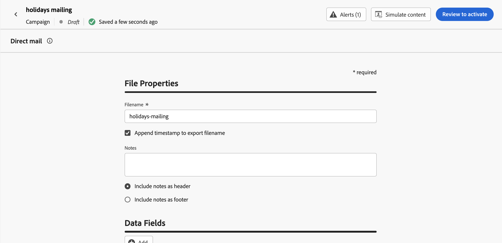
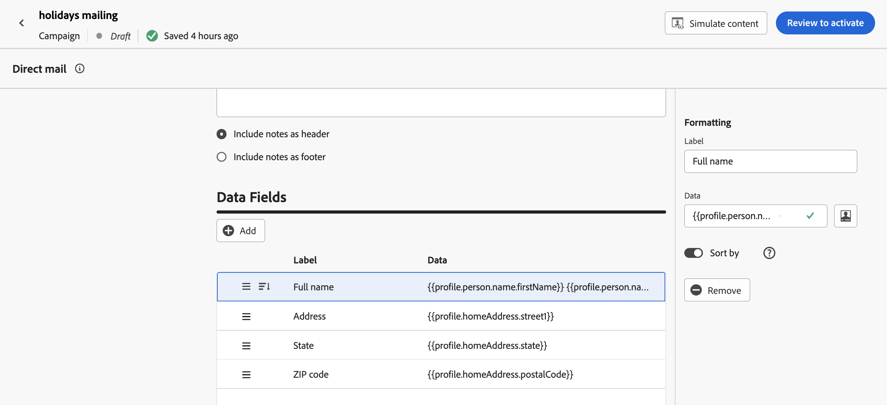

# Een direct-mailbericht maken {#create-direct}

>[!CONTEXTUALHELP]
>id="ajo_direct_mail"
>title="Direct mail maken"
>abstract="Maak direct-mailberichten in geplande campagnes en ontwerp de extractiedossiers die door directe postleveranciers worden vereist om post naar uw klanten te verzenden."

Als u direct-mailberichten wilt maken, maakt u een geplande campagne en configureert u het extractiebestand. Dit bestand is vereist door directe-mailproviders om e-mail naar uw klanten te verzenden.

>[!IMPORTANT]
>
>Voordat u een direct-mailbericht maakt, moet u controleren of u het volgende hebt geconfigureerd:
>
>1. A [ dossier dat configuratie ](../direct-mail/direct-mail-configuration.md#file-routing-configuration) verplettert die de server specificeert waar het extractiedossier zou moeten worden geupload en worden opgeslagen,
>1. A [ direct-mailberichtconfiguratie ](../direct-mail/direct-mail-configuration.md#direct-mail-surface) die het dossier zal van verwijzingen voorzien dat configuratie verplettert.

## Een campagne voor direct mail maken{#create-dm-campaign}

Om een direct-mailcampagne tot stand te brengen, zult u opstelling een geplande campagne, uw doelpubliek selecteren, en directe-mailmontages met inbegrip van de berichtconfiguratie vormen. Voer de volgende stappen uit:

1. Open het menu **[!UICONTROL Campaigns]** en klik op **[!UICONTROL Create campaign]** .

1. Selecteer het type campagne dat u wilt uitvoeren

   * **Gepland - Op de markt brengend**: voer onmiddellijk de campagne of op een gespecificeerde datum uit. Geplande campagnes zijn gericht op het verzenden van marketingberichten. Zij worden gevormd en uitgevoerd van het gebruikersinterface.

   * **API-teweeggebracht - Marketing/Transactioneel**: voer de campagne uit gebruikend een API vraag. API-getriggerde campagnes zijn gericht op het verzenden van marketingberichten of transactiemeldingen, d.w.z. berichten die worden verzonden na een actie van een individu: wachtwoordinstelling, winkelwagentje enz.

1. Bewerk in de sectie **[!UICONTROL Properties]** de items **[!UICONTROL Title]** en **[!UICONTROL Description]** van uw campagne.

1. Als u het doelpubliek wilt definiëren, klikt u op de knop **[!UICONTROL Select audience]** en kiest u een van de beschikbare Adobe Experience Platform-doelgroepen. [Meer informatie](../audience/about-audiences.md).

   >[!IMPORTANT]
   >
   >Momenteel is de selectie van het publiek beperkt tot 3 miljoen profielen. Deze beperking kan op verzoek aan je Adobe-vertegenwoordiger worden opgeheven.

1. Selecteer in het veld **[!UICONTROL Identity namespace]** de juiste naamruimte om personen in het gekozen publiek te identificeren. [Meer informatie](../event/about-creating.md#select-the-namespace).

1. Kies in de sectie **[!UICONTROL Actions]** de optie **[!UICONTROL Direct mail]** .

1. Selecteer of maak een **[!UICONTROL Direct mail configuration]** die u wilt gebruiken. [ Leer hoe te om een direct-mailconfiguratie ](direct-mail-configuration.md#direct-mail-surface) tot stand te brengen.

   {width="800" align="center"}

   >[!AVAILABILITY]
   >
   >De directe Post steunt de **Holdout** functionaliteit maar steunt momenteel niet **Behandelingen**. [ leren hoe te met experimenten ](../content-management/get-started-experiment.md) te werken

1. De campagnes kunnen voor een specifieke datum worden gepland of worden geplaatst om met regelmatige intervallen opnieuw te komen. Leer hoe te om **[!UICONTROL Schedule]** van uw campagne in [ te vormen deze sectie ](../campaigns/campaign-schedule.md).

U kunt nu het extractiebestand configureren en verzenden naar uw directe-mailprovider.

## Het extractiebestand configureren {#extraction-file}

>[!CONTEXTUALHELP]
>id="ajo_direct_mail_data_fields"
>title="Gegevensvelden"
>abstract="Voeg en vorm de kolommen en de informatie toe die in het extractiedossier moet worden getoond dat door directe postleveranciers wordt vereist om post naar uw klanten te verzenden. U kunt maximaal 50 kolommen toevoegen."

>[!CONTEXTUALHELP]
>id="ajo_direct_mail_formatting"
>title="Opmaak van extractiebestanden"
>abstract="Geef voor elk veld een label en de informatie op die u wilt weergeven met de verpersoonlijkingseditor.    De <b> Soort door </b> optie staat u toe om het geselecteerde gebied te gebruiken om de kolommen van het extractiedossier te sorteren."

Het extractiebestand wordt vereist door directe-mailproviders om e-mail naar uw klanten te sturen. Voer de volgende stappen uit om de configuratie van het extractiebestand te definiëren:

1. Klik in het scherm Campagneconfiguratie op de knop **[!UICONTROL Edit content]** om de inhoud van het extractiebestand te configureren.

1. Pas de eigenschappen van het extractiebestand aan:

   1. Geef in het veld **[!UICONTROL Filename]** een naam op voor het extractiebestand.

      >[!NOTE]
      >
      >Standaard wordt het bestand naar de hoofdmap op de server geschreven. Het veld **[!UICONTROL Filename]** accepteert ook de notatie &quot;/your/path/here/Filename.csv&quot;, waarbij het opgegeven pad de doelmap op de geselecteerde server is. <!--TBC if for SFTP and Azure only, or for all servers including S3-->

   1. Schakel desgewenst de optie **[!UICONTROL Append timestamp to export filename]** in als u een automatische tijdstempel wilt toevoegen aan de opgegeven bestandsnaam.

   1. Soms moet u informatie toevoegen aan het begin of aan het einde van het extractiebestand. Hiervoor gebruikt u het veld **[!UICONTROL Notes]** en geeft u op of u de notitie wilt opnemen als kop- of voettekst.

      {width="800" align="center"}

1. Configureer de kolommen en de informatie die in het extractiebestand moeten worden weergegeven:

   1. Klik op **[!UICONTROL Add]** om een nieuwe kolom te maken.

   1. Het deelvenster **[!UICONTROL Formatting]** wordt aan de rechterkant weergegeven, zodat u de geselecteerde kolom kunt instellen. Geef een **[!UICONTROL Label]** voor de kolom op.

   1. Op het **[!UICONTROL Data]** gebied, selecteer de profielattributen om te tonen gebruikend de [ verpersoonlijkingsredacteur ](../personalization/personalization-build-expressions.md).

   1. Als u het extractiebestand wilt sorteren met een kolom, selecteert u de kolom en schakelt u de optie **[!UICONTROL Sort by]** in. Het pictogram **[!UICONTROL Sort By]** wordt weergegeven naast het label van de kolom in de sectie **[!UICONTROL Data Fields]** .

      {width="800" align="center"}

   1. Herhaal deze stappen om zoveel kolommen toe te voegen als u nodig hebt voor het extractiebestand. U kunt maximaal 50 kolommen toevoegen.

      Als u de positie van een kolom wilt wijzigen, sleept u de kolom naar de gewenste locatie in de sectie **[!UICONTROL Data field]** . Als u een kolom wilt verwijderen, selecteert u deze en klikt u op de knop **[!UICONTROL Remove]** in het deelvenster **[!UICONTROL Formatting]** .

U kunt nu uw directe-mailbericht testen en verzenden naar uw publiek. [ Leer hoe te om direct-mailberichten te testen en te verzenden ](test-send-direct-mail.md)

