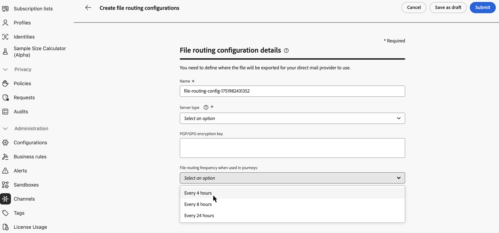

# Berichten direct mail verzenden met reizen {#direct-mail-journeys}

>[!CONTEXTUALHELP]
>id="ajo_journey_direct_mail"
>title="Eindactiviteit"
>abstract="Directe post is een off-line kanaal dat u toestaat om de extractiedossiers te personaliseren en te produceren die door derde directe postleveranciers worden vereist om post naar uw klanten te verzenden."

>[!AVAILABILITY]
>
>Deze mogelijkheid is alleen beschikbaar voor een aantal organisaties (beperkte beschikbaarheid).

Directe post is een off-line kanaal dat u toestaat om de extractiedossiers te personaliseren en te produceren die door derde directe postleveranciers worden vereist om post naar uw klanten te verzenden.

Wanneer u een direct-mailbericht maakt, genereert [!DNL Journey Optimizer] automatisch een bestand met alle doelprofielen en geselecteerde gegevens, zoals postadressen en profielkenmerken. Dit bestand wordt naar de server van uw keuze verzonden, zodat het toegankelijk is voor de door u gekozen externe provider, die het eigenlijke mailingproces voor u afhandelt.

U moet met uw gekozen derde directe postleverancier werken om het even welke vereiste toestemmingen van uw klanten te verkrijgen, als toepasselijk, zodat uw klanten post van u kunnen ontvangen. Voor het gebruik van mailingservices gelden aanvullende voorwaarden van de betreffende externe provider. Adobe heeft geen controle over en is niet verantwoordelijk voor uw gebruik van producten van derden. Neem contact op met de door u gekozen externe provider voor informatie over problemen of verzoeken om hulp die te maken hebben met het verzenden van uw e-mailbericht.

>[!NOTE]
>
>Op deze pagina vindt u informatie over het proces voor het maken en verzenden van e-mailberichten tijdens reizen. Voor meer informatie over het Directe postkanaal en hoe te om direct-mailcampagnes tot stand te brengen, verwijs naar deze sectie: [&#x200B; wordt begonnen met direct-mail &#x200B;](../direct-mail/get-started-direct-mail.md).

## Creeer een dossier dat configuratie verplettert

>[!CONTEXTUALHELP]
>id="ajo_dm_file_routing_frequency"
>title="Kies het AWS-gebied"
>abstract="Als uw dossier dat configuratie verplettert zal worden verzonden gebruikend reizen, kunt u de frequentie specificeren waarbij het dossier de server zal worden verzonden."

Alvorens tot een direct-mailbericht te leiden, zorg ervoor u een dossier gevormd heeft dat configuratie verplettert die de server specificeert waar het extractiedossier zou moeten worden geupload en worden opgeslagen. Voer hiertoe de volgende stappen uit:

1. Open het menu **[!UICONTROL Administration]** > **[!UICONTROL Channels]** > **[!UICONTROL Direct mail settings]** > **[!UICONTROL File routing]** en klik op **[!UICONTROL Create file routing config]** .

1. Definieer het bestand dat configuratie-eigenschappen zoals de naam ervan verplettert en het type server dat moet worden gebruikt. De gedetailleerde informatie over hoe te opstelling is een dossier dat configuratie verplettert beschikbaar in de [&#x200B; Directe post configuratie &#x200B;](../direct-mail/direct-mail-configuration.md#file-routing-configuration) sectie.

   Als uw dossier dat configuratie verplettert zal worden verzonden gebruikend reizen, kunt u de frequentie specificeren waarbij het dossier de server zal worden verzonden.

   

1. Klik **[!UICONTROL Submit]** om het dossier te bevestigen dat configuratieverwezenlijking verplettert. De configuratie wordt gemaakt met de status **[!UICONTROL Active]** . Het is nu klaar om in een direct-mailconfiguratie van verwijzingen te worden voorzien.

## Een configuratie voor direct mail maken {#direct-mail-surface}

Een direct-mailconfiguratie bevat de instellingen voor de opmaak van het bestand dat de doelpublieksgegevens bevat en wordt gebruikt door de mailprovider. U moet ook bepalen waar het dossier door het dossier te selecteren verplettert configuratie zal worden uitgevoerd. De gedetailleerde informatie over hoe te om een direct-mailconfiguratie tot stand te brengen is beschikbaar in de [&#x200B; sectie van de de postconfiguratie 0&rbrace; Direct.](../direct-mail/direct-mail-configuration.md#file-routing-configuration)

Zodra uw configuratie direct-mail klaar is, kunt u een directe postactie in uw reis toevoegen.

## Voeg een actie Direct mail aan uw reis toe

Voer de volgende stappen uit om een actie direct mail toe te voegen aan een rit:

1. Open uw reis dan belemmering en laat vallen a **[!UICONTROL Direct mail]** activiteit van de **2&rbrace; sectie van Acties &lbrace;van het palet.**

1. Verstrek basisinformatie over uw bericht (etiket, beschrijving, categorie), dan kies de berichtconfiguratie aan gebruik. Het veld **[!UICONTROL configuration]** wordt standaard voorgevuld met de laatste configuratie die de gebruiker voor dat kanaal heeft gebruikt. Voor meer informatie over hoe te om een reis te vormen, verwijs naar [&#x200B; deze pagina &#x200B;](../building-journeys/journey-gs.md).

1. Configureer het extractiebestand dat u naar uw directe-mailprovider wilt verzenden. Klik hiertoe op de knop **[!UICONTROL Edit content]** .

   

1. Pas de eigenschappen van het extractiebestand aan, zoals de bestandsnaam, of de kolommen die u wilt weergeven. Voor meer informatie over hoe te om de eigenschappen van het extractiedossier te vormen, verwijs naar deze sectie: [&#x200B; creeer een direct-mailbericht &#x200B;](../direct-mail/create-direct-mail.md#extraction-file).

   

1. Nadat de inhoud van het extractiebestand is gedefinieerd, kunt u er testprofielen voor gebruiken. Als u gepersonaliseerde inhoud hebt ingevoegd, kunt u met behulp van testprofielgegevens controleren hoe deze inhoud in het bericht wordt weergegeven.

   Klik hiertoe op **[!UICONTROL Simulate content]** en voeg vervolgens een testprofiel toe om te controleren hoe het extractiebestand met de testprofielgegevens wordt gerenderd. De gedetailleerde informatie over hoe te om testprofielen en voorproef uw inhoud te selecteren is beschikbaar in de [&#x200B; sectie van het Beheer van de Inhoud &#x200B;](../content-management/preview-test.md).

   {width="800" align="center"}

Wanneer uw extractiedossier klaar is, voltooi de configuratie van uw [&#x200B; reis &#x200B;](../building-journeys/journey-gs.md) om het te verzenden.
