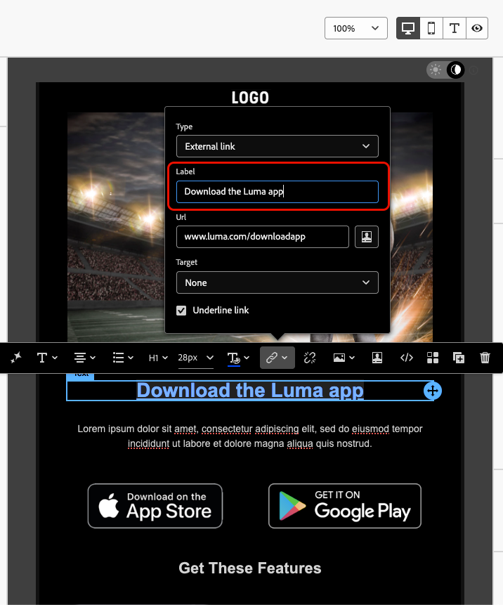

# Toegankelijke inhoud ontwerpen {#accessible-content}

De [ Europese toegankelijkheidswet ](https://eur-lex.europa.eu/legal-content/EN/TXT/?uri=CELEX%3A32019L0882){target="_blank"} is een richtlijn die wordt ontworpen om de interne markt voor toegankelijke producten en diensten te verbeteren door barrières weg te nemen die door verschillende nationale regels in de lidstaten worden veroorzaakt.

Deze verordening bepaalt dat alle digitale communicatie, inclusief e-mails, nieuwsbrieven, PDF&#39;s en downloadbare inhoud, toegankelijk moet zijn. Wanneer u inhoud maakt voor uw ontvangers, moet u daarom bepaalde richtlijnen volgen, zoals het gebruik van toegankelijke lettertypen, leesbare indelingen en het aanbieden van alternatieve tekst voor afbeeldingen.

[!DNL Journey Optimizer] [ E-mail Designer ](content-from-scratch.md), die marketers toelaat om inhoud zowel voor **e-mail** als **het landen pagina&#39;s** te bouwen, staat u toe om gemakkelijk aan deze richtlijn te voldoen, die op de Richtlijnen van de Toegankelijkheid van de Inhoud van het Web (WCAG) 2.1, niveauAA wordt gebaseerd.

In lijn hiermee worden de aanbevolen procedures voor het ontwerpen van toegankelijke inhoud met [!DNL Journey Optimizer] hieronder weergegeven.

>[!NOTE]
>
>Deze pagina gaat over het toegankelijk maken van uw inhoud voor al uw ontvangers, zodat mensen met een handicap uw e-mails en landingspagina&#39;s die zijn ontworpen met [!DNL Journey Optimizer] kunnen lezen, begrijpen en ermee kunnen communiceren.
>
>Anderzijds, is de toegankelijkheid van de [!DNL Journey Optimizer] interface zelf gedetaillerd in [ deze sectie ](../start/accessibility.md).
> 
>## Zorg ervoor dat de tekst leesbaar is {#text-readability}

Gebruik de tab **[!UICONTROL Styles]** van de component **[!UICONTROL Text]** om ervoor te zorgen dat de tekst leesbaar is, bijvoorbeeld door een juist kleurcontrast en eenvoudige lettertypen te gebruiken. [Meer informatie](content-components.md#text)

{width="80%"}

Volg onderstaande richtlijnen voor lettertypen en tekst:

**de selectie van de Doopvont**

* Gebruik sans-serif-lettertypen zoals Arial, Verdana, Tahoma, Helvetica of Open Sans.
* Vermijd serif-, cursieve of decoratieve lettertypen in de inhoud van het lichaam.
* Selecteer een beperkte lettertypeset voor consistentie en fallback (bijvoorbeeld: `font-family: Arial, Helvetica, sans-serif;`).

**het rangschikken van doopvont**

* Zorg voor een minimale tekengrootte van 16 px voor platte tekst.
* Gebruik de juiste hiërarchie voor koppen.

**Contrast van de Kleur**

* Houd een contrastverhouding van minstens 4.5 :1 tussen tekst en achtergrond.
* Voor grote tekst (≥ 24px of gewaagd 18px), zorg minstens een 3 :1 contrast.
* Vermijd lichtgrijze of pasteltekst op witte achtergronden.
* Vertrouw niet op kleur alleen om betekenis over te brengen, maar gebruik in plaats daarvan onderstrepingen, pictogrammen, enzovoort.

**de toegankelijkheid van de Tekst**

* Vermijd tekst in afbeeldingen.
* Gebruik niet alle uiteinden in lichaamstekst.
* Zorg ervoor dat op tekst kan worden ingezoomd tot 200% zonder de layout te verbreken.

## Zorg voor visuele toegankelijkheid {#visual-accessibility}

Volg onderstaande tips om te controleren of uw inhoud visueel toegankelijk is:

* Vermijd het gebruik van alleen-kleuren-indicatoren voor belangrijke informatie.
* Gebruik tekstlabels of pictogrammen voor meer duidelijkheid.
* Optimaliseer uw ontwerp voor mobiele en responsieve lay-outs, zodat de knoppen groot zijn en de juiste afstand hebben.
* Regelmatig testen op verschillende apparaten en schermformaten om de toegankelijkheid te behouden.

In [!DNL Journey Optimizer] kunt u de grootte en tussenruimte van de verschillende elementen in uw inhoud verder verfijnen met de opmaakparameters en -kenmerken uit het deelvenster Designer e-mailen **[!UICONTROL Styles]** . [Meer informatie](get-started-email-style.md)

Bijvoorbeeld, kunt u de [ achtergrond ](backgrounds.md) bijwerken, of de marges veranderen, opvullen en groepering om de visuele toegankelijkheid van uw inhoud te verbeteren. [Meer informatie](alignment-and-padding.md)

{width="80%"}

Bovendien kunt u met de [!DNL Journey Optimizer] Email Designer een voorvertoning weergeven van het ontwerp van verschillende apparaten en schermgrootten en het ontwerp ervan optimaliseren. U kunt op elk gewenst moment **[!UICONTROL Switch to live view]** gebruiken om te controleren hoe uw inhoud op verschillende apparaatgrootten wordt gerenderd.

{width="80%"}

>[!CAUTION]
>
>De live weergave is een algemene voorvertoning die is ontworpen om te vergelijken hoe de rendering er tussen verschillende apparaatgrootten uitziet. De uiteindelijke rendering kan variëren afhankelijk van de e-mailclient van de ontvanger.

## Alternatieve tekst gebruiken voor afbeeldingen {#alt-text}

Gebruik de component **[!UICONTROL Image]** om alternatieve tekst voor afbeeldingen te bieden. [Meer informatie](content-components.md#image)

{width="90%"}

Volg onderstaande richtlijnen voor effectieve alternatieve tekst in digitale producten:

* Beschrijf het doel van de afbeelding beknopt en contextueel.
* Vermijd overbodige zinnen zoals &quot;Afbeelding van ...&quot; en gebruik lege alt-tekst voor decoratieve afbeeldingen.
* Gebruik voor pictogrammen met betekenis, nuttige labels en voor complexe afbeeldingen een korte alt-tekst plus een langere beschrijving elders.

## Leesbare indeling gebruiken {#readable-format}

Gebruik de e-mail van Designer relevante structuur en [ inhoudscomponenten ](content-components.md), evenals de opties in de **[!UICONTROL Styles]** ruit, om uw inhoud op een duidelijke, logische en beknopte manier te organiseren die voor allen toegankelijk is.

{width="100%"}

* Gebruik gestructureerde, semantische HTML met de juiste koppen, alinea&#39;s, lijsten en tabellen.
* Zorg ervoor dat de inhoud een logische stroom volgt van links naar rechts en van boven naar beneden.
* Gebruik duidelijke, beknopte taal.
* Alternatieve indelingen bieden voor PDF&#39;s en informatie.
* Formaat van tekst wijzigen en opnieuw plaatsen toestaan en ervoor zorgen dat typografie met een passend kleurcontrast in alle indelingen kan worden gelezen.

## Leesbaarheid van inhoud garanderen {#readability}

Om leesbaar te zijn, moet uw inhoud duidelijk zijn, goed gestructureerd, en bruikbaar voor iedereen, met inbegrip van mensen met visuele, cognitieve, of lezingsmoeilijkheden en degenen die hulptechnologieën gebruiken. Enkele punten waarmee u rekening moet houden bij het maken van toegankelijke inhoud zijn:

* Zelden van zinnen tot ongeveer 20 woorden of minder.
* Bewerk de kopie om direct naar het punt te gaan.
* Gebruik actieve stem om de zinsstructuur eenvoudiger te houden.
* Vermijd slang, jargon of regionale woorden die sommige mensen misschien niet kennen.

Om uw e-mailleesbaarheid te evalueren, kunt u de populaire [ test van de Versnelling van de Lezing van de Vlesch gebruiken ](https://support.microsoft.com/en-us/office/get-your-document-s-readability-and-level-statistics-85b4969e-e80a-4777-8dd3-f7fc3c8b3fd2){target="_blank"}, die in Microsoft Word kan worden gevonden en berekent hoe gemakkelijk uw inhoud op een schaal van 0-100 moet lezen.

## Uw inhoud testen {#test}

Om de toegankelijkheid van uw inhoud te controleren, kunt u de testmogelijkheden gebruiken die door [!DNL Journey Optimizer] worden verstrekt. Ze zijn niet specifiek ontworpen om te controleren of uw inhoud volledig toegankelijk is, maar ze kunnen wel een eerste verificatieniveau bieden.

* Geef een voorvertoning van de inhoud weer met testprofielen. [ leer hoe ](../content-management/preview.md)

* Gebruik de [ E-mail die ](../content-management/rendering.md) optie teruggeeft die hefboomwerkingen Litmus om uw ontwerpen over belangrijke e-mailcliënten (de Post van Apple, Gmail, Vooruitzichten) te simuleren en te zien of maken de tekst, de kleuren en de beelden uw inhoud toegankelijk. <!--Litmus includes accessibility testing-->

* Verzend proefdrukken om de rendering van uw inhoud te testen voordat u deze naar uw echte publiek stuurt. [ leer hoe ](../content-management/proofs.md)

{width="90%"}

Als u op een meer consistente manier wilt controleren of uw inhoud betrouwbaar toegankelijk is, gaat u naar specifieke externe gereedschappen, zoals:

* De [ contrastcontrole WebAim ](https://webaim.org/resources/contrastchecker/){target="_blank"} en het [ hulpmiddel van de de evaluatie van de Webtoegankelijkheid van de WAVE ](https://wave.webaim.org/){target="_blank"} om contrast en naleving te evalueren;

* De technologieën van de hulp zoals het schermlezers (bijvoorbeeld: [ NVDA ](https://www.nvaccess.org/download/){target="_blank"}, of [ VoiceOver ](https://support.apple.com/en-ie/guide/iphone/iph3e2e415f/ios){target="_blank"} op iPhone) om e-mails van het perspectief van visueel gehandicapte gebruikers te ervaren.

## Donkere modus gebruiken {#dark-mode}

<!--TO PUBLISH WHEN DARK MODE IS RELEASED-->

De donkere modus verbetert de visuele toegankelijkheid voor gebruikers met lichtgevoeligheid of een visuele handicap voor een betere kijkervaring.

{width="90%"}

U kunt onder andere het beste transparante PNG&#39;s of SVG&#39;s gebruiken bij het ontwerpen van inhoud in de donkere modus, de juiste metatags en CSS instellen en een toegankelijke fallback-stijl bieden als de donkere modus niet wordt ondersteund. Zorg er ten slotte voor dat uw e-mailberichten correct worden weergegeven in de donkere modus door alle e-mailinhoud en UI-elementen te testen in zowel de lichte als de donkere modus.

Gedetailleerde beste praktijken specifiek voor donkere wijze, met inbegrip van richtlijnen om toegankelijkheid te verzekeren, zijn vermeld in [ deze sectie ](dark-mode.md#best-practices). <!--KEEP dark mode accessibility best practices IN ONE SINGLE LOCATION - for now listed on the Dark mode page.-->

## Specifieke kenmerken voor toegankelijkheid gebruiken {#attributes}

### Taalkenmerken {#language}

Wanneer u ontwerpen maakt, neemt u de kenmerken `lang` (taal) en `dir` (tekstrichting) op in de hoofdtekst van de inhoud. Deze kenmerken helpen ondersteunende hulpmiddelen, zoals schermlezers, om uw inhoud op de juiste manier te interpreteren en te presenteren.

* Het attribuut `lang` geeft de taal van de e-mail aan ondersteunende technologieën aan, zodat woorden correct worden uitgesproken.

  +++Voorbeelden

  Voorbeeld voor Engels:

  ```
  <body lang="en">
  ```

  Voorbeeld voor Frans:

  ```
  <body lang="fr">
  ```

  +++

* Het kenmerk `dir` geeft de tekstrichting op. De meeste talen, waaronder Engels en Frans, worden van links naar rechts (ltr) gelezen, terwijl talen zoals Arabisch en Hebreeuws van rechts naar links (rtl) worden gelezen.

  +++Voorbeelden

  Voorbeeld voor Engels (van links naar rechts):

  ```
  <body lang="en" dir="ltr">
  ```

  Voorbeeld voor Arabisch (van rechts naar links):

  ```
  <body lang="ar" dir="rtl">
  ```

  +++

Schermlezers vertrouwen op het kenmerk `lang` om de juiste uitspraakregels toe te passen, terwijl de tekstrichting ervoor zorgt dat de inhoud op natuurlijke wijze doorloopt voor talen die van links naar rechts of van rechts naar links worden geschreven. Zonder deze kenmerken kunnen gebruikers last krijgen van verwarrende leesvolgorde of verkeerde uitspraak. Plaats daarom altijd de juiste kenmerken voor `lang` en `dir` in de hoofdtekst van de e-mail.

>[!TIP]
>
>Als uw e-mail meerdere talen bevat, wijst u de juiste taalkenmerken toe aan specifieke secties (zoals `<table>` - of `<td>` -blokken) om ervoor te zorgen dat elk onderdeel correct wordt gelezen.

### Tabellen {#tables}

In HTML-inhoud worden tabellen vaak gebruikt voor de lay-out. Standaard behandelen schermlezers elke `<table>` als een gegevenstabel, waarbij rijen, kolommen en structuur worden aangekondigd. Dit kan verwarrend zijn als de tabel alleen wordt gebruikt voor opmaak.

Voeg `role="presentation"` (of `role="none"` ) toe aan indelingstabellen om ervoor te zorgen dat ondersteunende hulpmiddelen hun structuur overslaan en alleen de werkelijke inhoud activeren.

+++Voorbeeld - Lay-outtabel (met `role="presentation"`)

```
<table role="presentation" border="0" cellpadding="0" cellspacing="0" width="100%"> 

  <tr> 

    <td align="center"> 

      <h1>Hello World</h1> 

      <p>Welcome to our newsletter</p> 

    </td> 

  </tr> 

</table>
```

De schermlezers lezen:
&quot;Hallo wereld. Welkom bij onze nieuwsbrief.&quot; *(Geen vermelding van rijen, kolommen of tabel)*

+++

+++Voorbeeld - Gegevenstabel (zonder `role="presentation"`)

```
<table border="1" cellpadding="5" cellspacing="0"> 

  <tr> 

    <th scope="col">Name</th> 

    <th scope="col">Score</th> 

  </tr> 

  <tr> 

    <td>Alice</td> 

    <td>95</td> 

  </tr> 

  <tr> 

    <td>Bob</td> 

    <td>88</td> 

  </tr> 

</table> 
```

De schermlezers lezen:
&quot;Tabel met 2 kolommen en 3 rijen.&quot;

&quot;Naam, Alice. Score, 95.&quot;

&quot;Naam, Bob. Score, 88.&quot;

+++

>[!TIP]
>
>Gebruik `role="presentation"` uitsluitend voor lay-outtabellen. Voor gegevenstabellen, behoud de semantische `<table>` structuur zodat de schermlezers correct kopballen en verhoudingen kunnen aankondigen.

### Tekst voor koppelingen {#links}

Schermlezers lezen koppelingen voor met behulp van hun tekst. Als een koppeling alleen &#39;Klik hier&#39; of &#39;Meer lezen&#39; heet, weten gebruikers van ondersteunende hulpmiddelen niet wat het doel is. Om toegankelijkheid te waarborgen, hebben ze beschrijvende tekst nodig die het doel of de actie duidelijk aangeeft.

Gebruik E-mail Designer om [ een verbinding ](message-tracking.md#insert-links) aan uw inhoud toe te voegen en het etiket uit te geven om het (zichtbaar) en beschrijvend (duidelijk over doel) te maken. Vermijd vage labels zoals &#39;here&#39; of &#39;more&#39;.

{width="70%"}

+++Voorbeeld - Goede koppeling (beschrijvend): 

```
<p>Learn more in the  

<a href="https://adobe.com/release-notes">August release notes</a>. 

</p>
```

De schermlezers lezen:
&quot;Link, August release notes.&quot;

+++

+++Voorbeeld - Ongeldige koppeling (niet beschrijvend)

```
<p>Learn more about our new features.  

  <a href="https://adobe.com/release-notes">Click here</a>. 

</p>
```

De schermlezers lezen:
&quot;Link, klik hier.&quot; *(Verstrekt geen context uit leesorde)*

+++

<!--
>[!TIP]
>
>Always ensure link text is discernible (visible) and descriptive (clear about purpose). Avoid vague labels like 'here' or 'more'.-->

## Ondersteuning voor toetsenbordnavigatie en focus bieden {#keyboard}

<!--for landing pages-->

Dankzij toetsenbordnavigatie en focusondersteuning hebben mensen die geen muis kunnen gebruiken, volledige toegang tot en interactie met inhoud. Het verbetert ook de algemene bruikbaarheid door alle gebruikers een duidelijke en consistente manier te geven om door informatie te bewegen.

* Focus via toetsenbord

   * Zorg ervoor dat alle interactieve elementen (zoals knoppen, selectievakjes, koppelingen) `tabindex="0"` hebben, zodat ze in de natuurlijke tabvolgorde worden opgenomen.

   * Navigeren met de Tab- en pijltoetsen ( ↑ &lt;ART →) toestaan, waardoor het element dat de focus heeft zichtbaar moet worden gemarkeerd.

* Aangepaste focusstijl

   * Pas duidelijke en te onderscheiden stijlen toe om zich op actioneerbare elementen te concentreren:

     +++Voorbeeld (CSS)

     ```
     [tabindex="0"] : focus { 
     
     outline: 2px solid #00AEEF;  /* Cyan border */ 
     
     background-color: #20CEFF;   /* Optional background */ 
     
     }
     ```

     +++

   * Zorg ervoor dat focusindicatoren voldoen aan de WCAG 2.2-standaarden voor focusweergave, zoals:

      * Minimaal gebied: 2 CSS-pixels dikke omtrek.

      * Contrastverhouding: ≥ 3 :1 tussen de toestand Gericht en niet-geconcentreerd.

* Ondersteuning voor toetsenbordactivering

   * Zorg ervoor dat selectievakjes en knoppen reageren op de Enter- en Space-toets.

   * Interactie valideren met alleen toetsenbord:

      * Voer selectievakjes in of gebruik de spatiebalk.

      * Enter of Space moet knoppen activeren.
