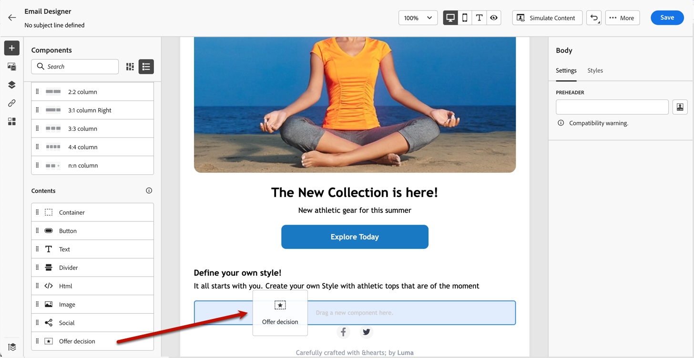

# Aangepaste aanbiedingen toevoegen {#deliver-personalized-offers}

In [!DNL Journey Optimizer] e-mailberichten kunt u beslissingen invoegen die de Beslissingsbeheerengine gebruiken om de beste aanbieding aan uw klanten te kiezen.

U kunt bijvoorbeeld een besluit toevoegen dat in uw e-mail een speciale kortingsaanbieding weergeeft die afhankelijk is van het loyaliteitsniveau van de ontvanger.

>[!IMPORTANT]
>
>Als er wijzigingen worden aangebracht in een biedbesluit dat wordt gebruikt in een reisbericht, moet u de reis ongedaan maken en opnieuw publiceren.  Dit zal ervoor zorgen dat de veranderingen in het reisbericht worden opgenomen en dat de boodschap in overeenstemming is met de meest recente updates.

* Voor meer op om aanbiedingen tot stand te brengen en te beheren, verwijs naar [ deze sectie ](../offers/get-started/starting-offer-decisioning.md).
* Voor a **volledig voorbeeld van begin tot eind** die tonen hoe te om aanbiedingen te vormen, gebruik hen in een besluit en hefboomwerking dit besluit in e-mail, controle uit [ deze sectie ](../offers/offers-e2e.md#insert-decision-in-email).

➡️ [ Leer hoe te om aanbiedingen als verpersoonlijking in deze video toe te voegen ](#video-offers)

## Een beslissing invoegen in een e-mail {#insert-offers}

>[!CAUTION]
>
>Alvorens te beginnen, moet u [ een aanbiedingsbesluit ](../offers/offer-activities/create-offer-activities.md) bepalen.

Volg onderstaande stappen om een beslissing in te voegen in een e-mailbericht:

1. Maak uw e-mail en open vervolgens de e-mail-Designer om de inhoud ervan te configureren.

1. Voeg een inhoudscomponent **[!UICONTROL Offer decision]** toe.

   

   Leer hoe te om inhoudscomponenten in [ te gebruiken deze sectie ](content-components.md).

1. Het tabblad **[!UICONTROL Offer decision]** wordt weergegeven in het rechterpalet. Klik op **[!UICONTROL Select Offer decision]** :

   1. Selecteer in het venster dat wordt weergegeven de plaatsing die overeenkomt met de aanbiedingen die u wilt weergeven.

      [ Plaatsingen ](../offers/offer-library/creating-placements.md) zijn containers die worden gebruikt om uw aanbiedingen te tonen. In dit voorbeeld gebruiken we de plaatsing &quot;e-mail top image&quot;. Deze plaatsing is in de Bibliotheek van de Aanbieding gecreeerd om beeld-type aanbiedingen te tonen die zich aan de bovenkant van berichten bevinden.

   1. Besluiten die overeenkomen met de geselecteerde plaatsingsweergave. Selecteer de beslissing die u in de inhoudscomponent wilt gebruiken en klik op **[!UICONTROL Add]** .

      >[!NOTE]
      >
      >Alleen beslissingen die compatibel zijn met de geselecteerde plaatsing worden weergegeven in de lijst. In dit voorbeeld komt slechts één aanbiedingsactiviteit overeen met de plaatsing van de &quot;e-mailtop image&quot;.

      

Het besluit wordt nu toegevoegd aan de component. Nadat u uw wijzigingen hebt opgeslagen, kunt u uw aanbiedingen weergeven voor de relevante profielen wanneer u het bericht verzendt als onderdeel van een reis.

>[!NOTE]
>
>Wanneer u een aanbod, een fallback-aanbieding, een verzameling van aanbiedingen of een besluit over aanbiedingen bijwerkt waarnaar direct of indirect wordt verwezen in het bericht, worden de updates automatisch weerspiegeld in het bijbehorende bericht.

## Aanbiedingen voorvertonen in een e-mail {#preview-offers-in-email}

U kunt een voorvertoning weergeven van de verschillende aanbiedingen die deel uitmaken van de beslissing die aan de e-mail is toegevoegd met de sectie **[!UICONTROL Offer]** of de pijlen van de inhoudcomponenten.

Volg onderstaande stappen om de verschillende aanbiedingen die deel uitmaken van de beslissing, weer te geven met een klantprofiel.

1. Selecteer de testprofielen die u wilt gebruiken om een voorvertoning van de aanbieding weer te geven:

   1. Klik op de knop **[!UICONTROL Simulate Content button]** en kies de naamruimte die u wilt gebruiken voor het identificeren van testprofielen in het veld **[!UICONTROL Identity namespace]** .

      >[!NOTE]
      >
      >In dit voorbeeld, gebruiken wij **E-mail** namespace. Leer meer over de identiteitsnaamruimten van Adobe Experience Platform [ in deze sectie ](../audience/get-started-identity.md).

   1. Voer in het veld **[!UICONTROL Identity value]** de waarde in waarmee het testprofiel wordt geïdentificeerd. In dit voorbeeld voert u het e-mailadres van een testprofiel in.

   <!--For example enter smith@adobe.com and click the **[!UICONTROL Add profile]** button.-->

   1. Voeg andere profielen toe zodat u verschillende varianten van het bericht afhankelijk van de profielgegevens kunt testen.

      

1. Klik op het tabblad **[!UICONTROL Preview]** om uw bericht te testen en selecteer vervolgens een testprofiel. Het aanbod dat overeenkomt met het geselecteerde profiel (een vrouw) wordt weergegeven.

   

   U kunt andere testprofielen selecteren om de e-mailinhoud voor elke variant van uw bericht te bekijken. In de berichtinhoud wordt het aanbod dat overeenkomt met het geselecteerde testprofiel (nu een man) nu weergegeven.

Leer meer over de gedetailleerde stappen om berichtvoorproef in [ deze sectie ](#preview-your-messages) te controleren.

## Hoe kan ik-video{#video-offers}

Leer hoe u een component voor beslissingsbeheer aan berichten in [!DNL Journey Optimizer] toevoegt.

>[!VIDEO](https://video.tv.adobe.com/v/334088?quality=12)
