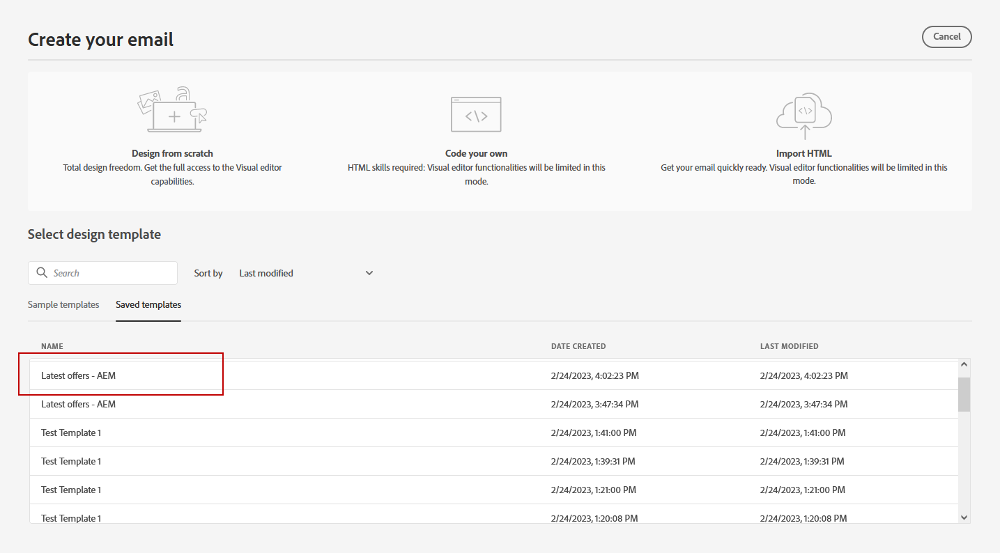

# Werken met Adobe Experience Manager-sjablonen {#aem-templates}

>[!AVAILABILITY]
>
>Integratie met Adobe Experience Manager is momenteel alleen beschikbaar als een bètaversie om gebruikers te selecteren.
> Als bètagebruiker, gebruik [ deze vorm ](https://forms.office.com/pages/responsepage.aspx?id=Wht7-jR7h0OUrtLBeN7O4Wf0cbVTQ3tCpW_unE-w8-JUN1FaNlAzNkhPSUdaSkJXVFRCNTRJNVRFSy4u){target="_blank"} om te delen terugkoppelt.

Met Adobe Journey Optimizer kunt u op maat gemaakte berichten maken via Adobe Experience Manager-sites. Begin door uw sjablonen te ontwerpen met gebruik van Adobe Experience Manager-inhoudsbronnen en verzend deze vervolgens naar Adobe Journey Optimizer. Als deze sjablonen eenmaal zijn gedeeld, zijn ze toegankelijk in Adobe Journey Optimizer Email Designer, waardoor het maken en verzenden van berichten naar het gewenste publiek eenvoudiger wordt.

## Vereisten {#prerequisites}

Controleer voordat u deze functie gebruikt of u aan de volgende vereisten voldoet:

* **de montages van Experience Manager**

  Dit vermogen is beschikbaar met [ Adobe Experience Manager as a Cloud Service ](https://experienceleague.adobe.com/docs/experience-manager-cloud-service/content/overview/introduction.html){target="_blank"}.

  Als onderdeel van het bètaprogramma wordt de Cloud Service-configuratie uitgevoerd door Adobe in Adobe Experience Manager om verbinding te maken met Adobe Journey Optimizer.

* **Toestemmingen**

  Als u inhoudssjablonen wilt maken, bewerken en verwijderen in Adobe Journey Optimizer, moet u de machtiging **[!DNL Manage Library Items]** hebben opgenomen in het productprofiel van **[!DNL Content Library Manager]** . [Meer informatie](../administration/ootb-product-profiles.md#content-library-manager)

## Afvoerkanalen en beperkingen{#aem-templates-limitations}

Om het gebruik van Adobe Experience Manager met Adobe Journey Optimizer verder te optimaliseren, is het belangrijk dat u rekening houdt met de volgende aanvullende instructies en beperkingen:

* Een correcte Journey Optimizer-syntaxis is vereist om personalisatie in de Experience Manager-sjabloon effectief te maken. [Meer informatie](../personalization/personalization-syntax.md)

* Bulksjabloonexport wordt momenteel niet ondersteund, sjablonen moeten afzonderlijk worden geëxporteerd.

* Synchronisatie tussen Experience Manager en Journey Optimizer is momenteel niet beschikbaar. Als er wijzigingen worden aangebracht in een Experience Manager-sjabloon nadat deze naar Journey Optimizer is verzonden, moet de gebruiker de sjabloon opnieuw exporteren en opnieuw naar Journey Optimizer verzenden.

## Een sjabloon naar Journey Optimizer verzenden{#aem-templates-send}

Voer de volgende stappen uit om een Adobe Experience Manager-sjabloon naar Adobe Journey Optimizer te exporteren:

1. Selecteer **[!UICONTROL Outbound Marketing]** op uw Adobe Experience Manager-startpagina.

<!--
    
-->

1. Vanuit uw inhoudsbibliotheek kunt u eerder geconfigureerde sjablonen gebruiken of een geheel nieuwe sjabloon maken. [Meer informatie](https://experienceleague.adobe.com/docs/experience-manager-65/authoring/authoring/managing-pages.html#creating-a-new-page)

1. Door Journey Optimizer-verpersoonlijkingssyntaxis in uw sjabloon op te nemen, kunt u de aanpassingsmogelijkheden van de toepassing verbeteren. [Meer informatie](../personalization/personalization-syntax.md)

<!--
    
-->

1. Selecteer de sjabloon die u naar Journey Optimizer wilt exporteren en klik op **[!UICONTROL Send to]** in het geavanceerde menu.

   

1. Voer de **[!UICONTROL Name]** van de inhoudsjabloon in en selecteer het doel **[!UICONTROL Sandbox]** .

<!--
   
-->

1. Nadat u op de knop **[!UICONTROL Send]** hebt geklikt, wordt het exportproces gestart. Wanneer het exporteren is voltooid, wordt in de gebruikersinterface het volgende bericht weergegeven: &quot;Sjabloon &quot;XX&quot; is naar AJO verzonden.&quot;

De sjabloon wordt toegevoegd aan Adobe Journey Optimizer-inhoudssjablonen van de geselecteerde sandbox.

## Een Adobe Experience Manager-sjabloon gebruiken en aanpassen{#aem-templates-perso}

Zodra de Experience Manager-sjabloon in Journey Optimizer beschikbaar is als een inhoudssjabloon, kunt u de benodigde inhoud voor de e-mail identificeren en opnemen, inclusief personalisatie.

1. Open in Journey Optimizer via het menu **[!UICONTROL Content template]** de geïmporteerde sjabloon.

<!--
    
-->

1. Door op de knop **[!UICONTROL Alert]** te klikken, kunt u snel controleren of er belangrijke instellingen ontbreken. Dit zal helpen ervoor zorgen dat uw berichten behoorlijk worden gevormd en om het even welke potentiële fouten of kwesties verhinderen.

<!--
    
-->

1. Klik in het **[!UICONTROL Template properties]** -venster op de knop **[!UICONTROL Manage access]** om aangepaste labels of basislabels voor gegevensgebruik toe te wijzen aan uw sjabloon. [ leer meer over de Controle van de Toegang van het Niveau van Objecten (OLAC) ](../administration/object-based-access.md)

1. Als u de Experience Manager-sjabloon verder wilt aanpassen en aangepaste aanpassingen aan uw inhoud wilt toevoegen, klikt u op **[!UICONTROL Edit content]** . Zo kunt u gemakkelijk wijzigingen aanbrengen en de sjabloon aan uw specifieke behoeften aanpassen. [Meer informatie](../email/get-started-email-design.md)

   >[!WARNING]
   >
   > Als u de sjabloon wilt bewerken en aanpassen, kunt u alleen de compatibiliteitsmodus gebruiken.

1. Wanneer uw inhoudsmalplaatje klaar is, [ test en bevestigt het ](../content-management/content-templates.md#test-template).

1. Wanneer de inhoud is gedefinieerd, kunt u deze gebruiken bij het maken van een nieuwe e-mail door in de verzameling **[!UICONTROL Saved templates]** te bladeren. Selecteer vervolgens **[!UICONTROL Use this template]** .

<!--
    
-->

1. U kunt de inhoud nu bewerken en aanpassen. Voor meer informatie over hoe te om uw e-mailinhoud te bouwen, verwijs naar deze [ pagina ](../email/content-from-scratch.md).

<!--
    
-->

1. Als u persoonlijke inhoud hebt toegevoegd aan uw Experience Manager-sjabloon, klikt u op **[!UICONTROL Simulate Content]** om een voorvertoning weer te geven van de inhoud die in het bericht wordt weergegeven met testprofielen.

[Meer informatie over voorvertoningen en testprofielen](../content-management/preview-test.md)

<!--
    
-->

1. Wanneer u de voorvertoning van het bericht weergeeft, worden alle gepersonaliseerde elementen automatisch vervangen door de bijbehorende gegevens uit het geselecteerde testprofiel.

   Zo nodig kunt u via de knop **[!UICONTROL Manage test profiles]** aanvullende testprofielen toevoegen.

<!--
    
-->

Wanneer uw e-mail klaar is, voltooi de configuratie van uw [ reis ](../building-journeys/journey-gs.md) of [ campagne ](../campaigns/create-campaign.md), en activeer het om het bericht te verzenden.
