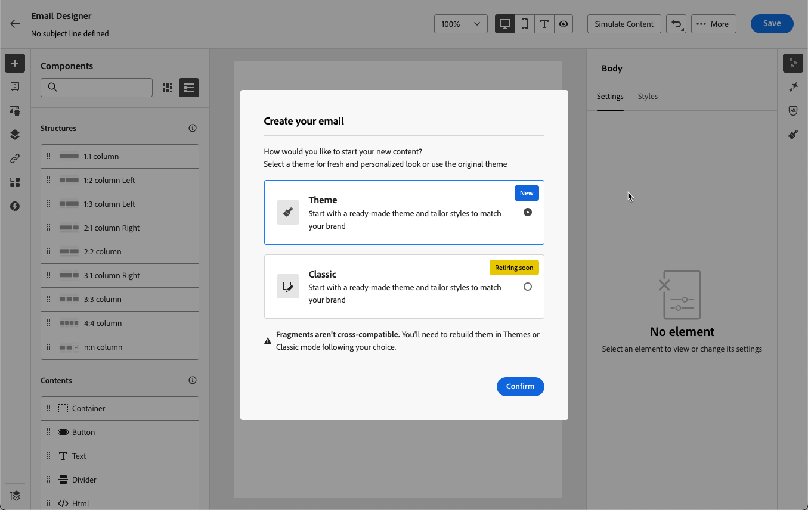

# Thema&#39;s toepassen op uw e-mailinhoud {#apply-email-themes}

>[!CONTEXTUALHELP]
>id="ajo_use_theme"
>title="Een thema toepassen op uw e-mail"
>abstract="Selecteer een thema voor uw e-mail om snel een specifieke stijl toe te passen die aan uw merk en ontwerp past."

<!--This documentation provides a comprehensive guide to using themes to streamline your email creation process. With the ability to define reusable themes and leverage pre-designed modules, marketers can create professional, brand-aligned emails faster and with less effort.-->

>[!AVAILABILITY]
>
>Deze mogelijkheid is momenteel beschikbaar in bètaversie en alleen voor bètaklanten. Neem contact op met uw Adobe-vertegenwoordiger als u wilt deelnemen aan het bètaprogramma.

Met thema&#39;s, hebben de niet-technische gebruikers de capaciteit om herbruikbare inhoud tot stand te brengen die een specifiek merk en een ontwerptaal door douanemateriaal bovenop de standaardmalplaatjes <!-- to achieve brand specific results--> toe te voegen past.

Deze functie stelt marketers in staat visueel aantrekkelijke, merkgebonden e-mails sneller en met minder moeite te gebruiken en biedt geavanceerde aanpassingsopties voor unieke ontwerpbehoeften.

<!--What is the Enhanced Email Authoring Experience?

This feature introduces two key components to simplify and enhance email creation:

* **Theme Management System**: A centralized system for creating, customizing, and applying reusable themes to emails. Themes ensure consistent styling across campaigns and eliminate the need for repetitive manual styling.

* **Modules**: Pre-designed, reusable content blocks that abstract common email elements (e.g., titles, descriptions, images, and links). Modules are built using customizable low-level components, offering flexibility while maintaining design standards.

Key Benefits:

- **Consistency**: Ensure all emails align with your brand's design guidelines.
- **Efficiency**: Save time by reusing themes and modules across campaigns.
- **Customization**: Add custom CSS and mobile-specific styles for advanced designs.
- **Scalability**: Eliminate repetitive styling tasks, enabling faster email creation.-->

## Afvoerkanalen en beperkingen {#themes-guardrails}

* Wanneer u een volledig nieuw e-mailbericht maakt, kunt u uw inhoud op basis van een thema maken en snel een specifieke stijl toepassen die past bij uw merk en ontwerp.

  Als u de modus Handmatig opmaken kiest, kunt u alleen thema&#39;s toepassen als u uw e-mail opnieuw instelt.

* [&#x200B; de Fragmenten &#x200B;](../content-management/fragments.md) zijn niet dwars-compatibel tussen de Thema&#39;s van het Gebruik en de Hand het Stileren wijzen.

  Als u een fragment wilt kunnen gebruiken in inhoud waarop een thema is toegepast, moet dit fragment worden gemaakt in de modus Thema gebruiken.

* Als het gebruiken van inhoud die in HTML wordt gecreeerd, zult u op [&#x200B; verenigbaarheidswijze &#x200B;](existing-content.md) zijn en u kunt geen thema&#39;s op deze inhoud toepassen.

  Als u alle mogelijkheden van de e-mail-Designer, inclusief thema&#39;s, volledig wilt benutten, moet u een nieuwe inhoud maken in de modus Thema&#39;s gebruiken of de geïmporteerde HTML-inhoud omzetten. [Meer informatie](existing-content.md)

<!--If using a content created in Manual Styling mode or HTML, you cannot apply themes to this content. You must create a new content in Use Themes mode.

If you apply a theme to a content using a [fragment](../content-management/fragments.md) created in Manual Styling mode, the rendering may not be optimal.-->

## Een thema maken {#create-and-edit-themes}

Volg onderstaande stappen om een thema te definiëren dat u in uw toekomstige e-mailinhoud kunt gebruiken.

1. Om begonnen te worden, creeer een nieuw [&#x200B; inhoudsmalplaatje &#x200B;](../content-management/create-content-templates.md).

1. Selecteer de optie **[!UICONTROL Create or edit themes]** .

   

1. U kunt het standaardthema selecteren of een Adobe- of aangepaste sjabloon gebruiken. Selecteer in dit voorbeeld het standaardthema en klik op **[!UICONTROL Create]** .

   

1. Definieer op het tabblad **[!UICONTROL General settings]** het thema door het een specifieke naam voor uw merk te geven. U kunt de standaardbreedte voor uw e-mails aanpassen en ook het huidige thema uitvoeren om het over zandbakken [&#x200B; te delen &#x200B;](../configuration/copy-objects-to-sandbox.md).

   <!---->

1. Gebruik de rail rechts om door de verschillende lusjes te navigeren en uw ontwerpmontages bij te werken.

   

1. Op het tabblad **[!UICONTROL Colors]** :

   * Gebruik de knop **[!UICONTROL Edit]** om een **[!UICONTROL Color palette]** met standaardkleuren voor uw merk in te stellen. Selecteer een **[!UICONTROL Preset]** om snel een kleurenschema te maken of pas elke kleur van uw thema afzonderlijk aan. U kunt ook een combinatie van beide gebruiken.

     

   * Klik op **[!UICONTROL Add variant]** om meerdere kleurvarianten te maken, zoals de modus Licht en Donker, waarbij elke variant een eigen kleurpalet en een eigen nuantiebesturingspunt heeft.

     

   * Klik voor elke variant op het pictogram Bewerken om elk afzonderlijk element te bewerken. U kunt het standaardpalet gebruiken dat u hebt gemaakt, of aangepaste kleuren.

     

1. In **[!UICONTROL Text settings]** kunt u het algemene lettertype instellen dat u voor het hele thema wilt gebruiken. Voor meer korrelige besturingselementen kunt u ook elk kop- en alineatekst bewerken om het lettertype, de grootte, de stijl enzovoort aan te passen.

   

1. Selecteer op het tabblad **[!UICONTROL Spacing]** een afzonderlijk element in de lijst om de ruimte tussen de verschillende componenten op de juiste wijze te bepalen.

   <!---->

1. Met de andere tabbladen aan de rechterkant kunt u elk knopelement, elke scheidingslijn, elke extra afbeeldingsopmaak en de ruimte tussen de rasterlay-outs voor dit thema afzonderlijk beheren.

   <!---->

1. Klik op **[!UICONTROL Save]** om dit thema op te slaan voor toekomstig gebruik.

## Thema&#39;s toepassen op een e-mail {#apply-themes}

Volg onderstaande stappen om standaardthema&#39;s of aangepaste opmaakthema&#39;s toe te passen op een e-mail.

1. In [!DNL Journey Optimizer], [&#x200B; voeg een e-mail &#x200B;](create-email.md) actie aan een reis of een campagne toe, en [&#x200B; geef uw e-maillichaam &#x200B;](get-started-email-design.md#key-steps) uit.

1. U kunt een van de volgende handelingen selecteren:

   * Selecteer een ingebouwde [&#x200B; e-mailmalplaatje &#x200B;](use-email-templates.md) om e-mail Designer te openen. Er wordt automatisch een standaardthema toegepast dat specifiek is voor elke sjabloon.

   * Ontwerp a [&#x200B; nieuwe inhoud van kras &#x200B;](content-from-scratch.md) en selecteer **[!UICONTROL Use Theme]s** om met een vooraf bepaald het stileren thema te beginnen.

     

     >[!CAUTION]
     >
     >Als u de modus Handmatig opmaken kiest, kunt u alleen thema&#39;s toepassen als u uw e-mail opnieuw instelt.
     >
     >Om a [&#x200B; fragment &#x200B;](../content-management/fragments.md) op de wijze van Thema&#39;s van het Gebruik te gebruiken, moet dit fragment zelf gecreeerd zijn gebruikend de wijze van Thema&#39;s van het Gebruik.

1. Klik eenmaal in de e-mail-Designer op de knop **[!UICONTROL Themes]** op de rechtertrack. Het standaardthema of het thema van de sjabloon wordt weergegeven. U kunt schakelen tussen de twee kleurvarianten voor dit thema.

   

1. Klik op de pijl naast het thema dat momenteel wordt gebruikt. De lijst met beschikbare aangepaste thema&#39;s en Adobe-thema&#39;s wordt weergegeven.

   

1. Klik op **[!UICONTROL Custom themes]** en selecteer het thema dat u hebt gemaakt.

   

1. Klik buiten de vervolgkeuzelijst. Het nieuwe, aangepaste thema past automatisch de stijlen toe op alle e-mailcomponenten. U kunt schakelen tussen de twee kleurvarianten.

1. Wanneer een component is geselecteerd, kunt u de stijl ervan nog steeds ontgrendelen met behulp van het toegewezen pictogram.

   

U kunt op elk gewenst moment naar een ander thema gaan. De e-mailinhoud blijft ongewijzigd, maar de stijlen worden bijgewerkt met het nieuwe thema.

<!--
>[!NOTE]
> - Themes apply styles globally. Ensure your theme is finalized before applying it to multiple emails.
> - Switching themes may override custom styles applied to individual components.

>[!CAUTION]
> - When using fragments, the email's theme will override the fragment's styles. A warning will be displayed in the editor if there is a conflict.

## Example Use Cases {#example-use-cases}

### 1. Creating a New Theme
- A marketer creates a theme with their brand's colors, fonts, and button styles.
- The theme is saved and reused across multiple email campaigns.

### 2. Switching Themes
- A marketer applies a holiday-themed design to an existing email by switching to a pre-designed holiday theme.-->
