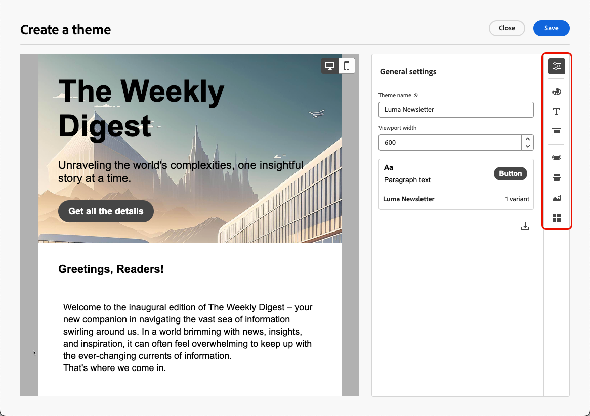

# Thema&#39;s toepassen op uw e-mailinhoud {#apply-email-themes}

>[!CONTEXTUALHELP]
>id="ajo_use_theme"
>title="Een thema toepassen op uw e-mail"
>abstract="Selecteer een thema voor uw e-mail om snel een specifieke stijl toe te passen die aan uw merk en ontwerp past."

>[!AVAILABILITY]
>
>Deze mogelijkheid is in Beperkte Beschikbaarheid. Neem contact op met uw Adobe-vertegenwoordiger voor toegang.

Met thema&#39;s, hebben de niet-technische gebruikers de capaciteit om herbruikbare inhoud tot stand te brengen die een specifiek merk en een ontwerptaal door douanemateriaal bovenop de standaardmalplaatjes <!-- to achieve brand specific results--> toe te voegen past.

Deze functie stelt marketers in staat visueel aantrekkelijke, merkgebonden e-mails sneller en met minder moeite te gebruiken en biedt geavanceerde aanpassingsopties voor unieke ontwerpbehoeften.

## Afvoerkanalen en beperkingen {#themes-guardrails}

* Wanneer u een volledig nieuw e-mailbericht maakt, kunt u uw inhoud op basis van een thema maken en snel een specifieke stijl toepassen die past bij uw merk en ontwerp.

  Als u de modus Handmatig opmaken kiest, kunt u alleen thema&#39;s toepassen als u uw e-mail opnieuw instelt.

* [ de Fragmenten ](../content-management/fragments.md) zijn niet dwars-compatibel tussen de Thema&#39;s van het Gebruik en de Hand het Stileren wijzen.

   * Geachte fragmenten zijn niet beschikbaar in e-mailinhoud die zonder thema&#39;s is gemaakt.

   * Aan hefboomwerking a [ fragment ](../content-management/fragments.md) in een thema inhoud, moet dit fragment zelf tot stand gebracht hebben gebruikend thema&#39;s. [Meer informatie](#leverage-themes-fragment)

   * Wanneer u een fragment in e-mailinhoud gebruikt, moet u een thema toepassen dat u voor dit fragment hebt gedefinieerd. Als u dit niet doet, kunnen er weergaveproblemen optreden, met name in Outlook 2021 en eerdere versies. [Meer informatie](#leverage-themes-fragment)

* Als het gebruiken van inhoud die in HTML wordt gecreeerd, zult u op [ verenigbaarheidswijze ](existing-content.md) zijn en u kunt geen thema&#39;s op deze inhoud direct toepassen.

   * Om thema&#39;s toe te passen, moet u eerst de ingevoerde inhoud [ als nieuw malplaatje ](../content-management/create-content-templates.md#save-as-template) bewaren, dan dit malplaatje in een thema-compatibele inhoud omzetten. Vervolgens kunt u deze sjabloon gebruiken om uw e-mailinhoud te maken. Leer hoe te om een malplaatje om te zetten dat met handhet stileren in [ wordt gecreeerd deze sectie ](#theme-convertor).

   * U kunt uw geïmporteerde HTML-inhoud ook converteren. [Meer informatie](existing-content.md)

  <!--To fully leverage all the capabilities of the Email Designer, including themes, you must either create a new content in Use Themes mode, or convert your imported HTML content. [Learn more](existing-content.md)-->

<!--If you apply a theme to a content using a [fragment](../content-management/fragments.md) created with Manual Styling mode, the rendering may not be optimal.-->

## Een thema maken {#create-and-edit-themes}

Volg onderstaande stappen om een thema te definiëren dat u in uw toekomstige e-mailinhoud kunt gebruiken.

1. Om begonnen te worden, creeer een nieuw [ inhoudsmalplaatje ](../content-management/create-content-templates.md).

1. Selecteer de optie **[!UICONTROL Create or edit themes]** .

   

1. Selecteer een Adobe-thema. In dit voorbeeld selecteert u **[!UICONTROL Default theme]** en klikt u op **[!UICONTROL Create]** .

   

1. U kunt ook een aangepaste sjabloon selecteren op het tabblad **[!UICONTROL My themes]** en op **[!UICONTROL Edit]** klikken om deze bij te werken.

   

1. Definieer op het tabblad **[!UICONTROL General settings]** het thema door het een specifieke naam te geven die aansluit bij uw merk. U kunt de standaardviewportbreedte voor uw e-mail aanpassen en ook het huidige thema naar [ uitvoeren deel het over zandbakken ](../configuration/copy-objects-to-sandbox.md).

   <!---->

1. Gebruik de rail rechts om door de verschillende lusjes te navigeren en uw ontwerpmontages bij te werken.

   

1. Op het tabblad **[!UICONTROL Colors]** :

   * Gebruik de knop **[!UICONTROL Edit]** om een **[!UICONTROL Color palette]** met standaardkleuren voor uw merk in te stellen. Selecteer een **[!UICONTROL Preset]** om snel een kleurenschema te maken of pas elke kleur van uw thema afzonderlijk aan. U kunt ook een combinatie van beide gebruiken.

     

   * Klik op **[!UICONTROL Add variant]** om meerdere kleurvarianten te maken, zoals de modus Licht en Donker, waarbij elke variant van het thema een eigen kleurenpalet en nuantiebesturingselementen heeft.

     

   * Klik voor elke variant op het pictogram **[!UICONTROL Edit]** om een afzonderlijk element te bewerken. U kunt het standaardpalet gebruiken dat u hebt gemaakt, of aangepaste kleuren.

     

1. In **[!UICONTROL Text settings]** kunt u het algemene lettertype instellen dat u voor het hele thema wilt gebruiken. Voor meer korrelige besturingselementen kunt u ook elk kop- en alineatekst bewerken om het lettertype, de grootte, de stijl enzovoort aan te passen.

   

1. Selecteer op het tabblad **[!UICONTROL Spacing]** een afzonderlijk element in de lijst om de ruimte tussen de verschillende componenten op de juiste wijze te bepalen.

   <!---->

1. Met de andere tabbladen aan de rechterkant kunt u elk knopelement, elke scheidingslijn, elke extra afbeeldingsopmaak en de ruimte tussen de rasterlay-outs voor dit thema afzonderlijk beheren.

   

1. Klik op **[!UICONTROL Save]** om dit thema op te slaan voor toekomstig gebruik. Deze wordt nu weergegeven op het tabblad **[!UICONTROL My themes]** .

<!--A little strange upon hitting Save, because once the theme is created, you need to hit Close to go back to Design your template screen, then click Cancel if you don't want to proceed with template creation.-->

## Thema&#39;s toepassen op e-mailinhoud {#apply-themes-email}

Voer de onderstaande stappen uit om standaard- of aangepaste opmaakthema&#39;s toe te passen op een inhoudssjabloon of een e-mail.

1. In [!DNL Journey Optimizer], [ voeg een e-mail ](create-email.md) actie aan een reis of een campagne toe, of creeer een e-mail [ inhoudsmalplaatje ](../content-management/create-content-templates.md#create-template-from-scratch), en [ geef het e-maillichaam ](get-started-email-design.md#key-steps) uit.

1. U kunt een van de volgende handelingen selecteren:

   * Selecteer een ingebouwde [ e-mailmalplaatje ](use-email-templates.md) om e-mail Designer te openen. Er wordt automatisch een standaardthema toegepast dat specifiek is voor elke sjabloon.

   * Ontwerp a [ nieuwe inhoud van kras ](content-from-scratch.md) en selecteer **[!UICONTROL Use Themes]** om met een vooraf bepaald het stileren thema te beginnen.

     

     >[!CAUTION]
     >
     >Als u de modus Handmatig opmaken kiest, kunt u alleen thema&#39;s toepassen als u het ontwerp opnieuw instelt.
     >
     >Aan hefboomwerking a [ fragment ](../content-management/fragments.md) in een thema inhoud, moet dit fragment zelf tot stand gebracht hebben gebruikend thema&#39;s. [Meer informatie](#leverage-themes-fragment)

1. Klik eenmaal in de e-mail-Designer op de knop **[!UICONTROL Themes]** op de rechtertrack. Het standaardthema of het thema van de sjabloon wordt weergegeven. U kunt schakelen tussen de twee kleurvarianten voor dit thema.

   

1. Klik op de pijl naast het thema dat momenteel wordt gebruikt. De lijst met beschikbare aangepaste thema&#39;s en Adobe-thema&#39;s wordt weergegeven.

   

1. Klik op **[!UICONTROL My themes]** en selecteer een thema dat u hebt gemaakt.

   

1. Klik buiten de vervolgkeuzelijst. Het nieuwe, aangepaste thema past automatisch de stijlen toe op alle e-mailcomponenten. U kunt schakelen tussen de eventuele kleurvarianten.

1. Wanneer een thema is geselecteerd in een inhoudssjabloon, kunt u op de knop **[!UICONTROL Edit theme]** klikken om het thema bij te werken. [Meer informatie](#create-and-edit-themes)

   {width="40%"}

   >[!NOTE]
   >
   >Deze optie is niet beschikbaar als u thema&#39;s in e-mailinhoud gebruikt.

1. Als u een thema gebruikt met verschillende kleurvarianten, kunt u een specifieke variant kiezen voor een bepaalde structuurcomponent. Zo kunt u een kleurvariant definiëren voor de gehele inhoud en een andere variant gebruiken voor slechts één specifieke structuur.

   >[!NOTE]
   >
   >U kunt deze handeling niet uitvoeren op inhoudscomponenten.

   Hiervoor selecteert u een structuurcomponent, klikt u op **[!UICONTROL Use specific theme's variant option]** op het tabblad **[!UICONTROL Styles]** rechts en past u de gewenste variant op die structuur toe.

   

   In dit voorbeeld wordt de eerste kleurvariant van het huidige thema toegepast op de hele e-mailinhoud, maar wordt de derde kleurvariant toegepast op de geselecteerde structuur. U ziet dat de achtergrondkleuren van de hoofdtekst en viewport voor die specifieke structuur afwijken van de rest van de inhoud.

U kunt op elk gewenst moment naar een ander thema gaan. De e-mailinhoud blijft ongewijzigd, maar de stijlen worden bijgewerkt met het nieuwe thema.

### Stijlen ontgrendelen {#unlocking-styles}

Wanneer een component is geselecteerd, kunt u de stijl ontgrendelen met het toegewezen pictogram op het tabblad **[!UICONTROL Styles]** .

{width="90%"}

Het geselecteerde thema wordt nog steeds op die component toegepast, maar u kunt de opmaakelementen ervan overschrijven. Als u thema&#39;s verandert, wordt het nieuwe thema slechts toegepast op het stileren elementen die niet met voeten werden getreden.<!--can you revert this action?-->

Bijvoorbeeld, als u een tekstcomponent ontgrendelt, kunt u <!--the font size from 11 to 14 and --> de doopvontkleur van zwart in rood veranderen:

{width="80%" align="center" zoomable="yes"}

Als u thema&#39;s verandert, <!--the font size is still 14 and --> is de doopvontkleur nog rood voor die component, maar de achtergrondkleur voor deze component zal met het nieuwe thema veranderen:

{width="80%"}

## Thema&#39;s in een fragment gebruiken {#leverage-themes-fragment}

Om een fragment in een malplaatje of een e-mail met [ toegepaste thema&#39;s ](#apply-themes-email) te hefboomwerking, moet dit fragment tot stand zijn gebracht zelf gebruikend thema&#39;s. Anders kunt u dit fragment niet gebruiken in de inhoud van het thema.

Voer de onderstaande stappen uit om een fragment te maken dat compatibel is met thema&#39;s.

1. Maak in [!DNL Journey Optimizer] een visueel fragment en klik op **[!UICONTROL Create]** om de inhoud van het fragment te ontwerpen. [ leer hoe ](../content-management/create-fragments.md)

1. Selecteer **[!UICONTROL Use Themes]** om te beginnen met een vooraf gedefinieerd opmaakthema.

   {width="100%"}

   >[!CAUTION]
   >
   >Als u de modus Handmatig opmaken kiest, kunt u alleen thema&#39;s toepassen als u het fragmentontwerp opnieuw instelt.

1. Eenmaal in de e-mail-Designer kunt u beginnen met het maken van het fragment.

1. Klik op de knop **[!UICONTROL Themes]** op de rechterrails. Het standaardthema wordt weergegeven. U kunt schakelen tussen de verschillende kleurvarianten voor dit thema.

   {width="100%" align="center" zoomable="yes"}

1. U kunt andere thema&#39;s selecteren om een voorvertoning van uw fragmentinhoud weer te geven. Selecteer hiertoe de pijl naast het standaardthema en klik op **[!UICONTROL Select themes]** .

   {width="40%"}

1. U kunt navigeren tussen de tabbladen **[!UICONTROL Adobe themes]** en **[!UICONTROL My themes]** en maximaal vijf compatibele thema&#39;s (van beide tabbladen) voor het fragment selecteren.

   {width=70%}

   >[!CAUTION]
   >
   >Wanneer het gebruiken van het fragment in een e-mailinhoud, zorg ervoor u [ een thema ](#apply-themes-email) toepast dat u voor dit fragment hebt bepaald. Als u dit niet doet, kunnen er weergaveproblemen optreden, met name in Outlook 2021 en eerdere versies.

1. Klik op **[!UICONTROL Close]**.

1. Selecteer nogmaals de pijl naast de **[!UICONTROL Default theme]** . U kunt nu schakelen tussen de verschillende thema&#39;s die u net hebt geselecteerd om elke stijlrendering te bekijken.

   {width=90%}

1. Klik nogmaals op **[!UICONTROL Select themes]** om meer thema&#39;s toe te voegen of uw selectie te wijzigen.

## Een sjabloon compatibel maken met thema&#39;s {#theme-convertor}

Met [!DNL Journey Optimizer] kunt u een sjabloon die met handmatige opmaak is gemaakt, omzetten in inhoud die compatibel is met thema&#39;s. Dit is vooral handig als u inhoudssjablonen hebt gemaakt voordat thema&#39;s werden geïntroduceerd in [!DNL Journey Optimizer] of als u externe inhoud importeert.

>[!NOTE]
>
> Slechts **e-mailmalplaatjes** kunnen worden omgezet om compatibel met thema&#39;s te zijn. Afzonderlijke e-mails kunnen niet worden geconverteerd. U moet uw inhoud eerst als een sjabloon opslaan.

1. Open een e-mail [ inhoudsmalplaatje ](../content-management/create-content-templates.md) en geef zijn inhoud uit gebruikend E-mail Designer.

1. Selecteer het pictogram **[!UICONTROL Themes]** op de rechterrails en klik op de knop **[!UICONTROL Generate theme from content]** .

   {width=100%}

1. Het venster **[!UICONTROL Create a theme]** wordt geopend. [!DNL Journey Optimizer] detecteert automatisch de opmaakelementen en voegt deze samen tot een nieuw thema.

   {width=90%}

1. Geef een naam op voor uw thema.

1. Breng desgewenst uw eigen aanpassingen aan, net als bij het maken van een geheel nieuw thema, zoals het toevoegen van een kleurvariant, het bewerken van lettertypen enzovoort. [ leer hoe ](#create-and-edit-themes)

   {width=90%}

1. Klik op **[!UICONTROL Save]** om dit nieuwe thema op te slaan voor hergebruik. U kunt dit thema nu toepassen op inhoud, zoals elk ander thema. [ leer hoe ](#leverage-themes-fragment)