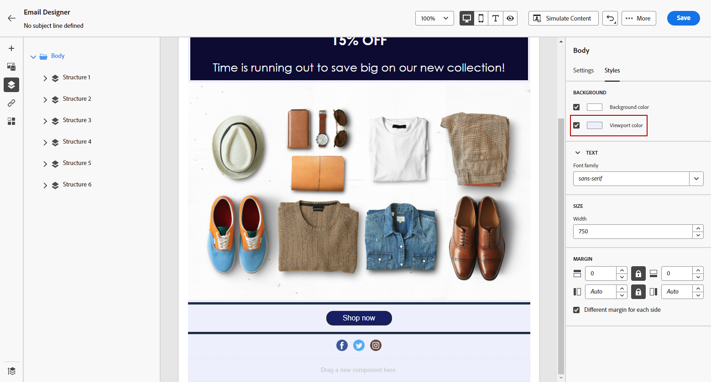

# Uw e-mailachtergrond aanpassen {#backgrounds}

>[!CONTEXTUALHELP]
>id="ac_edition_backgroundimage"
>title="Achtergrondinstellingen"
>abstract="U kunt de achtergrondkleur of achtergrondafbeelding voor uw inhoud aanpassen. Achtergrondafbeelding wordt niet door alle e-mailclients ondersteund."

Als het gaat om het instellen van achtergronden met de e-mailontwerper, raadt Adobe het volgende aan:

1. Pas een achtergrondkleur toe op de tekst van uw e-mail, indien dat door uw ontwerp wordt vereist.
1. Stel de achtergrondkleuren meestal in op kolomniveau.
1. Probeer geen achtergrondkleuren te gebruiken voor afbeeldings- of tekstcomponenten, omdat deze moeilijk te beheren zijn.

Hieronder vindt u de beschikbare achtergrondinstellingen die u kunt gebruiken.

* Een **[!UICONTROL Background color]** voor de hele e-mail. Selecteer de instellingen voor de hoofdtekst in de boomstructuur die toegankelijk is in het linkerpalet.

   

* Dezelfde achtergrondkleur voor alle structuurcomponenten instellen door **[!UICONTROL Viewport background color]**. Met deze optie kunt u een andere instelling selecteren dan de achtergrondkleur.

   

* Stel een andere achtergrondkleur in voor elke structuurcomponent. Selecteer een structuur in de boomstructuur die toegankelijk is vanuit het linkerpalet als u alleen een specifieke achtergrondkleur op die structuur wilt toepassen.

   Zorg ervoor dat u geen achtergrondkleur voor de viewport instelt, omdat hierdoor de achtergrondkleuren van de structuur kunnen worden verborgen.

   

* Een **[!UICONTROL Background image]** voor de inhoud van een structuurcomponent.

   >[!NOTE]
   >
   >Sommige e-mailprogramma&#39;s ondersteunen achtergrondafbeeldingen niet. Als deze optie niet wordt ondersteund, wordt in plaats daarvan de achtergrondkleur van de rij gebruikt. Selecteer de gewenste achtergrondkleur voor fallback voor het geval de afbeelding niet kan worden weergegeven.

   

* Stel een achtergrondkleur in op kolomniveau.

   >[!NOTE]
   >
   >Dit is het meest gebruikte geval. Adobe raadt aan achtergrondkleuren in te stellen op kolomniveau, omdat dit meer flexibiliteit biedt bij het bewerken van de volledige e-mailinhoud.

   U kunt ook een achtergrondafbeelding instellen op kolomniveau, maar dit wordt zelden gebruikt.

   
