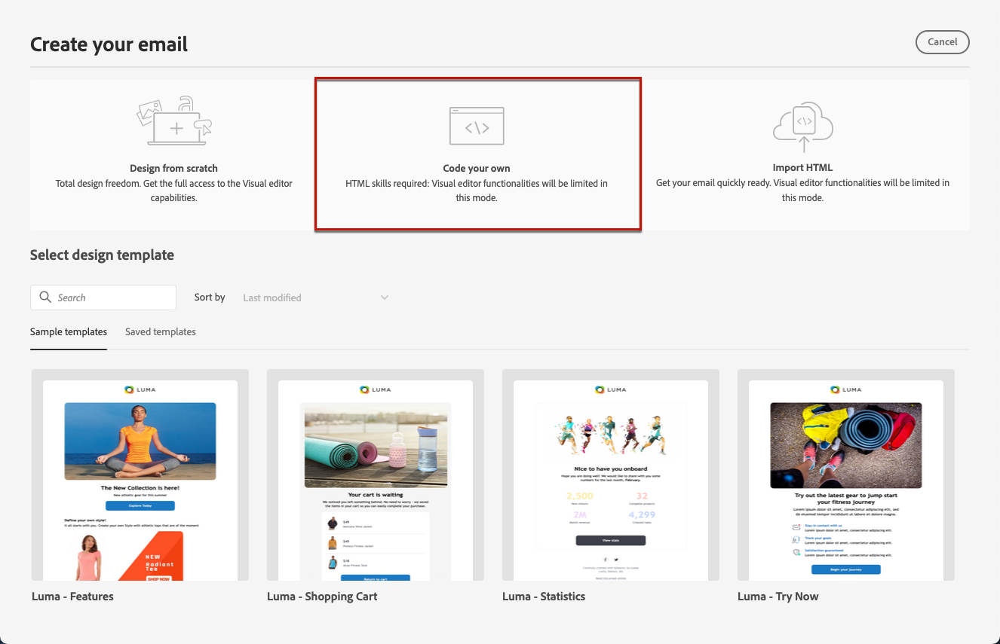

# Uw eigen inhoud coderen {#code-content}

Gebruik de modus **[!UICONTROL Code your own]** om onbewerkte HTML te importeren en/of uw e-mailinhoud te coderen. Deze methode vereist HTML-vaardigheden.

➡️ [&#x200B; ontdekt deze eigenschap in video &#x200B;](#video)

>[!CAUTION]
>
> De beelden van [&#x200B; Adobe Experience Manager Assets &#x200B;](../integrations/assets.md) kunnen niet worden van verwijzingen voorzien wanneer het gebruiken van deze methode. De afbeeldingen waarnaar in uw HTML-code wordt verwezen, moeten worden opgeslagen op een openbare locatie.

1. Selecteer **[!UICONTROL Code your own]** op de homepage van E-mail Designer.

   

1. Voer de onbewerkte HTML-code in of plak deze.

1. Gebruik het linkerdeelvenster om [!DNL Journey Optimizer] personalisatiemogelijkheden te benutten. [Meer informatie](../personalization/personalize.md)

   

1. Als u uw e-mailinhoud wilt wissen en uw e-mail wilt starten vanuit een nieuw ontwerp, selecteert u **[!UICONTROL Change your design]** in het optiemenu.

   

   >[!NOTE]
   >
   >Met deze handeling wordt de geselecteerde sjabloon geopend in de e-mailtoepassing van de Designer. Daarna kunt u het ontwerp van uw e-mail voltooien of teruggaan naar de code-editor met de optie **[!UICONTROL Switch to code editor]** .

1. Klik op de knop **[!UICONTROL Preview]** om het ontwerp en de personalisatie van berichten te controleren met behulp van testprofielen. [Meer informatie](../content-management/preview-test.md)

   

1. Zodra uw code klaar is, klik **[!UICONTROL Save]** dan ga terug naar het scherm van de berichtverwezenlijking om uw bericht te voltooien.

   
