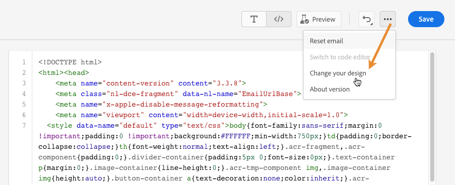

# Uw eigen inhoud coderen {#code-content}

Met **[!UICONTROL Code your own]** kunt u onbewerkte HTML schrijven of plakken en rechtstreeks e-mailinhoud maken in de [!DNL Journey Optimizer] e-mailtoepassing van Designer. Gebruik deze modus wanneer u volledige controle over markeringen nodig hebt of wanneer u bestaande HTML importeert.

U moet de vaardigheden van HTML hebben, en zodra u deze wijze kiest, blijft u in code redacteur-u kunt niet op de visuele redacteur schakelen.

➡️ [Ontdek deze functie in video](#video)

>[!NOTE]
>
>**[!UICONTROL Code your own]** is niet hetzelfde als de geavanceerde HTML-editor in inhoudssjablonen. Met de geavanceerde HTML-editor kunt u op elk gewenst moment schakelen tussen de HTML-weergave en de visuele weergave (Computer), en niet tussen de code-editor. [&#x200B; Leer meer over de geavanceerde redacteur van HTML &#x200B;](../content-management/email-template-expert-mode.md).

## De code-editor gebruiken {#use-code-editor}

Voer de volgende stappen uit om e-mailinhoud te maken of te bewerken met de code-editor.

1. Van de [&#x200B; E-mail Designer &#x200B;](get-started-email-design.md) homepage, uitgezochte **[!UICONTROL Code your own]**.

   

1. Voer de onbewerkte HTML-code in of plak deze.

1. Gebruik het linkerdeelvenster om [!DNL Journey Optimizer] personalisatiemogelijkheden te benutten. [Meer informatie](../personalization/personalize.md)

   

   >[!NOTE]
   >
   >De personalisatie-editor in de e-mail Designer heeft enkele functiebeperkingen in vergelijking met reisexpressies. [&#x200B; leer meer over datum/tijdfunctiebeperkingen &#x200B;](#date-time-limitations)

1. Als u uw e-mailinhoud wilt wissen en uw e-mail wilt starten vanuit een nieuw ontwerp, selecteert u **[!UICONTROL Change your design]** in het optiemenu.

   

   >[!NOTE]
   >
   >Met deze handeling wordt de geselecteerde sjabloon geopend in de e-mailtoepassing van de Designer. Daarna kunt u het ontwerp van uw e-mail voltooien of teruggaan naar de code-editor met de optie **[!UICONTROL Switch to code editor]** .

1. Klik op de knop **[!UICONTROL Preview]** om het ontwerp en de personalisatie van berichten te controleren met behulp van testprofielen. [Meer informatie](../content-management/preview-test.md)

   

1. Zodra uw code klaar is, klik **[!UICONTROL Save]** dan ga terug naar het scherm van de berichtverwezenlijking om uw bericht te voltooien.

   

>[!CAUTION]
>
>De beelden van [&#x200B; Adobe Experience Manager Assets &#x200B;](../integrations/assets.md) kunnen niet worden van verwijzingen voorzien wanneer het gebruiken van de Code uw eigen methode. Sla afbeeldingen waarnaar in uw HTML-code wordt verwezen, op een openbare locatie op.

## Beperkingen van datum- en tijdfunctie {#date-time-limitations}

Wanneer u personalisatie gebruikt in de E-mailcode-editor van de Designer, is de functie `now()` niet beschikbaar voor dynamische datumberekeningen.

>[!IMPORTANT]
>
>De `now()` functie wordt **niet gesteund** in de de uitdrukkingstaal van de Bouwer E-mail. Hoewel `now()` beschikbaar is in reisomstandigheden, kan het niet worden gebruikt in e-mailinhoud of de code-editor.

**Beschikbare alternatieven:**

Gebruik de volgende functies om met huidige datum en tijd in e-mailverpersoonlijking te werken:

* **`getCurrentZonedDateTime()`** - Retourneert de huidige datum en tijd met informatie over de tijdzone. Dit is het aanbevolen alternatief voor `now()` .

  Voorbeeld: `` retourneert `2024-12-06T17:22:02.281067+05:30[Asia/Kolkata]`

* **`currentTimeInMillis()`** - Geeft de huidige tijd in epoch milliseconds.

  Voorbeeld: ``

**geadviseerde alternerende actie:**

Als u datumberekeningen moet uitvoeren in uw e-mailinhoud:

* **precalculate datumgebieden** - bereken vereiste datumwaarden in uw gegevens pijpleiding of profielattributen alvorens e-mail te verzenden, dan verwijzing deze vooraf berekende waarden in uw verpersoonlijking.

  Voorbeeld: ``

* **de functies van de de datummanipulatie van het Gebruik** - 2&rbrace; datum/tijdfuncties [&#x200B; als &#x200B;](../personalization/functions/dates.md) of `dayOfYear()` met datumwaarden van profielattributen gebruiken.`diffInDays()`

  Voorbeeld: ``

* **Gebruik gegevens verwerkte attributen** - creeer [&#x200B; gegevens verwerkte attributen &#x200B;](../audience/computed-attributes.md) die complexe datumberekeningen uitvoeren, die de resultaten beschikbaar maken als profielattributen.

Zie [&#x200B; functie van de Datum en van de tijd &#x200B;](../personalization/functions/dates.md) voor de volledige lijst van gesteunde functies.
