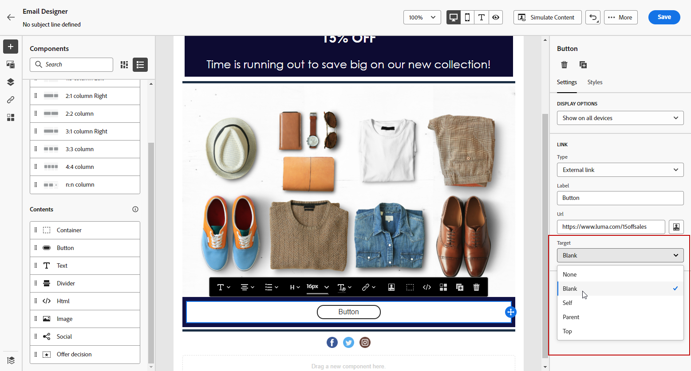

# De inhoudcomponenten van E-mailDesigner gebruiken {#content-components}

>[!CONTEXTUALHELP]
>id="ac_content_components_email"
>title="Informatie over inhoudscomponenten"
>abstract="Inhoudscomponenten zijn lege plaatsaanduidingen voor inhoud die u kunt gebruiken om de lay-out van een e-mail te maken."

>[!CONTEXTUALHELP]
>id="ac_content_components_landing_page"
>title="Informatie over inhoudscomponenten"
>abstract="Inhoudscomponenten zijn lege plaatsaanduidingen voor inhoud die u kunt gebruiken om de lay-out van een bestemmingspagina te maken."

>[!CONTEXTUALHELP]
>id="ac_content_components_fragment"
>title="Informatie over inhoudscomponenten"
>abstract="Inhoudscomponenten zijn lege plaatsaanduidingen voor inhoud die u kunt gebruiken om de lay-out van een fragment te maken."

>[!CONTEXTUALHELP]
>id="ac_content_components_template"
>title="Informatie over inhoudscomponenten"
>abstract="Inhoudscomponenten zijn lege plaatsaanduidingen voor inhoud die u kunt gebruiken om de lay-out van een sjabloon te maken."

Wanneer u uw e-mailinhoud maakt, **[!UICONTROL Content components]** kunt u uw e-mail verder aanpassen met onbewerkte onderdelen die u kunt bewerken nadat u deze in een e-mail hebt geplaatst.

U kunt zoveel inhoudscomponenten toevoegen als u nodig hebt binnen een of meer structuurcomponenten, die de indeling van uw e-mail definiëren.

## Inhoudscomponenten toevoegen {#add-content-components}

Voer de onderstaande stappen uit om inhoudcomponenten aan uw e-mail toe te voegen en deze aan uw wensen aan te passen.

1. Gebruik in de e-mailontwerper een bestaande inhoud of sleep en zet **[!UICONTROL Structure components]** in uw lege inhoud om de lay-out van uw e-mail te bepalen. [Meer informatie](content-from-scratch.md)

1. Om toegang te krijgen tot **[!UICONTROL Content components]** selecteert u de bijbehorende knop in het linkerdeelvenster van E-mailontwerper.

   

1. Sleep de inhoudcomponenten van uw keuze naar keuze binnen de relevante structuurcomponenten.

   

   >[!NOTE]
   >
   >U kunt meerdere componenten toevoegen aan één structuurcomponent en aan elke kolom van een structuurcomponent.

1. Pas de kenmerken en opmaak voor elke component aan met de opdracht **[!UICONTROL Settings]** en **[!UICONTROL Style]** aan de rechterkant. U kunt bijvoorbeeld de tekststijl, opvulling of marge van elke component wijzigen. [Meer informatie over uitlijning en opvulling](alignment-and-padding.md)

   

1. Via het geavanceerde menu van uw **[!UICONTROL Content component]** kunt u inhoudscomponenten gemakkelijk verwijderen of dupliceren.

   

## Container {#container}

Als u specifieke opmaak wilt toepassen op een groep inhoudcomponenten, kunt u een **[!UICONTROL Container]** en voegt vervolgens de gewenste inhoudcomponent(en) in de component toe. Hierdoor kunt u een afzonderlijke stijl op de container toepassen. Deze stijl verschilt van de stijl die op de inhoudcomponenten binnen wordt toegepast.

Voeg bijvoorbeeld een **[!UICONTROL Container]** en voegt vervolgens een [Knop](#button) in die container. U kunt een specifieke achtergrond voor de container, en een andere voor de knoop gebruiken.

## Knop {#button}

Gebruik de **[!UICONTROL Button]** om een of meerdere knoppen in te voegen in uw e-mail en uw e-mailpubliek om te leiden naar een andere pagina.

1. Van **[!UICONTROL Content components]**, slepen en neerzetten **[!UICONTROL Button]** in een **[!UICONTROL Structure component]**.

1. Klik op de knop die u net hebt toegevoegd om de tekst aan te passen en toegang te krijgen tot de knop **[!UICONTROL Settings]** en **[!UICONTROL Styles]** tabbladen in het rechterdeelvenster van E-mailontwerper.

   

1. Van de **[!UICONTROL Link]** voegt u de URL toe waarnaar u wilt omleiden wanneer u op de knop klikt.

1. Kies hoe de doelgroep wordt omgeleid met de **[!UICONTROL Target]** vervolgkeuzelijst:

   * **[!UICONTROL None]**: Hiermee opent u de koppeling in hetzelfde frame als waarop u hebt geklikt (standaard).
   * **[!UICONTROL Blank]**: Hiermee opent u de koppeling in een nieuw venster of op een nieuw tabblad.
   * **[!UICONTROL Self]**: Hiermee opent u de koppeling in hetzelfde frame als waarop u hebt geklikt.
   * **[!UICONTROL Parent]**: Hiermee opent u de koppeling in het bovenliggende frame.
   * **[!UICONTROL Top]**: Hiermee opent u de koppeling in de volledige tekst van het venster.

   

1. U kunt de knop verder aanpassen door opmaakkenmerken te wijzigen, zoals **[!UICONTROL Border]**, **[!UICONTROL Size]**, **[!UICONTROL Margin]**, enz. van de **[!UICONTROL Component settings]** venster.

## Tekst {#text}

Gebruik de **[!UICONTROL Text]** om tekst in te voegen in uw e-mail, en de stijl (rand, grootte, opvulling, enz.) aan te passen met de **[!UICONTROL Styles]** tab.

1. Van **[!UICONTROL Content components]**, slepen en neerzetten **[!UICONTROL Text]** in een **[!UICONTROL Structure component]**.

1. Klik op de nieuwe component om de tekst aan te passen en toegang te krijgen tot de component **[!UICONTROL Settings]** en **[!UICONTROL Styles]** in het rechterdeelvenster van de e-mailontwerper.

1. Wijzig de tekst met de volgende opties beschikbaar op de werkbalk:

   

   * **[!UICONTROL Change text style]**: u kunt uw tekst vet, cursief, onderstrepen of doorhalen.
   * **Uitlijning wijzigen**: kiest u tussen links, rechts, centreren of uitvullen voor de tekst.
   * **[!UICONTROL Create list]**: Voeg opsommingstekens of nummers toe aan uw tekst.
   * **[!UICONTROL Set heading]**: Voeg maximaal zes kopniveaus aan uw tekst toe.
   * **Fontgrootte**: Selecteer de tekengrootte van de tekst in pixels.
   * **[!UICONTROL Change font color]**: kiest u de kleur van het lettertype.
   * **[!UICONTROL Insert link]**: voeg om het even welk type van verbinding aan uw inhoud toe.
   * **[!UICONTROL Edit image]**: Voeg een afbeelding of een element toe aan uw tekstcomponent. [Meer informatie over middelenbeheer](assets-essentials.md)
   * **[!UICONTROL Change font color]**: kiest u de kleur van het lettertype.
   * **[!UICONTROL Add personalization]**: Voeg verpersoonlijkingsgebieden toe om de inhoud van uw profielgegevens aan te passen. [Meer informatie over content personalization](../personalization/personalize.md)
   * **[!UICONTROL Show the source code]**: de broncode van de tekst weergeven. Het kan niet worden gewijzigd.
   * **[!UICONTROL Enable conditional content]**: Voeg voorwaardelijke inhoud toe om de inhoud van de component aan de beoogde profielen aan te passen. [Meer informatie over dynamische inhoud](../personalization/get-started-dynamic-content.md)
   * **[!UICONTROL Duplicate]**: Voeg een kopie van de tekstcomponent toe.
   * **[!UICONTROL Delete]**: Verwijder de geselecteerde tekstcomponent uit uw e-mail.

1. Pas de andere opmaakkenmerken aan, zoals tekstkleur, lettertypefamilie, rand, opvulling, marge, enzovoort. van de **[!UICONTROL Styles]** tab.

   

## Scheidingslijn {#divider}

Gebruik de **[!UICONTROL Divider]** om een scheidingslijn in te voegen om de lay-out en inhoud van uw e-mail te ordenen.

U kunt opmaakkenmerken zoals lijnkleur, -stijl en -hoogte aanpassen vanuit het dialoogvenster **[!UICONTROL Settings]** en **[!UICONTROL Styles]** tabs.

## HTML {#HTML}

Gebruik de **[!UICONTROL HTML]** om de verschillende onderdelen van uw bestaande HTML te kopiëren en te plakken. Hierdoor kunt u gratis modulaire HTML-componenten maken om externe inhoud opnieuw te gebruiken.

1. Van **[!UICONTROL Content Components]**, slepen en neerzetten **[!UICONTROL HTML]** in een **[!UICONTROL Structure component]**.

1. Klik op de zojuist toegevoegde component en selecteer vervolgens **[!UICONTROL Show the source code]** van de contextafhankelijke werkbalk om uw HTML toe te voegen.

   

1. Kopieer en plak de HTML-code die u aan uw e-mail wilt toevoegen en klik op **[!UICONTROL Save]**.

   

>[!NOTE]
>
>Om een externe inhoud eenvoudig compatibel te maken met de e-mailontwerper, raadt Adobe u aan een geheel nieuw bericht te maken en de inhoud van uw bestaande e-mail naar componenten te kopiëren.

## Afbeelding {#image}

Gebruik de **[!UICONTROL Image]** om een afbeeldingsbestand van uw computer in te voegen in uw e-mailinhoud.

1. Van **[!UICONTROL Content components]**, slepen en neerzetten **[!UICONTROL Image]** in een **[!UICONTROL Structure component]**.

   

1. Klikken **[!UICONTROL Browse]** om een afbeeldingsbestand te kiezen uit uw elementen.

   Meer informatie over [!DNL Assets Essentials], zie [Adobe Experience Manager Assets Essentials-documentatie](https://experienceleague.adobe.com/docs/experience-manager-assets-essentials/help/introduction.html){target="_blank"}.

1. Klik op de nieuw toegevoegde component en stel de afbeeldingseigenschappen in via het dialoogvenster **[!UICONTROL Settings]** tab:

   * **[!UICONTROL Image title]** Hiermee kunt u een titel voor de afbeelding definiëren.
   * **[!UICONTROL Alt text]** Hiermee kunt u het bijschrift definiëren dat aan de afbeelding is gekoppeld. Dit komt overeen met het kenmerk alt HTML.

   

1. U kunt ook **[!UICONTROL Find similar Stock photos]**. [Meer informatie](stock.md)

1. Van de **[!UICONTROL Styles]** , past u de andere opmaakkenmerken aan, zoals marge, rand, enz. of u voegt een koppeling toe om uw publiek om te leiden naar een andere inhoud vanuit de **[!UICONTROL Component settings]** venster.

## Social {#social}

Gebruik de **[!UICONTROL Social]** om koppelingen naar pagina&#39;s met sociale media in te voegen in uw e-mailinhoud.

1. Van **[!UICONTROL Content Components]**, slepen en neerzetten **[!UICONTROL Social]** in een **[!UICONTROL Structure component]**.

1. Selecteer de zojuist toegevoegde component.

1. In de **[!UICONTROL Social]** van het **[!UICONTROL Settings]** kiest u welke sociale media u wilt toevoegen of verwijderen.

   

1. Kies de grootte van de pictogrammen in het desbetreffende veld.

1. Klik op elk van uw pictogrammen voor sociale media om het dialoogvenster **[!UICONTROL URL]** waarnaar uw publiek wordt omgeleid.

   

1. U kunt de pictogrammen van elk van uw sociale media desgewenst ook wijzigen in uw Middelen.

1. Pas de andere opmaakkenmerken aan, zoals stijl, marge, rand, enzovoort. van de **[!UICONTROL Styles]** tab.

## Offertebeslissing {#offer-decision}

Gebruik de **[!UICONTROL Offer decision]** om aanbiedingen in te voegen in uw berichten. De [beslissingsbeheer](../offers/get-started/starting-offer-decisioning.md) engine kiest de beste aanbieding voor uw klanten.

1. Van **[!UICONTROL Content Components]**, slepen en neerzetten **[!UICONTROL Offer decision]** in een **[!UICONTROL Structure component]**.

1. Klikken **[!UICONTROL Add]** om uw **[!UICONTROL Offer decision]**.

   

1. Selecteer in de vervolgkeuzelijst de optie **[!UICONTROL Placements]**.  Selecteer vervolgens de **[!UICONTROL Offer decision]** wilt u toevoegen aan uw inhoud en klikt u op **[!UICONTROL Add]**.

   

1. Van de **[!UICONTROL Offer decision]** kunt u een voorbeeld van het ingevoegde voorstel bekijken of dit wijzigen.

Leer hoe u persoonlijke aanbiedingen kunt toevoegen aan een e-mailbericht in [deze sectie](add-offers-email.md).

>[!IMPORTANT]
>
>Als er wijzigingen worden aangebracht in een biedbesluit dat wordt gebruikt in een reisbericht, moet u de reis ongedaan maken en opnieuw publiceren.  Dit zal ervoor zorgen dat de veranderingen in het reisbericht worden opgenomen en dat de boodschap in overeenstemming is met de meest recente updates.
