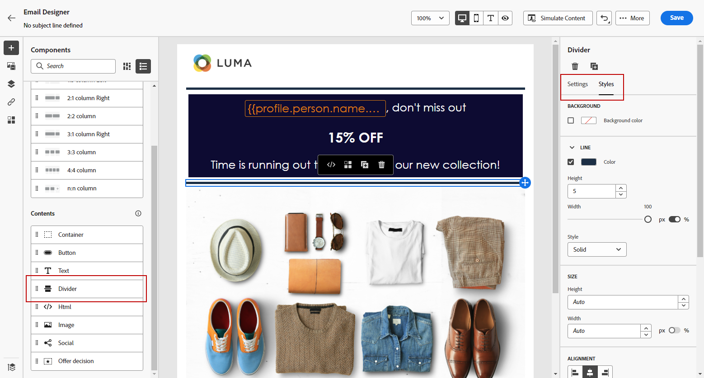

# De Designer-inhoudsonderdelen voor e-mail gebruiken {#content-components}

>[!CONTEXTUALHELP]
>id="ac_content_components_email"
>title="Informatie over contentonderdelen"
>abstract="Inhoudscomponenten zijn lege plaatsaanduidingen voor inhoud die u kunt gebruiken om de lay-out van een e-mail te maken."

>[!CONTEXTUALHELP]
>id="ac_content_components_landing_page"
>title="Informatie over contentonderdelen"
>abstract="Inhoudscomponenten zijn lege plaatsaanduidingen voor inhoud die u kunt gebruiken om de lay-out van een bestemmingspagina te maken."

>[!CONTEXTUALHELP]
>id="ac_content_components_fragment"
>title="Informatie over contentonderdelen"
>abstract="Inhoudscomponenten zijn lege plaatsaanduidingen voor inhoud die u kunt gebruiken om de lay-out van een fragment te maken."

>[!CONTEXTUALHELP]
>id="ac_content_components_template"
>title="Informatie over contentonderdelen"
>abstract="Inhoudscomponenten zijn lege plaatsaanduidingen voor inhoud die u kunt gebruiken om de lay-out van een sjabloon te maken."

Wanneer u uw e-mailinhoud maakt, kunt u in **[!UICONTROL Content components]** uw e-mail verder aanpassen met onbewerkte onderdelen die u kunt bewerken wanneer u deze eenmaal in een e-mail hebt geplaatst.

U kunt zoveel inhoudscomponenten toevoegen als u nodig hebt binnen een of meer structuurcomponenten, die de indeling van uw e-mail definiëren.

>[!NOTE]
>
>De [&#x200B; Europese toegankelijkheidshandeling &#x200B;](https://eur-lex.europa.eu/legal-content/EN/TXT/?uri=CELEX%3A32019L0882){target="_blank"} verklaart dat alle digitale mededelingen toegankelijk zouden moeten zijn. Zorg ervoor u de specifieke richtlijnen volgt die op [&#x200B; worden vermeld deze pagina &#x200B;](accessible-content.md) wanneer het leveraging van inhoudscomponenten om e-mails in [!DNL Journey Optimizer] te ontwerpen, zoals het gebruiken van toegankelijke doopvonten, leesbare formaten, en het verstrekken van alternatieve tekst voor beelden.

## Inhoudscomponenten toevoegen {#add-content-components}

Voer de onderstaande stappen uit om inhoudcomponenten aan uw e-mail toe te voegen en deze aan uw wensen aan te passen.

1. Gebruik in de Designer-e-mail een bestaande inhoud of sleep **[!UICONTROL Structure components]** naar de lege inhoud om de lay-out van uw e-mail te definiëren. [&#x200B; leer hoe &#x200B;](content-from-scratch.md)

1. U opent de sectie **[!UICONTROL Content components]** door de bijbehorende knop te selecteren in het linkerdeelvenster van de Designer-mailtoepassing.

   

1. Sleep de inhoudcomponenten van uw keuze naar keuze binnen de relevante structuurcomponenten.

   

   >[!NOTE]
   >
   >U kunt meerdere componenten toevoegen aan één structuurcomponent en aan elke kolom van een structuurcomponent.

1. Pas de kenmerken en opmaak voor elke component aan met de tabbladen **[!UICONTROL Settings]** en **[!UICONTROL Style]** rechts. U kunt bijvoorbeeld de tekststijl, opvulling of marge van elke component wijzigen. [&#x200B; leer meer over groepering en het opvullen &#x200B;](alignment-and-padding.md)

   

1. Vanuit het geavanceerde menu van uw **[!UICONTROL Content component]** kunt u zo nodig eenvoudig inhoudscomponenten verwijderen of dupliceren.

   

## Container {#container}

Als u specifieke opmaak wilt toepassen op een groep inhoudscomponenten, kunt u een component **[!UICONTROL Container]** toevoegen en vervolgens de gewenste inhoudscomponent(en) in de component toevoegen. Op deze manier kunt u een afzonderlijke stijl op de container toepassen. Deze stijl verschilt van de stijl die op de inhoudcomponenten binnen is toegepast.

Bijvoorbeeld, voeg een **[!UICONTROL Container]** component toe en voeg dan a [&#x200B; Button &#x200B;](#button) component binnen die container toe. U kunt een specifieke achtergrond voor de container, en een andere voor de knoop gebruiken.

## Knop {#button}

Gebruik de component **[!UICONTROL Button]** om een of meerdere knoppen in te voegen in uw e-mail en uw e-mailpubliek om te leiden naar een andere pagina.

1. Sleep de component **[!UICONTROL Content components]** vanuit **[!UICONTROL Button]** naar een **[!UICONTROL Structure component]** -component.

1. Klik op de knop die u net hebt toegevoegd om de tekst aan te passen en om toegang te krijgen tot de tabbladen **[!UICONTROL Settings]** en **[!UICONTROL Styles]** in het rechterdeelvenster van Designer e-mailen.

   

1. Voeg in het menu **[!UICONTROL Link]** de URL toe waarnaar u wilt omleiden wanneer u op de knop klikt.

1. Kies hoe de doelgroep wordt omgeleid in de vervolgkeuzelijst **[!UICONTROL Target]** :

   * **[!UICONTROL None]** : hiermee wordt de koppeling geopend in hetzelfde frame als waarop is geklikt (standaard).
   * **[!UICONTROL Blank]** : hiermee opent u de koppeling in een nieuw venster of op een nieuw tabblad.
   * **[!UICONTROL Self]** : hiermee opent u de koppeling in hetzelfde frame als waarop u hebt geklikt.
   * **[!UICONTROL Parent]** : hiermee opent u de koppeling in het bovenliggende frame.
   * **[!UICONTROL Top]** : hiermee opent u de koppeling in de volledige tekst van het venster.

   

1. U kunt de knop verder aanpassen door opmaakkenmerken zoals **[!UICONTROL Border]** , **[!UICONTROL Size]** , **[!UICONTROL Margin]** enz. te wijzigen. in het deelvenster **[!UICONTROL Component settings]** .

## Tekst {#text}

Gebruik de component **[!UICONTROL Text]** om tekst in te voegen in uw e-mail en pas de stijl (rand, grootte, opvulling, enz.) aan met de tab **[!UICONTROL Styles]** .

1. Sleep de component **[!UICONTROL Content components]** vanuit **[!UICONTROL Text]** naar een **[!UICONTROL Structure component]** -component.

1. Klik op de zojuist toegevoegde component om de tekst aan te passen en toegang te krijgen tot de tabbladen **[!UICONTROL Settings]** en **[!UICONTROL Styles]** in het rechterdeelvenster van de Designer-e-mail.

1. Wijzig de tekst met de volgende opties beschikbaar op de werkbalk:

   

   * **[!UICONTROL Change text style]**: pas de tekst vet, cursief, onderstrepen of doorhalen.
   * **de groepering van de Verandering**: kies tussen linkerzijde, recht, centrum of gerechtvaardigde groepering voor uw tekst.
   * **[!UICONTROL Create list]**: voeg een lijst met opsommingstekens of nummers toe aan uw tekst.
   * **[!UICONTROL Set heading]**: voeg maximaal zes koptekstniveaus toe aan uw tekst.
   * **de grootte van het Doopvont**: selecteer de doopvontgrootte van uw tekst in pixel.
   * **[!UICONTROL Change font color]** : kies de kleur van het lettertype.
   * **[!UICONTROL Insert link]** : voeg een willekeurig type koppeling toe aan uw inhoud.
   * **[!UICONTROL Edit image]**: voeg een afbeelding of een element toe aan uw tekstcomponent. [&#x200B; Leer meer over middelenbeheer &#x200B;](../integrations/assets.md)
   * **[!UICONTROL Change font color]** : kies de kleur van het lettertype.
   * **[!UICONTROL Add personalization]**: voeg verpersoonlijkingsgebieden toe om de inhoud van uw profielgegevens aan te passen. [&#x200B; Leer meer over inhoudstijdpersonalisatie &#x200B;](../personalization/personalize.md)
   * **[!UICONTROL Show the source code]** : geef de broncode van de tekst weer. Het kan niet worden gewijzigd.
   * **[!UICONTROL Enable conditional content]**: voeg voorwaardelijke inhoud toe om de inhoud van de component aan de doelprofielen aan te passen. [&#x200B; leer meer over dynamische inhoud &#x200B;](../personalization/get-started-dynamic-content.md)
   * **[!UICONTROL Duplicate]** : voeg een kopie van de tekstcomponent toe.
   * **[!UICONTROL Delete]**: verwijder de geselecteerde tekstcomponent uit uw e-mail.

1. Pas de andere opmaakkenmerken aan, zoals tekstkleur, lettertypefamilie, rand, opvulling, marge, enzovoort. op de tab **[!UICONTROL Styles]** .

   

## Scheidingslijn {#divider}

Gebruik de component **[!UICONTROL Divider]** om een scheidingslijn in te voegen om de lay-out en inhoud van uw e-mail te ordenen.

U kunt opmaakkenmerken zoals de lijnkleur, stijl en hoogte aanpassen op de tabbladen **[!UICONTROL Settings]** en **[!UICONTROL Styles]** .

## HTML {#HTML}

Gebruik de component **[!UICONTROL HTML]** om de verschillende onderdelen van uw bestaande HTML te kopiëren en te plakken. Op deze manier kunt u gratis modulaire HTML-componenten maken om externe inhoud opnieuw te gebruiken.

1. Sleep de component **[!UICONTROL Content Components]** vanuit **[!UICONTROL HTML]** naar een **[!UICONTROL Structure component]** -component.

1. Klik op de zojuist toegevoegde component en selecteer vervolgens **[!UICONTROL Show the source code]** op de contextafhankelijke werkbalk om uw HTML toe te voegen.

   

1. Kopieer en plak de HTML-code die u aan uw e-mail wilt toevoegen en klik op **[!UICONTROL Save]** .

   

>[!NOTE]
>
>Adobe raadt u aan een geheel nieuw bericht te maken en de inhoud van uw bestaande e-mail te kopiëren naar onderdelen, zodat u eenvoudig een externe inhoud compatibel kunt maken met de e-mailtoepassing.

## Afbeelding {#image}

Gebruik de component **[!UICONTROL Image]** om een afbeeldingsbestand van uw computer in te voegen in uw e-mailinhoud.

1. Sleep de component **[!UICONTROL Content components]** vanuit **[!UICONTROL Image]** naar een **[!UICONTROL Structure component]** -component.

   

1. Klik op het tabblad **[!UICONTROL Settings]** op **[!UICONTROL Browse]** om een afbeeldingsbestand te kiezen uit uw elementen of **[!UICONTROL Import media]** om een element te uploaden naar Adobe Experience Manager Assets.

   Meer over [!DNL Adobe Experience Manager Assets] leren, verwijs naar [&#x200B; documentatie van Adobe Experience Manager Assets &#x200B;](https://experienceleague.adobe.com/docs/experience-manager-assets-essentials/help/introduction.html?lang=nl-NL){target="_blank"}.

   >[!NOTE]
   >
   > We raden u aan Adobe Assets te gebruiken in plaats van op een bron-URL voor uw afbeeldingen te vertrouwen om ervoor te zorgen dat uw koppelingen actief blijven en om problemen met het verlopen te voorkomen.

1. U kunt ook rechtstreeks zoeken in Adobe Stock met de optie **[!UICONTROL Find Adobe Stock photos]** .

1. Klik op de nieuw toegevoegde component en stel de afbeeldingseigenschappen in:

   * Met **[!UICONTROL Image title]** kunt u een titel voor de afbeelding definiëren.
   * Met **[!UICONTROL Alt text]** kunt u het bijschrift definiëren dat aan de afbeelding is gekoppeld. Dit komt overeen met het alt HTML-kenmerk. [Meer informatie](../email/accessible-content.md#alt-text)

   

1. U kunt ook kiezen voor **[!UICONTROL Find similar Stock photos]** . [Meer informatie](../integrations/stock.md)

1. Pas op het tabblad **[!UICONTROL Styles]** de andere opmaakkenmerken aan, zoals marge, rand, enzovoort. of door een koppeling toe te voegen om de doelgroep vanuit het deelvenster **[!UICONTROL Component settings]** om te leiden naar andere inhoud.

## Social {#social}

Gebruik de component **[!UICONTROL Social]** om koppelingen naar pagina&#39;s met sociale media in te voegen in uw e-mailinhoud.

1. Sleep de component **[!UICONTROL Content Components]** vanuit **[!UICONTROL Social]** naar een **[!UICONTROL Structure component]** -component.

1. Selecteer de zojuist toegevoegde component.

1. Kies in het veld **[!UICONTROL Social]** van het tabblad **[!UICONTROL Settings]** welke sociale media u wilt toevoegen of verwijderen.

   

1. Kies de grootte van de pictogrammen in het desbetreffende veld.

1. Klik op elk van uw pictogrammen voor sociale media om de **[!UICONTROL URL]** te configureren waarnaar uw publiek wordt omgeleid.

   

1. U kunt de pictogrammen van elk van uw sociale media desgewenst ook wijzigen vanuit uw Assets.

1. Pas de andere opmaakkenmerken aan, zoals stijl, marge, rand, enzovoort. op de tab **[!UICONTROL Styles]** .

## Offertebeslissing {#offer-decision}

Gebruik de component **[!UICONTROL Offer decision]** om aanbiedingen in te voegen in uw berichten. De [&#x200B; motor van het besluitvormingsbeheer &#x200B;](../offers/get-started/starting-offer-decisioning.md) zal de beste aanbieding kiezen om aan uw klanten te leveren.

1. Sleep de component **[!UICONTROL Content Components]** vanuit **[!UICONTROL Offer decision]** naar een **[!UICONTROL Structure component]** -component.

1. Klik op **[!UICONTROL Add]** om uw **[!UICONTROL Offer decision]** te selecteren.

   

1. Selecteer in de vervolgkeuzelijst de **[!UICONTROL Placements]** .  Selecteer vervolgens de **[!UICONTROL Offer decision]** die u aan de inhoud wilt toevoegen en klik op **[!UICONTROL Add]** .

   

1. Via het tabblad **[!UICONTROL Offer decision]** kunt u een voorbeeld van het ingevoegde voorstel bekijken of dit wijzigen.

Leer hoe te om gepersonaliseerde aanbiedingen in e-mail in [&#x200B; toe te voegen deze sectie &#x200B;](add-offers-email.md).

>[!IMPORTANT]
>
>Als er wijzigingen worden aangebracht in een biedbesluit dat wordt gebruikt in een reisbericht, moet u de reis ongedaan maken en opnieuw publiceren.  Dit zal ervoor zorgen dat de veranderingen in het reisbericht worden opgenomen en dat de boodschap in overeenstemming is met de meest recente updates.
