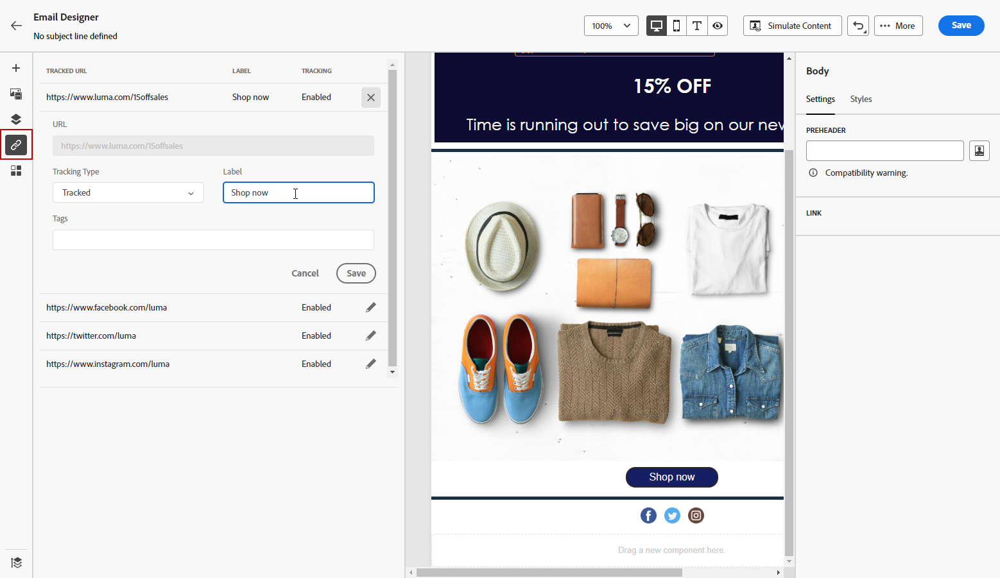

# Inhoud helemaal opnieuw ontwerpen met de e-mailtoepassing Designer {#content-from-scratch}

>[!CONTEXTUALHELP]
>id="ac_structure_components_email"
>title="Structuurcomponenten toevoegen"
>abstract="Structuurelementen definiëren de indeling van de e-mail. De belemmering en laat vallen component van de a **Structuur** in het canvas beginnen uw e-mailinhoud te ontwerpen."

>[!CONTEXTUALHELP]
>id="ac_structure_components_landing_page"
>title="Structuurcomponenten toevoegen"
>abstract="Structuurcomponenten definiëren de indeling van de bestemmingspagina. De belemmering en laat vallen component van de a **Structuur** in het canvas beginnen de inhoud van uw het landen pagina te ontwerpen."

>[!CONTEXTUALHELP]
>id="ac_structure_components_fragment"
>title="Structuurcomponenten toevoegen"
>abstract="Structuurcomponenten definiëren de indeling van het fragment. De belemmering en laat vallen component van de a **Structuur** in het canvas beginnen de inhoud van uw fragment te ontwerpen."

>[!CONTEXTUALHELP]
>id="ac_structure_components_template"
>title="Structuurcomponenten toevoegen"
>abstract="Structuurelementen definiëren de lay-out van de sjabloon. De belemmering en laat vallen component van de a **Structuur** in het canvas beginnen de inhoud van uw malplaatje te ontwerpen."

>[!CONTEXTUALHELP]
>id="ac_edition_columns_email"
>title="E-mailkolommen definiëren"
>abstract="Met E-mail Designer kunt u de indeling van uw e-mail eenvoudig definiëren door de kolomstructuur te selecteren."

>[!CONTEXTUALHELP]
>id="ac_edition_columns_landing_page"
>title="Startpaginakolommen definiëren"
>abstract="Met de Designer kunt u de lay-out van de bestemmingspagina eenvoudig definiëren door de kolomstructuur te selecteren."

>[!CONTEXTUALHELP]
>id="ac_edition_columns_fragment"
>title="Fragmentkolommen definiëren"
>abstract="Met de Designer kunt u de lay-out van het fragment eenvoudig definiëren door de kolomstructuur te selecteren."

>[!CONTEXTUALHELP]
>id="ac_edition_columns_template"
>title="Sjabloonkolommen definiëren"
>abstract="Met de Designer kunt u de lay-out van uw sjabloon eenvoudig definiëren door de kolomstructuur te selecteren."

Met de [!DNL Adobe Journey Optimizer] Email Designer kunt u eenvoudig de structuur van uw inhoud definiëren. Door structuurelementen toe te voegen en te bewegen met eenvoudige belemmering-en-dalingsacties, kunt u de vorm van uw inhoud binnen seconden ontwerpen.

>[!NOTE]
>
>De [&#x200B; Europese toegankelijkheidshandeling &#x200B;](https://eur-lex.europa.eu/legal-content/EN/TXT/?uri=CELEX%3A32019L0882){target="_blank"} verklaart dat alle digitale mededelingen toegankelijk zouden moeten zijn. Zorg ervoor u de specifieke richtlijnen volgt die op [&#x200B; worden vermeld deze pagina &#x200B;](accessible-content.md) wanneer het ontwerpen van inhoud in [!DNL Journey Optimizer].

Voer de onderstaande stappen uit om uw inhoud te gaan samenstellen:

1. Selecteer de optie **[!UICONTROL Design from scratch]** op de startpagina van Designer.

   

1. Begin met het ontwerpen van uw inhoud door **[!UICONTROL Structures]** naar het canvas te slepen en neer te zetten om de lay-out van uw e-mail te definiëren.

   >[!NOTE]
   >
   >Kolommen stapelen is niet compatibel met alle e-mailprogramma&#39;s. Kolommen worden niet gestapeld als deze functie niet wordt ondersteund.

   <!--Once placed in the email, you cannot move nor remove your components unless there is already a content component or a fragment placed inside. This is not true in AJO - TBC?-->

1. Voeg zo veel **[!UICONTROL Structures]** toe als nodig is en bewerk de instellingen in het daarvoor bestemde venster aan de rechterkant.

   

   Selecteer de **[!UICONTROL n:nkolom]** component om het aantal kolommen van uw keus (tussen 3 en 10) te bepalen. U kunt de breedte van elke kolom ook bepalen door de pijlen bij de bodem van elke kolom te bewegen.

   >[!NOTE]
   >
   >Elke kolomgrootte mag niet kleiner zijn dan 10% van de totale breedte van de structuurcomponent. U kunt geen kolom verwijderen die niet leeg is.

1. Vouw de sectie **[!UICONTROL Contents]** uit en voeg zoveel elementen toe als u nodig hebt in een of meer structuurcomponenten. [&#x200B; leer meer over inhoudscomponenten &#x200B;](content-components.md)

1. Elke component kan verder worden aangepast met de tabbladen **[!UICONTROL Settings]** of **[!UICONTROL Style]** in het rechtermenu. U kunt bijvoorbeeld de tekststijl, opvulling of marge van elke component wijzigen. [&#x200B; leer meer over groepering en het opvullen &#x200B;](alignment-and-padding.md)

   

1. Vanuit **[!UICONTROL Asset picker]** kunt u rechtstreeks elementen selecteren die zijn opgeslagen in de **[!UICONTROL Assets library]** . [&#x200B; Leer meer over middelenbeheer &#x200B;](../integrations/assets.md)

   Dubbelklik op de map met uw elementen. Sleep en zet ze neer in een structuurcomponent.

   

1. Voeg verpersoonlijkingsgebieden in om uw inhoud van profielattributen, publiekslidmaatschappen, Contextuele attributen, en meer aan te passen. [&#x200B; Leer meer over inhoudstijdpersonalisatie &#x200B;](../personalization/personalize.md)

   

1. Klik op **[!UICONTROL Enable condition content]** om dynamische inhoud toe te voegen en de inhoud aan te passen aan de doelprofielen op basis van voorwaardelijke regels. [&#x200B; worden begonnen met dynamische inhoud &#x200B;](../personalization/get-started-dynamic-content.md)

   

1. Klik op de tab **[!UICONTROL Links]** in het linkerdeelvenster om alle URL&#39;s weer te geven van de inhoud die wordt bijgehouden. U kunt hun **[!UICONTROL Tracking Type]** of **[!UICONTROL Label]** wijzigen en **[!UICONTROL Tags]** toevoegen als dat nodig is. [&#x200B; leer meer over verbindingen en het volgen &#x200B;](message-tracking.md)

   

1. Indien nodig kunt u uw e-mail verder aanpassen door in het geavanceerde menu op **[!UICONTROL Switch to code editor]** te klikken. Op deze manier kunt u de broncode van de e-mail bewerken, bijvoorbeeld door trackingtags of aangepaste HTML-tags toe te voegen. [&#x200B; leer meer over de coderedacteur &#x200B;](code-content.md)

   >[!CAUTION]
   >
   >U kunt niet terugkeren naar de visuele ontwerper voor deze e-mail na het schakelen naar de coderedacteur.

1. Wanneer de inhoud gereed is, klikt u op de knop **[!UICONTROL Simulate content]** om de rendering te controleren. U kunt kiezen voor de weergave Computer of Mobiel. De gedetailleerde informatie over hoe te om testprofielen en voorproef uw inhoud te selecteren is beschikbaar in de [&#x200B; sectie van het Beheer van de Inhoud &#x200B;](../content-management/preview-test.md).

   

1. Klik op **[!UICONTROL Save]** wanneer de inhoud gereed is.
