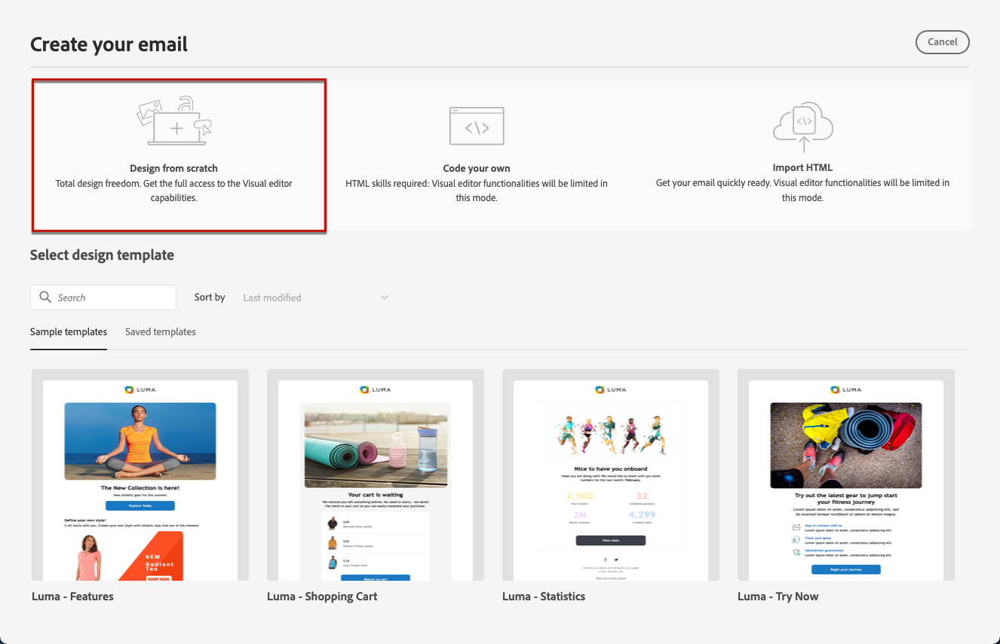

# Opnieuw starten {#content-from-scratch}

>[!CONTEXTUALHELP]
>id="ac_structure_components_email"
>title="Informatie over de componenten Structuur"
>abstract="Structuurelementen definiëren de indeling van de e-mail."

>[!CONTEXTUALHELP]
>id="ac_structure_components_landing_page"
>title="Informatie over de componenten Structuur"
>abstract="Structuurcomponenten definiëren de lay-out van de bestemmingspagina."

>[!CONTEXTUALHELP]
>id="ac_structure_components_fragment"
>title="Informatie over de componenten Structuur"
>abstract="Structuurcomponenten definiëren de lay-out van het fragment."

>[!CONTEXTUALHELP]
>id="ac_structure_components_template"
>title="Informatie over de componenten Structuur"
>abstract="Structuurelementen definiëren de lay-out van de sjabloon."

>[!CONTEXTUALHELP]
>id="ac_edition_columns_email"
>title="E-mailkolommen definiëren"
>abstract="Met de E-mailontwerper kunt u de indeling van uw e-mail eenvoudig definiëren door de kolomstructuur te definiëren."

>[!CONTEXTUALHELP]
>id="ac_edition_columns_landing_page"
>title="Landingspaginakolommen definiëren"
>abstract="Met de e-mailontwerper kunt u de indeling van de bestemmingspagina eenvoudig definiëren door de kolomstructuur te definiëren."

>[!CONTEXTUALHELP]
>id="ac_edition_columns_fragment"
>title="Fragmentkolommen definiëren"
>abstract="Met de e-mailontwerper kunt u de indeling van het fragment eenvoudig definiëren door de kolomstructuur te definiëren."

>[!CONTEXTUALHELP]
>id="ac_edition_columns_template"
>title="Sjabloonkolommen definiëren"
>abstract="Met de E-mailontwerper kunt u de indeling van uw sjabloon eenvoudig definiëren door de kolomstructuur te definiëren."

Met de e-mailontwerper kunt u de structuur van uw e-mail eenvoudig definiëren. Door structuurelementen toe te voegen en te bewegen met eenvoudige belemmering-en-dalingsacties, kunt u de vorm van uw e-mail binnen seconden ontwerpen.

Voer de onderstaande stappen uit om uw e-mailinhoud te gaan samenstellen:

1. Selecteer op de introductiepagina E-mail Designer de optie **[!UICONTROL Design from scratch]** optie.

   

1. Begin met het ontwerpen van uw e-mailinhoud door te slepen en neer te zetten **[!UICONTROL Structure components]** in het canvas om de lay-out van uw e-mail te definiëren.

   >[!NOTE]
   >
   >Kolommen stapelen is niet compatibel met alle e-mailprogramma&#39;s. Kolommen worden niet gestapeld als deze functie niet wordt ondersteund.

   <!--Once placed in the email, you cannot move nor remove your components unless there is already a content component or a fragment placed inside. This is not true in AJO - TBC?-->

1. Zoveel toevoegen **[!UICONTROL Structure components]** en bewerk de instellingen in het daarvoor bestemde venster aan de rechterkant.

   

   Selecteer **[!UICONTROL n:n column]** om het aantal kolommen van uw keus (tussen 3 en 10) te bepalen. U kunt de breedte van elke kolom ook bepalen door de pijlen bij de bodem van elke kolom te bewegen.

   

   >[!NOTE]
   >
   >Elke kolomgrootte mag niet kleiner zijn dan 10% van de totale breedte van de structuurcomponent. U kunt geen kolom verwijderen die niet leeg is.

1. Breid uit **[!UICONTROL Content components]** en voegt zo veel elementen toe als u nodig hebt in een of meer structuurcomponenten. [Meer informatie over inhoudscomponenten](content-components.md)

1. Elke component kan verder worden aangepast met de **[!UICONTROL Component settings]** aan de rechterkant. U kunt bijvoorbeeld de tekststijl, opvulling of marge van elke component wijzigen. [Meer informatie over uitlijning en opvulling](alignment-and-padding.md)

   

1. Van de **[!UICONTROL Asset picker]** kunt u rechtstreeks de elementen selecteren die in het dialoogvenster **[!UICONTROL Assets library]**. [Meer informatie over middelenbeheer](assets-essentials.md)

   Dubbelklik op de map met uw elementen. Sleep en zet ze neer in een structuurcomponent.

   

1. Voeg verpersoonlijkingsgebieden in om uw e-mailinhoud van profielgegevens aan te passen. [Meer informatie over content personalization](../personalization/personalize.md)

   

1. Voeg dynamische inhoud toe om de inhoud aan te passen aan de doelprofielen op basis van voorwaardelijke regels. [Aan de slag met dynamische inhoud](../personalization/get-started-dynamic-content.md)

   

1. Klik op de knop **[!UICONTROL Links]** in het linkerdeelvenster om alle URL&#39;s weer te geven van de inhoud die wordt bijgehouden. U kunt de **[!UICONTROL Tracking Type]** of **[!UICONTROL Label]** en toevoegen **[!UICONTROL Tags]** indien nodig. [Meer informatie over koppelingen en berichtregistratie](message-tracking.md)

   

1. Indien nodig kunt u uw e-mail verder aanpassen door op **[!UICONTROL Switch to code editor]** in het geavanceerde menu. [Meer informatie over de code-editor](code-content.md)

   

   >[!CAUTION]
   >
   >U zult niet terug naar de visuele ontwerper voor deze e-mail kunnen terugkeren nadat het schakelen naar de coderedacteur.

1. Wanneer de inhoud gereed is, klikt u op **[!UICONTROL Simulate content]** om de rendering van uw e-mail te controleren. U kunt kiezen voor de weergave Computer of Mobiel. [Meer informatie over een voorbeeld van uw e-mail](preview.md)

   

1. Wanneer uw e-mail gereed is, klikt u op **[!UICONTROL Save]**.

