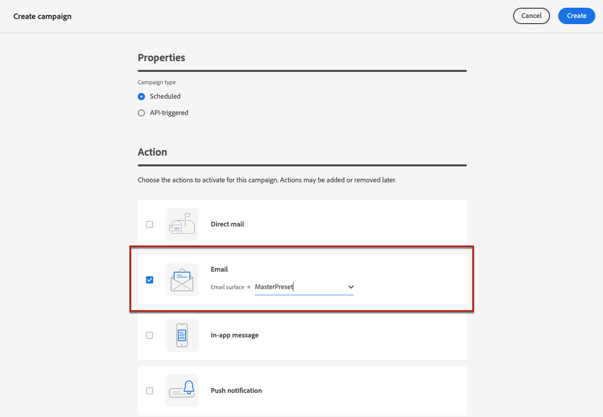
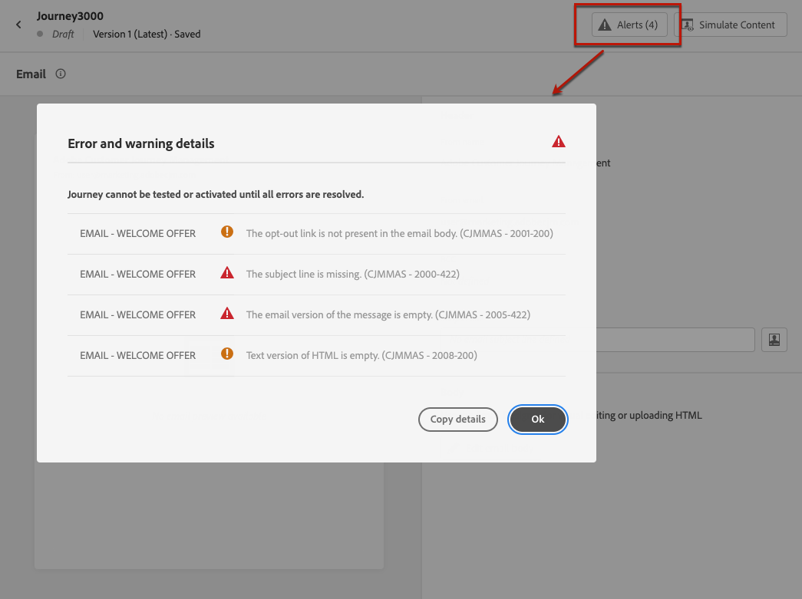
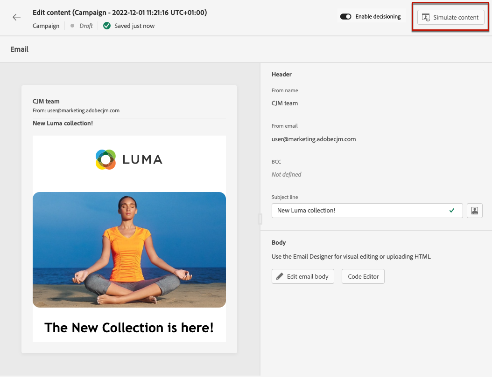

# Een e-mail maken {#create-email}

>[!CONTEXTUALHELP]
>id="ajo_message_email"
>title="E-mailontwerp"
>abstract="Definieer de onderwerpregel van uw e-mail en open de e-mailtoepassing Designer om de inhoud van de e-mail te maken."

## Een e-mailactie toevoegen {#email-action}

Als u een e-mail wilt maken in [!DNL Journey Optimizer] , voegt u een **[!UICONTROL Email]** -actie toe aan een rit of een campagne. Volg vervolgens de onderstaande stappen, afhankelijk van uw zaak.

>[!BEGINTABS]

>[!TAB voeg een e-mail aan een reis  toe]

1. Open uw reis en sleep vervolgens een **[!UICONTROL Email]** -activiteit vanuit de **[!UICONTROL Actions]** -sectie van het palet.

   <!--You can also use the **[!UICONTROL Action]** activity to add email to a journey—select the Email channel when configuring the action. The **[!UICONTROL Email]** activity will soon be deprecated. [Learn more about the Action activity](../building-journeys/journey-action.md).-->

1. Geef basisinformatie op over je bericht (label, beschrijving, categorie).

1. Kies of creeer de [&#x200B; e-mailconfiguratie &#x200B;](email-settings.md).

   

   Het veld wordt standaard vooraf ingevuld met de laatste configuratie die de gebruiker voor dat kanaal heeft gebruikt.

>[!NOTE]
>
>Met de optie Send-Time optimalisatie kunt u het beste tijdstip voorspellen waarop u het bericht wilt verzenden om de betrokkenheid te maximaliseren op basis van de historisch geopende bestanden en klikt u op percentages. [&#x200B; Leer hoe te met Optimalisering Send-Time &#x200B;](../building-journeys/send-time-optimization.md) te werken

Voor meer informatie over hoe te om een reis te vormen, verwijs naar [&#x200B; deze pagina &#x200B;](../building-journeys/journey-gs.md).

>[!TAB  voeg een e-mail aan een campagne toe ]

1. [&#x200B; creeer een campagne &#x200B;](../campaigns/create-campaign.md), en selecteer **[!UICONTROL Email]** als uw actie.

1. Voltooi de stappen om een e-mailcampagne, zoals de campagneeigenschappen, [&#x200B; publiek &#x200B;](../audience/about-audiences.md), en [&#x200B; programma &#x200B;](../campaigns/campaign-schedule.md) tot stand te brengen.

   

1. Selecteer de handeling **[!UICONTROL Email]** .

1. Selecteer of maak de e-mailconfiguratie. [Meer informatie](email-settings.md)

   

<!--
From the **[!UICONTROL Action]** section, specify if you want to track how your recipients react to your delivery: you can track email opens, and/or clicks on links and buttons in your email.

-->

Voor meer informatie over hoe te om een campagne te vormen, verwijs naar [&#x200B; deze pagina &#x200B;](../campaigns/get-started-with-campaigns.md).

>[!ENDTABS]

## Uw e-mailinhoud definiëren {#define-email-content}

<!-- update the quarry component with right ID value-->

>[!CONTEXTUALHELP]
>id="test_id"
>title="E-mailinhoud configureren"
>abstract="Maak de inhoud van uw e-mail. Definieer het onderwerp en gebruik vervolgens de e-mailtoepassing van de Designer om de tekst van de e-mail te maken en aan te passen."

Nadat u de e-mailactie aan uw reis of campagne hebt toegevoegd, moet u de e-mailinhoud definiëren, inclusief de onderwerpregel, de informatie van de afzender en de e-mailinhoud met de e-mailtoepassing Designer. Voer de volgende stappen uit:

1. Klik in het configuratiescherm van de rit of campagne op de knop **[!UICONTROL Edit content]** om de e-mailinhoud te configureren. [Meer informatie](get-started-email-design.md)

   

1. Schakel **[!UICONTROL Enable decisioning]** in als u beleidsregels voor beslissingen in uw e-mail wilt opnemen.

   Beslissingsbeleid is containers voor uw aanbiedingen die de beslissingsengine gebruiken om dynamisch de beste inhoud te retourneren die voor elk publiekslid kan worden geleverd. [&#x200B; Leer hoe te om een besluitvormingsbeleid in e-mail toe te voegen &#x200B;](../experience-decisioning/create-decision.md#create-decision)

   

   >[!AVAILABILITY]
   >
   >Momenteel is het maken van beleidsbeslissingen in e-mails beschikbaar in Beperkte beschikbaarheid. Neem contact op met uw Adobe-vertegenwoordiger voor toegang.

1. Controleer in de sectie **[!UICONTROL Header]** de velden **[!UICONTROL From name]** , **[!UICONTROL From email]** en **[!UICONTROL BCC]** . Zij worden gevormd in de e-mailconfiguratie die u selecteerde. [&#x200B; Leer meer &#x200B;](email-settings.md) <!--check if same for journey-->

   

1. Voeg een onderwerpregel voor uw bericht toe. Klik op het pictogram **[!UICONTROL Open personalization dialog]** om de onderwerpregel te configureren en aan te passen met de personalisatie-editor. [Meer informatie](../personalization/personalization-build-expressions.md)

   >[!NOTE]
   >
   >De onderwerpregel is verplicht. Er mogen geen regeleinden worden opgenomen.

1. Klik op de knop **[!UICONTROL Edit email body]** om toegang te krijgen tot de e-mailtoepassing van de Designer en uw inhoud op te bouwen. [Meer informatie](get-started-email-design.md)

   

1. Als u in een campagne werkt, kunt u ook op de knop **[!UICONTROL Code Editor]** klikken om uw eigen inhoud in normale HTML te coderen met behulp van het pop-upvenster dat wordt weergegeven.

   

   >[!NOTE]
   >
   >Als u al inhoud hebt gemaakt of geïmporteerd via e-mail Designer, wordt deze inhoud weergegeven in HTML.

## Waarschuwingen controleren {#check-email-alerts}

Terwijl u berichten ontwerpt, worden waarschuwingen weergegeven in de interface (rechtsboven op het scherm) wanneer er geen toetseninstellingen aanwezig zijn.

>[!NOTE]
>
>Als deze knop niet wordt weergegeven, is er geen melding gevonden.

De instellingen en elementen die door het systeem zijn gecontroleerd, worden hieronder weergegeven. U zult ook informatie over hoe te om uw configuratie aan te passen om de overeenkomstige kwesties op te lossen vinden.

Er kunnen twee typen waarschuwingen optreden:

* **de Waarschuwingen** verwijzen naar aanbevelingen en beste praktijken, zoals:

   * **[!UICONTROL The opt-out link is not present in the email body]**: u kunt het beste een koppeling zonder abonnement toevoegen aan uw e-mailadres. Leer hoe te om het in [&#x200B; te vormen deze sectie &#x200B;](../privacy/opt-out.md#opt-out-decision-management).

     >[!NOTE]
     >
     >E-mailberichten van het type Marketing moeten een opt-out-koppeling bevatten, die niet vereist is voor transactiemeldingen. De berichtcategorie (**[!UICONTROL Marketing]** of **[!UICONTROL Transactional]**) wordt bepaald op het [&#x200B; niveau van de kanaalconfiguratie &#x200B;](email-settings.md#email-type) en wanneer [&#x200B; creërend het bericht &#x200B;](#create-email-journey-campaign) van een reis of een campagne.

   * **[!UICONTROL Text version of HTML is empty]**: vergeet niet een tekstversie van uw e-mailhoofdtekst te definiëren, omdat deze wordt gebruikt wanneer HTML-inhoud niet kan worden weergegeven. Leer hoe te om de tekstversie in [&#x200B; tot stand te brengen deze sectie &#x200B;](text-version-email.md).

   * **[!UICONTROL Empty link is present in email body]**: controleer of alle koppelingen in uw e-mail correct zijn. Leer hoe te om inhoud en verbindingen in [&#x200B; te beheren deze sectie &#x200B;](content-from-scratch.md).

   * **[!UICONTROL Email size has exceeded the limit of 100KB]**: zorg ervoor dat uw e-mailadres voor optimale levering niet groter is dan 100 kB. Leer hoe te om e-mailinhoud in [&#x200B; uit te geven deze sectie &#x200B;](content-from-scratch.md).

* **de Fouten** verhinderen u de reis/de campagne te testen of te activeren zolang zij niet, zoals worden opgelost:

   * **[!UICONTROL The subject line is missing]**: e-mailonderwerpregel is verplicht. Leer hoe te om het in [&#x200B; te bepalen en te personaliseren deze sectie &#x200B;](create-email.md).

  <!--HTML is empty when Amp HTML is present-->

   * **[!UICONTROL The email version of the message is empty]**: deze fout wordt weergegeven wanneer de e-mailinhoud niet is geconfigureerd. Leer hoe te om e-mailinhoud in [&#x200B; te ontwerpen deze sectie &#x200B;](get-started-email-design.md).

   * **[!UICONTROL configuration doesn't exist]**: u kunt het bericht niet gebruiken als de configuratie die u hebt geselecteerd, wordt verwijderd na het maken van het bericht. Als deze fout voorkomt, selecteer een andere configuratie in het bericht **[!UICONTROL Properties]**. Leer meer over kanaalconfiguraties in [&#x200B; deze sectie &#x200B;](../configuration/channel-surfaces.md).

>[!CAUTION]
>
>Om de reis/de campagne te kunnen testen of activeren gebruikend e-mail, moet u alle **fout** alarm oplossen.

## Uw e-mail controleren en verzenden

Zodra de inhoud van uw bericht is gedefinieerd, kunt u testprofielen gebruiken om een voorvertoning ervan weer te geven, proefdrukken te verzenden en de rendering ervan in populaire desktops, mobiele en webclients te beheren. Als u gepersonaliseerde inhoud hebt ingevoegd, kunt u met behulp van testprofielgegevens controleren hoe deze inhoud in het bericht wordt weergegeven.

U kunt de kwaliteit van uw inhoud ook valideren om de leesbaarheid, de doeltreffendheid en de samenhang van de inhoud te beoordelen. [&#x200B; leer meer over de bevestiging van de inhoudskwaliteit &#x200B;](../content-management/brands-score.md#validate-quality)

>[!NOTE]
>
>Naast testprofielen kunt u met [!DNL Journey optimizer] ook verschillende varianten van de inhoud testen door deze voor te vertonen en proefdrukken te verzenden met behulp van voorbeeldinvoergegevens die vanuit een CSV-/JSON-bestand zijn geüpload of handmatig zijn toegevoegd. [&#x200B; leer hoe te om inhoudvariaties &#x200B;](../test-approve/simulate-sample-input.md) te simuleren

Klik hiertoe op **[!UICONTROL Simulate content]** en voeg vervolgens een testprofiel toe om uw bericht te controleren aan de hand van de gegevens van het testprofiel.

De gedetailleerde informatie over hoe te om testprofielen en voorproef uw inhoud te selecteren is beschikbaar in de [&#x200B; sectie van het Beheer van de Inhoud &#x200B;](../content-management/preview-test.md).

Wanneer uw e-mail klaar is, voltooi de configuratie van uw [&#x200B; reis &#x200B;](../building-journeys/journey-gs.md) of [&#x200B; campagne &#x200B;](../campaigns/create-campaign.md), en activeer het om het bericht te verzenden.

>[!NOTE]
>
>Om het gedrag van uw ontvangers door e-mailopeningen en/of interactie te volgen, zorg ervoor dat de specifieke opties in de **[!UICONTROL Tracking]** sectie in de 1&rbrace; e-mailactiviteit van de reis [&#x200B; of in de e-mail &#x200B;](../building-journeys/journeys-message.md) campagne [&#x200B; worden toegelaten.](../campaigns/create-campaign.md)<!--to move?-->

<!--

## Define your email content {#email-content}

Use [!DNL Journey Optimizer] Email Designer to [design your email from scratch](../email/content-from-scratch.md). If you have an existing content, you can [import it in the Email Designer](../email/existing-content.md), or [code your own content](../email/code-content.md) in [!DNL Journey Optimizer]. 

[!DNL Journey Optimizer] comes with a set of [built-in templates](email-templates.md) to help you start. Any email can also be saved as a template.

Use [!DNL Journey Optimizer] personalization editor to personalize your messages with profiles' data. For more on personalization, refer to [this section](../personalization/personalize.md).

Adapt the content of your messages to the targeted profiles by using [!DNL Journey Optimizer] dynamic content capabilities. [Get started with dynamic content](../personalization/get-started-dynamic-content.md)

## Email tracking {#email-tracking}

If you want to track the behavior of your recipients through openings and/or clicks on links, enable the following options: **[!UICONTROL Email opens]** and **[!UICONTROL Click on email]**. 

Learn more about tracking in [this section](message-tracking.md).

## Validate your email content {#email-content-validate}

Control the rendering of your email, and check personalization settings with test profiles, using the preview section on the left-hand side. For more on this, refer to [this section](preview.md).

You must also check alerts in the upper section of the editor.  Some of them are simple warnings, but others can prevent you from using the message. 

-->

