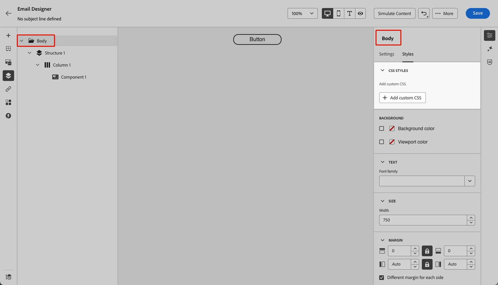

# Aangepaste CSS toevoegen aan uw e-mailinhoud {#email-metadata}

>[!CONTEXTUALHELP]
>id="ac_edition_css"
>title="Geef uw eigen CSS op"
>abstract="Voor meer flexibiliteit en controle over de weergave van uw inhoud kunt u direct aangepaste CSS toevoegen in de e-mailtoepassing van Designer om geavanceerde en specifieke opmaak toe te passen."

Wanneer het ontwerpen van uw e-mails, kunt u uw eigen douaneCSS direct binnen [!DNL Journey Optimizer] [&#x200B; E-mailDesigner &#x200B;](get-started-email-design.md) toevoegen. Met deze functie kunt u geavanceerde en specifieke stijlen toepassen, voor meer flexibiliteit en controle over de weergave van uw inhoud.

## Aangepaste CSS definiëren {#define-custom-css}

Volg onderstaande stappen om aangepaste CSS toe te voegen aan uw e-mailinhoud.

1. Verzeker er wat inhoud die in E-mail Designer wordt bepaald door minstens één [&#x200B; component &#x200B;](content-components.md) toe te voegen.

1. Selecteer **[!UICONTROL Body]** in het vak **[!UICONTROL Navigation tree]** links of boven in het rechtervenster. De sectie **[!UICONTROL CSS styles]** wordt rechts weergegeven.

   {width="85%"}

   >[!NOTE]
   >
   >De sectie **[!UICONTROL CSS styles]** is alleen beschikbaar als er al inhoud in de editor aanwezig is.

1. Klik op de knop **[!UICONTROL Add Custom CSS]**.

   >[!NOTE]
   >
   >De knop **[!UICONTROL Add custom CSS]** is alleen beschikbaar wanneer **[!UICONTROL Body]** is geselecteerd. U kunt echter aangepaste CSS-stijlen toepassen op alle componenten in uw inhoud.

1. Voer uw CSS-code in in het speciale tekstgebied dat wordt weergegeven. Zorg ervoor dat de aangepaste CSS geldig is en de juiste syntaxis volgt. [Meer informatie](#use-valid-css)

   {width="65%"} in

   >[!NOTE]
   >
   >Wanneer het gebruiken van a [&#x200B; malplaatje met gesloten inhoud &#x200B;](../content-management/content-locking.md#use), kunt u geen douane CSS aan uw inhoud toevoegen. Het knoplabel verandert in **[!UICONTROL View custom CSS]** en eventuele aangepaste CSS die al in de inhoud aanwezig is, is alleen-lezen.

1. Sla uw aangepaste CSS op en controleer of uw aangepaste CSS correct is toegepast op uw inhoud. Als dit niet het geval is, controleer de [&#x200B; sectie van het Oplossen van problemen &#x200B;](#troubleshooting).

   {width="85%"}

1. Als u alle inhoud verwijdert, verdwijnt de sectie en wordt de eerder gedefinieerde aangepaste CSS niet meer toegepast.

1. Voeg inhoud weer toe aan de editor om de sectie **[!UICONTROL CSS styles]** opnieuw weer te geven. De aangepaste CSS wordt opnieuw toegepast.

## Gebruik van geldige CSS {#use-valid-css}

U kunt elke geldige CSS-tekenreeks invoeren in het tekstgebied **[!UICONTROL Add custom CSS]** . CSS met de juiste opmaak wordt direct toegepast op de inhoud.

>[!CAUTION]
>
>Gebruikers zijn verantwoordelijk voor de beveiliging van hun aangepaste CSS. Zorg ervoor dat uw CSS geen kwetsbaarheden of conflicten met de bestaande inhoud introduceert.
>
>Vermijd het gebruik van CSS die de lay-out of functionaliteit van de inhoud onbedoeld kan onderbreken.

+++ Voorbeelden van CSS

Hieronder staan voorbeelden van geldige CSS.

```css
.acr-component[data-component-id="form"] {
  display: flex;
  justify-content: center;
  background: none;
}

.acr-Form {
  width: 100%;
  padding: 20px 100px;
  border-spacing: 0px 8px;
  box-sizing: border-box;
  margin: 0;
}

.acr-Form .spectrum-FieldLabel {
  width: 20%;
}

.acr-Form.spectrum-Form--labelsAbove .spectrum-FieldLabel,
.acr-Form [data-form-item="checkbox"] .spectrum-FieldLabel {
  width: auto;
}

.acr-Form .spectrum-Textfield {
  width: 100%;
}

#acr-form-error,
#acr-form-confirmation {
  width: 100%;
  padding: var(--spectrum-global-dimension-static-size-500);
  display: flex;
  align-items: center;
  flex-direction: column;
  justify-content: center;
  gap: var(--spectrum-global-dimension-static-size-200);
}

.spectrum-Form-item.is-required .spectrum-FieldLabel:after{
  content: '*';
  font-size: 1.25rem;
  margin-left: 5px;
  position: absolute;
}

/* Error field placeholder */
.spectrum-HelpText {
  display: none !important;
}

.spectrum-HelpText.is-invalid,
.is-invalid ~ .spectrum-HelpText {
  display: flex !important;
}
```

```css
@media only screen and (min-width: 600px) {
  .acr-paragraph-1 {
    width: 100% !important;
  }
}
```

+++


+++ Voorbeelden van ongeldige CSS

Als er ongeldige CSS wordt ingevoerd, wordt een foutbericht weergegeven dat aangeeft dat de CSS niet kan worden opgeslagen. Hieronder staan voorbeelden van ongeldige CSS.

Het gebruik van `<style>` -tags wordt niet geaccepteerd:

```html
<style type="text/css">
  .acr-Form {
    width: 100%;
    padding: 20px 100px;
    border-spacing: 0px 8px;
    box-sizing: border-box;
    margin: 0;
  }
</style>
```

Ongeldige syntaxis, zoals ontbrekende accolades, wordt niet geaccepteerd:

```css
body {
  background: red;
```

+++

## Technische uitvoering {#implementation}

Uw aangepaste CSS wordt aan het einde van de sectie `<head>` toegevoegd als onderdeel van een `<style>` -tag met het kenmerk `data-name="global-custom"` , zoals in het onderstaande voorbeeld. Op deze manier weet u zeker dat de aangepaste stijlen globaal op de inhoud worden toegepast.

+++ Zie voorbeeld

```html
<!DOCTYPE html>
<html>
  <head>
    <meta charset="utf-8">
    <meta name="content-version" content="3.3.31">
    <meta name="x-apple-disable-message-reformatting">
    <meta name="viewport" content="width=device-width,initial-scale=1.0">
    <style data-name="default" type="text/css">
      td { padding: 0; }
      th { font-weight: normal; }
    </style>
    <style data-name="grid" type="text/css">
      .acr-grid-table { width: 100%; }
    </style>
    <style data-name="acr-theme" type="text/css" data-theme="default" data-variant="0">
      body { margin: 0; font-family: Arial; }
    </style>
    <style data-name="media-default-max-width-500px" type="text/css">
      @media screen and (max-width: 500px) {
        body { width: 100% !important; }
      }
    </style>
    <style data-name="global-custom" type="text/css">
      /* Add you custom CSS here */
    </style>
  </head>
  <body>
    <!-- Minimal content -->
  </body>
</html>
```

+++


De aangepaste CSS wordt niet geïnterpreteerd of gevalideerd door het deelvenster Designer e-mailen **[!UICONTROL Settings]** . Deze is volledig onafhankelijk en kan alleen worden gewijzigd via de optie **[!UICONTROL Add Custom CSS]** .

### Guardrails - Geïmporteerde inhoud

Houd rekening met het volgende als u aangepaste CSS wilt gebruiken met inhoud die is geïmporteerd in de e-mailtoepassing Designer:

* Als u externe HTML-inhoud met inbegrip van CSS importeert, tenzij u die inhoud converteert, bevindt de inhoud zich in **[!UICONTROL Compatibility mode]** , waar de sectie **[!UICONTROL CSS styles]** niet beschikbaar is. [&#x200B; leer meer bij het invoeren van bestaande inhoud &#x200B;](existing-content.md)

* Als u inhoud importeert die is gemaakt met de e-mailtoepassing, inclusief CSS die is toegepast via de optie **[!UICONTROL Add custom CSS]** , worden de eerder toegepaste CSS zichtbaar en bewerkbaar met dezelfde optie.

<!--
* If importing content created with the Email Designer with CSS applied externally, the CSS code previously applied cannot be accessed within the **[!UICONTROL Add custom CSS]** pop-up window, but you can still override it with new custom CSS.-->

## Problemen oplossen {#troubleshooting}

Houd rekening met de onderstaande opties als uw aangepaste CSS niet wordt toegepast.

* Zorg ervoor dat uw CSS geldig is en geen syntaxisfouten bevat (zoals ontbrekende accolades, onjuiste eigenschapsnamen). [&#x200B; leer hoe &#x200B;](#use-valid-css)

* Zorg ervoor dat uw CSS wordt toegevoegd aan de tag `<style>` met het kenmerk `data-name="global-custom"` .

* Controleer of het kenmerk `global-custom` set to `data-disabled` is ingesteld voor de stijltag `true` . In dat geval wordt de aangepaste CSS niet toegepast.

+++ Bijvoorbeeld:

  ```html
  <style data-name="global-custom" type="text/css" data-disabled="true"> body: { color: red; } </style>
  ```

+++

* Zorg ervoor dat uw CSS niet door andere CSS regels, met inbegrip van om het even welk [&#x200B; thema &#x200B;](apply-email-themes.md) wordt met voeten getreden die op uw inhoud wordt toegepast.

   * Gebruik de browsergereedschappen voor ontwikkelaars om de inhoud te controleren en te controleren of uw CSS zich richt op de juiste kiezers.

   * Voeg `!important` aan uw declaraties toe om ervoor te zorgen dat deze voorrang krijgen.

+++ Bijvoorbeeld:

     ```css
     .acr-Form {
       background: red !important;
     }
     ```

+++
