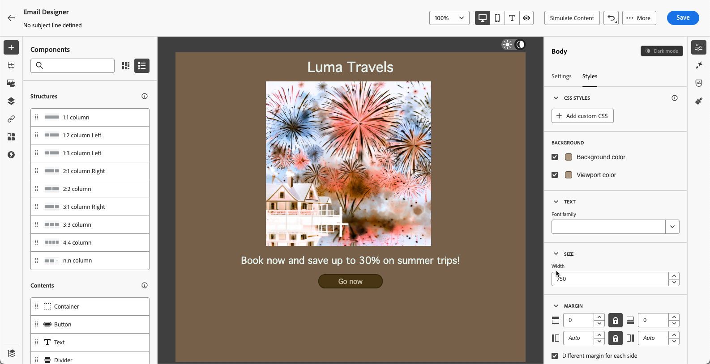

# Inhoud in de donkere modus beheren {#dark-mode}

>[!CONTEXTUALHELP]
>id="ac_edition_darkmode"
>title="Overschakelen naar donkere modus"
>abstract="Schakel over naar de donkere modus waar u een voorvertoning kunt weergeven van de rendermethode en specifieke aangepaste instellingen kunt definiëren.   het definitieve teruggeven hangt van de e-mailcliënt van de ontvanger af. Alle e-mailclients bieden geen ondersteuning voor de aangepaste donkere modus."

>[!CONTEXTUALHELP]
>id="ac_edition_darkmode_preview"
>title="Overschakelen naar donkere modus"
>abstract="Schakel over naar de donkere modus om te bekijken hoe deze kan worden weergegeven bij ondersteunde e-mailclients.   het definitieve teruggeven hangt van de e-mailcliënt van de ontvanger af. Merk op dat alle e-mailcliënten donkere wijze niet steunen."

Wanneer het ontwerpen van uw e-mails, [!DNL Journey Optimizer] [ E-mail Designer ](get-started-email-design.md) staat u toe om aan de **[!UICONTROL Dark mode]** mening over te schakelen.

In deze <!--Email Designer --> donkere wijzemening, kunt u specifieke douanemontages ook bepalen die door de ondersteunende e-mailcliënten zullen worden getoond wanneer hun donkere wijze is.

<!--When designing your emails, the Journey Optimizer Email Designer allows you to switch to Dark mode where you can define specific custom settings. When dark mode is on, the supporting email clients will display the settings that you defined for this mode.-->

## Wat is de donkere modus? {#what-is-dark-mode}

De manier waarop donkere modus wordt weergegeven in de verschillende e-mailclients is complex. Laten we eerst de donkere modus definiëren.

In de donkere modus kunnen de ondersteunde e-mailclients en apps e-mails weergeven met donkere achtergronden en lichtere kleuren voor tekst, knoppen en andere UI-elementen. Hierdoor kan de belasting van het oog worden verminderd, de levensduur van de batterij worden bespaard en de leesbaarheid in omgevingen met weinig licht worden verbeterd voor een comfortabeler kijkervaring.

<!--Dark Mode uses a dark color palette with light text and UI elements to reduce eye strain, save battery life, and improve readability in low-light environments.-->

Aangezien een groeiende trend over belangrijke werkende systemen en apps <!-- (Apple Mail, Gmail, Outlook, Twitter, Slack)-->, is het een belangrijke overweging in modern e-mailontwerp geworden om ervoor te zorgen dat de inhoud leesbaar blijft en visueel aantrekkelijk voor alle gebruikers.

## Guardrails {#guardrails}

De verwachtingen ten aanzien van donkere wijze het teruggeven moeten met voorzichtigheid worden overwogen aangezien de manier het door de verschillende e-mailcliënten wordt toegepast zeer kan variëren.

<!--The dark mode final rendering depends on the recipient's email client. It is not possible to guarantee that your email will look the same in dark mode across all devices.-->

Voordat u de donkere modus gebruikt in de [!DNL Journey Optimizer] e-mailtoepassing van de Designer, is het van cruciaal belang dat u begrijpt hoe de hoofd-e-mailclient dit verwerkt. Er zijn drie zaken om te onderscheiden:

<!--
* Check out the list of [email clients supporting dark mode](https://www.caniemail.com/search/?s=dark){target="_blank"}

* Learn more on Dark mode in this [Litmus blog post](https://www.litmus.com/blog/the-ultimate-guide-to-dark-mode-for-email-marketers){target="_blank"}
-->

### Clients die de donkere modus niet ondersteunen {#not-supporting}

Sommige e-mailclients ondersteunen deze functie helemaal niet, zoals:

* Yahoo!Mail
* AOL

Ongeacht of u aangepaste instellingen voor de donkere modus definieert in de e-mailclient of niet, deze e-mailclients geven nooit een donkere modus weer. <!--Regardless of whether the interface is in light or dark mode, your email will render the same.-->

### Clients die hun eigen donkere modus toepassen {#default-support}

Sommige e-mailclients passen stelselmatig hun eigen donkere standaardmodus toe op alle ontvangen e-mailberichten. Kleuren, achtergronden, afbeeldingen, enz. automatisch worden aangepast met de instellingen voor de donkere modus die specifiek zijn voor de e-mailclient. Dit betekent dat er geen externe wijziging mogelijk is.

<!--It is important to note that less than 25% of email clients offer customization options for dark mode. Clients such as Gmail implement their own dark mode rendering, which is not subject to external modification.-->

Deze clients zijn bijvoorbeeld:

* Gmail (desktopwebmail, iOS, Android, mobiele webmail)
* Outlook Windows
* Outlook Windows Mail

Als u in dit geval aangepaste instellingen voor de donkere modus definieert in de Designer-e-mail, worden deze instellingen overschreven door de instellingen van de e-mailclient.

Het is belangrijk om te begrijpen dat deze e-mailcliënten donkere wijze behandelen, maar uw specifiek donkere wijzeontwerp zal niet worden teruggegeven.

<!--In this case, the custom settings that you defined in the Email Designer cannot be rendered.-->

<!--Some visual changes may also be caused by the email app or device overriding the original design.-->

### Clients die aangepaste donkere modus ondersteunen {#custom-support}

Andere e-mailclients bieden de optie om de aangepaste donkere modus te renderen met de query `@media (prefers-color-scheme: dark)` . Dit is de methode die wordt gebruikt door de [!DNL Journey Optimizer] Email Designer.

Hier volgt een lijst met de belangrijkste clients die deze optie afhandelen:

* Apple Mail macOS
* Apple Mail iOS
* Outloook macOS
* Outlook.com
* Outloook iOS
* Outloook Android

In dit geval moeten de specifieke instellingen die u in de e-mailtoepassing van de Designer definieert, worden weergegeven.

>[!NOTE]
>
>Leer hoe te om de montages van de douane donkere wijze met E-mail Designer in [ te bepalen deze sectie ](#define-custom-dark-mode).

Sommige beperkingen kunnen echter van toepassing zijn voor elke e-mailclient. Sommige clients, zoals Apple Mail 16 (macOs 13), genereren bijvoorbeeld geen donkere modus als er afbeeldingen aanwezig zijn in de e-mailinhoud.

Voor optimale resultaten test u de inhoud met de e-mailclients waarop u zich richt. Om een simulatie te zien die zo dicht mogelijk bij het definitieve resultaat voor elke cliënt komt, gebruik de [ E-mail teruggevende ](../content-management/rendering.md) optie in E-mail Designer.

## Donkere modus in de Designer-e-mail {#dark-mode-email-designer}

Wat de donkere modus in de e-mailtoepassing Designer betreft, moet u rekening houden met twee aspecten:

* U kunt een voorvertoning weergeven van hoe de standaard donkere modus wordt weergegeven in de meeste ondersteunde e-mailclients. [Meer informatie](#preview-dark-mode)

<!--
    >[!CAUTION]
    >
    >The final rendering may vary according to the recipient's email client. To see the exact rendering for each email client, use the [Email rendering](../content-management/rendering.md) option.-->

* Als u de standaardinstellingen voor het ondersteunen van e-mailclients wilt overschrijven, kunt u aangepaste instellingen voor de donkere modus definiëren die van toepassing zijn op de e-mail die u bewerkt. [Meer informatie](#define-custom-dark-mode)

<!--
    >[!WARNING]
    >
    >Not all email clients support custom dark mode. Some email clients only apply their own default dark mode for all emails that are received. In this case, the custom settings that you defined in the Email Designer cannot be rendered. [Learn more](#guardrails)-->

### Standaardmodus voor donker voorvertonen {#preview-dark-mode}

Volg onderstaande stappen om de donkere modus te openen in de E-mail-Designer en een voorbeeld te bekijken van de standaard donkere modusinstellingen.

1. Selecteer de optie **[!UICONTROL Design from scratch]** op de homepage van Designer via e-mail. [Meer informatie](content-from-scratch.md)

<!--Should work with templates and themes, NOT for LP and fragments - but TBC with eng.
    >[!NOTE]
    >
    >Currently you may not be able to switch to dark mode if you select an [email template](use-email-templates.md) or if you apply a [theme](apply-email-themes.md).-->

1. Voeg [ structuren ](content-from-scratch.md) en [ inhoudcomponenten ](content-components.md) aan uw inhoud toe.

1. Rechtsboven op het centrale canvas schakelt u de schakeloptie over naar **[!UICONTROL Dark mode]** .

   

1. De standaardvoorvertoning in de donkere modus wordt weergegeven.

   

Standaard wordt in de voorvertoning van de donkere modus van e-mail Designer het kleurschema &#39;full color invert&#39; toegepast op alle elementen behalve afbeeldingen en pictogrammen.

Het betekent dat gebieden met lichte en donkere elementen worden gedetecteerd en omgekeerd, zodat de lichte achtergronden donker worden en donkere tekst licht, terwijl donkere achtergronden licht worden en lichte tekst donker wordt.

>[!CAUTION]
>
>De uiteindelijke rendering kan variëren afhankelijk van de e-mailclient van de ontvanger. Om een simulatie te zien die zo dicht mogelijk bij het definitieve resultaat voor elke e-mailcliënt komt, gebruik de [ E-mail teruggevende ](../content-management/rendering.md) optie.

<!--This is custom dark mode:

  

Here you can see that we have applied a different background, defined another image and change the color of the text and button.-->

### Aangepaste donkere modus definiëren {#define-custom-dark-mode}

>[!CONTEXTUALHELP]
>id="ac_edition_darkmode_image"
>title="Een specifieke afbeelding gebruiken voor de donkere modus"
>abstract="U kunt een andere afbeelding selecteren die wordt weergegeven wanneer de donkere modus is ingeschakeld.   het toevoegen van een specifiek beeld voor donkere wijze garandeert het correct in alle e-mailcliënten. Alle e-mailclients bieden geen ondersteuning voor de aangepaste donkere modus."

Nadat u naar **[!UICONTROL Dark mode]** hebt overgeschakeld, kunt u specifieke opmaakelementen van uw inhoud bewerken die alleen worden weergegeven wanneer de donkere modus is ingeschakeld in de e-mailclient van de ontvanger - op voorwaarde dat deze functie wordt ondersteund.

>[!WARNING]
>
>De uiteindelijke rendering in de donkere modus is afhankelijk van elke e-mailclient. De resultaten kunnen dus per e-mailclient verschillen. [Meer informatie](#guardrails)

<!--
>[!WARNING]
>
>Not all email clients support dark mode. Moreover, some email clients only apply their own default dark mode for all emails that are received. In both cases, the custom settings that you defined in the Email Designer cannot be rendered.-->

Als u de aangepaste stijl voor de donkere modus van Designer via e-mail wilt gebruiken, gebruikt Journey Optimizer de <!-- `@media (prefers-color-scheme: dark)` method--> `@media (prefers-color-scheme: dark)` CSS-query, die detecteert of de e-mailclient van de gebruiker is ingesteld op de donkere modus en past het donkere ontwerp toe dat in de e-mail is gedefinieerd.

Volg onderstaande stappen om aangepaste instellingen voor de donkere modus te definiëren.

1. Zorg ervoor dat u overschakelt naar de voorvertoning van **[!UICONTROL Dark mode]** in de e-mailtoepassing Designer. [ leer hoe ](#preview-dark-mode)

1. Bewerk alle opmaakkleurkenmerken, zoals tekst, achtergronden, knoppen, enz.

1. U kunt de kleuren van afbeeldingen en pictogrammen niet wijzigen, maar u kunt wel specifieke elementen alleen voor de donkere modus definiëren. Selecteer een afbeelding om dit te doen. Schakel over naar **[!UICONTROL Dark mode]** met de specifieke schakeloptie in het deelvenster **[!UICONTROL Settings]** en selecteer een ander element.

   

   <!---->

1. U kunt op elk gewenst moment **[!UICONTROL Switch to live view]** gebruiken om te controleren hoe uw inhoud op verschillende apparaatgrootten wordt gerenderd. Selecteer in deze weergave de optie Donkere modus boven op het scherm om een voorvertoning weer te geven van de donkere modusversie van de inhoud op de verschillende apparaten.

   {width="80%" align="center"}

   >[!CAUTION]
   >
   >De live weergave is een algemene voorvertoning die is ontworpen om te vergelijken hoe de rendering er tussen verschillende apparaatgrootten uitziet. De uiteindelijke rendering kan variëren afhankelijk van de e-mailclient van de ontvanger.

1. Als u tevreden bent met de wijzigingen in de donkere modus, klikt u op **[!UICONTROL Simulate Content]** .

   

1. Selecteer **[!UICONTROL Render email]** en verbind met uw rekening van de NLS. U ziet de uiteindelijke donkere modus voor verschillende e-mailclients. Leer meer op [ E-mail teruggevend ](../content-management/rendering.md).

   >[!WARNING]
   >
   >Hoewel de simulatie nauwkeurig benadert hoe e-mails worden weergegeven in de donkere modus, kan de werkelijke rendering afwijken als gevolg van verschillen in e-mailserviceproviders of instellingen op apparaatniveau.

## Best practices {#best-practices}

Aangezien de donkere wijzetoepassing over belangrijke e-mailcliënten stijgt, is het essentieel om te overwegen hoe uw e-mail in zowel lichte als donkere milieu&#39;s teruggeeft - of u [ douane donkere wijze ](#define-custom-dark-mode) of niet gebruikt.

In de donkere modus kunt u kleuren, achtergronden en afbeeldingen wijzigen. Soms worden ontwerpkeuzen genegeerd. Volg de onderstaande aanbevolen procedures om de visuele consistentie, toegankelijkheid en brandintegriteit te garanderen.

**optimaliseer uw beelden en logo&#39;s**

* Sla logo&#39;s en pictogrammen op als PNG&#39;s met transparante achtergronden om zichtbare witte vakken in de donkere modus te voorkomen.

* Vermijd afbeeldingen met een hardcodeerde witte of lichte achtergrond.

* Als transparantie geen optie is, plaatst u afbeeldingen op een effen achtergrond in uw ontwerp om ongewenste kleurinversies te voorkomen.

**bekijk uw achtergronden**

* Zorg voor voldoende contrast tussen tekst en achtergrondkleuren voor leesbaarheid in zowel de lichte als de donkere modus.

* Vertrouw niet alleen op achtergrondkleuren voor essentiële inhoud. Sommige clients overschrijven achtergrondkleuren in de donkere modus, zodat de belangrijkste gegevens nog steeds zichtbaar zijn.

<!--**Inline critical styles**

Inline CSS helps maintain more control over styling, as some clients strip external styles in dark mode.-->

**Ontwerp toegankelijke inhoud op donkere wijze**

<!--KEEP dark mode accessibility best practices IN ONE SINGLE LOCATION - for now listed on this page.
If needed, it can be moved to the Design accessible content page:
The best practices for designing accesible content in dark mode are listed in [this section](accessible-content.md#dark-mode).-->

* Gebruik kleurcombinaties die u gemakkelijk kunt herkennen voor mensen met kleurenblindheid.

* Gebruik een palet met middentonen om contrast tegen zowel lichte als donkere achtergronden te waarborgen.

* Gebruik toegankelijke kleurcombinaties met hoog contrast om de leesbaarheid te verbeteren en te voldoen aan de WCAG-standaarden (Web Content Accessibility Guidelines). Gebruik gereedschappen zoals de Contrast Checker van WebAIM om het kleurcontrast te controleren.

* Vermijd dunne lettertypen omdat dit van invloed is op de leesbaarheid. Als uw merk een dun lettertype nodig heeft, kunt u het vet in de donkere modus drukken.

* Overslaan puur wit op puur zwart, omdat dit oogbelasting kan veroorzaken en door sommige e-mailclients automatisch kan worden omgekeerd.

* Maak toegankelijke fallback-stijlen als de donkere modus niet wordt ondersteund.

**Test uw e-mails op donkere wijzemilieu**

* Gebruik de e-mail Designer [ donkere wijzevoorproef ](#preview-dark-mode) die omgekeerde kleurenschema&#39;s aan vlekkwesties vroeg gebruikt.

* Gebruik de [ E-mail die ](../content-management/rendering.md) optie teruggeeft die hefboomwerkingen Litmus om uw ontwerpen over belangrijke e-mailcliënten (de Post van Apple, Gmail, Vooruitzichten) te simuleren en te zien hoe de kleuren en de beelden zich op donkere wijze gedragen.

<!--

## Email clients supporting dark mode {#supporting-email-clients}

Below is a list of the main email clients supporting dark mode using the with the `@media (prefers-color-scheme: dark)` query.

>[!NOTE]
>
>Some versions of these email clients do not support dark mode, so they are also presented in this table for the sake of clarity.

| Email clients supporting custom dark mode| Compatible versions | *Unsupported versions* |
|---------|----------|---------|
| Apple Mail macOS| 12.4, 16.0 | *10.3* |
| Apple Mail iOS | 13.0, 16.1 | *12.2* |
| Outloook macOS | 2019, 16.70, 16.80 | NA |
| Outlook.com | 2019-07, 2022-12 | NA |
| Outloook iOS | 2020-01, 2022-12 | NA |
| Outloook Android | 2023-03 | *2020-01, 2022-12* |

| Other email clients supporting custom dark mode| Compatible versions | *Unsupported versions* |
|---------|----------|---------|
| Samsung Email (Android) | 6.1 | *6.0* |
| Mozilla Thunderbird (macOS) | 68.4 | *60.8, 78.5, 91.13* |
| Fastmail (Desktop Webmail)| 2022-12 | *2021-07* |
| HEY (Desktop Webmail)| 2020-06 | *2022-12* |
| Orange Desktop Webmail| 2019-08, 2021-03, 2022-12, 2024-04 | NA |
| Orange iOS | 2022-12, 2024-04 | *2020-01* |
| Orange Android | 2024-04 | *2020-01, 2022-12* |
| LaPoste.net | 2021-08, 2022-12 | NA |
| SFR  Desktop Webmail | 2019-08, 2022-12 | NA |
| GMX (iOs and Android) | 2022-06 | NA |
| 1&1 (Desktop Webmail and Android) | 2022-06 | NA |
| WEB.DE (iOs and Android) | 2022-06 | NA |
| Free.fr | 2022-12 | NA |

>[!WARNING]
>
>The dark mode final rendering depends on each email client, so results can vary from one to another.

## Email clients not supporting dark mode {#non-supporting-email-clients}

Some email clients allow users to switch their interface to dark mode, but this setting does not affect how HTML emails are displayed.  Here is a list of those clients:

| Main email clients with their own dark mode| 
|---------|
| Gmail (Desktop Webmail, iOS, Android, Mobile Webmail) | 
| Outloook Windows |
| Outlook Windows Mail |

Other email clients do not support dark mode at all:

| Main email clients not supporting dark mode| 
|---------|
| Yahoo!Mail | 
| AOL | 

| Other mail clients not supporting dark mode| 
|---------|
| ProtonMail |
| SFR iOS |
| SFR Android | 
| GMX Desktop Webmail | 
| Mail.ru | 
| WEB.DE Desktop Webmail | 
| T-online.de |

-->