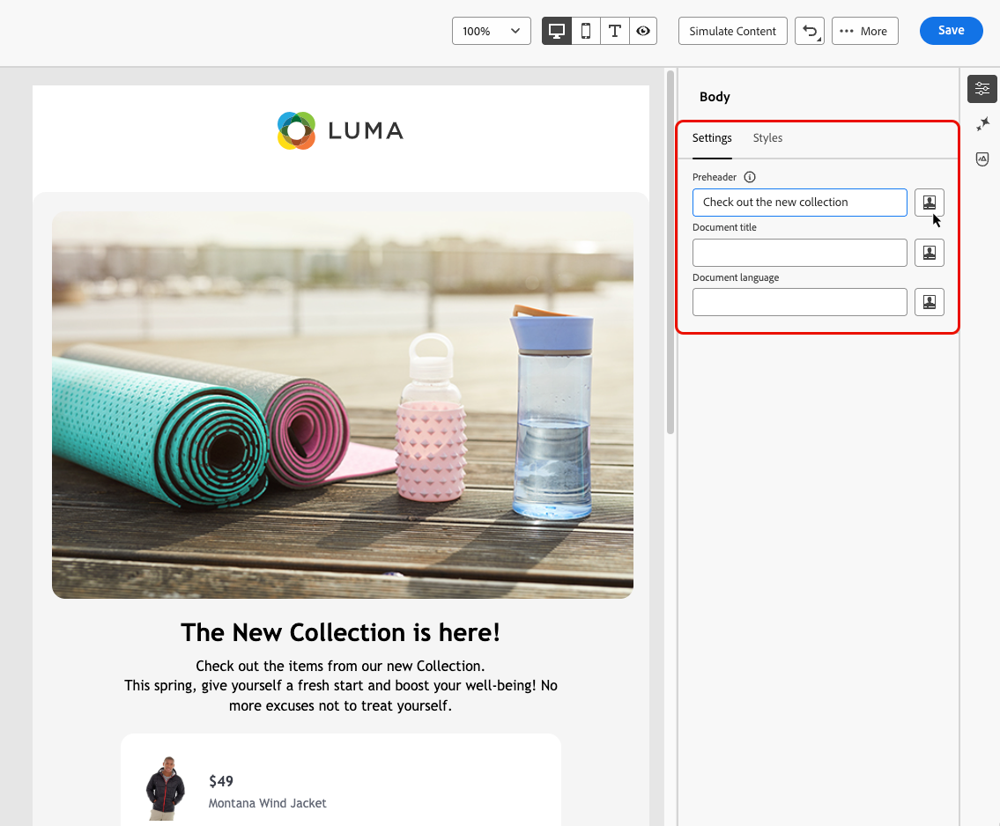

# Metagegevens toevoegen aan uw e-mailinhoud {#email-metadata}

>[!CONTEXTUALHELP]
>id="ac_edition_preheader"
>title="Een preheader definiëren"
>abstract="Een preheader is een korte samenvattingstekst die op de onderwerpregel volgt wanneer een e-mailbericht van uw e-mailclient wordt weergegeven. In veel gevallen geeft het een korte samenvatting van de e-mail en is het doorgaans één zin lang."

Bij het ontwerpen van uw e-mails kunt u voor betere leesbaarheid en betere toegankelijkheid aanvullende metakenmerken voor uw inhoud definiëren. [!DNL Journey Optimizer] [&#x200B; E-mail Designer &#x200B;](get-started-email-design.md) laat u toe om de volgende elementen te specificeren:

* **[!UICONTROL Preheader]**: Een preheader is een korte samenvattingstekst die op de onderwerpregel volgt wanneer een e-mailbericht van uw e-mailclient wordt weergegeven. In veel gevallen geeft het een korte samenvatting van de e-mail en is het doorgaans één zin lang.

  >[!NOTE]
  >
  >Preheaders worden niet door alle e-mailclients ondersteund. Als deze optie niet wordt ondersteund, wordt de preheader niet weergegeven.

* **[!UICONTROL Document title]**: Dit veld, dat overeenkomt met het element `<title>` , bevat beschrijvende informatie over de e-mailinhoud die meestal als knopinfo wordt weergegeven wanneer de muisaanwijzer wordt bewogen. Het kan gebruikers met handicaps door extra context te verstrekken helpen, en kan tot een beter inzicht in uw inhoud door onderzoeksmotoren bijdragen.

* **[!UICONTROL Document language]**: om de toegankelijkheid te garanderen, kunt u de taal opgeven die schermlezers gebruiken om tekst en afbeeldingen om te zetten in spraak of braille - voor mensen met een visuele handicap of een leerhandicap. Deze instelling komt overeen met het kenmerk `lang` in het element `<html>` .

Volg onderstaande stappen om deze instellingen te configureren.

1. Van [&#x200B; E-mail Designer &#x200B;](content-from-scratch.md), voeg minstens a **[!UICONTROL Structure component]** toe beginnen uw e-mail te ontwerpen.

1. Klik op **[!UICONTROL Body]** in het vak **[!UICONTROL Navigation tree]** aan de linkerkant of op het rechterdeelvenster.

   

1. Typ op het tabblad **[!UICONTROL Settings]** tekst in de velden **[!UICONTROL Preheader]** , **[!UICONTROL Document title]** en/of **[!UICONTROL Document language]** .

1. U kunt ook op het pictogram voor aanpassen naast elk veld klikken om de inhoud aan te passen aan de hand van profielkenmerken, doelgroepen, contextafhankelijke kenmerken en meer. [&#x200B; leer meer over verpersoonlijking &#x200B;](../personalization/personalization-build-expressions.md)

   

1. Klik op **[!UICONTROL Save]** om uw wijzigingen te bevestigen.