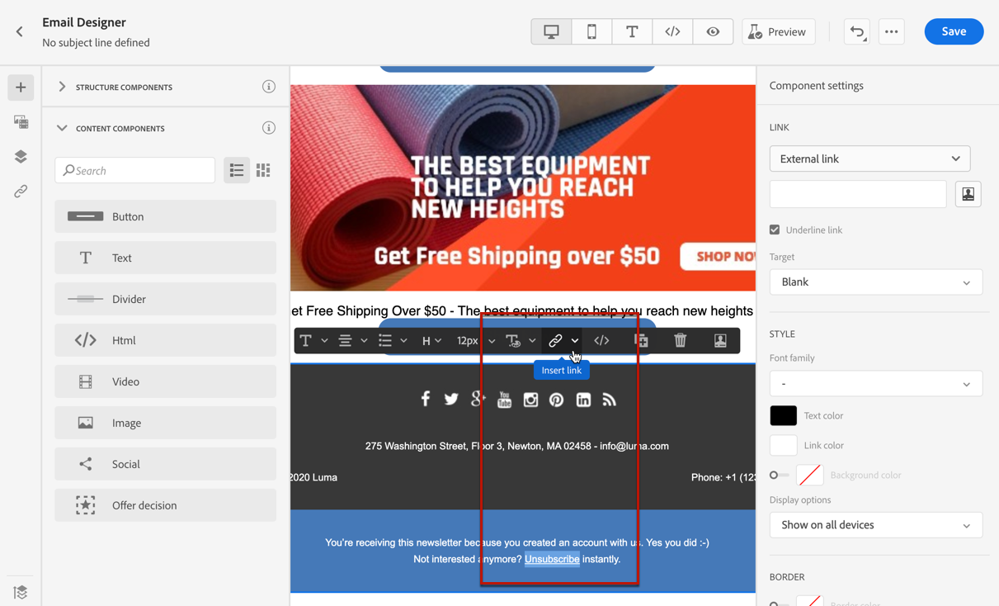

# E-mailuitschakelbeheer {#email-opt-out}

Wanneer het verzenden van berichten van reizen of campagnes, moet u altijd ervoor zorgen dat de klanten van toekomstige mededelingen kunnen opzeggen. Als u het abonnement opzegt, worden de profielen automatisch verwijderd uit het publiek van toekomstige marketingberichten.  [ Leer meer over privacy &amp; opt-out beheer ](../privacy/opt-out.md)

>[!NOTE]
>
>In al uw marketingberichten moet een koppeling naar de optie Weigeren zijn opgenomen. Dit is niet vereist voor transactieberichten. De berichtcategorie - **[!UICONTROL Marketing]** of **[!UICONTROL Transactional]** - wordt bepaald op het [ niveau van de kanaalconfiguratie ](../configuration/channel-surfaces.md#email-type) en wanneer het creëren van het bericht.

Als u een koppeling zonder abonnement wilt invoegen in uw e-mailinhoud, kunt u:

* Voeg één klik toe unsubscribe URL in de e-mailkopbal. Met de optie **[!UICONTROL Enable List-Unsubscribe]** op het niveau van de kanaalconfiguratie voegt u een uitschakelkoppeling toe aan de e-mailheader. [ Leer meer over opt-out in e-mailkopbal ](#unsubscribe-header)

* Laat **toe 1-klik opt-out verbinding** voor uw e-mail.  [ Leer hoe te om een één-klik opt-out verbinding toe te voegen ](#one-click-opt-out)

* Tussenvoegsel a **verbinding aan een het landen pagina**. [ Leer hoe te om een opt-out het landen pagina toe te voegen ](#opt-out-external-lp)

Wanneer een ontvanger op de opt-out-koppeling klikt, wordt het afwijzingsverzoek van de ontvanger dienovereenkomstig verwerkt.

Om te controleren dat de overeenkomstige keus van het profiel is bijgewerkt, ga naar Experience Platform en [ doorblader aan dat profiel ](https://experienceleague.adobe.com/en/docs/experience-platform/profile/ui/user-guide#attributes-tab). Op het tabblad **[!UICONTROL Attributes]** ziet u de waarde voor **[!UICONTROL choice]** is gewijzigd in **[!UICONTROL no]** . Leer meer in de [ documentatie van Experience Platform ](https://experienceleague.adobe.com/en/docs/experience-platform/profile/ui/user-guide#browse-identity){target="_blank"}.


>[!NOTE]
>
>Soms kan het langer duren om afmeldingsgebeurtenissen weer te geven op profielniveau als gevolg van de verwerking van downstreamgegevens. Laat het systeem enige tijd bijwerken.

## Eenfasige opt-out {#opt-out-one-step}

Met [!DNL Adobe Journey Optimizer], kunt u uw [ montages van de e-mailconfiguratie ](email-settings.md#list-unsubscribe) met een auto-geproduceerde één-klik vormen unsubscribe URL en postto adres in de e-mailkopbal, of één-klik opt-out URL in uw e-maillichaam omvatten.

### Eén klik op URL voor annuleren in de e-mailheader {#unsubscribe-header}

De één-klik lijst unsubscribe URL is een unsubscribe verbinding of knoop die naast de informatie van de e-mailafzender wordt getoond en laat ontvangers onmiddellijk uit uw het posten lijsten met één enkele klik kiezen. Leer hoe te om de **[!UICONTROL List unsubscribe]** optie in [ deze sectie ](list-unsubscribe.md) te beheren.

### Eén klik op Weigeren in de e-mailinhoud {#one-click-opt-out}

Als u een gepersonaliseerde URL voor annuleren wilt instellen, voegt u een koppeling voor een eenmalige aanmelding in de inhoud van het e-mailbericht in en voert u de URL van uw keuze in, zoals hieronder wordt beschreven:

1. Heb toegang tot uw e-mailinhoud en [ neem een verbinding ](../email/message-tracking.md#insert-links) op.
1. Selecteer **[!UICONTROL One click Opt-out]** als het type koppeling.

   

1. Voer de URL in van de bestemmingspagina waarop de gebruiker wordt omgeleid zodra het abonnement is opgezegd. Deze pagina is hier om te bevestigen dat het afmelden is gelukt.

   >[!NOTE]
   >
   >Als u de **[!UICONTROL List-Unsubscribe]** optie op het [ niveau van de kanaalconfiguratie ](email-settings.md#list-unsubscribe) toeliet en de standaard **[!UICONTROL One-click unsubscribe URL]** optie ongecontroleerd hebt, wordt deze het landen pagina URL ook gebruikt wanneer de gebruikers unsubscribe verbinding in de e-mailkopbal klikken. [Meer informatie](list-unsubscribe.md)

   

   U kunt uw koppelingen aanpassen. Leer meer over gepersonaliseerde URLs in [ deze sectie ](../personalization/personalization-syntax.md).

1. Selecteer hoe u de optie wilt toepassen: op het kanaal- of identiteitsniveau.

   

   * **[!UICONTROL Channel]**: De optie Weigeren is van toepassing op toekomstige berichten die naar het doel van het profiel (d.w.z. e-mailadres) voor het huidige kanaal worden verzonden. Als er meerdere doelen aan een profiel zijn gekoppeld, geldt de opt-out voor alle doelen (e-mailadressen) in het profiel voor dat kanaal.
   * **[!UICONTROL Identity]**: De optie om te weigeren is van toepassing op toekomstige berichten die worden verzonden naar het specifieke doel (e-mailadres) dat voor het huidige bericht wordt gebruikt.
     <!--* **[!UICONTROL Subscription]**: The opt-out applies to future messages associated with a specific subscription list. This option can only be selected if the current message is associated with a subscription list.-->

1. Sla uw wijzigingen op.


## Optie in twee stappen {#opt-out-external-lp}

Het standaardmechanisme voor opt-out is gebaseerd op twee stappen: de abonnee klikt in een e-mail op de koppeling om te weigeren en vervolgens wordt hij omgeleid naar een bestemmingspagina om zijn abonnement te bevestigen.

Als u deze uitstapmodus wilt implementeren, moet u een bestemmingspagina voor een opt-out maken en publiceren en een koppeling voor een abonnement toevoegen in uw e-mailberichten met een koppeling naar de bestemmingspagina. Deze stappen worden hieronder beschreven.


### Vereisten {#prereq-lp}

Als u een systeem met twee stappen wilt instellen voor het weigeren van toegang, moet u uw eigen bestemmingspagina&#39;s voor abonnementen maken. De eerste landingspagina wordt gekoppeld vanuit uw bericht en moet een call-to-action-knop bevatten. Er moet een bevestigingsbericht worden weergegeven wanneer de gebruiker op de knop klikt.

Leer hoe te om een het landen pagina in Adobe Journey Optimizer tot stand te brengen om abonnementen op [ te beheren deze pagina ](../landing-pages/lp-use-cases.md#opt-out).

U kunt ook een externe bestemmingspagina gebruiken. In dat geval configureert u de API zodanig dat de informatie naar Adobe Journey Optimizer wordt verzonden wanneer een ontvanger zich niet meer abonneert.

+++ Leer hoe u een opt-out API-aanroep implementeert

Om uw ontvangers te hebben uit verkoos wanneer zij hun keus van de het landen pagina voorleggen, moet u de vraag van API van het a **Abonnement** door [ Adobe Developer ](https://developer.adobe.com){target="_blank"} uitvoeren om de overeenkomstige profielen&#39; voorkeur bij te werken.

Deze POST-aanroep is als volgt:

Eindpunt: https://platform.adobe.io/journey/imp/consent/preferences

Parameters query:

* **params**: bevat de gecodeerde lading
* **pid**: Gecodeerde profiel identiteitskaart

Deze twee parameters worden opgenomen in de URL van de bestemmingspagina van derden die naar de ontvanger wordt verzonden:


Eisen voor koptekst:

* x-api-key
* x-gw-ims-org-id
* x-sandbox-name
* autorisatie (gebruikerstoken van uw technische account)

Instantie van aanvraag:

```
{
   "marketing": [
       {
            "type": "email",           
            "choice": "no",          
            "scope": "channel"       
        }
    ],
 
}
```

[!DNL Journey Optimizer] gebruikt deze parameters om de overeenkomstige keus van het profiel door de [ Adobe Developer ](https://developer.adobe.com){target="_blank"} API vraag bij te werken.

+++


### Koppeling voor annuleren toevoegen {#add-unsubscribe-link}

Eerst moet u een afmeldingskoppeling toevoegen aan een bericht. Hiervoor voert u de volgende stappen uit:

1. Creeer een bericht en [ neem een verbinding ](../email/message-tracking.md#insert-links) op gebruikend de contextafhankelijke toolbar.

   

1. Selecteer **[!UICONTROL Landing page]** in de vervolgkeuzelijst **[!UICONTROL Type]** en selecteer de bestemmingspagina voor de optie Weigeren in het veld **[!UICONTROL Landing page]** .

   Als u een externe landingspagina gebruikt, selecteert u **[!UICONTROL External Opt-out/Unsubscription]** in de vervolgkeuzelijst **[!UICONTROL Type]** .

   

   Plak in het veld **[!UICONTROL Link]** de koppeling naar de landingspagina van derden.

   

1. Klik op **[!UICONTROL Save]**.


### Bericht verzenden met afmeldingskoppeling {#send-message-unsubscribe-link}

Zodra u de unsubscribe verbinding aan uw landende pagina vormde, kunt u uw bericht creëren en verzenden.

1. Vorm uw bericht met een unsubscription verbinding en verzend het naar uw abonnees.

1. Zodra het bericht wordt ontvangen, als de ontvanger de unsubscribe verbinding klikt, wordt uw landende pagina getoond.

   

1. Als de ontvanger het formulier verzendt - hier, door de **[!UICONTROL Unsubscribe]** knoop in uw landingspagina te raken - worden de profielgegevens bijgewerkt door de API vraag.

1. De ontvanger van de optie-uit wordt dan opnieuw gericht aan een bevestigingsberichtscherm erop wijzend dat het kiezen uit succesvol was.

   

   Dit heeft tot gevolg dat deze gebruiker geen communicatie van uw merk ontvangt, tenzij hij opnieuw een abonnement neemt.

