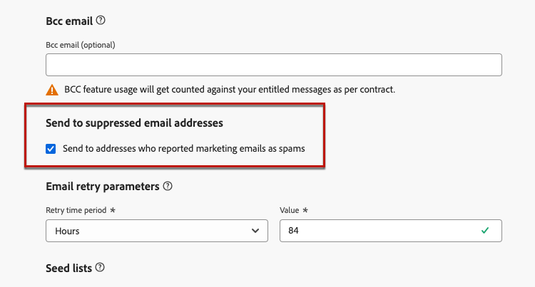

# E-mailinstellingen configureren {#email-settings}

Als u een e-mailbericht wilt maken, moet u e-mailkanaalconfiguraties instellen die alle technische parameters definiëren die vereist zijn voor uw berichten. [&#x200B; leer hoe te om configuraties &#x200B;](../configuration/channel-surfaces.md) tot stand te brengen

>[!NOTE]
>
>Als u uw reputatie wilt behouden en de leverbaarheid wilt verbeteren, stelt u de subdomeinen in die u wilt gebruiken voor het verzenden van e-mails voordat u een e-mailconfiguratie maakt. [Meer informatie](../configuration/about-subdomain-delegation.md)

Definieer de e-mailinstellingen in de specifieke sectie van de kanaalconfiguratie, zoals hieronder wordt beschreven.

{width="50%" align="left"}

De e-mailconfiguratie wordt opgepikt voor het verzenden van mededelingen volgens de logica hieronder:

* Voor batchritten is deze code niet van toepassing op batchuitvoering die al was gestart voordat de configuratie van het e-mailoppervlak is gemaakt. De wijzigingen worden opgepikt bij de volgende herhaling of nieuwe uitvoering.

* Voor transactieberichten, wordt de verandering onmiddellijk voor de volgende mededeling (tot vijf minuten vertraging) opgepikt.

>[!NOTE]
>
>De bijgewerkte configuratie-instellingen voor e-mail worden automatisch opgehaald tijdens de rit(s) of campagne(s) waar de configuratie wordt gebruikt.

## Type e-mail {#email-type}

>[!CONTEXTUALHELP]
>id="ajo_admin_presets_emailtype"
>title="Het e-mailtype definiëren"
>abstract="Selecteer het type e-mailberichten dat wordt verzonden wanneer u deze configuratie gebruikt: Marketing voor speciale e-mails waarvoor toestemming van de gebruiker vereist is, of Transactie voor niet-commerciële e-mailberichten die ook in specifieke contexten naar profielen zonder abonnement kunnen worden verzonden."

In de **sectie van het Type E-mail**, selecteer het type van bericht voor de configuratie: **[!UICONTROL Marketing]** of **[!UICONTROL Transactional]**.

* Selecteer **Marketing** voor promotionele e-mail, zoals wekelijkse promoties voor een detailhandel. Voor deze berichten is toestemming van de gebruiker vereist.

* Selecteer **Transactioneel** voor niet-commerciële e-mail, zoals orderbevestiging, wachtwoord terugstellende berichten, of leveringsinformatie bijvoorbeeld. Deze e-mails kunnen naar profielen worden verzonden die **&#x200B;**&#x200B;van marketing mededelingen afsloot. Deze berichten kunnen alleen in specifieke contexten worden verzonden.

Wanneer u een bericht maakt, moet u een geldige kanaalconfiguratie kiezen die overeenkomt met de categorie die u voor uw e-mail hebt geselecteerd.

## Subdomein {#subdomains}

Selecteer het subdomein dat u wilt gebruiken om de e-mails te verzenden.

>[!NOTE]
>
>Voor meer controle over de e-mailinstellingen kunt u dynamische subdomeinen definiëren. [Meer informatie](../email/surface-personalization.md#dynamic-subdomains)

Om de reputatie van uw domein te bewaren, versnelt het IP opwarmingsproces en verbetert leverbaarheid, uw verzendende subdomeinen aan Adobe delegeren. [Meer informatie](../configuration/about-subdomain-delegation.md)

## Details van IP-pool {#ip-pools}

Selecteer de IP pool aan vennoot met de configuratie. [Meer informatie](../configuration/ip-pools.md)

{width="50%" align="left"}

U kunt niet met configuratieverwezenlijking te werk gaan terwijl de geselecteerde IP pool onder [&#x200B; uitgave &#x200B;](../configuration/ip-pools.md#edit-ip-pool) (**[!UICONTROL Processing]** status) is en nooit met geselecteerde subdomain is geassocieerd. Anders, zal de oudste versie van de IP pool/subdomain vereniging nog worden gebruikt. Als dit het geval is, sparen de configuratie als ontwerp en probeer opnieuw zodra de IP pool de **[!UICONTROL Success]** status heeft.

>[!NOTE]
>
>Voor niet-productiemilieu&#39;s, creeert Adobe geen uit-van-de-doos testsubdomeinen noch verleent toegang tot een gedeelde verzendende IP pool. U moet [&#x200B; uw eigen subdomeinen &#x200B;](../configuration/delegate-subdomain.md) afvaardigen en IPs van de pool gebruiken die aan uw organisatie wordt toegewezen.

Nadat een IP pool is geselecteerd, is de informatie PTR zichtbaar wanneer het hangen over de IP adressen onder de IP pool drop-down lijst wordt getoond. [&#x200B; leer meer over PTR verslagen &#x200B;](../configuration/ptr-records.md)

>[!NOTE]
>
>Als er geen PTR-record is geconfigureerd, neemt u contact op met uw Adobe-vertegenwoordiger.

## Abonnement opzeggen {#list-unsubscribe}

Als u een subdomein in de lijst selecteert, wordt de optie **[!UICONTROL Enable List-Unsubscribe]** weergegeven. Deze optie is standaard ingeschakeld.

Hiermee kunt u met één klik een URL voor afmelden opnemen in de e-mailkoptekst. [Meer informatie](list-unsubscribe.md)

## Parameters koptekst {#email-header}

Voer in de sectie **[!UICONTROL Header parameters]** de namen en e-mailadressen van de afzender in die zijn gekoppeld aan het type e-mails dat met die configuratie is verzonden. [Meer informatie](header-parameters.md)

## BCC-e-mail {#bcc-email}

U kunt een identieke kopie (of blinde koolstofkopie) van e-mails die door [!DNL Journey Optimizer] zijn verzonden naar een BCC-postvak verzenden waar deze worden opgeslagen voor compatibiliteits- of archiefdoeleinden.

Hiervoor schakelt u de optionele functie **[!UICONTROL BCC email]** in op het niveau van de kanaalconfiguratie. [Meer informatie](../configuration/archiving-support.md#bcc-email)

Wanneer u bovendien het **[!UICONTROL Bcc email]** -adres definieert, moet u ervoor zorgen dat u een subdomein gebruikt dat een geldige MX-recordconfiguratie heeft, anders mislukt de verwerking van de e-mailconfiguratie.

Als u een fout bij het voorleggen van de e-mailconfiguratie krijgt, betekent het dat het MX- verslag niet voor subdomain van het adres wordt gevormd u inging. Contacteer uw beheerder voor het vormen van het overeenkomstige MX verslag of gebruik een ander adres met een geldige MX verslagconfiguratie.

## Verzenden naar onderdrukt e-mailadressen {#send-to-suppressed-email-addresses}

>[!CONTEXTUALHELP]
>id="ajo_surface_suppressed_addresses"
>title="Prioriteit suppressielijst overschrijven"
>abstract="U kunt ook transactiemeldingen verzenden naar profielen, zelfs als hun e-mailadres op de suppressielijst voor Adobe Journey Optimizer staat vanwege een spamklacht. Deze optie is standaard uitgeschakeld."
>additional-url="https://experienceleague.adobe.com/docs/journey-optimizer/using/configuration/monitor-reputation/manage-suppression-list.html?lang=nl-NL" text="De vervolgkeuzelijst beheren"

>[!IMPORTANT]
>
>Deze optie is alleen beschikbaar als u het e-mailtype **[!UICONTROL Transactional]** hebt geselecteerd. [Meer informatie](#email-type)

In [!DNL Journey Optimizer], worden alle e-mailadressen die als harde grenzen, zachte grenzen, en spamklachten duidelijk zijn automatisch verzameld in de [&#x200B; suppressielijst &#x200B;](../configuration/manage-suppression-list.md) en uitgesloten van het verzenden in een reis of een campagne.

Nochtans, kunt u besluiten om op het verzenden van berichten van het **transactie** type naar profielen te gaan zelfs als hun e-mailadressen op de suppressielijst toe te schrijven aan spamklacht door de gebruiker zijn.

Transactieberichten bevatten over het algemeen nuttige en verwachte informatie, zoals een orderbevestiging of een wachtwoordherstelmelding. Daarom zelfs als zij één van uw marketing berichten als spam hebben gemeld, het grootste deel van de tijd wilt u uw klanten dit type van niet-commerciële e-mail ontvangen.

Als u e-mailadressen wilt opnemen die zijn onderdrukt als gevolg van een spamklacht in het publiek van het transactiebericht, selecteert u de desbetreffende optie in de sectie **[!UICONTROL Send to suppressed email addresses]** .

>[!NOTE]
>
>Deze optie is standaard uitgeschakeld.

Deze optie is standaard uitgeschakeld als best practice voor de te leveren items. Zo weet u zeker dat er geen contact wordt opgenomen met uw klanten die ervoor hebben gekozen dit niet te doen. Nochtans, kunt u deze standaardoptie veranderen, die u dan toestaat om transactieberichten naar uw klanten te verzenden.

Zodra deze optie wordt toegelaten, hoewel een klant uw marketing e-mail als spam merkte, zal die klant uw transactiemeldingen kunnen ontvangen gebruikend de huidige configuratie. Zorg er altijd voor dat de voorkeuren voor weigeren worden beheerd in overeenstemming met de best practices voor prestaties.

## Zaadlijst {#seed-list}

>[!CONTEXTUALHELP]
>id="ajo_surface_seed_list"
>title="Een zaadlijst toevoegen"
>abstract="Selecteer de zaadlijst van uw keus om specifieke interne adressen aan uw publiek automatisch toe te voegen. Deze zaadadressen zullen op de tijd van de leveringsuitvoering worden omvat en zullen een nauwkeurige kopie van het bericht voor betrouwbaarheidsdoeleinden ontvangen."
>additional-url="https://experienceleague.adobe.com/docs/journey-optimizer/using/configuration/seed-lists.html?lang=nl-NL#use-seed-list" text="Wat zijn zaadlijsten?"

Met een zaadlijst in [!DNL Journey Optimizer] kunt u automatisch specifieke e-mailadressen opnemen in uw leveringen. [Meer informatie](../configuration/seed-lists.md)

>[!CAUTION]
>
>Deze functie is momenteel alleen van toepassing op het e-mailkanaal.

Selecteer in de sectie **[!UICONTROL Seed list]** de lijst die voor u van belang is. Leer hoe te om een zaadlijst in [&#x200B; tot stand te brengen deze sectie &#x200B;](../configuration/seed-lists.md#create-seed-list).

{width="80%"}

>[!NOTE]
>
>Er kan slechts één zaadlijst tegelijk worden geselecteerd.

Wanneer de huidige configuratie in een campagne of reis wordt gebruikt, zijn de e-mailadressen op de geselecteerde zaadlijst inbegrepen in de tijd van de leveringsuitvoering, die zij een exemplaar van de levering voor verzekeringsdoeleinden zullen ontvangen.

Leer hoe te om zaadlijst in een campagne of een reis in [&#x200B; te gebruiken deze sectie &#x200B;](../configuration/seed-lists.md#use-seed-list).

## Parameters opnieuw proberen {#email-retry}

>[!CONTEXTUALHELP]
>id="ajo_admin_presets_retryperiod"
>title="De periode voor het opnieuw proberen aanpassen"
>abstract="Retries worden 3,5 dagen (84 uur) uitgevoerd wanneer een e-maillevering mislukt als gevolg van een tijdelijke soft bounce-fout. U kunt deze standaardperiode voor opnieuw proberen aanpassen aan uw wensen."
>additional-url="https://experienceleague.adobe.com/docs/journey-optimizer/using/configuration/monitor-reputation/retries.html?lang=nl-NL" text="Opnieuw proberen"

U kunt **e-mail vormen opnieuw probeert parameters**.

Door gebrek, wordt de [&#x200B; periode van de opnieuw probeert tijd &#x200B;](../configuration/retries.md#retry-duration) geplaatst aan 84 uren, maar u kunt dit het plaatsen aanpassen om uw behoeften beter aan te passen.

U moet een geheel-getalwaarde (in uren of notulen) binnen de volgende waaier ingaan:

* Voor het in de handel brengen van e-mails is de minimale herroepingstermijn 6 uur.
* Voor transactie-e-mailberichten is de minimale herroepingstermijn 10 minuten.
* Voor beide e-mailtypen is de maximale hergebruiksperiode 84 uur (of 5040 minuten).

Leer meer over pogingen in [&#x200B; deze sectie &#x200B;](../configuration/retries.md).

## URL-tracking {#url-tracking}

Met **[!UICONTROL URL tracking parameters]** kunt u de doeltreffendheid van uw marketingactiviteiten op verschillende kanalen meten. [Meer informatie](url-tracking.md)

## Uitvoeringsadres {#execution-address}

Als u een profiel als doel instelt, zijn mogelijk verschillende e-mailadressen beschikbaar in de database (professioneel e-mailadres, persoonlijk e-mailadres, enz.).

In dat geval gebruikt [!DNL Journey Optimizer] het adres dat is opgegeven in **[!UICONTROL Execution fields]** op sandboxniveau om te bepalen welk e-mailadres prioriteit moet krijgen van de profielservice. [Meer informatie](../configuration/primary-email-addresses.md)

>[!NOTE]
>
>Als u de velden wilt controleren die standaard worden gebruikt, opent u het menu **[!UICONTROL Administration]** > **[!UICONTROL Channels]** > **[!UICONTROL General settings]** > **[!UICONTROL Executions fields]** .

U kunt dit standaard uitvoeringsveld echter wijzigen op het niveau van de configuratie van het e-mailkanaal. U kunt deze instelling vervolgens toepassen op specifieke campagnes of reizen.

Hiervoor bewerkt u het veld **[!UICONTROL Delivery address]** en selecteert u een item in de lijst met beschikbare XDM-velden van het e-mailtype. [Meer informatie](../configuration/primary-email-addresses.md#override-execution-address-channel-config)

