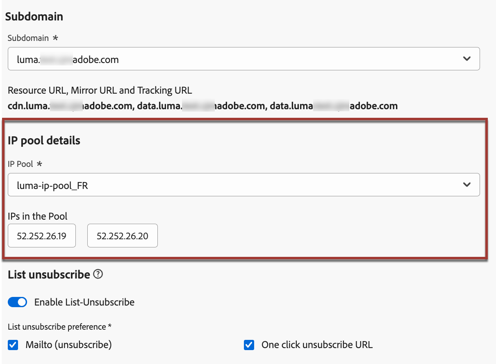
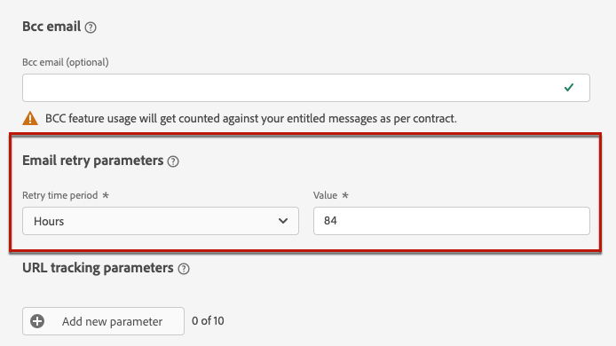

# E-mailinstellingen configureren {#email-settings}

Als u een e-mailbericht wilt maken, moet u e-mailkanaalconfiguraties instellen die alle technische parameters definiëren die vereist zijn voor uw berichten. [ leer hoe te om configuraties ](../configuration/channel-surfaces.md) tot stand te brengen

>[!NOTE]
>
>Als u uw reputatie wilt behouden en de leverbaarheid wilt verbeteren, stelt u de subdomeinen in die u wilt gebruiken voor het verzenden van e-mails voordat u een e-mailconfiguratie maakt. [Meer informatie](../configuration/about-subdomain-delegation.md)

Definieer de e-mailinstellingen in de specifieke sectie van de kanaalconfiguratie, zoals hieronder wordt beschreven.

{width="50%" align="left"}

De e-mailconfiguratie wordt opgepikt voor het verzenden van mededelingen volgens de logica hieronder:

* Voor batchritten is deze code niet van toepassing op batchuitvoering die al was gestart voordat de configuratie van het e-mailoppervlak is gemaakt. De wijzigingen worden opgepikt bij de volgende herhaling of nieuwe uitvoering.

* Voor transactieberichten, wordt de verandering onmiddellijk voor de volgende mededeling (tot vijf minuten vertraging) opgepikt.

>[!NOTE]
>
>De bijgewerkte configuratie-instellingen voor e-mail worden automatisch opgehaald tijdens de rit(s) of campagne(s) waar de configuratie wordt gebruikt.

## Type e-mail {#email-type}

>[!CONTEXTUALHELP]
>id="ajo_admin_presets_emailtype"
>title="Het e-mailtype definiëren"
>abstract="Selecteer het type e-mailberichten dat wordt verzonden wanneer u deze configuratie gebruikt: Marketing voor speciale e-mails waarvoor toestemming van de gebruiker vereist is, of Transactie voor niet-commerciële e-mailberichten die ook in specifieke contexten naar profielen zonder abonnement kunnen worden verzonden."

In de **sectie van het Type E-mail**, selecteer het type van bericht voor de configuratie: **[!UICONTROL Marketing]** of **[!UICONTROL Transactional]**.

* Selecteer **Marketing** voor promotionele e-mail, zoals wekelijkse promoties voor een detailhandel. Voor deze berichten is toestemming van de gebruiker vereist.

* Selecteer **Transactioneel** voor niet-commerciële e-mail, zoals orderbevestiging, wachtwoord terugstellende berichten, of leveringsinformatie bijvoorbeeld. Deze e-mails kunnen naar profielen worden verzonden die **** van marketing mededelingen afsloot. Deze berichten kunnen alleen in specifieke contexten worden verzonden.

Wanneer u een bericht maakt, moet u een geldige kanaalconfiguratie kiezen die overeenkomt met de categorie die u voor uw e-mail hebt geselecteerd.

## Subdomein {#subdomains}

Selecteer het subdomein dat u wilt gebruiken om de e-mails te verzenden.

>[!NOTE]
>
>Voor meer controle over de e-mailinstellingen kunt u dynamische subdomeinen definiëren. [Meer informatie](../email/surface-personalization.md#dynamic-subdomains)

Om de reputatie van uw domein te bewaren, versnelt het IP opwarmingsproces en verbetert leverbaarheid, uw verzendende subdomeinen aan Adobe delegeren. [Meer informatie](../configuration/about-subdomain-delegation.md)

## Details van IP-pool {#ip-pools}

Selecteer de IP pool aan vennoot met de configuratie. [Meer informatie](../configuration/ip-pools.md)

{width="50%" align="left"}

U kunt niet met configuratieverwezenlijking te werk gaan terwijl de geselecteerde IP pool onder [ uitgave ](../configuration/ip-pools.md#edit-ip-pool) (**[!UICONTROL Processing]** status) is en nooit met geselecteerde subdomain is geassocieerd. Anders, zal de oudste versie van de IP pool/subdomain vereniging nog worden gebruikt. Als dit het geval is, sparen de configuratie als ontwerp en probeer opnieuw zodra de IP pool de **[!UICONTROL Success]** status heeft.

>[!NOTE]
>
>Voor niet-productiemilieu&#39;s, leidt de Adobe niet uit-van-de-doos testsubdomeinen noch verleent toegang tot een gedeelde verzendende IP pool. U moet [ uw eigen subdomeinen ](../configuration/delegate-subdomain.md) afvaardigen en IPs van de pool gebruiken die aan uw organisatie wordt toegewezen.

Nadat een IP pool is geselecteerd, is de informatie PTR zichtbaar wanneer het hangen over de IP adressen onder de IP pool drop-down lijst wordt getoond. [ leer meer op PTR verslagen ](../configuration/ptr-records.md)

>[!NOTE]
>
>Als een PTR-record niet is geconfigureerd, neemt u contact op met uw Adobe.

## Abonnement voor lijst opzeggen{#list-unsubscribe}

<!--Do not modify - Legal Review Done -->

Op [ selecterend subdomain ](#subdomains-and-ip-pools) van de lijst, toont de **[!UICONTROL Enable List-Unsubscribe]** optiesvertoningen.

Deze optie is standaard ingeschakeld om een éénklik-URL voor annuleren op te nemen in de e-mailkoptekst, zoals:

>[!NOTE]
>
>Als u deze optie uitschakelt, wordt er geen één-klik-URL voor annuleren weergegeven in de e-mailkoptekst.

U kunt het toestemmingsniveau van de **[!UICONTROL Consent level]** drop-down lijst selecteren. Dit kan specifiek zijn voor het kanaal of de profielidentiteit. Op basis van deze instelling wordt de toestemming in Adobe Journey Optimizer bijgewerkt op kanaalniveau of op ID-niveau wanneer een gebruiker zich afmeldt met de lijst die de URL in de koptekst van een e-mail afmeldt.

De header List unsubscribe biedt twee functies die standaard zijn ingeschakeld, tenzij u een of beide functies uitschakelt:

{width="80%"}

<!--{width="80%"}-->

* A **Brievenbus (unsubscribe)** adres, dat het bestemmingsadres is waar unsubscribe verzoeken aan voor auto-verwerking worden verpletterd.

  In Journey Optimizer, is het unsubscribe e-mailadres de standaard **Brievenbus (unsubscribe)** adres dat in de kanaalconfiguratie wordt getoond, die op uw [ wordt gebaseerd geselecteerde subdomain ](#subdomains-and-ip-pools).

* **één-klik unsubscribe URL**, die door gebrek is uit één-klik uit URL geproduceerde Lijst unsubscribe kopbal, die op subdomein wordt gebaseerd u plaatst en in de montages van de kanaalconfiguratie gevormd.

<!--
    >[!AVAILABILITY]
    >
    >One-click Unsubscribe URL Header will be available in Adobe Journey Optimizer starting June 3, 2024.
    >
-->

De functies **[!UICONTROL Mailto (unsubscribe)]** en **[!UICONTROL One-click unsubscribe URL]** zijn optioneel.

Als u niet de standaard gegenereerde één-klik wilt gebruiken unsubscribe URL, kunt u de eigenschap uncheck. In het scenario waar de **[!UICONTROL Enable List-Unsubscribe]** optie wordt van een knevel voorzien en de **[!UICONTROL One-click Unsubscribe URL]** eigenschap is ongecontroleerd, als u a [ toe:voegen één-klik opt-out verbinding ](../privacy/opt-out.md#one-click-opt-out) aan een bericht dat gebruikend deze configuratie wordt gecreeerd, neemt de Lijst unsubscribe kopbal de één-klik opt-out verbinding op u in het lichaam van e-mail hebt opgenomen en gebruikt dat als één-klik unsubscribe URL waarde.

>[!NOTE]
>
>Als u geen één-klik opt-out verbinding in uw berichtinhoud toevoegt en het gebrek één-klik unsubscribe URL wordt niet gecontroleerd in de montages van de kanaalconfiguratie, wordt geen URL overgegaan in de e-mailkopbal als deel van de Lijst unsubscribe kopbal.

Leer meer bij het beheren van unsubscribe mogelijkheden in uw berichten in [ deze sectie ](../email/email-opt-out.md#unsubscribe-header).

<!--{width="80%"}-->

## Parameters koptekst {#email-header}

Voer in de sectie **[!UICONTROL Header parameters]** de namen en e-mailadressen van de afzender in die zijn gekoppeld aan het type e-mails dat met die configuratie is verzonden.

>[!NOTE]
>
>Voor meer controle over de e-mailinstellingen kunt u de headerparameters aanpassen. [Meer informatie](../email/surface-personalization.md#personalize-header)

* **[!UICONTROL Sender name]**: De naam van de afzender, zoals de naam van uw merk.
* **[!UICONTROL Sender email]**: Het e-mailadres dat u voor uw communicatie wilt gebruiken.
* **[!UICONTROL Reply to (name)]**: De naam die zal worden gebruikt wanneer de ontvanger de **antwoordknoop** in hun e-mailcliëntsoftware klikt.
* **[!UICONTROL Reply to (email)]**: Het e-mailadres dat zal worden gebruikt wanneer de ontvanger de **antwoordknoop** in hun e-mailcliëntsoftware klikt. [Meer informatie](#reply-to-email)
* **[!UICONTROL Error email]**: Alle fouten die door ISPs na een paar dagen van post worden geproduceerd die (asynchrone stuitingen) worden ontvangen op dit adres. De out-of-office berichten en de uitdagingsreacties worden ook ontvangen op dit adres.

  Als u de uit-van-bureauberichten en uitdagingsreacties op een specifiek e-mailadres wilt ontvangen dat niet aan Adobe wordt gedelegeerd, moet u a [ door:sturen proces ](#forward-email) opstelling. Zorg er in dat geval voor dat u een handmatige of geautomatiseerde oplossing hebt waarmee de e-mailberichten die in deze Postvak IN worden geplaatst, kunnen worden verwerkt.

>[!CAUTION]
>
>De **[!UICONTROL Sender email]** en **[!UICONTROL Error email]** adressen moeten huidige geselecteerde [ gedelegeerde subdomain ](../configuration/about-subdomain-delegation.md) gebruiken. Bijvoorbeeld, als gedelegeerde subdomain *marketing.luma.com* is, kunt u *contact@marketing.luma.com* en *error@marketing.luma.com* gebruiken.

{width="80%"}

>[!NOTE]
>
>Adressen moeten beginnen met een letter (A-Z) en mogen alleen alfanumerieke tekens bevatten. U kunt ook onderstrepingsteken `_` -, punt `.` - en afbreekstreepjes `-` gebruiken.

### E-mail beantwoorden {#reply-to-email}

Wanneer u het **[!UICONTROL Reply to (email)]** -adres definieert, kunt u elk e-mailadres opgeven, op voorwaarde dat het een geldig adres is, in de juiste notatie en zonder enige typefout.

Het Postvak IN dat wordt gebruikt voor antwoorden, ontvangt alle e-mails met reacties, met uitzondering van meldingen buiten het kantoor en antwoorden op problemen, die worden ontvangen op het **[!UICONTROL Error email]** -adres.

Volg onderstaande aanbevelingen om te zorgen voor een goed antwoordbeheer:

* Zorg ervoor dat de toegewezen Postvak IN voldoende ontvangstcapaciteit heeft om alle e-mailberichten te ontvangen die via de e-mailconfiguratie worden verzonden. Als het postvak &#39;Bounces&#39; retourneert, worden sommige reacties van uw klanten mogelijk niet ontvangen.

* De reacties moeten worden verwerkt met inachtneming van de verplichtingen inzake privacy en naleving, aangezien zij persoonlijk identificeerbare informatie (PII) kunnen bevatten.

* Merk geen berichten als spam in antwoordinbox, aangezien het alle andere reacties zal beïnvloeden die naar dit adres worden verzonden.

Wanneer u bovendien het **[!UICONTROL Reply to (email)]** -adres definieert, moet u ervoor zorgen dat u een subdomein gebruikt dat een geldige MX-recordconfiguratie heeft, anders mislukt de verwerking van de e-mailconfiguratie.

Als u een fout bij het voorleggen van de e-mailconfiguratie krijgt, betekent het dat het MX- verslag niet voor subdomain van het adres wordt gevormd u inging. Contacteer uw beheerder voor het vormen van het overeenkomstige MX verslag of gebruik een ander adres met een geldige MX verslagconfiguratie.

>[!NOTE]
>
>Als subdomain van het adres u inging een domein is dat [ volledig ](../configuration/delegate-subdomain.md#full-subdomain-delegation) aan Adobe werd gedelegeerd, contacteer uw Adobe rekeningsmanager.

### E-mail doorsturen {#forward-email}

Neem contact op met de klantenservice van de Adobe als u alle e-mailberichten die [!DNL Journey Optimizer] voor het gedelegeerde subdomein heeft ontvangen, wilt doorsturen naar een specifiek e-mailadres.

>[!NOTE]
>
>Als subdomain die voor het **[!UICONTROL Reply to (email)]** adres wordt gebruikt niet aan Adobe wordt afgevaardigd, door:sturen kan niet voor dit adres werken.

U moet het volgende opgeven:

* Het e-mailadres van uw keuze. Merk op dat het voorwaartse domein van het e-mailadres geen subdomein kan aanpassen dat aan Adobe wordt gedelegeerd.
* De naam van uw sandbox.
* De configuratienaam of het subdomein waarvoor het voorwaartse e-mailadres zal worden gebruikt.
  <!--* The current **[!UICONTROL Reply to (email)]** address or **[!UICONTROL Error email]** address set at the channel configuration level.-->

>[!NOTE]
>
>Per subdomein kan slechts één voorwaarts e-mailadres aanwezig zijn. Daarom als de veelvoudige configuraties zelfde subdomain gebruiken, moet het zelfde voorwaartse e-mailadres voor elk van hen worden gebruikt.

Het e-mailadres voor verzending wordt ingesteld door Adobe. Dit kan 3 tot 4 dagen duren.

Zodra u klaar bent, worden alle berichten die op de **[!UICONTROL Reply to (email)]** - en **[!UICONTROL Error email]** -adressen worden ontvangen doorgestuurd naar het specifieke e-mailadres dat u hebt opgegeven.

## BCC-e-mail {#bcc-email}

U kunt een identieke kopie (of blinde koolstofkopie) van e-mails die door [!DNL Journey Optimizer] zijn verzonden naar een BCC-postvak verzenden waar deze worden opgeslagen voor compatibiliteits- of archiefdoeleinden.

Hiervoor schakelt u de optionele functie **[!UICONTROL BCC email]** in op het niveau van de kanaalconfiguratie. [Meer informatie](../configuration/archiving-support.md#bcc-email)

Wanneer u bovendien het **[!UICONTROL Bcc email]** -adres definieert, moet u ervoor zorgen dat u een subdomein gebruikt dat een geldige MX-recordconfiguratie heeft, anders mislukt de verwerking van de e-mailconfiguratie.

Als u een fout bij het voorleggen van de e-mailconfiguratie krijgt, betekent het dat het MX- verslag niet voor subdomain van het adres wordt gevormd u inging. Contacteer uw beheerder voor het vormen van het overeenkomstige MX verslag of gebruik een ander adres met een geldige MX verslagconfiguratie.

## Verzenden naar onderdrukt e-mailadressen {#send-to-suppressed-email-addresses}

>[!CONTEXTUALHELP]
>id="ajo_surface_suppressed_addresses"
>title="Prioriteit suppressielijst overschrijven"
>abstract="U kunt ook transactiemeldingen verzenden naar profielen, zelfs als hun e-mailadres op de suppressielijst voor Adobe Journey Optimizer staat vanwege een spamklacht. Deze optie is standaard uitgeschakeld."
>additional-url="https://experienceleague.adobe.com/docs/journey-optimizer/using/configuration/monitor-reputation/manage-suppression-list.html" text="De vervolgkeuzelijst beheren"

>[!IMPORTANT]
>
>Deze optie is alleen beschikbaar als u het e-mailtype **[!UICONTROL Transactional]** hebt geselecteerd. [Meer informatie](#email-type)

In [!DNL Journey Optimizer], worden alle e-mailadressen die als harde grenzen, zachte grenzen, en spamklachten duidelijk zijn automatisch verzameld in de [ suppressielijst ](../configuration/manage-suppression-list.md) en uitgesloten van het verzenden in een reis of een campagne.

Nochtans, kunt u besluiten om op het verzenden van berichten van het **transactie** type naar profielen te gaan zelfs als hun e-mailadressen op de suppressielijst toe te schrijven aan spamklacht door de gebruiker zijn.

Transactieberichten bevatten over het algemeen nuttige en verwachte informatie, zoals een orderbevestiging of een wachtwoordherstelmelding. Daarom zelfs als zij één van uw marketing berichten als spam hebben gemeld, het grootste deel van de tijd wilt u uw klanten dit type van niet-commerciële e-mail ontvangen.

Als u e-mailadressen wilt opnemen die zijn onderdrukt als gevolg van een spamklacht in het publiek van het transactiebericht, selecteert u de desbetreffende optie in de sectie **[!UICONTROL Send to suppressed email addresses]** .

>[!NOTE]
>
>Deze optie is standaard uitgeschakeld.

Deze optie is standaard uitgeschakeld als best practice voor de te leveren items. Zo weet u zeker dat er geen contact wordt opgenomen met uw klanten die ervoor hebben gekozen dit niet te doen. Nochtans, kunt u deze standaardoptie veranderen, die u dan toestaat om transactieberichten naar uw klanten te verzenden.

Zodra deze optie wordt toegelaten, hoewel een klant uw marketing e-mail als spam merkte, zal die klant uw transactiemeldingen kunnen ontvangen gebruikend de huidige configuratie. Zorg er altijd voor dat de voorkeuren voor weigeren worden beheerd in overeenstemming met de best practices voor prestaties.

## Zaadlijst {#seed-list}

>[!CONTEXTUALHELP]
>id="ajo_surface_seed_list"
>title="Een zaadlijst toevoegen"
>abstract="Selecteer de zaadlijst van uw keus om specifieke interne adressen aan uw publiek automatisch toe te voegen. Deze zaadadressen zullen op de tijd van de leveringsuitvoering worden omvat en zullen een nauwkeurige kopie van het bericht voor betrouwbaarheidsdoeleinden ontvangen."
>additional-url="https://experienceleague.adobe.com/docs/journey-optimizer/using/configuration/seed-lists.html#use-seed-list" text="Wat zijn zaadlijsten?"

Met een zaadlijst in [!DNL Journey Optimizer] kunt u automatisch specifieke e-mailadressen opnemen in uw leveringen. [Meer informatie](../configuration/seed-lists.md)

>[!CAUTION]
>
>Deze functie is momenteel alleen van toepassing op het e-mailkanaal.

Selecteer in de sectie **[!UICONTROL Seed list]** de lijst die voor u van belang is. Leer hoe te om een zaadlijst in [ tot stand te brengen deze sectie ](../configuration/seed-lists.md#create-seed-list).

{width="80%"}

>[!NOTE]
>
>Er kan slechts één zaadlijst tegelijk worden geselecteerd.

Wanneer de huidige configuratie in een campagne of reis wordt gebruikt, zijn de e-mailadressen op de geselecteerde zaadlijst inbegrepen in de tijd van de leveringsuitvoering, die zij een exemplaar van de levering voor verzekeringsdoeleinden zullen ontvangen.

Leer hoe te om zaadlijst in een campagne of een reis in [ te gebruiken deze sectie ](../configuration/seed-lists.md#use-seed-list).

## Parameters opnieuw proberen {#email-retry}

>[!CONTEXTUALHELP]
>id="ajo_admin_presets_retryperiod"
>title="De periode voor het opnieuw proberen aanpassen"
>abstract="Retries worden 3,5 dagen (84 uur) uitgevoerd wanneer een e-maillevering mislukt als gevolg van een tijdelijke soft bounce-fout. U kunt deze standaardperiode voor opnieuw proberen aanpassen aan uw wensen."
>additional-url="https://experienceleague.adobe.com/docs/journey-optimizer/using/configuration/monitor-reputation/retries.html" text="Opnieuw proberen"

U kunt **e-mail vormen opnieuw probeert parameters**.

Door gebrek, wordt de [ periode van de opnieuw probeert tijd ](../configuration/retries.md#retry-duration) geplaatst aan 84 uren, maar u kunt dit het plaatsen aanpassen om uw behoeften beter aan te passen.

U moet een geheel-getalwaarde (in uren of notulen) binnen de volgende waaier ingaan:

* Voor het in de handel brengen van e-mails is de minimale herroepingstermijn 6 uur.
* Voor transactie-e-mailberichten is de minimale herroepingstermijn 10 minuten.
* Voor beide e-mailtypen is de maximale hergebruiksperiode 84 uur (of 5040 minuten).

Leer meer op herpogingen in [ deze sectie ](../configuration/retries.md).

## URL-tracking {#url-tracking}

>[!CONTEXTUALHELP]
>id="ajo_admin_preset_utm"
>title="Parameters voor URL-tracking definiëren"
>abstract="Met deze sectie kunt u automatisch parameters voor bijhouden toevoegen aan de URL&#39;s in uw e-mailinhoud. Deze functie is optioneel."

>[!CONTEXTUALHELP]
>id="ajo_admin_preset_url_preview"
>title="Voorvertoning van parameters voor URL bijhouden"
>abstract="Bekijk hoe u parameters voor bijhouden toevoegt aan de URL&#39;s in uw e-mailinhoud."

Met **[!UICONTROL URL tracking parameters]** kunt u de doeltreffendheid van uw marketingactiviteiten op verschillende kanalen meten. Deze functie is optioneel.

De parameters die in deze sectie worden gedefinieerd, worden toegevoegd aan het einde van de URL&#39;s die in de inhoud van uw e-mailbericht zijn opgenomen. Vervolgens kunt u deze parameters vastleggen in hulpprogramma&#39;s voor webanalyse, zoals Adobe Analytics of Googles Analytics, en verschillende prestatierapporten maken.

Met de knop **[!UICONTROL Add new parameter]** kunt u maximaal 10 volgparameters toevoegen.

{width="80%"}

Als u een URL-volgparameter wilt configureren, kunt u de gewenste waarden rechtstreeks invoeren in de velden **[!UICONTROL Name]** en **[!UICONTROL Value]** .

U kunt elk **[!UICONTROL Value]** gebied ook uitgeven gebruikend de [ verpersoonlijkingsredacteur ](../personalization/personalization-build-expressions.md). Klik op het pictogram van de editie om de editor te openen. Vervolgens kunt u de beschikbare contextafhankelijke kenmerken selecteren en/of de tekst rechtstreeks bewerken.

De volgende vooraf gedefinieerde waarden zijn beschikbaar via de verpersoonlijkingseditor:

* **handelings identiteitskaart van Source**: identiteitskaart van de E-mailactie die aan de reis of de campagne wordt toegevoegd.

* **de actienaam van Source**: naam van de E-mailactie die aan de reis of de campagne wordt toegevoegd.

* **identiteitskaart van Source**: identiteitskaart van de reis of de campagne e-mail werd verzonden met.

* **naam van Source**: naam van de reis of de campagne e-mail werd verzonden met.

* **versie identiteitskaart van Source**: identiteitskaart van de reis of campagneversie e-mail werd verzonden met.

* **identiteitskaart van de Aanbieding**: identiteitskaart van de aanbieding die in e-mail wordt gebruikt.

>[!NOTE]
>
>U kunt het typen van tekstwaarden en het gebruiken van contextafhankelijke attributen van de verpersoonlijkingsredacteur combineren. Elk **[!UICONTROL Value]** -veld kan een aantal tekens tot maximaal 5 kB bevatten.

<!--You can drag and drop the parameters to reorder them.-->

Hieronder staan voorbeelden van URL&#39;s die compatibel zijn met Adobe Analytics en Googles Analytics.

* Met Adobe Analytics compatibele URL: `www.YourLandingURL.com?cid=email_AJO_{{context.system.source.id}}_image_{{context.system.source.name}}`

* Compatibele URL voor Googles Analytics: `www.YourLandingURL.com?utm_medium=email&utm_source=AJO&utm_campaign={{context.system.source.id}}&utm_content=image`

U kunt de resulterende URL voor bijhouden dynamisch voorvertonen. Elke keer dat u een parameter toevoegt, bewerkt of verwijdert, wordt de voorvertoning automatisch bijgewerkt.

>[!NOTE]
>
>U kunt ook dynamische parameters voor gepersonaliseerde bijhouden toevoegen aan de koppelingen in uw e-mailinhoud, maar dit is niet mogelijk op configuratieniveau. Dit moet u doen wanneer u uw bericht ontwerpt met de e-mailontwerper. [Meer informatie](message-tracking.md#url-tracking)

## Uitvoeringsadres {#execution-address}

>[!CONTEXTUALHELP]
>id="ajo_email_config_execution_address"
>title="Het standaard te gebruiken uitvoeringsadres overschrijven"
>abstract="Als er meerdere e-mailadressen beschikbaar zijn in de database (persoonlijk, professioneel, enz.), kunt u kiezen bij welke e-mailadressen de verzending prioriteit moet krijgen. Het primaire adres wordt bepaald op het zandbakniveau, maar hier kunt u het gebrek met voeten treden dat voor deze specifieke e-mailconfiguratie plaatst."

Als u een profiel als doel instelt, zijn mogelijk verschillende e-mailadressen beschikbaar in de database (professioneel e-mailadres, persoonlijk e-mailadres, enz.).

In dat geval gebruikt [!DNL Journey Optimizer] het adres dat is opgegeven in **[!UICONTROL Execution fields]** op sandboxniveau om te bepalen welk e-mailadres prioriteit moet krijgen van de profielservice. [Meer informatie](../configuration/primary-email-addresses.md)

>[!NOTE]
>
>Als u de velden wilt controleren die standaard worden gebruikt, opent u het menu **[!UICONTROL Administration]** > **[!UICONTROL Channels]** > **[!UICONTROL General settings]** > **[!UICONTROL Executions fields]** .

U kunt dit standaard uitvoeringsveld echter wijzigen op het niveau van de configuratie van het e-mailkanaal. U kunt deze instelling vervolgens toepassen op specifieke campagnes of reizen.

Hiervoor bewerkt u het veld **[!UICONTROL Delivery address]** en selecteert u een item in de lijst met beschikbare XDM-velden van het e-mailtype.

Het uitvoeringsgebied wordt bijgewerkt en dan gebruikt als primair adres. De algemene instelling op sandboxniveau wordt genegeerd.
