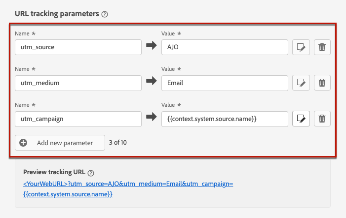
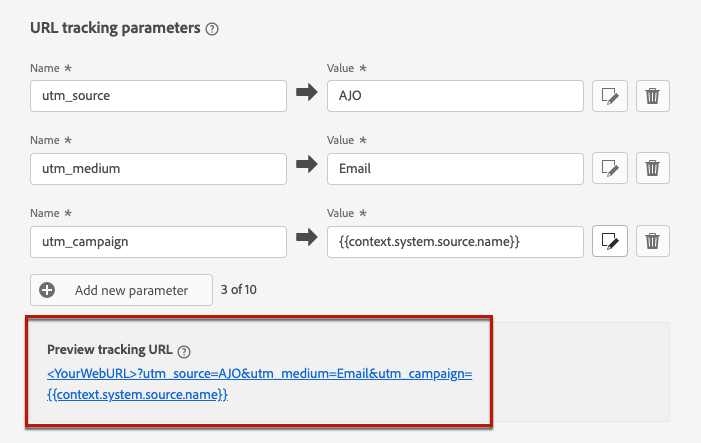

# E-mailinstellingen configureren {#email-settings}

Als u een e-mailbericht wilt maken, moet u oppervlakken van e-mailkanalen instellen die alle technische parameters definiëren die vereist zijn voor uw berichten. [Leer hoe u oppervlakken maakt](../configuration/channel-surfaces.md)

Bepaal de e-mailmontages in de specifieke sectie van de configuratie van de kanaaloppervlakte.

De configuratie van de e-mailoppervlakte wordt opgepikt voor het verzenden van mededelingen die de logica hieronder volgen:

* Voor batch- en burstritten is deze niet van toepassing op batch- of burst-uitvoering die al was gestart voordat de e-mailoppervlakteconfiguratie werd gemaakt. De wijzigingen worden opgepikt bij de volgende herhaling of nieuwe uitvoering.

* Voor transactieberichten, wordt de verandering onmiddellijk voor de volgende mededeling (tot vijf minuten vertraging) opgepikt.

>[!NOTE]
>
>De bijgewerkte instellingen van het e-mailoppervlak worden automatisch opgehaald tijdens de reis(en) of campagne(s) waar het oppervlak wordt gebruikt.

## Type e-mail {#email-type}

>[!CONTEXTUALHELP]
>id="ajo_admin_presets_emailtype"
>title="De e-mailcategorie definiëren"
>abstract="Selecteer het type e-mail dat wordt verzonden wanneer u dit oppervlak gebruikt: Marketing voor speciale e-mailberichten waarvoor toestemming van de gebruiker vereist is, of Transactie voor niet-commerciële e-mails die ook in specifieke contexten naar profielen zonder abonnement kunnen worden verzonden."

In de **E-MAILTYPE** selecteert u het type bericht dat met het oppervlak wordt verzonden: **Marketing** of **Transactioneel**.

* Kies **Marketing** voor e-mail met speciale aandacht: voor deze berichten is toestemming van de gebruiker vereist .

* Kies **Transactioneel** voor niet-commerciële e-mail, zoals bevestiging van de bestelling, wachtwoordherstelmeldingen of leveringsgegevens.

>[!CAUTION]
>
>**Transactioneel** e-mails kunnen worden verzonden naar profielen die zich niet meer hebben geabonneerd op marketingberichten. Deze berichten kunnen alleen in specifieke contexten worden verzonden.

Wanneer u een bericht maakt, moet u een geldig kanaaloppervlak kiezen dat overeenkomt met de categorie die u voor uw e-mail hebt geselecteerd.

## Subdomein- en IP-pools {#subdomains-and-ip-pools}

In de **Subdomein- en IP-pools** -sectie, moet u:

1. Selecteer het subdomein dat u wilt gebruiken om de e-mails te verzenden. [Meer informatie](../configuration/about-subdomain-delegation.md)

1. Selecteer de IP pool om met de oppervlakte te associëren. [Meer informatie](../configuration/ip-pools.md)

U kunt niet met oppervlakverwezenlijking te werk gaan terwijl de geselecteerde IP pool onder is [editie](../configuration/ip-pools.md#edit-ip-pool) (**[!UICONTROL Processing]** status) en is nooit gekoppeld aan het geselecteerde subdomein. Anders, zal de oudste versie van de IP pool/subdomain vereniging nog worden gebruikt. Als dit het geval is, sparen de oppervlakte als ontwerp en probeer opnieuw zodra de IP pool heeft **[!UICONTROL Success]** status.

>[!NOTE]
>
>Voor niet-productiemilieu&#39;s, creeert Adobe geen uit-van-de-doos testsubdomeinen noch verleent toegang tot een gedeelde verzendende IP pool. U moet [delegeren uw eigen subdomeinen](../configuration/delegate-subdomain.md) en gebruik IPs van de pool die aan uw organisatie wordt toegewezen.

Nadat een IP pool is geselecteerd, is de informatie PTR zichtbaar wanneer het hangen over de IP adressen onder de IP pool drop-down lijst wordt getoond. [Meer informatie over PTR-records](../configuration/ptr-records.md)

>[!NOTE]
>
>Als een PTR-record niet is geconfigureerd, neemt u contact op met uw Adobe-vertegenwoordiger.

## List-Unsubscribe {#list-unsubscribe}

Aan [selecteren, subdomein](#subdomains-and-ip-pools) in de lijst **[!UICONTROL Enable List-Unsubscribe]** weergegeven.

Deze optie is standaard ingeschakeld.

Als u deze optie ingeschakeld laat, wordt automatisch een afmeldingskoppeling opgenomen in de e-mailkoptekst, zoals:

Als u deze optie uitschakelt, wordt er geen koppeling voor afmelden weergegeven in de e-mailkoptekst.

De unsubscribe-koppeling bestaat uit twee elementen:

* An **e-mailadres opzeggen**, waarnaar alle afmeldingsverzoeken worden verzonden.

   In [!DNL Journey Optimizer], is het e-mailadres voor opzeggen het standaardadres **[!UICONTROL Mailto (unsubscribe)]** adres dat in de kanaaloppervlakte wordt getoond, die op [geselecteerd subdomein](#subdomains-and-ip-pools).

   

* De **abonnement-URL opzeggen**, dit is de URL van de bestemmingspagina waarop de gebruiker wordt omgeleid wanneer deze het abonnement opzegt.

   Als u een [one-click opt-out link](../privacy/opt-out.md#one-click-opt-out) voor een bericht dat is gemaakt met dit oppervlak, is de URL voor het afmelden van een abonnement de URL die is gedefinieerd voor de koppeling om één muisklik uit te schakelen.

   

   >[!NOTE]
   >
   >Als u geen koppeling om te weigeren met één klik toevoegt aan uw berichtinhoud, wordt er geen bestemmingspagina weergegeven voor de gebruiker.

Meer informatie over het toevoegen van een link voor opzeggen van koptekst aan je berichten in [deze sectie](../privacy/opt-out.md#unsubscribe-header).

<!--Select the **[!UICONTROL Custom List-Unsubscribe]** option to enter your own Unsubscribe URL and/or your own Unsubscribe email address.(to add later)-->

## Parameters koptekst {#email-header}

In de **[!UICONTROL Header parameters]** in, voert u de namen en e-mailadressen van de afzender in die zijn gekoppeld aan het type e-mail dat met dat oppervlak is verzonden.

* **[!UICONTROL Sender name]**: De naam van de afzender, zoals de naam van uw merk.

* **[!UICONTROL Sender email]**: Het e-mailadres dat u voor uw communicatie wilt gebruiken.

* **[!UICONTROL Reply to (name)]**: De naam die wordt gebruikt wanneer de ontvanger op de knop **Reageren** in hun e-mailclientsoftware.

* **[!UICONTROL Reply to (email)]**: Het e-mailadres dat wordt gebruikt wanneer de ontvanger op de knop **Reageren** in hun e-mailclientsoftware. [Meer informatie](#reply-to-email)

* **[!UICONTROL Error email]**: Alle fouten die door ISPs na een paar dagen van post worden geproduceerd die (asynchrone stuitingen) worden ontvangen op dit adres.

>[!CAUTION]
>
>De **[!UICONTROL Sender email]** en **[!UICONTROL Error email]** adressen moeten de huidige geselecteerde gebruiken [gedelegeerd subdomein](../configuration/about-subdomain-delegation.md). Als het gedelegeerde subdomein bijvoorbeeld *marketing.luma.com* kunt u *contact@marketing.luma.com* en *error@marketing.luma.com*.

>[!NOTE]
>
>Adressen moeten beginnen met een letter (A-Z) en mogen alleen alfanumerieke tekens bevatten. U kunt ook het onderstrepingsteken gebruiken `_`, punt`.` en afbreekstreepje `-` tekens.

### Reageren op e-mail {#reply-to-email}

Bij het definiëren van de **[!UICONTROL Reply to (email)]** adres, kunt u om het even welk e-mailadres specificeren op voorwaarde dat het een geldig adres, in correct formaat en zonder enige typefout is.

Volg onderstaande aanbevelingen om een goed antwoordbeheer te garanderen:

* De inbox die voor antwoorden wordt gebruikt, zal alle antwoorde-mails ontvangen, inclusief meldingen buiten het kantoor en antwoorden op uitdagingen. Zorg er dus voor dat u een handmatig of geautomatiseerd proces hebt om de e-mailberichten te verwerken die in deze inbox worden ingevoerd.

* Zorg ervoor dat de toegewezen Postvak IN voldoende ontvangstcapaciteit heeft om alle e-mails met reacties te ontvangen die via het e-mailoppervlak worden verzonden. Als het postvak &#39;Bounces&#39; retourneert, worden sommige reacties van uw klanten mogelijk niet ontvangen.

* De reacties moeten worden verwerkt met inachtneming van de verplichtingen inzake privacy en naleving, aangezien zij persoonlijk identificeerbare informatie (PII) kunnen bevatten.

* Merk geen berichten als spam in antwoordinbox, aangezien het alle andere reacties zal beïnvloeden die naar dit adres worden verzonden.

Bovendien, wanneer het bepalen van **[!UICONTROL Reply to (email)]** adres, zorg ervoor om subdomain te gebruiken die een geldige MX verslagconfiguratie heeft, anders zal de verwerking van de e-mailoppervlakte ontbreken.

Als u een fout bij het voorleggen van de e-mailoppervlakte krijgt, betekent het dat het MX- verslag niet voor subdomain van het adres wordt gevormd u inging. Contacteer uw beheerder voor het vormen van het overeenkomstige MX verslag of gebruik een ander adres met een geldige MX verslagconfiguratie.

>[!NOTE]
>
>Als het subdomein van het adres u inging een domein is dat [volledig gedelegeerd](../configuration/delegate-subdomain.md#full-subdomain-delegation) om Adobe te, contacteer uw Adobe- rekeningsmanager.

### E-mail doorsturen {#forward-email}

Als je naar een specifiek e-mailadres wilt doorsturen, alle e-mails ontvangen door [!DNL Journey Optimizer] voor het gedelegeerde subdomein, contacteer de Zorg van de Klant van de Adobe. U moet het volgende opgeven:

* Het e-mailadres van uw keuze. Merk op dat het voorwaartse domein van het e-mailadres geen subdomein kan aanpassen dat aan Adobe wordt gedelegeerd.
* De naam van uw sandbox.
* De oppervlaknaam waarvoor het voorwaartse e-mailadres zal worden gebruikt.
* De huidige **[!UICONTROL Reply to (email)]** adres dat op het niveau van de kanaaloppervlakte wordt geplaatst.

>[!NOTE]
>
>Per subdomein kan slechts één voorwaarts e-mailadres aanwezig zijn. Als meerdere oppervlakken hetzelfde subdomein gebruiken, moet voor alle oppervlakken hetzelfde e-mailadres worden gebruikt.

Het e-mailadres voor verzending wordt ingesteld door Adobe. Dit kan 3 tot 4 dagen duren.

## BCC-e-mail {#bcc-email}

U kunt een identieke kopie (of blinde koolstofkopie) van e-mails verzenden die zijn verzonden door [!DNL Journey Optimizer] naar een BCC-postvak waar ze worden opgeslagen voor compatibiliteits- of archiefdoeleinden.

Om dit te doen, laat toe **[!UICONTROL BCC email]** optionele functie op het niveau van het kanaaloppervlak. [Meer informatie](../configuration/archiving-support.md#bcc-email)

Bovendien, wanneer het bepalen van **[!UICONTROL Bcc email]** adres, zorg ervoor om subdomain te gebruiken die een geldige MX verslagconfiguratie heeft, anders zal de verwerking van de e-mailoppervlakte ontbreken.

Als u een fout bij het voorleggen van de e-mailoppervlakte krijgt, betekent het dat het MX- verslag niet voor subdomain van het adres wordt gevormd u inging. Contacteer uw beheerder voor het vormen van het overeenkomstige MX verslag of gebruik een ander adres met een geldige MX verslagconfiguratie.

## Parameters opnieuw proberen {#email-retry}

>[!CONTEXTUALHELP]
>id="ajo_admin_presets_retryperiod"
>title="De periode voor het opnieuw proberen aanpassen"
>abstract="Retries worden 3,5 dagen (84 uur) uitgevoerd wanneer een e-maillevering mislukt als gevolg van een tijdelijke soft bounce-fout. U kunt deze standaardperiode voor opnieuw proberen aanpassen aan uw wensen."
>additional-url="https://experienceleague.adobe.com/docs/journey-optimizer/using/configuration/monitor-reputation/retries.html" text="Opnieuw proberen"

U kunt de **Parameters opnieuw proberen**.

Standaard worden de [periode voor opnieuw uitproberen](../configuration/retries.md#retry-duration) is ingesteld op 84 uur, maar u kunt deze instelling aanpassen aan uw wensen.

U moet een geheel-getalwaarde (in uren of notulen) binnen de volgende waaier ingaan:

* Voor het in de handel brengen van e-mails is de minimale herroepingstermijn 6 uur.
* Voor transactie-e-mailberichten is de minimale herroepingstermijn 10 minuten.
* Voor beide e-mailtypen is de maximale hergebruiksperiode 84 uur (of 5040 minuten).

Meer informatie over nieuwe pogingen in [deze sectie](../configuration/retries.md).

## URL-tracking {#url-tracking}

>[!CONTEXTUALHELP]
>id="ajo_admin_preset_utm"
>title="Parameters voor URL-tracking definiëren"
>abstract="Met deze sectie kunt u automatisch parameters voor bijhouden toevoegen aan de URL&#39;s in uw e-mailinhoud. Deze functie is optioneel."

>[!CONTEXTUALHELP]
>id="ajo_admin_preset_url_preview"
>title="Voorvertoning van parameters voor URL bijhouden"
>abstract="Bekijk hoe u parameters voor bijhouden toevoegt aan de URL&#39;s in uw e-mailinhoud."

U kunt **[!UICONTROL URL tracking parameters]** om de doeltreffendheid van uw marketing inspanningen over kanalen te meten. Deze functie is optioneel.

De parameters die in deze sectie worden gedefinieerd, worden toegevoegd aan het einde van de URL&#39;s die in de inhoud van uw e-mailbericht zijn opgenomen. Vervolgens kunt u deze parameters vastleggen in hulpprogramma&#39;s voor webanalyse, zoals Adobe Analytics of Google Analytics, en verschillende prestatierapporten maken.

U kunt maximaal 10 volgparameters toevoegen met de functie **[!UICONTROL Add new parameter]** knop.

Als u een URL-volgparameter wilt configureren, kunt u rechtstreeks de gewenste waarden invoeren in het dialoogvenster **[!UICONTROL Name]** en **[!UICONTROL Value]** velden.

U kunt ook elke **[!UICONTROL Value]** veld met [Expressieeditor](../personalization/personalization-build-expressions.md). Klik op het pictogram van de editie om de editor te openen. Vervolgens kunt u de beschikbare contextafhankelijke kenmerken selecteren en/of de tekst rechtstreeks bewerken.

De volgende vooraf gedefinieerde waarden zijn beschikbaar via de Expressieeditor:

* **Id van handeling Bron**: Id van de e-mailactie die is toegevoegd aan de reis of campagne.

* **Naam van bronhandeling**: naam van de e-mailactie die aan de reis of campagne is toegevoegd.

* **Bron-id**: Id van de reis of campagne waarmee de e-mail is verzonden.

* **Bronnaam**: naam van de reis of campagne waarmee de e-mail is verzonden.

* **Id van bronversie**: Id van de reis- of campagneversie waarmee de e-mail is verzonden.

* **Offerte-id**: ID van het voorstel dat in de e-mail wordt gebruikt.

>[!NOTE]
>
>U kunt tekstwaarden typen en contextafhankelijke kenmerken gebruiken in de Expressieeditor. Elk **[!UICONTROL Value]** mag een aantal tekens bevatten tot maximaal 5 kB.

<!--You can drag and drop the parameters to reorder them.-->

Hieronder staan voorbeelden van URL&#39;s die compatibel zijn met Adobe Analytics en Google Analytics.

* URL die compatibel is met Adobe Analytics: `www.YourLandingURL.com?cid=email_AJO_{{context.system.source.id}}_image_{{context.system.source.name}}`

* Compatibele URL voor Google Analytics: `www.YourLandingURL.com?utm_medium=email&utm_source=AJO&utm_campaign={{context.system.source.id}}&utm_content=image`

U kunt de resulterende URL voor bijhouden dynamisch voorvertonen. Elke keer dat u een parameter toevoegt, bewerkt of verwijdert, wordt de voorvertoning automatisch bijgewerkt.

>[!NOTE]
>
>U kunt ook dynamische parameters voor gepersonaliseerde reeksspatiëring toevoegen aan de koppelingen in uw e-mailinhoud, maar dit is niet mogelijk op oppervlakteneniveau. Dit moet u doen wanneer u uw bericht ontwerpt met de e-mailontwerper. [Meer informatie](message-tracking.md#url-tracking)
