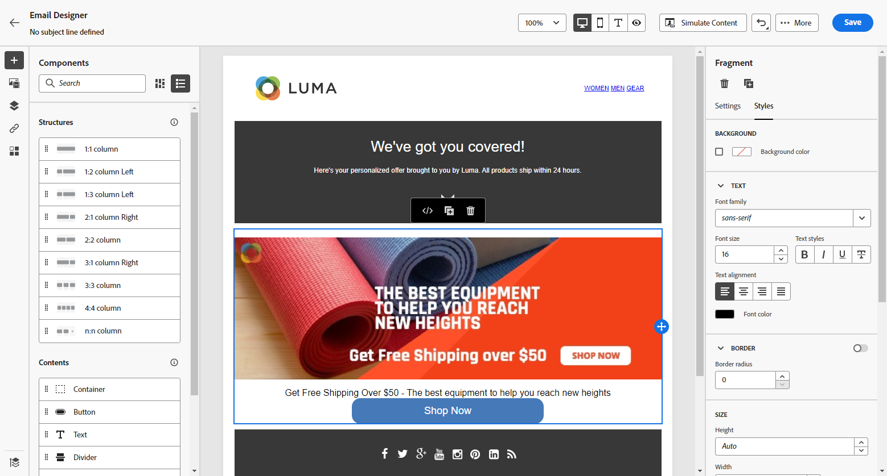

# Uw e-mailinhoud importeren {#existing-content}

Met [!DNL Journey Optimizer] kunt u bestaande HTML-inhoud importeren om uw e-mails te ontwerpen. Deze inhoud kan:

* Een **dossier van HTML** met een opgenomen stijlblad;
* Een map **.zip** met een HTML-bestand, de stijlpagina (.css) en afbeeldingen.

  >[!NOTE]
  >
  >Er gelden geen beperkingen voor de .zip-bestandsstructuur. Verwijzingen moeten echter relatief zijn en passen bij de boomstructuur van de ZIP-map.

>[!TIP]
>
>Als u beeldontwerpen (JPEG of PNG) in plaats van de dossiers van HTML hebt, kunt u het [&#x200B; beeld aan de omzetter van HTML &#x200B;](image-to-html.md) gebruiken om hen automatisch om te zetten in editable HTML e-mailmalplaatjes gebruikend AI.

Voer de onderstaande stappen uit om een bestand met HTML-inhoud te importeren:

1. Selecteer **[!UICONTROL Import HTML]** op de homepage van E-mail Designer.

   

1. Sleep het HTML- of ZIP-bestand met de HTML-inhoud en klik op **[!UICONTROL Import]** .

   

1. Nadat de HTML-inhoud is geüpload, bevindt de inhoud zich in **[!UICONTROL Compatibility mode]** .

   In deze modus kunt u alleen uw tekst aanpassen, koppelingen toevoegen of elementen aan uw inhoud toevoegen.

1. Als u de Designer-inhoudsonderdelen voor e-mail wilt gebruiken, opent u het tabblad **[!UICONTROL HTML converter]** en klikt u op **[!UICONTROL Convert]** .

   

   >[!NOTE]
   >
   > Als u een `<table>` -tag als eerste laag in een HTML-bestand gebruikt, kan dit leiden tot stijlverlies, zoals de achtergrond- en breedte-instellingen in de bovenste laagtag.

1. U kunt uw geïmporteerde bestand nu naar wens aanpassen met de functies van E-mail Designer. [Meer informatie](content-from-scratch.md)

## Hoe kan ik-video {#video}

Leer hoe u bestaande HTML-content kunt importeren, het ontwerp kunt aanpassen, spiegelpagina&#39;s kunt toevoegen en lidmaatschapskoppelingen kunt opheffen, en hoe u de content kunt coderen.

>[!VIDEO](https://video.tv.adobe.com/v/334102?quality=12)
