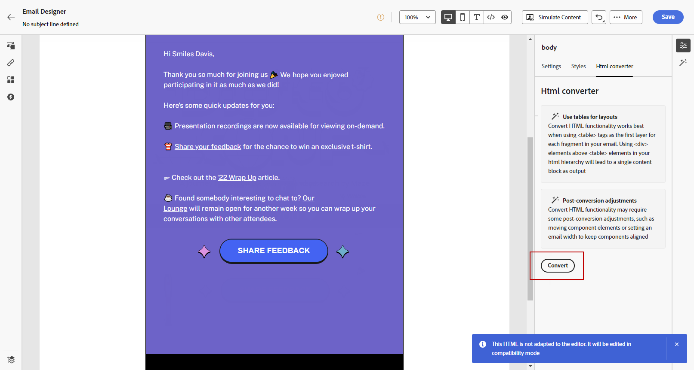

# Uw e-mailinhoud importeren {#existing-content}

[!DNL Journey Optimizer] kunt u bestaande HTML-inhoud importeren om uw e-mails te ontwerpen. Deze inhoud kan:

* An **HTML-bestand** met een model;
* A **.zip-map** inclusief een HTML-bestand, de stijlpagina (.css) en afbeeldingen.

  >[!NOTE]
  >
  >Er gelden geen beperkingen voor de .zip-bestandsstructuur. Verwijzingen moeten echter relatief zijn en passen bij de boomstructuur van de ZIP-map.

Voer de volgende stappen uit om een bestand met HTML-inhoud te importeren:

1. Selecteer op de introductiepagina E-mail Designer de optie **[!UICONTROL Import HTML]**.

   

1. Sleep het HTML- of ZIP-bestand met de inhoud van uw HTML en klik op **[!UICONTROL Import]**.

   

1. Nadat de HTML-inhoud is geüpload, wordt uw inhoud weergegeven in **[!UICONTROL Compatibility mode]**.

   In deze modus kunt u alleen uw tekst aanpassen, koppelingen toevoegen of elementen aan uw inhoud toevoegen.

1. Als u gebruik wilt maken van de inhoudcomponenten van E-mail Designer, opent u het dialoogvenster **[!UICONTROL HTML converter]** en klik op **[!UICONTROL Convert]**.

   

   >[!NOTE]
   >
   > Een `<table>` -tag als de eerste laag in een HTML-bestand kan leiden tot stijlverlies, inclusief de instellingen voor achtergrond en breedte in de bovenste laagtag.

1. U kunt uw geïmporteerde bestand nu naar wens aanpassen met de functies van E-mailontwerper [Meer informatie](content-from-scratch.md).

## Hoe kan ik-video {#video}

Leer hoe u bestaande HTML-content kunt importeren, het ontwerp kunt aanpassen, spiegelpagina&#39;s kunt toevoegen en lidmaatschapskoppelingen kunt opheffen, en hoe u de content kunt coderen.

>[!VIDEO](https://video.tv.adobe.com/v/334102?quality=12)
