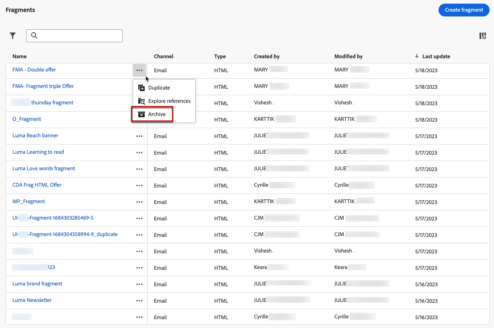

# Werken met fragmenten {#fragments}

Een fragment is een herbruikbare component waarnaar in een of meer e-mails kan worden verwezen [!DNL Journey Optimizer] campagnes en reizen.

Met deze functionaliteit kunt u meerdere blokken met aangepaste inhoud samenstellen die door niet-technische marketinggebruikers kunnen worden gebruikt om snel e-mailinhoud samen te stellen in een verbeterd ontwerpproces.

<!--
➡️ [Learn how to create and use templates in this video](#video-templates)-->

>[!CAUTION]
>
>Als u fragmenten wilt maken, bewerken en archiveren, moet u beschikken over de **[!DNL Manage Library Items]** bevoegdheid opgenomen in de **[!DNL Content Library Manager]** productprofiel. [Meer informatie](../administration/ootb-product-profiles.md#content-library-manager)

U kunt zo veel mogelijk gebruikmaken van fragmenten:

* Maak uw eigen fragmenten. Zie [Fragmenten maken](#create-fragments)
* Gebruik ze zo vaak als nodig is in je e-mails. Zie [Fragmenten gebruiken](#use-fragments)

>[!NOTE]
>
>Deze functie is momenteel alleen beschikbaar voor e-mails.

## Fragmenten openen en beheren {#access-manage-fragments}

Selecteer **[!UICONTROL Content Management]** > **[!UICONTROL Fragments]** in het linkermenu.

Alle fragmenten die op de huidige sandbox zijn gemaakt - ofwel op basis van de **[!UICONTROL Fragments]** menu, met de [Opslaan als fragment](#save-as-fragment) -optie - worden weergegeven.

U kunt fragmenten filteren op de aanmaak- of wijzigingsdatum. U kunt ervoor kiezen om alle fragmenten weer te geven, of alleen de items die de huidige gebruiker heeft gemaakt of gewijzigd. U kunt ook de **[!UICONTROL Archived]** fragmenten. [Meer informatie](#archive-fragments)

Van de **[!UICONTROL More actions]** naast elk fragment kunt u het volgende doen:

* Dupliceer een fragment.

* Gebruik de **[!UICONTROL Explore references]** de reis, de campagnes of de sjablonen waar deze worden gebruikt. [Meer informatie](#explore-references)

* Archiveer een fragment. [Meer informatie](#archive-fragments)

### Fragmenten bewerken {#edit-fragments}

Voer de onderstaande stappen uit om een fragment te bewerken.

1. Klik op het gewenste item in het pop-upmenu **[!UICONTROL Fragment]** lijst.
1. Vanuit de fragmenteigenschappen kunt u [verwijzingen verkennen](#explore-references), [zijn toegang beheren](../administration/object-based-access.md) en werkt de fragmentdetails bij.

   

1. Selecteer de bijbehorende knop om de inhoud te bewerken zoals u zou doen bij het maken van een geheel nieuw fragment. [Meer informatie](#create-from-scratch)

>[!NOTE]
>
>Wanneer u een fragment bewerkt, worden de wijzigingen automatisch doorgegeven aan alle e-mails of sjablonen met dat fragment, behalve de e-mails die worden gebruikt in **[!UICONTROL Live]** reizen of campagnes. U kunt de overerving van het oorspronkelijke fragment ook verbreken. [Meer informatie](#break-inheritance)

<!--Changes made to a fragment are not propagated to live journeys or campaigns where it is used.-->

<!--When added to an email, if you want to modify a fragment for a specific email, you can break the synchronization with the original fragment. The fragment becomes part of the email content and the changes will not be synchronized anymore. [Learn more](#break-inheritance)-->

### Verwijzingen verkennen {#explore-references}

U kunt een lijst weergeven met de reizen, campagnes en inhoudssjablonen die momenteel een fragment gebruiken.

Selecteer **[!UICONTROL Explore references]** hetzij van de **[!UICONTROL More actions]** in de fragmentlijst of vanuit het scherm met fragmenteigenschappen.

Selecteer een tabblad om te schakelen tussen reizen, campagnes en sjablonen. U kunt hun status zien en op een naam klikken die moet worden omgeleid naar het corresponderende item waar naar het fragment wordt verwezen.

>[!NOTE]
>
>Als het fragment wordt gebruikt in een reis, campagne of sjabloon met een label dat u ervan weerhoudt het te openen, wordt boven op het geselecteerde tabblad een waarschuwingsbericht weergegeven. [Leer meer op de Controle van de Toegang van het Niveau van Objecten (OLAC)](../administration/object-based-access.md)

### Fragmenten archiveren {#archive-fragments}

U kunt de fragmentlijst opruimen van de items die niet meer van belang zijn voor uw merk.

Klik hiertoe op de knop **[!UICONTROL More actions]** pictogram naast het gewenste fragment en selecteer **[!UICONTROL Archive]**. Deze verdwijnt uit de fragmentlijst, zodat gebruikers deze niet meer kunnen gebruiken in toekomstige e-mails of sjablonen.

>[!NOTE]
>
>Als u een fragment archiveert dat in een e-mail of in een inhoudsmalplaatje wordt gebruikt, <!--it will remain in the email or template, but you won't be able to select it from the fragment list to edit it-->dit heeft geen invloed op het e-mailbericht of de sjabloon.

Als u een fragment ongedaan wilt maken, filtert u op het tabblad **[!UICONTROL Archived]** items en selecteer **[!UICONTROL Unarchive]** van de **[!UICONTROL More actions]** -menu. Het is nu weer toegankelijk vanuit de fragmentlijst en kan in elke e-mail of sjabloon worden gebruikt.

## Fragmenten maken {#create-fragments}

U kunt op twee manieren fragmenten maken:

* Een geheel nieuw fragment maken met de opdracht **[!UICONTROL Fragments]** speciaal menu. [Meer informatie](#create-template-from-scratch)

* Sla bij het ontwerpen van een e-mail- of inhoudssjabloon een gedeelte van de inhoud op als fragment. [Meer informatie](#save-as-template)

Als het fragment eenmaal is opgeslagen, kan het worden gebruikt in een reis, campagne of sjabloon. Of het nu om een geheel nieuw fragment of om een bestaand fragment gaat, u kunt dit fragment nu gebruiken bij het samenstellen van een [email](get-started-email-design.md) of [inhoudssjabloon](content-templates.md) binnen [!DNL Journey Optimizer]. [Meer informatie](#use-fragments)

### Maken vanaf nul {#create-from-scratch}

>[!CONTEXTUALHELP]
>id="ajo_create_fragment"
>title="Uw eigen fragment definiëren"
>abstract="Maak een volledig zelfstandig fragment, zodat uw inhoud tijdens meerdere reizen en campagnes opnieuw kan worden gebruikt."

Voer de onderstaande stappen uit om een geheel nieuw fragment te maken.

1. Open de fragmentlijst via de **[!UICONTROL Content Management]** > **[!UICONTROL Fragments]** links.

1. Selecteer **[!UICONTROL Create fragment]**.

1. Vul de fragmentdetails in, d.w.z. naam en beschrijving (indien nodig).

   

   >[!NOTE]
   >
   >Alleen de **[!UICONTROL Visual fragment]** en de **E-mail** wordt ondersteund.

1. Selecteer **[!UICONTROL Manage access]**. [Leer meer op de Controle van de Toegang van het Niveau van Objecten (OLAC)](../administration/object-based-access.md).

1. Klik op **[!UICONTROL Create]**.

1. De [E-mailontwerper](get-started-email-design.md) worden weergegeven. Bewerk uw inhoud naar wens, net zoals u doet voor elke e-mail binnen een reis of campagne.

   >[!NOTE]
   >
   >U kunt aanpassingsvelden en dynamische inhoud toevoegen, maar contextafhankelijke kenmerken worden niet ondersteund in fragmenten.

   

1. Wanneer het fragment gereed is, klikt u op **[!UICONTROL Save]**.

1. Klik zo nodig op de pijl naast de fragmentnaam om terug te gaan naar de map **[!UICONTROL Details]** en bewerken.

   

Dit fragment kan nu worden gebruikt bij het maken van [email](get-started-email-design.md) of [inhoudssjabloon](content-templates.md) binnen [!DNL Journey Optimizer]. [Meer informatie](#use-fragments)

### Opslaan als fragment {#save-as-fragment}

Bij het ontwerpen van een [inhoudssjabloon](content-templates.md) of [email](get-started-email-design.md) in een campagne of een reis, kunt u een deel van uw inhoud als fragment voor toekomstig hergebruik bewaren. Volg de onderstaande stappen om dit te doen.

1. In de [E-mailontwerper](get-started-email-design.md)Klik op de ellips rechtsboven in het scherm.

1. Selecteren **[!UICONTROL Save as fragment]** in het keuzemenu.

   

1. De **[!UICONTROL Save as fragment]** weergegeven. Hier selecteert u de elementen die u in het fragment wilt opnemen, inclusief personalisatievelden en dynamische inhoud. Contextafhankelijke kenmerken worden niet ondersteund in fragmenten.

   >[!CAUTION]
   >
   >U kunt alleen secties selecteren die aan elkaar grenzen. U kunt geen lege structuur of een ander fragment selecteren.

   

1. Klik op **[!UICONTROL Create]**. Vul de fragmentdetails in, d.w.z. naam en beschrijving (indien nodig).

   

   >[!NOTE]
   >
   >Alleen de **[!UICONTROL Visual fragment]** en de **E-mail** wordt ondersteund.

1. Selecteer **[!UICONTROL Manage access]**. [Leer meer op de Controle van de Toegang van het Niveau van Objecten (OLAC)](../administration/object-based-access.md).

1. Klikken **[!UICONTROL Create]** opnieuw. Het fragment wordt opgeslagen in de **[!UICONTROL Fragments]** lijst, toegankelijk via de [!DNL Journey Optimizer] speciaal menu.

   Het wordt een zelfstandig fragment dat [benaderd](#access-manage-fragments), [bewerkt](#edit-fragments) en [gearchiveerd](#archive-fragments) zoals elk ander item op die lijst.

U kunt dit fragment nu gebruiken wanneer u een [email](get-started-email-design.md) of [inhoudssjabloon](content-templates.md) binnen [!DNL Journey Optimizer]. [Meer informatie](#use-fragments)

>[!NOTE]
>
>Wijzigingen in dat nieuwe fragment worden niet doorgegeven aan het e-mailbericht of de sjabloon waaruit het fragment afkomstig is. Op dezelfde manier wordt het nieuwe fragment niet gewijzigd wanneer de oorspronkelijke inhoud wordt bewerkt in het e-mailbericht of de sjabloon.

## Fragmenten gebruiken {#use-fragments}

U kunt een fragment gebruiken in een [email](get-started-email-design.md) tijdens een reis, een campagne of [inhoudssjabloon](content-templates.md).

1. Open e-mail- of sjablooninhoud met de [E-mailontwerper](get-started-email-design.md).

1. Selecteer **[!UICONTROL Fragments]** pictogram van de linkerspoorstaaf.

   

1. De lijst met alle fragmenten die in de huidige sandbox zijn gemaakt, wordt weergegeven. U kunt:

   * Zoek naar een specifiek fragment door zijn etiket te beginnen typen.
   * Sorteer fragmenten in oplopende of aflopende volgorde.
   * De manier wijzigen waarop de fragmenten worden weergegeven (kaarten of lijstweergave).

1. U kunt de lijst ook vernieuwen.

   >[!NOTE]
   >
   >Als sommige fragmenten zijn gewijzigd of toegevoegd terwijl u de inhoud bewerkt, wordt de lijst bijgewerkt met de meest recente wijzigingen.

1. Sleep een fragment uit de lijst naar het gebied waar u het wilt invoegen.

   

1. Net als bij andere componenten kunt u het fragment in de inhoud verplaatsen.

1. Selecteer het fragment om het corresponderende venster aan de rechterkant weer te geven. Daarna kunt u het fragment uit de inhoud verwijderen of dupliceren. U kunt deze handelingen ook rechtstreeks uitvoeren vanuit het contextmenu dat boven op het fragment wordt weergegeven.

   

1. Van de **[!UICONTROL Settings]** kunt u:

   * Kies de apparaten waarop het fragment moet worden weergegeven.
   * Open het fragment op een nieuw tabblad om het zo nodig te bewerken. [Meer informatie](#edit-fragments)
   * Verken verwijzingen. [Meer informatie](#explore-references)

1. U kunt het fragment verder aanpassen met de opdracht **[!UICONTROL Styles]** tab.

1. Indien nodig, kunt u de overerving met het oorspronkelijke fragment verbreken. [Meer informatie](#break-inheritance)

1. Voeg zoveel fragmenten toe als u wilt en **[!UICONTROL Save]** uw wijzigingen.

### Overerving onderbreken {#break-inheritance}

Wanneer u een fragment bewerkt, worden de wijzigingen gesynchroniseerd. Ze worden automatisch doorgegeven aan iedereen **[!UICONTROL Draft]** ritten/campagnes en inhoudssjablonen met dat fragment.

>[!NOTE]
>
>De wijzigingen worden niet doorgegeven aan e-mails die worden gebruikt in **[!UICONTROL Live]** reizen of campagnes.

Wanneer fragmenten aan een e-mail- of inhoudssjabloon worden toegevoegd, worden ze standaard gesynchroniseerd.

U kunt de overerving echter wel verbreken van het oorspronkelijke fragment. In dat geval wordt de inhoud van het fragment naar het huidige ontwerp gekopieerd en worden de wijzigingen niet meer gesynchroniseerd.

Volg onderstaande stappen om overerving te onderbreken:

1. Selecteer het fragment.

1. Klik op het ontgrendelingspictogram op de contextafhankelijke werkbalk.

   

1. Dat fragment wordt een zelfstandig element dat niet meer aan het oorspronkelijke fragment is gekoppeld. Bewerk de inhoud als elke andere inhoudscomponent in de inhoud. [Meer informatie](content-components.md)

<!--

## How-to video {#video-templates}

Learn how to create, edit, and use fragments in [!DNL Journey Optimizer].

>[!VIDEO](https://video.tv.adobe.com/v/3413743/?quality=12)

-->
