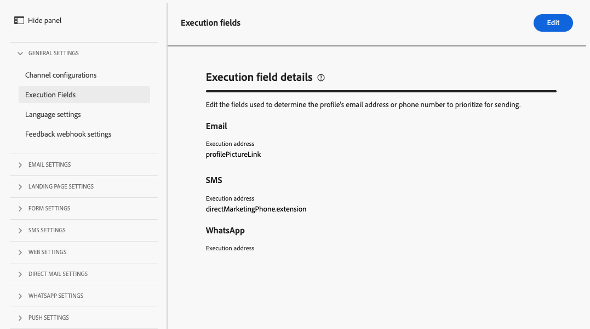

# Aan de slag met e-mailconfiguratie {#get-starte-email-config}

E-mails verzenden via reizen en campagnes in [!DNL Journey Optimizer], moet u door een aantal configuratiestappen gaan.

1. Om optimale leverbaarheid te verzekeren en uw reputatie te beschermen, begin door aan Adobe subdomeinen te delegeren u gaat gebruiken om uw e-mails met te verzenden [!DNL Journey Optimizer]. Deze subdomeinen bepalen elementen zoals de webpagina&#39;s die moeten worden bijgehouden en de URL&#39;s van de spiegelpagina. [Meer informatie](../configuration/about-subdomain-delegation.md)

   

1. Verbeter uw e-mailleverbaarheid en reputatie door IP adressen te groeperen provisioned met uw instantie. [Meer informatie](../configuration/ip-pools.md)

   

1. Kanaaloppervlakken maken en de optie **[!UICONTROL Email]** kanaal. [Meer informatie](../configuration/channel-surfaces.md)

   

1. In elke oppervlakte van het e-mailkanaal, vorm alle technische parameters die worden vereist om e-mail te leveren. [Meer informatie](email-settings.md)

   * Hier selecteert u het subdomein dat u wilt gebruiken om de e-mails en de IP-pools te verzenden die u aan het oppervlak wilt koppelen. [Meer informatie](email-settings.md#subdomains-and-ip-pools)

   

   * De **[!UICONTROL Sender email]** en **[!UICONTROL Error email]** adressen moeten het huidige geselecteerde gedelegeerde subdomein gebruiken. [Meer informatie](email-settings.md#email-header)

   

1. Bepaal welk e-mailadres u als prioriteit voor uw ontvangers wilt gebruiken wanneer in Adobe Experience Platform verschillende adressen beschikbaar zijn. [Meer informatie](../configuration/primary-email-addresses.md)

   

1. Het aantal dagen beheren waarin opnieuw pogingen worden uitgevoerd voordat e-mailadressen naar de suppressielijst worden verzonden. [Meer informatie](../configuration/manage-suppression-list.md)

   
