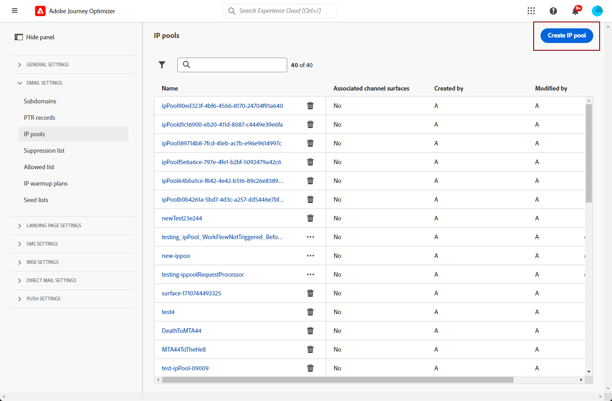

# Aan de slag met e-mailconfiguratie {#get-starte-email-config}

Als u e-mailberichten wilt verzenden via reizen en campagnes in [!DNL Journey Optimizer] , moet u een aantal configuratiestappen doorlopen.

1. Om optimale prestaties te garanderen en uw reputatie te beschermen, begint u met het delegeren naar Adobe van de subdomeinen die u gaat gebruiken om uw e-mails met [!DNL Journey Optimizer] te verzenden. Deze subdomeinen bepalen elementen zoals de webpagina&#39;s die moeten worden bijgehouden en de URL&#39;s van de spiegelpagina. [Meer informatie](../configuration/about-subdomain-delegation.md)

   

1. Verbeter uw e-mailleverbaarheid en reputatie door IP adressen te groeperen provisioned met uw instantie. [Meer informatie](../configuration/ip-pools.md)

   

1. Maak kanaalconfiguraties en selecteer het kanaal **[!UICONTROL Email]** . [Meer informatie](../configuration/channel-surfaces.md)

   

1. In elke configuratie van het e-mailkanaal, vorm alle technische parameters die worden vereist om e-mail te leveren. [Meer informatie](email-settings.md)

   * Hier selecteert u het subdomein dat u wilt gebruiken om de e-mails en de IP-pools te verzenden die u aan de configuratie wilt koppelen. [Meer informatie](email-settings.md#subdomains-and-ip-pools)

   

   * De adressen **[!UICONTROL Sender email]** en **[!UICONTROL Error email]** moeten het geselecteerde gedelegeerde subdomein gebruiken. [Meer informatie](email-settings.md#email-header)

   

1. Bepaal welk e-mailadres u als prioriteit voor uw ontvangers wilt gebruiken wanneer in Adobe Experience Platform verschillende adressen beschikbaar zijn. [Meer informatie](../configuration/primary-email-addresses.md)

   

1. Het aantal dagen beheren waarin opnieuw pogingen worden uitgevoerd voordat e-mailadressen naar de suppressielijst worden verzonden. [Meer informatie](../configuration/manage-suppression-list.md)

   
