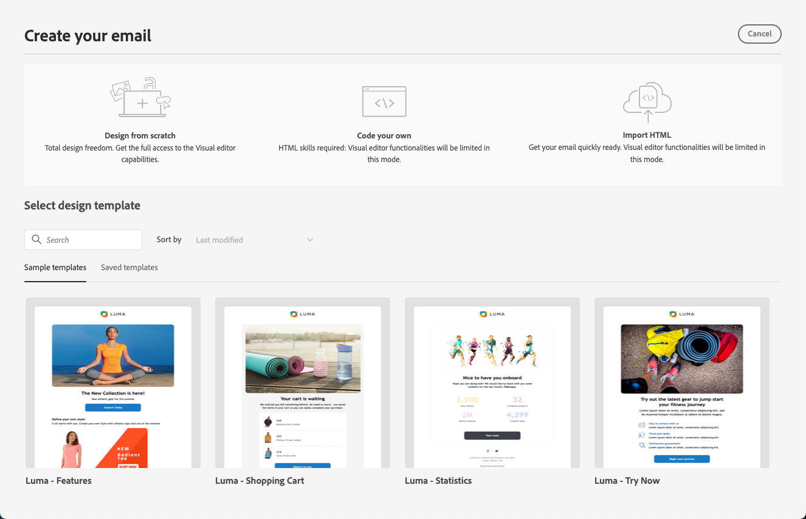
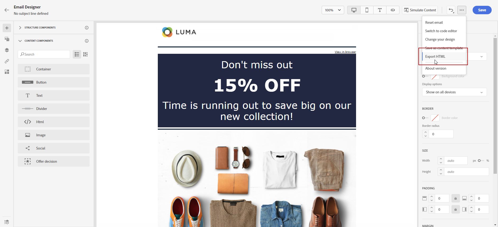

# Aan de slag met e-mailontwerp {#get-started-content-design}

U kunt bestaande inhoud importeren in [!DNL Journey Optimizer] of de mogelijkheden voor inhoudsontwerp benutten:

* Het gebruik [!DNL Journey Optimizer] **e-mail ontwerpend mogelijkheden** om ontvankelijke e-mails te ontwerpen of in te voeren. [Meer informatie](content-from-scratch.md)

* De Hoofdzaak van de Middelen van de Manager van de Ervaring van de hefboomwerking **om uw e-mail te verrijken, uw eigen activa gegevensbestand te bouwen en te beheren.** [Meer informatie](../integrations/assets.md)

* Vind **foto&#39;s van Adobe Stock** om uw inhoud te bouwen en uw e-mailontwerp te verbeteren. [Meer informatie](../integrations/stock.md)

* Verbeter de ervaring van klanten door gepersonaliseerde en dynamische berichten te creëren die op hun profielattributen worden gebaseerd. Leer meer over [ verpersoonlijking ](../personalization/personalize.md) en [ dynamische inhoud ](../personalization/get-started-dynamic-content.md).

➡️ [Ontdek deze functie in video](#video)

## Aanbevolen werkwijzen voor e-mailontwerp {#best-practices}

Bij het verzenden van e-mails is het belangrijk om te bedenken dat ontvangers de berichten kunnen doorsturen, wat soms problemen kan veroorzaken met de weergave van de e-mail. Dit geldt met name wanneer u CSS-klassen gebruikt die mogelijk niet worden ondersteund door de e-mailprovider die wordt gebruikt voor het doorsturen, bijvoorbeeld wanneer u de CSS-klasse &#39;is-desktop-hidden&#39; gebruikt om een afbeelding op mobiele apparaten te verbergen.

Om deze weergaveproblemen tot een minimum te beperken, raden we u aan de structuur van uw e-mailontwerp zo eenvoudig mogelijk te houden. Probeer één ontwerp te gebruiken dat goed werkt voor zowel mobiele als desktopapparaten en gebruik geen complexe CSS-klassen of andere ontwerpelementen die mogelijk niet volledig door alle e-mailclients worden ondersteund. Door deze beste praktijken te volgen, kunt u helpen ervoor zorgen dat uw e-mails constant correct worden teruggegeven, ongeacht hoe zij door ontvangers worden bekeken of door:sturen.

Raadpleeg de onderstaande tabel voor tips en trucs voor het ontwerpen van e-mails:

| Aanbevolen | Gebruik met zorg | Niet aanbevolen |
|-|-|-|
| <ul><li><b> Statische, op lijst-gebaseerde lay-outs </b> voor structuur</li> <li><b> de lijsten van HTML en genestelde lijsten </b> voor lay-outconsistentie</li> <li><b> Breedten van het Malplaatje </b> tussen 600px en 800px </li> <li><b> Eenvoudig, gealigneerde CSS </b> voor het stileren </li> <li><b> Web-veilige doopvonten </b> voor universele verenigbaarheid</li> | <ul><li><b> Achtergrondbeelden </b> kunnen niet op bepaalde e-mailplatforms verschijnen.</li><li><b> de doopvonten van het Web van de Douane </b> gebrek universele steun.</li><li><b> brede lay-outs </b> kunnen slecht op kleinere schermen tonen.</li><li><b> de kaarten van het Beeld </b> bieden beperkte functionaliteit aan.</li><li><b> ingebedde CSS </b> wordt soms verwijderd tijdens e-maillevering.</li> | <ul><li><b> JavaScript </b> wordt over het algemeen niet gesteund in e-mailmilieu&#39;s.</li> <li> <b>`<iframe>`</b> -tags worden op de meeste platforms geblokkeerd. </li> <li><b> Flits </b> is verouderd en niet meer gesteund.</li> <li><b> Ingesloten audio </b> ontbreekt vaak om te spelen.</li> <li><b> Ingesloten video </b> is onverenigbaar met vele e-mailplatforms.</li> <li> <b> Forms </b> werkt niet binnen e-mails.</li> <li> `
` -lagen kunnen leiden tot renderingproblemen.</li> |

>[!NOTE]
>
>De [ Europese toegankelijkheidshandeling ](https://eur-lex.europa.eu/legal-content/EN/TXT/?uri=CELEX%3A32019L0882){target="_blank"} verklaart dat alle digitale mededelingen toegankelijk zouden moeten zijn. Naast de e-mailontwerpbeste praktijken die in deze sectie worden vermeld, zorg ervoor u ook de richtlijnen volgt die op [ worden vermeld deze pagina ](accessible-content.md) specifiek voor de bouw van toegankelijke inhoud met E-mail Designer.

## Belangrijke stappen om e-mailinhoud te maken {#key-steps}

Zodra u [ een e-mail ](create-email.md) aan een reis of een campagne hebt toegevoegd, kunt u beginnen uw e-mailinhoud te creëren.

1. Ga in het scherm **[!UICONTROL Edit content]** van het scherm met reis- of campagneconfiguratie naar de E-mail-Designer. [Meer informatie](create-email.md#define-email-content)

   

1. Kies op de homepage van Designer via e-mail hoe u uw e-mail wilt ontwerpen uit de volgende opties:

   * **Ontwerp uw e-mail van kras** door de E-mailDesigner interface en hefboomwerkings beelden van [ Adobe Experience Manager Assets ](../integrations/assets.md). Leer hoe te om uw e-mailinhoud in [ te ontwerpen deze sectie ](content-from-scratch.md).

   * **Code of deeg ruwe HTML** direct in E-mailDesigner. Leer hoe te om uw eigen inhoud in [ te coderen deze sectie ](code-content.md).

     >[!NOTE]
     >
     >In een campagne kunt u ook de knop **[!UICONTROL Code Editor]** in het **[!UICONTROL Edit content]** -scherm selecteren. [Meer informatie](create-email.md#define-email-content)

   * **voer bestaande inhoud van HTML** van een dossier of een .zip omslag in. Leer hoe te om een e-mailinhoud in [ in deze sectie ](existing-content.md) in te voeren.
<!-- DOCAC-13676
    * **Convert image designs to HTML templates** using the AI-powered image to HTML converter. Learn how to transform static images into editable email templates in [this section](image-to-html.md).-->

    * ** Selecteer een bestaande inhoud** uit een lijst met ingebouwde of aangepaste sjablonen. Leer hoe u met e-mailsjablonen werkt in [dit gedeelte](../email/use-email-templates.md).
    
    

1. Zodra uw e-mailinhoud is gedefinieerd en gepersonaliseerd, kunt u uw inhoud exporteren voor validatie of later gebruik. Klik op **[!UICONTROL Export HTML]** om op uw computer een ZIP-bestand op te slaan dat uw HTML en elementen bevat.

   

## Hoe kan ik-video&#39;s {#video}

Leer hoe u e-mailinhoud maakt met de berichteneditor.

>[!VIDEO](https://video.tv.adobe.com/v/334150?quality=12)

Leer hoe u contentexperimenten configureert voor een A/B-test en e-mailinhoud verkent, wat de beste manier is om uw zakelijke doelstellingen te bepalen.

>[!VIDEO](https://video.tv.adobe.com/v/3419893)
