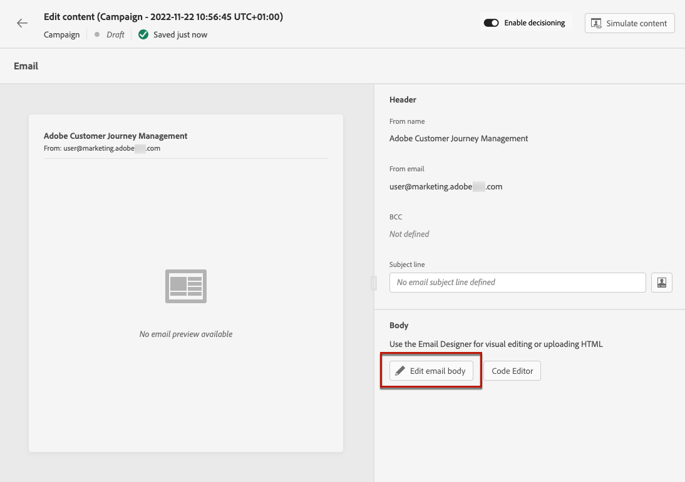

# Aan de slag met e-mailontwerp {#get-started-content-design}

U kunt bestaande inhoud importeren in [!DNL Journey Optimizer] of mogelijkheden voor inhoudsontwerp benutten:

* Gebruiken [!DNL Journey Optimizer] **e-mailontwerpmogelijkheden** om responsieve e-mails te ontwerpen of te importeren. [Meer informatie](content-from-scratch.md)

* Hefboomwerking **Adobe Experience Manager Assets Essentials** om uw e-mails te verrijken, maakt en beheert u uw eigen database met middelen. [Meer informatie](assets-essentials.md)

* Zoeken **Adobe Stock-foto&#39;s** om uw inhoud samen te stellen en uw e-mailontwerp te verbeteren. [Meer informatie](stock.md)

* Verbeter de ervaring van klanten door gepersonaliseerde en dynamische berichten te creëren die op hun profielattributen worden gebaseerd. Meer informatie over [personalisatie](../personalization/personalize.md) en [dynamische inhoud](../personalization/get-started-dynamic-content.md).

➡️ [Ontdek deze functie in video](#video)

Zodra u [e-mail toevoegen](create-email.md) voor een reis of een campagne, kunt u beginnen uw e-mailinhoud te creëren.

1. Van het reis of scherm van de campagneconfiguratie, ga door **[!UICONTROL Edit content]** scherm voor toegang tot de e-mailontwerper. [Meer informatie](create-email.md#define-email-content)

   

1. Kies op de introductiepagina van E-mail Designer hoe u uw e-mail wilt ontwerpen uit de volgende opties:

   * **Ontwerp uw e-mail helemaal zelf** via de interface van de e-mailontwerper en met behulp van afbeeldingen van [Adobe Experience Manager Assets Essentials](assets-essentials.md). Leer hoe u uw e-mailinhoud ontwerpt in [deze sectie](content-from-scratch.md).

   * **Code of paste raw HTML** rechtstreeks in de e-mailontwerper. Leer hoe u uw eigen inhoud codeert in [deze sectie](code-content.md).

      >[!NOTE]
      >
      >In een campagne kunt u ook de opdracht **[!UICONTROL Code Editor]** van de knop **[!UICONTROL Edit content]** scherm. [Meer informatie](create-email.md#define-email-content)

   * **Bestaande HTML-inhoud importeren** uit een bestand of een ZIP-map. Leer hoe u e-mailinhoud importeert in [deze sectie](existing-content.md).

   * **Bestaande inhoud selecteren** uit een lijst met ingebouwde of aangepaste sjablonen. Leer hoe u met e-mailsjablonen werkt [deze sectie](email-templates.md).

   

## Hoe kan ik-video {#video}

Leer hoe u e-mailinhoud maakt met de berichteneditor.

>[!VIDEO](https://video.tv.adobe.com/v/334150?quality=12)