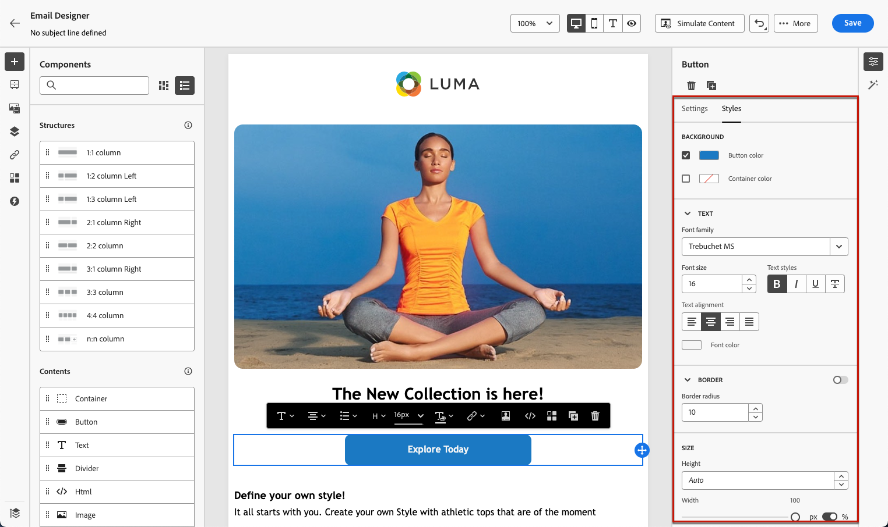

# Aan de slag met e-mailstijl {#get-started-email-style}

Nadat u uw e-mailinhoud hebt gemaakt in [!DNL Journey Optimizer] , kunt u een aantal opmaakparameters en -kenmerken aanpassen in het deelvenster Designer e-mail **[!UICONTROL Styles]** .

U kunt de wijzigingen toepassen op de hoofdtekst van de e-mail, op een structuurcomponent of op een inhoudscomponent.

Volg de onderstaande koppelingen om te zien hoe u bepaalde stijlinstellingen in uw e-mail kunt aanpassen.

* Leer hoe te [ uw e-mailachtergrond ](backgrounds.md) personaliseren
* Leer hoe te [ verticale groepering en het opvullen ](alignment-and-padding.md) beheren
* Leer hoe te [ inline het stileren attributen ](inline-styling.md) aanpassen
* Leer hoe te [ douane CSS aan uw e-mailinhoud ](custom-css.md) toevoegen
* Leer hoe te om [ donkere wijzeinhoud ](dark-mode.md) te beheren

>[!NOTE]
>
>De [ Europese toegankelijkheidshandeling ](https://eur-lex.europa.eu/legal-content/EN/TXT/?uri=CELEX%3A32019L0882){target="_blank"} verklaart dat alle digitale mededelingen toegankelijk zouden moeten zijn. Zorg ervoor u de specifieke het stileren richtlijnen volgt die op [ worden vermeld deze pagina ](../email/accessible-content.md) wanneer het ontwerpen van inhoud in [!DNL Journey Optimizer], zoals het aanpassen van kleuren, etiketten en pictogrammen om duidelijkheid te verzekeren, en het optimaliseren van uw ontwerp voor mobiele en ontvankelijke lay-outs.