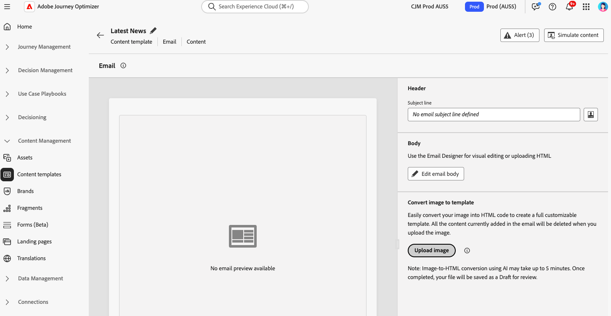

# Afbeeldingen met de afbeelding omzetten in HTML-sjablonen in HTML-converter {#image-to-html}

## Overzicht {#overview}

Het beeld aan de omzetter van HTML is een innovatieve AI-Vervaardigde eigenschap beschikbaar in het **menu van de Malplaatjes van de Inhoud** die dramatisch e-mailverwezenlijking door statische beeldontwerpen in volledig klantgerichte, modulaire e-mailinhoudsmalplaatjes van HTML om te zetten versnelt. Met dit codeprogramma kunnen marketers visuele ontwerpen van grafische ontwerpers of ontwerpgereedschappen omzetten in responsieve, bewerkbare e-mailsjablonen die kunnen worden opgeslagen in de bibliotheek met inhoudssjablonen en vervolgens opnieuw kunnen worden gebruikt voor meerdere reizen en campagnes—zonder dat hiervoor technische expertise vereist is.

>[!AVAILABILITY]
>
>Deze mogelijkheid is beschikbaar in Beperkte Beschikbaarheid. Neem contact op met uw Adobe-vertegenwoordiger voor toegang.

Door gebruik te maken van generatieve AI-technologie, analyseert de image naar HTML converter de lay-out, typografie, kleuren en visuele elementen in uw afbeelding en genereert deze schone, modulaire HTML-code die de betrouwbaarheid van het ontwerp behoudt en tegelijk volledige bewerkbaarheid en compatibiliteit met de e-mail Designer garandeert. Dit elimineert het handmatige, tijdrovende proces van conversie van modellen naar HTML en vermindert de afhankelijkheid van ontwikkelingsbronnen.

**Zeer belangrijke voordelen:**

* **Ontwerp aan HTML in notulen**: AI-aangedreven, geen-code omzetting zet statische beelden in editable, modulaire malplaatjes in notulen om, dramatisch verminderend malplaatjeaanmaaktijd
* **machtigt niet-technische gebruikers**: Vermindert afhankelijkheid van ontwerp of ontwikkelingsteams — de marketers kunnen malplaatjes met minimale technische kennis produceren en aanpassen
* **Vereenvoudigde platformmigratie**: Zet externe malplaatjes of ontwerpen van andere platforms in AJO-klaar HTML moeiteloos om
* **bouwt een herbruikbare malplaatjebibliotheek**: Creeer een scalable, brand-verenigbare malplaatjebibliotheek die over veelvoudige reizen en campagnes kan worden gebruikt
* **Getrouwheid van het Ontwerp**: handhaaf visuele consistentie met uw origineel ontwerp terwijl het creëren van volledig editable inhoud
* **E-mailverenigbaarheid**: produceer HTML die foutloos met de E-mailDesigner en over e-mailcliënten werkt

## Vaak voorkomende gebruiksscenario&#39;s {#use-cases}

De afbeelding naar HTML-converter is ideaal voor:

* **de migratie van het Platform**: Het migreren van een ander e-mailmarketing platform? Zet uw bestaande e-mailontwerpen om in HTML-sjablonen die klaar zijn voor AJO zonder dat u ze helemaal opnieuw hoeft op te bouwen
* **Mockup van het Ontwerp omzetting**: Transformeer ontwerpmodellen van hulpmiddelen zoals Photoshop, Figma, of andere ontwerpsoftware in functionele e-mailmalplaatjes
* **Snelle malplaatjeverwezenlijking**: Produceer snel e-mailmalplaatjes voor tijd-gevoelige campagnes zonder op ontwikkelaarsmiddelen te wachten
* **de bibliotheken van het malplaatje van de Bouw**: Creeer een uitvoerige bibliotheek van brand-verenigbare malplaatjes die de niet technische teamleden kunnen aanpassen en opstellen
* **Verminderend technische gebiedsdelen**: Laat marketers toe om op e-mailmalplaatjes onafhankelijk tot stand te brengen en te herhalen, snellere campagneuitvoering

## Vereisten {#prerequisites}

Voordat u de afbeelding gaat omzetten in HTML, moet u controleren of u beschikt over:

* Toegang tot Adobe Journey Optimizer met de e-mail Designer
* Een afbeeldingsbestand in JPEG- of PNG-indeling dat uw e-mailontwerp bevat
* Beperkte toegang tot de image tot de HTML-converterfunctie (neem contact op met uw Adobe-vertegenwoordiger)

>[!NOTE]
>
>U bereikt de beste resultaten wanneer u afbeeldingen van hoge kwaliteit gebruikt met heldere visuele elementen en leesbare tekst. De afbeeldingen moeten idealiter tussen 600 en 800 pixels breed zijn, zodat ze overeenkomen met de standaard e-mailafmetingen.

## Een afbeelding converteren naar een HTML-sjabloon {#convert-image}

Voer de volgende stappen uit om een afbeeldingsontwerp om te zetten in een volledig aanpasbare HTML-e-mailsjabloon:

1. U opent de lijst Inhoudssjablonen door in het linkermenu **[!UICONTROL Content Management]** > **[!UICONTROL Content Templates]** te selecteren.

1. Klik op **[!UICONTROL Create template]**.

1. Vul de sjabloondetails in en selecteer **[!UICONTROL Email]** als het kanaal en klik op **[!UICONTROL Create]** .

1. Klik in de rechtersectie in de sectie **[!UICONTROL Convert image to template]** op de knop **[!UICONTROL Upload image]** om het afbeeldingsbestand te selecteren.

   

   >[!CAUTION]
   >
   >Wanneer u een beeld voor omzetting uploadt, **zal alle inhoud die momenteel in e-mail wordt toegevoegd** met het geproduceerde malplaatje worden geschrapt en worden vervangen. Als u bestaande inhoud in uw e-mail hebt, moet u deze opslaan voordat u verdergaat met het omzetten van de afbeelding.

1. Kies de afbeelding en klik op **[!UICONTROL Open]** om het omzettingsproces op basis van AI te starten.

   >[!NOTE]
   >
   >Het generatieproces kan maximaal 5 minuten in beslag nemen, afhankelijk van de complexiteit en de grootte van het afbeeldingsontwerp. De AI-verwerking vindt plaats op de achtergrond, zodat u van dit scherm af kunt navigeren en andere taken kunt uitvoeren terwijl de conversie bezig is. U hoeft het scherm niet open te houden.

1. Zodra de conversie is voltooid, wordt de inhoudssjabloon automatisch opgeslagen als concept. U kunt de gegenereerde HTML-sjabloon vervolgens bekijken en bewerken in het canvas E-mail Designer.

   

1. De geconverteerde sjabloon wordt geopend in de E-mail-Designer met volledige bewerkingsmogelijkheden. U kunt nu het volgende:

   * Tekstinhoud bewerken en personalisatie toepassen
   * Afbeeldingen wijzigen en koppelingen toevoegen
   * Kleuren, lettertypen en stijlen aanpassen
   * Inhoud toevoegen, verwijderen of opnieuw rangschikken
   * Gebruik alle Designer-functies voor e-mail net als alle andere sjablonen

   

1. Breng de gewenste wijzigingen aan om de sjabloon te verfijnen en aan te passen aan de richtlijnen van uw merk.

1. Als u tevreden bent met de sjabloon, klikt u op **[!UICONTROL Save]** om de inhoudssjabloon op te slaan.

1. Uw sjabloon is nu beschikbaar in de bibliotheek met inhoudssjablonen en kan worden gebruikt voor het maken van e-mails tijdens reizen of campagnes. [ leer hoe te om inhoudsmalplaatjes ](use-email-templates.md) te gebruiken

## Je geconverteerde template gebruiken in e-mails {#use-template}

Nadat u de inhoudssjabloon hebt gemaakt en opgeslagen, kunt u deze gebruiken bij het ontwerpen van e-mails tijdens reizen of campagnes:

Als u een e-mail maakt tijdens een rit of campagne, opent u de e-mailtoepassing via het scherm **[!UICONTROL Edit content]** .

Leer meer over [ het werken met e-mailmalplaatjes ](use-email-templates.md) en [ het creëren van inhoudsmalplaatjes ](../content-management/content-templates.md).

## Best practices {#best-practices}

Houd u aan de volgende aanbevelingen om optimale resultaten te bereiken wanneer u de afbeelding naar HTML-converter gebruikt:

**alvorens u** begint

* **sparen bestaande inhoud**: Het omzetten van een beeld in HTML zal al bestaande inhoud in uw e-mail vervangen. Sla uw huidige werk altijd op voordat u deze functie gebruikt.
* **Plan uw werkschema**: Gebruik het beeld aan de omzetter van HTML aan het begin van uw e-mailverwezenlijking proces, of zorg ervoor u klaar bent om al huidige inhoud te vervangen.

**de voorbereiding van het Beeld**

* **Resolutie**: De beelden van het gebruik high-resolution (minstens 1200px breed) voor betere tekstherkenning en elementendetectie
* **Duidelijkheid**: Zorg ervoor de tekst duidelijk leesbaar is en de visuele elementen duidelijk zijn bepaald
* **Breedte**: Ontwerp beelden bij standaard e-mailbreedten (600-800px) om typische vereisten van de e-mailcliënt aan te passen
* **formaat van het Dossier**: Het formaat van JPEG of van PNG van het gebruik - vermijd samengeperste of laag - kwaliteit beelden
* **Volledig ontwerp**: Omvat het volledige e-mailontwerp in één enkel beeld, van kopbal aan footer

**overwegingen van het Ontwerp**

* **Eenvoudige lay-outs**: De eenvoudigere, goed gestructureerde lay-outs zetten nauwkeuriger dan hoogst complexe ontwerpen om
* **Standaardelementen**: De gemeenschappelijke patronen van het e-mailontwerp van het gebruik (kopbal, lichaamssecties, CTAs, footer)
* **leesbaarheid van de Tekst**: Zorg voldoende contrast tussen tekst en achtergronden
* **Web-veilige doopvonten**: De ontwerpen die gemeenschappelijke web-veilige doopvonten gebruiken zullen betere waarheidsgetrouwheid hebben
* **vermijd overlappende elementen**: Houd ontwerpelementen duidelijk gescheiden voor betere structuurerkenning

**na omzetting**

* **herzie uw ontwerp**: Zodra de omzetting volledig is, wordt uw malplaatje automatisch bewaard als ontwerp. Neem de tijd om de gegenereerde HTML zorgvuldig te controleren op nauwkeurigheid
* **Test grondig**: Test e-mail over verschillende e-mailcliënten en apparaten
* **verfijnen manueel**: Breng aanpassingen aan zoals nodig gebruikend de e-mail Designer volledige het uitgeven mogelijkheden
* **Merk groepering**: Verifieer kleuren, doopvonten, en het stileren passen uw merkrichtlijnen aan
* **Personalization**: Voeg dynamische inhoud en personalisatietokens toe zoals vereist
* **Toegankelijkheid**: Herzie en verbeter toegankelijkheidseigenschappen indien nodig

## Beperkingen en overwegingen {#limitations}

Houd rekening met de volgende beperkingen bij het gebruik van de converter Afbeelding naar HTML:

* **AI interpretatie**: AI produceert HTML die op visuele interpretatie van uw beeld wordt gebaseerd. Complexe of ongebruikelijke ontwerpen kunnen na conversie handmatig worden aangepast.

* **de nauwkeurigheid van de Tekst**: Terwijl AI probeert om tekst nauwkeurig te erkennen en te reproduceren, verifieer altijd tekstinhoud en maak correcties zoals nodig.

* **Dynamische inhoud**: Het omzettingsproces leidt tot statische HTML die op uw beeld wordt gebaseerd. U moet na de conversie handmatig personalisatie, dynamische inhoud en tracering toevoegen.

* **Complexe lay-outs**: De hoogst complexe ontwerpen met ingewikkelde het in lagen plaatsen, ongebruikelijke vormen, of niet-standaardelementen kunnen niet perfect omzetten. Eenvoudiger ontwerpen leveren over het algemeen betere resultaten op.

* **Verwerkingstijd**: Het omzettingsproces kan tot 5 minuten afhankelijk van de ingewikkeldheid en de grootte van uw beeld vergen. De AI-verwerking vindt plaats op de achtergrond, zodat u aan andere taken kunt werken zonder het scherm open te houden. De sjabloon wordt automatisch als een concept opgeslagen zodra de conversie is voltooid.

* **Beperkte Beschikbaarheid**: Als Beperkte eigenschap van de Beschikbaarheid, wordt het beeld aan de convertor van HTML onophoudelijk verbeterd. De functionaliteit en nauwkeurigheid kunnen variëren en uw feedback kan de functie verbeteren.

>[!NOTE]
>
>De afbeelding naar HTML-converter is ontworpen om een sterk startpunt te bieden voor het maken van e-mail. De gegenereerde HTML moet worden gereviseerd en verfijnd met de e-mail Designer om te controleren of deze aan uw exacte vereisten voldoet.

## Veelgestelde vragen {#faq}

+++Wat gebeurt er met mijn bestaande e-mailinhoud als ik de afbeelding gebruik voor HTML-converter?

Alle bestaande inhoud in uw e-mail wordt verwijderd en vervangen door de nieuw gegenereerde sjabloon wanneer u een afbeelding uploadt voor conversie. Sla belangrijke inhoud op voordat u deze functie gebruikt. U kunt de afbeelding het beste naar HTML converter gebruiken aan het begin van het e-mailontwerpproces.

+++

+++Welke bestandsindelingen worden ondersteund?

De afbeelding naar HTML-converter ondersteunt de afbeeldingsindelingen JPEG (.jpg, .jpeg) en PNG (.png).

+++

+++Hoe lang duurt het conversieproces?

De conversie kan maximaal 5 minuten in beslag nemen, afhankelijk van de complexiteit en grootte van het afbeeldingsontwerp. De AI-verwerking vindt plaats op de achtergrond, zodat u kunt wegnavigeren en aan andere taken kunt werken. U hoeft het scherm niet open te houden. Zodra de conversie is voltooid, wordt uw bestand automatisch opgeslagen als een concept dat u kunt controleren en bewerken.

+++

+++Kan ik de gegenereerde sjabloon bewerken?

Ja! De gegenereerde HTML-sjabloon wordt geopend in de E-mail Designer met alle bewerkingsmogelijkheden. U kunt alle aspecten van de sjabloon wijzigen, zoals tekst, afbeeldingen, opmaak, indeling en structuur.

+++

+++Wat gebeurt er als de conversie niet precies overeenkomt met mijn ontwerp?

De AI doet zijn best om uw ontwerp nauwkeurig te interpreteren, maar wat handmatige verfijning kan nodig zijn. Gebruik de E-mail Designer om elementen aan te passen die moeten worden verfijnd.

+++

+++Kan ik deze functie gebruiken voor het landen van pagina&#39;s of andere inhoudstypen?

De afbeelding naar HTML-converter is momenteel specifiek ontworpen voor e-mailsjablonen. Voor andere inhoudstypen gebruikt u de standaardopties voor ontwerp en importeren die beschikbaar zijn in de E-mail Designer.

+++

+++Heb ik speciale toestemmingen nodig om deze eigenschap te gebruiken?

De afbeelding naar HTML-converter is beschikbaar in Beperkte beschikbaarheid. U hebt beperkte toegang tot de Beschikbaarheid nodig (neem contact op met uw Adobe-vertegenwoordiger voor toegang) en standaard e-mailrechten voor Designer om deze functie te kunnen gebruiken.

+++

+++Kan ik geconverteerde sjablonen opnieuw gebruiken voor meerdere campagnes?

Ja! Sjablonen die met de afbeelding zijn gemaakt, worden automatisch opgeslagen naar de inhoudssjabloonbibliotheek. U kunt ze openen en opnieuw gebruiken in elke e-mail tijdens uw reizen en campagnes. [Meer informatie](../content-management/content-templates.md)

+++

+++Kan ik dit gebruiken voor platformmigratie?

Ja! De afbeelding wordt omgezet naar HTML en is ideaal voor het migreren van andere marketingplatforms voor e-mail. Exporteer of screenshot gewoon uw bestaande e-mailontwerpen vanaf uw vorige platform en zet ze om in HTML-sjablonen die klaar zijn voor AJO zonder ze helemaal opnieuw op te bouwen.

+++

## Verwante onderwerpen {#related-topics}

* [Aan de slag met inhoudssjablonen](../content-management/content-templates.md)
* [Inhoudssjablonen maken](../content-management/create-content-templates.md)
* [E-mailsjablonen gebruiken](use-email-templates.md)
* [Aan de slag met e-mailontwerp](get-started-email-design.md)
* [Uw e-mailinhoud importeren](existing-content.md)
* [Inhoud helemaal opnieuw ontwerpen](content-from-scratch.md)

