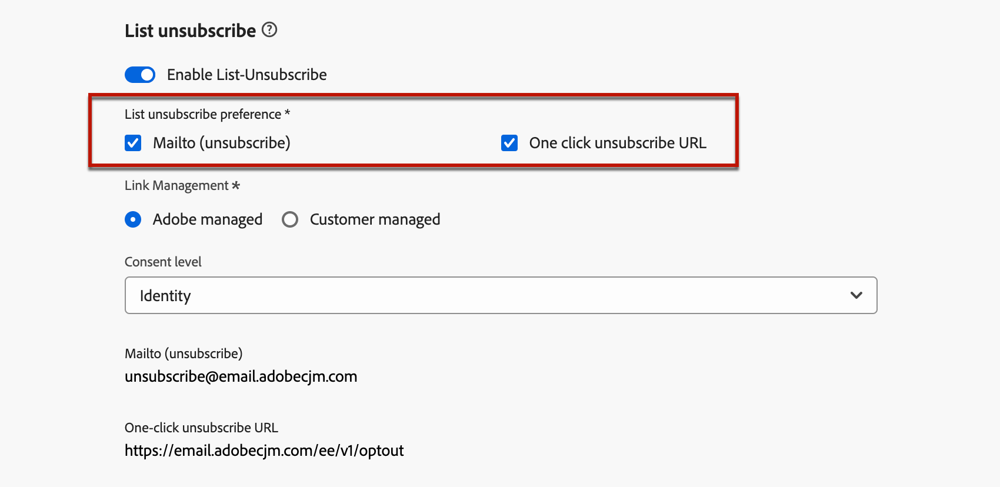

# Abonnement opzeggen{#list-unsubscribe}

<!--Do not modify - Legal Review Done -->

In [!DNL Adobe Journey Optimizer], wanneer het vormen van een nieuwe configuratie van het e-mailkanaal, bij [&#x200B; het selecteren van subdomain &#x200B;](email-settings.md#ip-pools) van de lijst, toont de **[!UICONTROL Enable List-Unsubscribe]** optie. Deze optie is standaard ingeschakeld.


De één-klik lijst unsubscribe URL is een unsubscribe verbinding of knoop die naast de informatie van de e-mailafzender wordt getoond, en laat ontvangers onmiddellijk uit uw het posten lijsten met één enkele klik kiezen.

Met de URL voor één klik voor annuleren wordt bijvoorbeeld een koppeling weergegeven zoals hieronder in Gmail:


>[!IMPORTANT]
>
>Als u één klik wilt weergeven, klikt u op de URL voor afmelden in de e-mailheader, moet de e-mailclient van de ontvangers deze functie ondersteunen.

Afhankelijk van de e-mailclient en de instellingen voor het opheffen van abonnementen op de e-mailconfiguratie, kan het klikken op de koppeling voor opzeggen in de e-mailheader de volgende gevolgen hebben:

* Wanneer de **Brievenbus (unsubscribe)** eigenschap wordt toegelaten, wordt het unsubscribe verzoek verzonden naar het gebrek unsubscribe adres dat op subdomain wordt gebaseerd u vormde.
* Wanneer **één-klik unsubscribe URL** eigenschap wordt toegelaten - of als u een unsubscription URL in uw e-maillichaamsinhoud opnam -, wordt de ontvanger direct opted-out, of op het kanaalniveau of op het niveau van identiteitskaart (afhankelijk van hoe de toestemming opstelling is), wanneer de ontvanger op één-klik unsubscribe URL (gebaseerd op subdomain u) klikt.

>[!NOTE]
>
>Leer hoe te om de unsubscription montages in [&#x200B; te beheren deze sectie &#x200B;](#enable-list-unsubscribe) hieronder.

In beide gevallen, wanneer een ontvanger de opt-out verbinding klikt, wordt hun afmeldingsverzoek dienovereenkomstig verwerkt. Het overeenkomstige profiel wordt onmiddellijk verkozen uit en deze keus wordt bijgewerkt in [&#x200B; Experience Platform &#x200B;](https://experienceleague.adobe.com/docs/experience-platform/profile/ui/user-guide.html){target="_blank"}. Leer meer over toestemmingsverwerking in de [&#x200B; documentatie van Experience Platform &#x200B;](https://experienceleague.adobe.com/docs/experience-platform/landing/governance-privacy-security/consent/adobe/overview.html){target="_blank"}.

>[!NOTE]
>
>Soms kan het langer duren om afmeldingsgebeurtenissen weer te geven op profielniveau als gevolg van de verwerking van downstreamgegevens. Laat het systeem enige tijd bijwerken.

## Abonnement op lijst opzeggen inschakelen {#enable-list-unsubscribe}

>[!CONTEXTUALHELP]
>id="ajo_admin_preset_unsubscribe"
>title="Voeg een afmeldings-URL toe aan uw e-mails"
>abstract="Schakel deze optie in om automatisch een afmelde URL aan de koptekst van de e-mail toe te voegen. U kunt een URL voor afmelden ook instellen in een bericht door een koppeling voor het uitschakelen van het abonnement in te voegen in de e-mailinhoud met één klik."
>additional-url="https://experienceleague.adobe.com/en/docs/journey-optimizer/using/channels/email/email-opt-out#one-click-opt-out" text="Een-klik-optie instellen om te weigeren in de e-mailinhoud"

Als de optie **[!UICONTROL Enable List-Unsubscribe]** is ingeschakeld en de e-mailclient van de ontvangers dit ondersteunt, bevat de e-mailheader standaard zowel een mailto als een URL waarmee ontvangers zich van uw mailinglijst kunnen afmelden.

>[!NOTE]
>
>Als u deze optie uitschakelt, wordt er geen één-klik-URL voor annuleren weergegeven in de e-mailkoptekst.

De header List unsubscribe biedt twee opties, die standaard zijn ingeschakeld, tenzij u een of beide opties uitschakelt:

{width="80%"}

* A **[!UICONTROL Mailto (unsubscribe)]** adres, dat het bestemmingsadres is waar unsubscribe verzoeken aan voor auto-verwerking worden verpletterd. In [!DNL Journey Optimizer], is het unsubscribe e-mailadres het standaard **[!UICONTROL Mailto (unsubscribe)]** adres dat in de kanaalconfiguratie wordt getoond, die op [&#x200B; wordt gebaseerd geselecteerde subdomain &#x200B;](email-settings.md#subdomains). <!--With this method, clicking the Unsubscribe link sends a pre-filled email to the unsubscribe address specified in the email header.-->

* **[!UICONTROL One-click unsubscribe URL]**, die door gebrek één-klik opt-out URL produceerde Lijst unsubscribe kopbal is, die op [&#x200B; wordt gebaseerd geselecteerde subdomain &#x200B;](email-settings.md#subdomains). <!--With this method, clicking the Unsubscribe link directly unsubscribes the user, requiring only a single action to unsubscribe.-->

U kunt **[!UICONTROL Consent level]** van de overeenkomstige drop-down lijst selecteren. Dit kan specifiek zijn voor het kanaal of de profielidentiteit. Op basis van deze instelling wordt de toestemming bijgewerkt in [!DNL Adobe Journey Optimizer] wanneer een gebruiker zich afmeldt via de lijst en de URL voor afmelden in de koptekst van een e-mailbericht opzegt, op kanaalniveau of op ID-niveau.

## Guardrails en aanbevelingen {#list-unsubscribe-guardrails}

Met de éénklikfunctie voor het afmelden van een URL-abonnement kunnen uw ontvangers eenvoudig weigeren te communiceren. Nochtans, aangezien niet alle e-mailcliënten deze verbinding in de e-mailkopbal steunen, adviseert Adobe u ook a [&#x200B; één-klik opt-out verbinding &#x200B;](email-opt-out.md#one-click-opt-out) of een [&#x200B; unsubscribe verbinding &#x200B;](email-opt-out.md#add-unsubscribe-link) in het lichaam van uw e-mail toe te voegen.

De functies **[!UICONTROL Mailto (unsubscribe)]** en **[!UICONTROL One-click unsubscribe URL]** zijn optioneel.

* Als u op de **[!UICONTROL Enable List-Unsubscribe]** optie in de [&#x200B; e-mailconfiguratiemontages &#x200B;](email-settings.md) van een knevel hebt voorzien, adviseren wij dat u beide methodes toelaat - **Brievenbus (unsubscribe)** en **Één-Klik Unsubscribe URL**. Niet alle e-mailclients ondersteunen de HTTP-methode. Met de lijst-unsubscribe eigenschap Mailto die voor u wordt verstrekt om een alternatief te selecteren, kan uw afzenderreputatie beter worden beschermd en al uw ontvangers kunnen toegang hebben om de unsubscribe functionaliteit te gebruiken.

* Als u niet de standaard gegenereerde één-klik wilt gebruiken unsubscribe URL, kunt u de eigenschap uncheck.

   * In het scenario waar de **[!UICONTROL Enable List-Unsubscribe]** optie wordt van een knevel voorzien en de **[!UICONTROL One-click Unsubscribe URL]** eigenschap is ongecontroleerd, als u a [&#x200B; toe:voegen één-klik opt-out verbinding &#x200B;](../email/email-opt-out.md#one-click-opt-out) aan een bericht dat gebruikend deze configuratie wordt gecreeerd, neemt de Lijst unsubscribe kopbal de één-klik opt-out verbinding op u in het lichaam van e-mail hebt opgenomen en gebruikt dat als één-klik unsubscribe URL waarde.

     

   * Als u geen opt-out-koppeling met één klik toevoegt aan de inhoud van het bericht en de standaardinstelling **[!UICONTROL One-click unsubscribe URL]** is uitgeschakeld in de instellingen voor kanaalconfiguratie, wordt er geen URL doorgegeven aan de e-mailkoptekst als onderdeel van de List unsubscribe header.

  >[!NOTE]
  >
  >Leer meer over het beheren van unsubscribe mogelijkheden binnen uw berichten in [&#x200B; deze sectie &#x200B;](../email/email-opt-out.md#unsubscribe-header).

In [!DNL Journey Optimizer], wordt de toestemming behandeld door het schema van de Experience Platform [&#x200B; Toestemming &#x200B;](https://experienceleague.adobe.com/docs/experience-platform/xdm/field-groups/profile/consents.html){target="_blank"}. Standaard is de waarde voor het veld voor toestemming leeg en wordt deze behandeld als toestemming voor het ontvangen van uw communicatie. U kunt deze standaardwaarde wijzigen terwijl het aan een van de mogelijke hier vermelde waarden [&#x200B; &#x200B;](https://experienceleague.adobe.com/docs/experience-platform/xdm/data-types/consents.html#choice-values){target="_blank"}, of gebruik [&#x200B; toestemmingsbeleid &#x200B;](../action/consent.md) om de standaardlogica met voeten te treden.

Momenteel voegt [!DNL Journey Optimizer] geen specifieke tag toe aan afmeldingsgebeurtenissen die worden geactiveerd door de functie voor afmelden van lijst. Als u List moet onderscheiden wanneer u klikt op een abonnement op een andere actie voor annuleren, moet u aangepaste tags extern implementeren of een externe bestemmingspagina gebruiken voor tracering.

## Abonnementsgegevens extern beheren {#custom-managed}

>[!CONTEXTUALHELP]
>id="ajo_email_config_unsubscribe_custom"
>title="Definiëren hoe afmeldingsgegevens worden beheerd"
>abstract="**beheerde Adobe**: De toestemmingsgegevens worden beheerd door u binnen het systeem van Adobe.<br>**beheerde Klant**: De toestemmingsgegevens worden beheerd door u in een extern systeem en geen synchronisatie van toestemmingsgegevens wordt bijgewerkt in het systeem van Adobe tenzij in werking gesteld door u."

>[!CONTEXTUALHELP]
>id="ajo_email_config_unsubscribe_custom_url"
>title="Voer uw eigen één-klik annuleren URL in"
>abstract="**Één-klik Unsubscribe URL** moet de POST verzoekmethode gebruiken."

Als u toestemming buiten Adobe beheert, selecteert u de optie **[!UICONTROL Customer managed]** om een aangepast e-mailadres voor opzeggen in te voeren en uw eigen URL voor opzeggen met één klik.

{width="80%"}

De **[!UICONTROL One-click Unsubscribe URL]** moet POST URL zijn.

>[!WARNING]
>
>Als u de optie **[!UICONTROL Customer managed]** gebruikt, slaat Adobe geen gegevens voor annulering of toestemming op. Met de optie **[!UICONTROL Customer managed]** kiezen organisaties voor het gebruik van een extern systeem en zijn ze verantwoordelijk voor het beheer van hun gegevens over machtigingen in een dergelijk extern systeem. Er is geen automatische synchronisatie van toestemmingsgegevens tussen het externe systeem en [!DNL Journey Optimizer]. Elke synchronisatie van toestemmingsgegevens, die afkomstig is van het externe systeem voor het bijwerken van gegevens over gebruikersmachtigingen in [!DNL Journey Optimizer], moet door de organisatie als gegevensoverdracht worden geïnitieerd om de toestemmingsgegevens terug te sturen naar [!DNL Journey Optimizer] .

### Aangepaste kenmerken toevoegen aan uw eindpunten {#custom-attributes}

Als de optie **[!UICONTROL Customer managed]** is geselecteerd en u aangepaste eindpunten invoert en deze gebruikt in een campagne of reis, voegt [!DNL Journey Optimizer] enkele specifieke parameters voor het standaardprofiel toe aan de gebeurtenis voor het bijwerken van de toestemming <!--sent to the custom endpoint --> wanneer de ontvangers op de koppeling voor het opzeggen klikken.

Om uw eindpunten <!-- (**[!UICONTROL Mailto (unsubscribe)]** and **[!UICONTROL One-click Unsubscribe URL]**)--> verder te personaliseren, kunt u douanekenmerken bepalen die ook aan de toestemmingsgebeurtenis zullen worden toegevoegd.

>[!AVAILABILITY]
>
>Voor de optie **[!UICONTROL Mailto (unsubscribe)]** is deze mogelijkheid beschikbaar in Beperkte beschikbaarheid. Neem contact op met uw Adobe-vertegenwoordiger voor toegang. In dit geval, moet u de nieuwe vraagparameters gebruiken die in **worden beschreven Brievenbus (unsubscribe) met douanekenmerken (Beperkte Beschikbaarheid)** hieronder sectie [&#x200B; &#x200B;](#configure-decrypt-api).

Gebruik de sectie **[!UICONTROL URL tracking parameters]** als u aangepaste kenmerken voor de eindpunten wilt definiëren. Alle URL volgende parameters u in de overeenkomstige sectie bepaalt zullen aan het eind van uw douaneeindpunten, naast standaardparameters worden toegevoegd. [&#x200B; Leer hoe te om het volgen van douane URL te plaatsen &#x200B;](url-tracking.md)

### De decoderings-API configureren {#configure-decrypt-api}

Wanneer uw ontvangers op een aangepaste unsubscribe-koppeling klikken, worden de parameters die aan de toestemmingsupdate-gebeurtenis zijn toegevoegd, op gecodeerde wijze naar het eindpunt verzonden. Aldus, moet het externe toestemmingssysteem specifieke API door [&#x200B; Adobe Developer &#x200B;](https://developer.adobe.com){target="_blank"} uitvoeren om de parameters te decrypteren die door Adobe worden verzonden.

De GET-aanroep om deze parameters op te halen is afhankelijk van de optie voor het opzeggen van het abonnement op de lijst die u gebruikt - **[!UICONTROL One-click unsubscribe URL]** of **[!UICONTROL Mailto (unsubscribe)]** .

<!--To configure the API to send back the information to [!DNL Adobe Journey Optimizer] when a recipient has unsubscribed using the List unsubscribe option with custom endpoints, follow the steps below.-->

+++ Eén klik op URL voor annuleren

Als u met de optie **[!UICONTROL One-click unsubscribe URL]** op de koppeling Abonnement opzeggen klikt, wordt de abonnement van de gebruiker direct opgezegd.

De GET-oproep ziet er als volgt uit:

Eindpunt: https://platform.adobe.io/journey/imp/consent/decrypt

Parameters query:

* **params**: bevat de gecodeerde lading
* **pid**: Gecodeerde profiel identiteitskaart

Deze twee parameters worden opgenomen in de gebeurtenis voor het bijwerken van de toestemming die naar de aangepaste eindpunten wordt verzonden.

Eisen voor koptekst:

* x-api-key
* x-gw-ims-org-id
* autorisatie (gebruikerstoken van uw technische account)

Hieronder vindt u de monsterparameters en de reactie op de toestemming:

| Query-parameter | Voorbeeld van lading |
|---------|----------|
| pid | <br> &quot;pid&quot; : &quot;5142733041546020095851529937068211571&quot;, <br> &quot;pns&quot; : &quot;CRMID&quot;,<br> 2&rbrace;&quot;e&quot;    : &quot;john@google.com&quot;, <br> &quot;ens&quot; : &quot;Email&quot;, <br> |
| param | <br> &quot;m&quot;: &quot;messageExecutionId&quot;, <br> &quot;ci&quot; : &quot;campagneId&quot;, <br> &quot;jv&quot;: &quot;tripVersionId&quot;, <br> &quot;ja&quot;: &quot;tripActionId&quot;, <br> &quot;s&quot;: &quot;sandboxId&quot;, <br> &quot;us&quot;: &quot;unsubscribeScope&quot;<br> |

Toestemmingsreactie:

```
{
    "profileNameSpace": " CRMID ",
    "profileId": "5142733041546020095851529937068211571",
    "emailAddress": "john@google.com",
    "emailNameSpace": "Email",
    "sandboxId": "sandboxId",
    "optOutLevel": "channel",
    "channelType": "email",
    "timestamp": "2024-11-26T14:25:09.316930Z"
    "utm": [
         {
            "utm_source": "AJO",
            "utm_medium": "Email"
        }
    ]
}
```

+++

+++ Mailto (afmelden)

Als u de optie **[!UICONTROL Mailto (unsubscribe)]** gebruikt en op de koppeling Abonnement opzeggen klikt, wordt een ingevuld e-mailbericht verzonden naar het opgegeven afmeldingsadres.

De GET-oproep ziet er als volgt uit.

Eindpunt: https://platform.adobe.io/journey/imp/consent/decrypt

Parameters query:

* **emailParams**: koord dat de **params** (gecodeerde lading) en **pid** (gecodeerde profielidentiteitskaart) parameters bevat.

De **params** en **pid** parameters zullen in de gebeurtenis worden omvat van de toestemmingsupdate die naar de douaneeindpunten wordt verzonden.

Eisen voor koptekst:

* x-api-key
* x-gw-ims-org-id
* autorisatie (gebruikerstoken van uw technische account)

Hieronder vindt u de monsterparameters en de reactie op de toestemming:

| Query-parameter | Voorbeeld van lading |
|---------|----------|
| emailParams | <br> &quot;p&quot; : &quot;profileId&quot;, <br> &quot;pn&quot; : &quot;profileNamespace&quot;, <br> &quot;en&quot; : &quot;emailNamespace&quot;, <br> &quot;ci&quot; : &quot;campagneId&quot;, <br> &quot;jv&quot;: &quot;tripVersionId&quot;, <br> &quot;ja&quot; : &quot;tripActionId&quot;, <br> &quot;is&quot;Id&quot;,<br> &quot;us&quot;: &quot;unsubscribeScope&quot;<br> |

Toestemmingsreactie:

```
{
    "profileNameSpace": " CRMID ",
    "profileId": "5142733041546020095851529937068211571",
    "emailAddress": "john@google.com",
    "emailNameSpace": "Email",
    "sandboxId": "sandboxId",
    "optOutLevel": "channel",
    "channelType": "email",
    "timestamp": "2024-11-26T14:25:09.316930Z"
}
```

+++

+++ Mailto (niet-geabonneerd) met aangepaste kenmerken (beperkte beschikbaarheid)

Als u de optie **[!UICONTROL Mailto (unsubscribe)]** gebruikt en op de koppeling Abonnement opzeggen klikt, wordt een ingevuld e-mailbericht verzonden naar het opgegeven afmeldingsadres.

Vanaf oktober 2025 kunt u, als u de optie **[!UICONTROL Customer managed]** voor het **[!UICONTROL Mailto (unsubscribe)]** -eindpunt gebruikt, aangepaste kenmerken definiëren die aan de gebeurtenis permission worden toegevoegd. In dit geval, moet u de hieronder beschreven vraagparameters gebruiken.

>[!AVAILABILITY]
>
>Deze mogelijkheid is beschikbaar in Beperkte Beschikbaarheid. Neem contact op met uw Adobe-vertegenwoordiger voor toegang.

De GET-oproep ziet er als volgt uit.

Eindpunt: https://platform.adobe.io/journey/imp/consent/decrypt

Parameters query:

* **emailParamsSub**: koord dat uit het onderwerp van e-mail wordt gehaald die bij het adres van de Brievenbus wordt ontvangen.

   * Voorbeeld: *unsubscribev1.abc*

   * Geparseerde waarde: *v1.abc*

* **emailParamsBody**: koord dat uit het e-maillichaam (als heden) in het formaat *wordt gehaald unsubscribev1.xyz*.

   * Geparseerde waarde: *v1.xyz*

Voorbeeld van API: https://platform.adobe.io/journey/imp/consent/decrypt?emailParamsSub=v1.abc&emailParamsBody=v1.xyz

>[!CAUTION]
>
>Als u de vorige implementatie (bijvoorbeeld: https://platform.adobe.io/journey/imp/consent/decrypt?emailParams=&lt;v1.xxx>) gebruikte, moet u nieuwe **emailParamsSub** en **emailParamsBody** parameters in plaats van **emailParams** gebruiken. Neem contact op met uw Adobe-vertegenwoordiger voor meer informatie.

De **emailParamsSub** en **emailParamsBody** parameters zullen in de gebeurtenis worden omvat van de toestemmingsupdate die naar de douaneeindpunten wordt verzonden.

Eisen voor koptekst:

* x-api-key
* x-gw-ims-org-id
* autorisatie (gebruikerstoken van uw technische account)

Toestemmingsreactie:

```
{
    "profileNameSpace": " CRMID ",
    "profileId": "5142733041546020095851529937068211571",
    "emailAddress": "john@google.com",
    "emailNameSpace": "Email",
    "sandboxId": "sandboxId",
    "optOutLevel": "channel",
    "channelType": "email",
    "timestamp": "2024-11-26T14:25:09.316930Z"
    "utm": [
        {
            "utm_source": "AJO",
            "utm_medium": "Email"
        }
    ]
}
```

+++
