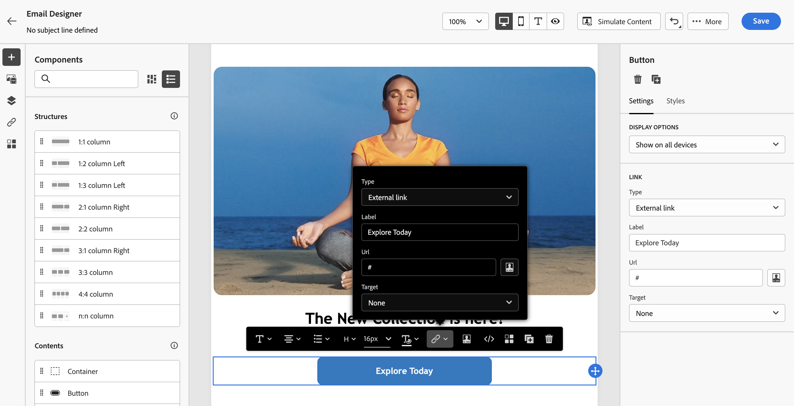
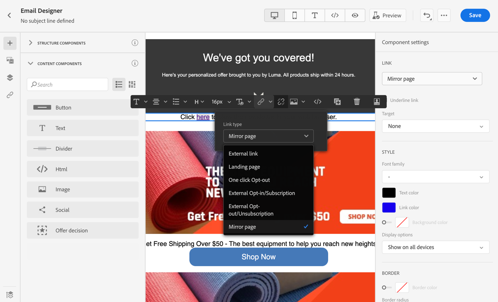
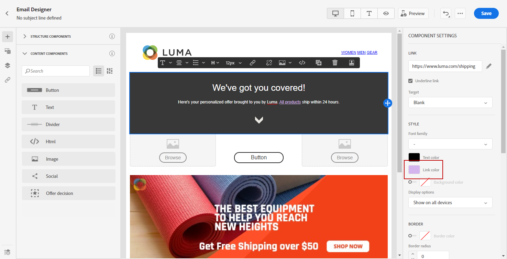

# Koppelingen toevoegen en berichten bijhouden {#tracking}

Gebruik [!DNL Journey Optimizer] om koppelingen naar uw inhoud toe te voegen en de verzonden berichten bij te houden om het gedrag van de ontvangers te controleren.

>[!NOTE]
>
>Wanneer de verbindingen in uw inhoud inbegrepen zijn, verlopen zij **25 maanden** nadat het bericht wordt verzonden, behalve verbindingen aan een spiegelpagina, die na **90 dagen** verlopen. Wanneer die vertraging is verstreken, zijn de koppelingen niet meer beschikbaar.

## Tekstspatiëring inschakelen {#enable-tracking}

U kunt het bijhouden van e-mailberichten inschakelen door de opties **[!UICONTROL Email opens]** en/of **[!UICONTROL Click on email]** te controleren bij het maken van uw bericht tijdens een rit of een campagne, zoals in de volgende tabbladen wordt getoond:

>[!BEGINTABS]

>[!TAB laat het volgen in een reis  toe]

>[!TAB  laat het volgen in een campagne toe ]

>[!ENDTABS]

>[!NOTE]
>
>Beide opties zijn standaard ingeschakeld.

Wanneer toegelaten, volgen deze opties het gedrag van de ontvangers van uw berichten:

* De metrische waarde van **[!UICONTROL Email opens]** controleert hoeveel berichten zijn geopend.
* De metrische waarde **[!UICONTROL Click on email]** berekent het aantal klikken op koppelingen in een e-mailbericht.

## Koppelingen invoegen {#insert-links}

Wanneer [&#x200B; het volgen &#x200B;](#enable-tracking) wordt toegelaten, worden alle verbindingen inbegrepen in de berichtinhoud gevolgd.

>[!NOTE]
>
>Koppelingen van fragmenten die in een e-mail worden gebruikt, worden ook bijgehouden. [&#x200B; Leer meer op fragmenten &#x200B;](../content-management/fragments.md)

Volg onderstaande stappen om koppelingen in te voegen in uw e-mailinhoud:

1. Selecteer een element (tekst of afbeelding) en klik op **[!UICONTROL Insert link]** op de contextuele werkbalk.

   

1. Kies het type koppeling dat u wilt maken:

   * Selecteer **[!UICONTROL External link]** om een koppeling naar een externe URL in te voegen.

   * Selecteer **[!UICONTROL Landing page]** om een koppeling naar een bestemmingspagina in te voegen. [Meer informatie](../landing-pages/get-started-lp.md)

   * Selecteer **[!UICONTROL One click Opt-out]** om een koppeling in te voegen zodat gebruikers zich snel kunnen afmelden bij uw communicatie zonder dat ze hoeven te bevestigen dat ze het abonnement moeten opzeggen. [Meer informatie](email-opt-out.md#one-click-opt-out).

   * Selecteer **[!UICONTROL External Opt-in/Subscription]** om een koppeling in te voegen voor het ontvangen van communicatie van uw merk.

   * Selecteer **[!UICONTROL External Opt-out/Unsubscription]** om een koppeling in te voegen waarmee u zich niet meer kunt abonneren op het ontvangen van communicatie van uw merk. Leer meer over opt-out beheer in [&#x200B; deze sectie &#x200B;](email-opt-out.md#email-opt-out).

   * Selecteer **[!UICONTROL Mirror page]** om een koppeling naar de spiegel voor e-mail toe te voegen. [Meer informatie](#mirror-page)

1. Voer de gewenste URL in het desbetreffende veld in of selecteer een openingspagina en definieer de koppelingsinstellingen en -stijlen. [Meer informatie](#adjust-links)

   >[!NOTE]
   >
   >Voor het interpreteren van URLs, [!DNL Journey Optimizer] voldoet aan de syntaxis van URI ([&#x200B; norm RFC 3986 &#x200B;](https://datatracker.ietf.org/doc/html/rfc3986){target="_blank"}), die sommige speciale internationale karakters in URLs onbruikbaar maakt. Wanneer u de proefdruk of e-mail probeert te verzenden, kunt u de tekenreeks via URL coderen als tijdelijke oplossing als u een fout hebt geretourneerd met een URL die aan uw inhoud is toegevoegd.

1. U kunt uw koppelingen aanpassen. [Meer informatie](../personalization/personalization-build-expressions.md)

1. Sla uw wijzigingen op.

1. Als de koppeling eenmaal is gemaakt, kunt u deze nog steeds wijzigen vanuit de deelvensters **[!UICONTROL Settings]** en **[!UICONTROL Styles]** aan de rechterkant.

   

>[!NOTE]
>
>Het op de markt brengen-type e-mailberichten moeten een [&#x200B; opt-out verbinding &#x200B;](../privacy/opt-out.md#opt-out-decision-management) omvatten, die niet voor transactionele berichten wordt vereist. De berichtcategorie (**[!UICONTROL Marketing]** of **[!UICONTROL Transactional]**) wordt bepaald in de [&#x200B; kanaalconfiguratie &#x200B;](email-settings.md#email-type) wanneer het creëren van het bericht.

Zodra het bericht wordt verzonden, is de behoudperiode voor een verbinding **25 maanden**. Na die vertraging is de koppeling niet meer beschikbaar.

## Koppelen naar een spiegelpagina {#mirror-page}

De spiegelpagina is een online versie van uw e-mail. Het toevoegen van een koppeling aan de spiegel is een goede manier om e-mailberichten op de markt te brengen. Gebruikers kunnen naar de spiegelpagina van een e-mailbericht bladeren, bijvoorbeeld als ze problemen ondervinden met het renderen of als ze afbeeldingen proberen te bekijken in hun Postvak IN. Het wordt ook aanbevolen om een onlineversie aan te bieden om toegankelijkheidsredenen of om sociaal delen aan te moedigen.

De spiegelpagina die door Adobe Journey Optimizer wordt gegenereerd, bevat alle aanpassingsgegevens.

Om een verbinding aan een spiegelpagina in uw e-mail toe te voegen, [&#x200B; neem een verbinding &#x200B;](#insert-links) op en selecteer **[!UICONTROL Mirror page]** als type van verbinding.

De spiegelpagina wordt automatisch gemaakt. Wanneer de e-mail is verzonden en de ontvangers op de koppeling voor de spiegelpagina klikken, wordt de inhoud van de e-mail in hun standaardwebbrowser weergegeven.

De behoudperiode voor een spiegelpagina is **90 dagen**. Na die vertraging is de spiegelpagina niet meer beschikbaar.

>[!CAUTION]
>
>* Koppelingen naar spiegelpagina&#39;s worden automatisch gegenereerd en kunnen niet worden bewerkt. Ze bevatten alle gecodeerde, gepersonaliseerde gegevens die nodig zijn om de oorspronkelijke e-mail te renderen. Als gevolg hiervan kan het gebruik van gepersonaliseerde kenmerken met grote waarden langdurige spiegel-pagina&#39;s-URL&#39;s genereren, waardoor de koppeling niet kan werken in webbrowsers met een maximale URL-lengte.
>
>* Wanneer u e-mailberichten maakt die sterk afhankelijk zijn van runtimeverpersoonlijking (bijvoorbeeld `#each` loops, geneste objecten, grote ladingsgegevens), kunnen URL&#39;s van spiegelpagina&#39;s te groot worden, met name in API-gestuurde campagnes die uitgebreide contextuele gegevens van ladingen gebruiken. Dit kan HTTP-fouten (404, 422, 502) veroorzaken in browsers of e-mailclients. Adobe raadt aan de breedte en diepte van dynamische velden te beperken, de afhankelijkheid van complexe fragmenten te verminderen en verpersoonlijkingsstructuren af te vlakken om mislukte koppelingen te voorkomen.
>
>* In het [&#x200B; bewijs &#x200B;](../content-management/proofs.md) dat naar de testprofielen wordt verzonden, is de verbinding aan de spiegelpagina niet actief. Deze is alleen actief in de laatste berichten.

## Weergave en doel van koppelingen aanpassen {#adjust-links}

U kunt uw koppelingen aanpassen, zoals onderstrepen, de kleur ervan wijzigen of het doel ervan selecteren.  Deze wijzigingen worden ingesteld in de deelvensters **[!UICONTROL Settings]** en **[!UICONTROL Styles]** rechts in de inhoudseditor.

### Target {#link-target}

Het **doel** attribuut wordt gebruikt om te controleren waar een verbonden pagina zal openen. Als u een doelkenmerk toevoegt aan een ankertag, kunt u opgeven of de koppeling moet worden geopend op een nieuw tabblad, op hetzelfde tabblad of in een ander frame.

Voer de volgende stappen uit om het doel van een koppeling te definiëren:

1. Selecteer de koppeling in een **[!UICONTROL Text]** -component waarin een koppeling wordt ingevoegd.

1. Selecteer op het tabblad **[!UICONTROL Settings]** in de vervolgkeuzelijst **[!UICONTROL Target]** waar de koppeling moet worden geopend. Mogelijke waarden worden hieronder weergegeven:

   * **[!UICONTROL None]** : hiermee wordt de koppeling geopend in hetzelfde frame als waarop is geklikt (standaard).
   * **[!UICONTROL Blank]** : hiermee opent u de koppeling in een nieuw venster of op een nieuw tabblad.
   * **[!UICONTROL Self]** : hiermee opent u de koppeling in hetzelfde frame als waarop u hebt geklikt.
   * **[!UICONTROL Parent]** : hiermee opent u de koppeling in het bovenliggende frame.
   * **[!UICONTROL Top]** : hiermee opent u de koppeling in de volledige tekst van het venster.

   

1. Sla uw wijzigingen op.

### Koppeling onderstrepen {#link-underline}

Schakel de optie **[!UICONTROL Underline link]** in om het label van de koppeling te onderstrepen.

### Kleur van koppeling {#link-color}

Als u de kleur van de koppeling wilt wijzigen, klikt u op **[!UICONTROL Link color]** op de tab **[!UICONTROL Styles]** .

## Beheer van bijhouden {#manage-tracking}

[&#x200B; E-mail Designer &#x200B;](content-from-scratch.md) staat u toe om bijgehouden URLs, zoals het uitgeven van het volgende type voor elke verbinding te beheren.

1. Klik op het pictogram **[!UICONTROL Links]** in het linkerdeelvenster om de lijst weer te geven met alle URL&#39;s van de inhoud die wordt bijgehouden.

   In deze lijst kunt u een gecentraliseerde weergave gebruiken en elke URL in de e-mailinhoud opzoeken.

1. Als u een koppeling wilt bewerken, klikt u op het bijbehorende potloodpictogram.

1. U kunt de **[!UICONTROL Tracking Type]** indien nodig wijzigen:

   

   Voor elke bijgehouden URL kunt u de modus Tekstspatiëring instellen op een van de volgende waarden:

   * **[!UICONTROL Tracked]**: activeert tracering op deze URL.
   * **[!UICONTROL Opt out]**: beschouwt deze URL als een niet-geabonneerde of niet-geabonneerde URL.
   * **[!UICONTROL Mirror page]**: beschouwt deze URL als een URL van een spiegelpagina.
   * **[!UICONTROL Never]**: activeert het bijhouden van deze URL nooit.

Het melden van openingen en klikken is beschikbaar in het [&#x200B; Levende rapport &#x200B;](../reports/live-report.md) en in het [&#x200B; rapport van Customer Journey Analytics &#x200B;](../reports/report-gs-cja.md).

## URL-tracking aanpassen {#url-tracking}

[&#x200B; URL het volgen &#x200B;](email-settings.md#url-tracking) wordt beheerd op het configuratieniveau en is op alle URLs inbegrepen in uw berichtinhoud van toepassing.

U kunt afzonderlijke URL&#39;s ook aanpassen in de Designer-mailtoepassing. Volg onderstaande stappen om aangepaste URL-volgparameters toe te voegen aan één koppeling in uw inhoud.

1. Selecteer een koppeling en klik op **[!UICONTROL Insert link]** op de contextuele werkbalk.

1. Selecteer het verpersoonlijkingspictogram. Het is slechts beschikbaar voor deze types van verbindingen: **Externe verbinding**, **Verbinding Unsubscription** en **Opt-Out**.

   

1. Voeg de URL volgende parameter toe en selecteer de profielattributen van uw keus van de [&#x200B; verpersoonlijkingsredacteur &#x200B;](../personalization/personalization-build-expressions.md).

   

1. Sla uw wijzigingen op.

1. Herhaal bovenstaande stappen voor elke koppeling waaraan u deze parameter voor bijhouden wilt toevoegen.

Wanneer de e-mail wordt verzonden, wordt deze parameter automatisch toegevoegd aan het einde van de URL. U kunt deze parameter vervolgens vastleggen in hulpprogramma&#39;s voor webanalyse of in prestatierapporten.

>[!NOTE]
>
>Om definitieve URL te verifiëren, kunt u [&#x200B; een proef &#x200B;](../content-management/proofs.md) verzenden en de verbinding in de inhoud van e-mail klikken zodra u de proef ontvangt. De URL moet de parameter tracking weergeven. In het bovenstaande voorbeeld is de laatste URL: <https://luma.enablementadobe.com/content/luma/us/en.html?utm_contact=profile.userAccount.contactDetails.homePhone.number>
