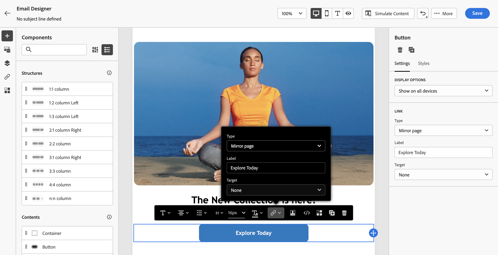

# Koppelingen toevoegen en berichten bijhouden {#tracking}

Gebruik [!DNL Journey Optimizer] om koppelingen naar uw inhoud toe te voegen en de verzonden berichten bij te houden om het gedrag van de ontvangers te controleren.

## Tekstspatiëring inschakelen {#enable-tracking}

U kunt het bijhouden van e-mailberichten inschakelen door de opties **[!UICONTROL Email opens]** en/of **[!UICONTROL Click on email]** te controleren wanneer u uw bericht maakt in een rit of een campagne.

>[!BEGINTABS]

>[!TAB  laat het volgen in een reis ] toe

>[!TAB  laat het volgen in een campagne toe ]

>[!ENDTABS]

>[!NOTE]
>
>Beide opties zijn standaard ingeschakeld.

Zo kunt u het gedrag van de ontvangers bijhouden via:

* **[!UICONTROL Email opens]**: berichten die zijn geopend.
* **[!UICONTROL Click on email]**: klik op koppelingen in een e-mail.

## Koppelingen invoegen {#insert-links}

Bij het ontwerpen van een bericht kunt u koppelingen naar uw inhoud toevoegen.

>[!NOTE]
>
>Wanneer [ het volgen ](#enable-tracking) wordt toegelaten, worden alle verbindingen inbegrepen in de berichtinhoud gevolgd.

Volg onderstaande stappen om koppelingen in te voegen in uw e-mailinhoud:

1. Selecteer een element en klik op **[!UICONTROL Insert link]** op de contextuele werkbalk.

   

1. Kies het type koppeling dat u wilt maken:

   * **[!UICONTROL External link]**: voeg een koppeling in naar een externe URL.

   * **[!UICONTROL Landing page]**: voeg een koppeling in naar een bestemmingspagina. [Meer informatie](../landing-pages/get-started-lp.md)

   * **[!UICONTROL One click Opt-out]**: Voeg een koppeling in zodat gebruikers zich snel kunnen afmelden voor uw communicatie zonder dat ze hoeven te bevestigen dat ze het abonnement moeten opzeggen. [Meer informatie](email-opt-out.md#one-click-opt-out).

   * **[!UICONTROL External Opt-in/Subscription]**: voeg een koppeling in om het ontvangen van communicatie van uw merk te accepteren.

   * **[!UICONTROL External Opt-out/Unsubscription]**: voeg een koppeling in om het abonnement op communicatie van uw merk op te zeggen. Leer meer op opt-out beheer in [ deze sectie ](email-opt-out.md#opt-out-management).

   * **[!UICONTROL Mirror page]**: voeg een koppeling toe om de e-mailinhoud in een webbrowser weer te geven. [Meer informatie](#mirror-page)

1. Voer de gewenste URL in het desbetreffende veld in of selecteer een openingspagina en definieer de koppelingsinstellingen en -stijlen. [Meer informatie](#adjust-links)

   >[!NOTE]
   >
   >Voor het interpreteren van URLs, [!DNL Journey Optimizer] voldoet aan de syntaxis van URI ([ norm RFC 3986 ](https://datatracker.ietf.org/doc/html/rfc3986) {target="_blank"}), die sommige speciale internationale karakters in URLs onbruikbaar maakt. Wanneer u de proefdruk of e-mail probeert te verzenden, kunt u de tekenreeks via URL coderen als tijdelijke oplossing als u een fout hebt geretourneerd met een URL die aan uw inhoud is toegevoegd.

1. U kunt uw koppelingen aanpassen. [Meer informatie](../personalization/personalization-syntax.md#perso-urls)

1. Sla uw wijzigingen op.

1. Als de koppeling eenmaal is gemaakt, kunt u deze nog steeds wijzigen vanuit de deelvensters **[!UICONTROL Settings]** en **[!UICONTROL Styles]** aan de rechterkant.

   

>[!NOTE]
>
>Het op de markt brengen-type e-mailberichten moeten een [ opt-out verbinding ](../privacy/opt-out.md#opt-out-management) omvatten, die niet voor transactionele berichten wordt vereist. De berichtcategorie (**[!UICONTROL Marketing]** of **[!UICONTROL Transactional]**) wordt bepaald in de [ kanaalconfiguratie ](../configuration/channel-surfaces.md#email-type) wanneer het creëren van het bericht.

## Koppelingen aanpassen {#adjust-links}

U kunt de koppelingen aanpassen met de deelvensters **[!UICONTROL Settings]** en **[!UICONTROL Styles]** rechts in het scherm. U kunt een koppeling onderstrepen, de kleur ervan bewerken en het doel ervan selecteren.

1. Selecteer de koppeling in een **[!UICONTROL Text]** -component waarin een koppeling wordt ingevoegd.

1. Kies op het tabblad **[!UICONTROL Settings]** hoe de doelgroep wordt omgeleid in de vervolgkeuzelijst **[!UICONTROL Target]** :

   * **[!UICONTROL None]** : hiermee wordt de koppeling geopend in hetzelfde frame als waarop is geklikt (standaard).
   * **[!UICONTROL Blank]** : hiermee opent u de koppeling in een nieuw venster of op een nieuw tabblad.
   * **[!UICONTROL Self]** : hiermee opent u de koppeling in hetzelfde frame als waarop u hebt geklikt.
   * **[!UICONTROL Parent]** : hiermee opent u de koppeling in het bovenliggende frame.
   * **[!UICONTROL Top]** : hiermee opent u de koppeling in de volledige tekst van het venster.

   

1. Schakel **[!UICONTROL Underline link]** in om de labeltekst van de koppeling te onderstrepen.

   

1. Als u de kleur van de koppeling wilt wijzigen, klikt u op **[!UICONTROL Link color]** op de tab **[!UICONTROL Styles]** .

   

1. Sla uw wijzigingen op.

## Koppelen naar een spiegelpagina {#mirror-page}

De spiegelpagina is een HTML-pagina die online toegankelijk is via een webbrowser. De inhoud is identiek aan de inhoud van uw e-mail.

Om een verbinding aan een spiegelpagina in uw e-mail toe te voegen, [ neem een verbinding ](#insert-links) op en selecteer **[!UICONTROL Mirror page]** als type van verbinding.

De spiegelpagina wordt automatisch gemaakt.

>[!IMPORTANT]
>
>Koppelingen naar spiegelpagina&#39;s worden automatisch gegenereerd en kunnen niet worden bewerkt. Ze bevatten alle gecodeerde, gepersonaliseerde gegevens die nodig zijn om de oorspronkelijke e-mail te renderen. Als gevolg hiervan kan het gebruik van gepersonaliseerde kenmerken met grote waarden langdurige spiegel-pagina&#39;s-URL&#39;s genereren, waardoor de koppeling niet kan werken in webbrowsers met een maximale URL-lengte.

Wanneer de e-mail is verzonden en de ontvangers op de koppeling voor de spiegelpagina klikken, wordt de inhoud van de e-mail in hun standaardwebbrowser weergegeven.

>[!NOTE]
>
>In het [ bewijs ](../content-management/proofs.md) dat naar de testprofielen wordt verzonden, is de verbinding aan de spiegelpagina niet actief. Deze wordt alleen geactiveerd in de laatste berichten.

De retentieperiode voor een spiegelpagina is 60 dagen. Na die vertraging is de spiegelpagina niet meer beschikbaar.

## Beheer van bijhouden {#manage-tracking}

[ E-mail Designer ](content-from-scratch.md) staat u toe om bijgehouden URLs, zoals het uitgeven van het volgende type voor elke verbinding te beheren.

1. Klik op het pictogram **[!UICONTROL Links]** in het linkerdeelvenster om de lijst weer te geven met alle URL&#39;s van de inhoud die wordt bijgehouden.

   In deze lijst kunt u een gecentraliseerde weergave gebruiken en elke URL in de e-mailinhoud opzoeken.

1. Als u een koppeling wilt bewerken, klikt u op het bijbehorende potloodpictogram.

1. U kunt de **[!UICONTROL Tracking Type]** indien nodig wijzigen:

   

   Voor elke bijgehouden URL kunt u de modus Tekstspatiëring instellen op een van de volgende waarden:

   * **[!UICONTROL Tracked]**: activeert tracering op deze URL.
   * **[!UICONTROL Opt out]**: beschouwt deze URL als een niet-geabonneerde of niet-geabonneerde URL.
   * **[!UICONTROL Mirror page]**: beschouwt deze URL als een URL van een spiegelpagina.
   * **[!UICONTROL Never]**: activeert het bijhouden van deze URL nooit.

Het melden van openingen en klikken is beschikbaar in het [ Levende rapport ](../reports/live-report.md) en in het [ rapport van Customer Journey Analytics ](../reports/report-gs-cja.md).

## URL-tracking aanpassen {#url-tracking}

Meestal [ URL die ](email-settings.md#url-tracking) volgen wordt beheerd op het configuratieniveau, maar de profielattributen worden niet gesteund. Momenteel is de enige manier om het te doen het [ te personaliseren URLs ](../personalization/personalization-syntax.md#perso-urls) in de e-mailontwerper.

Volg onderstaande stappen om aangepaste URL-volgparameters toe te voegen aan uw koppelingen.

1. Selecteer een koppeling en klik op **[!UICONTROL Insert link]** op de contextuele werkbalk.

1. Selecteer het verpersoonlijkingspictogram. Het is slechts beschikbaar voor deze types van verbindingen: **Externe verbinding**, **Verbinding Unsubscription** en **Opt-Out**.

   

1. Voeg de URL volgende parameter toe en selecteer het profielattribuut van uw keus van de verpersoonlijkingsredacteur.

   

1. Sla uw wijzigingen op.

1. Herhaal bovenstaande stappen voor elke koppeling waaraan u deze parameter voor bijhouden wilt toevoegen.

Wanneer de e-mail wordt verzonden, wordt deze parameter automatisch toegevoegd aan het einde van de URL. U kunt deze parameter vervolgens vastleggen in hulpprogramma&#39;s voor webanalyse of in prestatierapporten.

>[!NOTE]
>
>Om definitieve URL te verifiëren, kunt u [ een proef ](../content-management/preview-test.md#send-proofs) verzenden en de verbinding in de inhoud van e-mail klikken zodra u de proef ontvangt. De URL moet de parameter tracking weergeven. In het bovenstaande voorbeeld is de laatste URL: <https://luma.enablementadobe.com/content/luma/us/en.html?utm_contact=profile.userAccount.contactDetails.homePhone.number>
