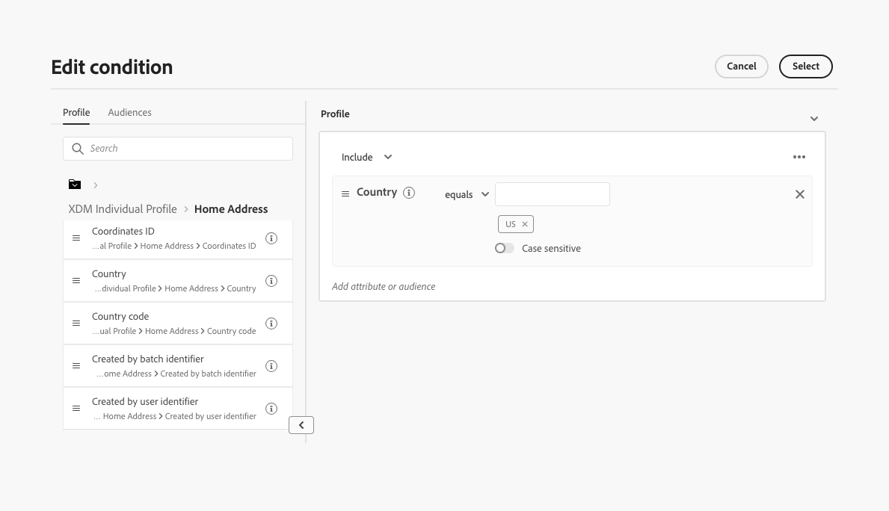
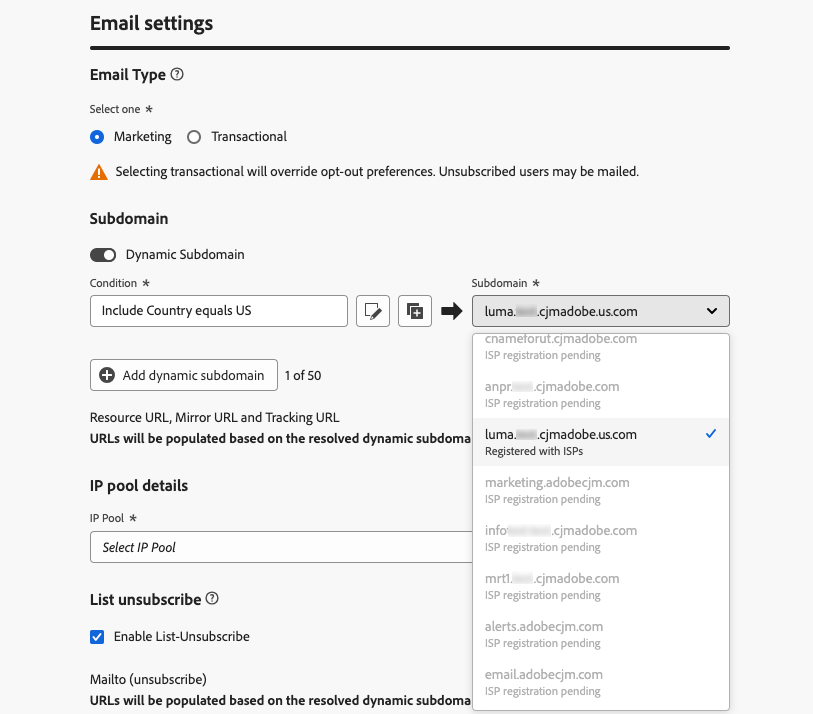

# Instellingen voor e-mailconfiguratie aanpassen {#surface-personalization}

Voor meer flexibiliteit en meer controle over de e-mailinstellingen kunt u in [!DNL Journey Optimizer] gepersonaliseerde waarden definiëren voor subdomeinen, kopteksten en URL-volgparameters wanneer u e-mailconfiguraties maakt.

## Dynamische subdomeinen toevoegen {#dynamic-subdomains}

>[!CONTEXTUALHELP]
>id="ajo_surface_perso_not_available"
>title="Personalization niet beschikbaar"
>abstract="Deze configuratie is gemaakt zonder personalisatiekenmerken. Raadpleeg de documentatie voor stappen die u kunt oplossen als personalisatie vereist is."

>[!CONTEXTUALHELP]
>id="ajo_surface_dynamic_subdomain"
>title="Dynamische subdomeinen inschakelen"
>abstract="Wanneer u een e-mailconfiguratie maakt, kunt u dynamische subdomeinen instellen op basis van voorwaarden die u met de verpersoonlijkingseditor definieert. U kunt maximaal 50 dynamische subdomeinen toevoegen."

Wanneer u een e-mailconfiguratie maakt, kunt u dynamische subdomeinen instellen op basis van specifieke voorwaarden.

Als u bijvoorbeeld juridische beperkingen hebt om berichten van een specifiek e-mailadres per land te verzenden, kunt u dynamische subdomeinen gebruiken. Dit staat u toe om één enkele configuratie met verscheidene verzendende subdomeinen te creëren die aan verschillende landen beantwoorden - in plaats van het creëren van veelvoudige configuraties voor elk land. Vervolgens kunt u zich richten op klanten die in verschillende landen zijn gevestigd en in één campagne zijn geconsolideerd.

Voer de onderstaande stappen uit om dynamische subdomeinen te definiëren in een configuratie van een e-mailkanaal.

1. Voordat u een configuratie maakt, stelt u de subdomeinen in die u wilt gebruiken voor het verzenden van e-mails volgens uw gebruiksscenario. [ leer hoe ](../configuration/about-subdomain-delegation.md)

   Stel bijvoorbeeld dat u verschillende subdomeinen wilt gebruiken voor verschillende landen: één subdomein instellen dat specifiek is voor de VS, één specifiek voor het Verenigd Koninkrijk, enzovoort.

1. Maak een kanaalconfiguratie. [ leer hoe ](../configuration/channel-surfaces.md)

1. Selecteer het kanaal **[!UICONTROL Email]** .

1. In de **Subdomain** sectie, laat de **[!UICONTROL Dynamic Subdomain]** optie toe.

   

1. Selecteer het pictogram Bewerken naast het eerste veld **[!UICONTROL Condition]** .

1. De [ verpersoonlijkingsredacteur ](../personalization/personalization-build-expressions.md) opent. In dit voorbeeld stelt u een voorwaarde in, bijvoorbeeld `Country` is gelijk aan `US` .

   

1. Selecteer het subdomein dat u aan deze voorwaarde wilt koppelen. [ leer meer over subdomeinen ](../configuration/about-subdomain-delegation.md)

   >[!NOTE]
   >
   >Bepaalde subdomeinen zijn momenteel niet beschikbaar voor selectie toe te schrijven aan hangende [ terugkoppel lijn ](../reports/deliverability.md#feedback-loops) registratie. Dit proces kan tot 10 werkdagen duren. Na voltooiing kunt u kiezen uit alle beschikbare subdomeinen. <!--where FL registration happens? is it when delegating a subdomain and you are awaiting from subdomain validation? or is it on ISP side only?-->

   

   Alle ontvangers die in de VS zijn gebaseerd, ontvangen berichten die het geselecteerde subdomein voor dat land gebruiken. Dit houdt in dat alle betrokken URL&#39;s (zoals spiegel, URL volgen of koppeling opzeggen) worden ingevuld op basis van dat subdomein.

1. Stel andere dynamische subdomeinen naar wens in. Je kunt maximaal 50 objecten toevoegen.

   

   <!--Select the [IP pool](../configuration/ip-pools.md) to associate with the configuration. [Learn more](email-settings.md#ip-pools)-->

1. Bepaal alle andere [ e-mailmontages ](email-settings.md) en [ voorleggen ](../configuration/channel-surfaces.md#create-channel-surface) uw configuratie.

Nadat u een of meer dynamische subdomeinen aan een configuratie hebt toegevoegd, worden de volgende items gevuld op basis van het opgeloste dynamische subdomein voor deze configuratie:

* Alle URL&#39;s (bron-URL, spiegel-URL en URL voor bijhouden)

* [ unsubscribe URL ](email-settings.md#list-unsubscribe)

* **van e-mail** en **E-mail van de Fout** achtervoegsels

>[!NOTE]
>
>Als u dynamische subdomeinen instelt en vervolgens de optie **[!UICONTROL Dynamic Subdomain]** uitschakelt, worden alle dynamische waarden verwijderd. Selecteer een subdomein en verzend de configuratie voor de veranderingen om van kracht te worden.

## De koptekst personaliseren {#personalize-header}

U kunt verpersoonlijking voor alle kopbalparameters ook gebruiken die in een configuratie worden bepaald.

Als u bijvoorbeeld meerdere merken hebt, kunt u één configuratie maken en gepersonaliseerde waarden gebruiken voor uw e-mailkopteksten. Dit staat u toe om ervoor te zorgen dat alle e-mails die van uw verschillende merken worden verzonden aan elk van uw klanten met het correcte **van** namen en e-mails worden gericht. Op dezelfde manier wanneer uw ontvangers de **knoop van het Antwoord** in hun software van de e-mailcliënt raken, wilt u **antwoorden aan** namen en e-mails beantwoorden aan het correcte merk voor de juiste gebruiker.

Volg onderstaande stappen om gepersonaliseerde variabelen voor de parameters van de configuratiekopbal te gebruiken.

>[!NOTE]
>
>U kunt alle **[!UICONTROL Header parameters]** -velden aanpassen, behalve het **[!UICONTROL Error email prefix]** -veld.

1. Definieer de headerparameters zoals u dat gewoonlijk doet. [ leer hoe ](email-settings.md#email-header)

1. Selecteer voor elk veld het pictogram Bewerken.

   

1. De [ verpersoonlijkingsredacteur ](../personalization/personalization-build-expressions.md) opent. Definieer de voorwaarde naar wens en sla uw wijzigingen op.

   <!--For example, set a condition such as each recipient receives an email from their own brand representative.-->

   >[!NOTE]
   >
   >U kunt alleen **[!UICONTROL Profile attributes]** en **[!UICONTROL Helper functions]** selecteren.

   Bijvoorbeeld, wilt u dynamisch e-mails behandelen die namens een relatiemanager worden verzonden, de waarvan details in het klantenprofiel worden opgeslagen, zodat elke klant met een relatiemanager wordt verbonden. In a [ reis ](../building-journeys/journey-gs.md), kan de e-mailkopbal (afzendernaam, afzendere-mail, antwoord aan adres) met de parameters van de relatiemanager worden gepersonaliseerd, die van de profielattributen worden genomen.

   <!--The examples below use event parameters, which are currently not available.
    
    Let's say you want to handle dynamically emails sent on behalf of a sales assistant, where the sales assistant is retrieved from an event or campaign contextual parameters. For example: In a [journey](../building-journeys/journey-gs.md), when a purchase event is linked to the sales assistant of a specific shop, the email header (sender name, sender email, reply to address) can be personalized with the sales assistant parameters, taken from the event attributes. In an [API-triggered campaign](../campaigns/api-triggered-campaigns.md), initiated externally by a sales assistant, the triggered email can be sent on behalf of the sales assistant and the header personalization values taken from campaign contextual parameters.-->

1. Herhaal bovenstaande stappen voor elke parameter waaraan u personalisatie wilt toevoegen.

>[!NOTE]
>
>Als u één of meerdere dynamische subdomeinen aan uw configuratie toevoegde, zullen **van e-mail** en **achtervoegsels van de Fout e-mail** worden bevolkt gebaseerd op het opgeloste [ dynamische subdomain ](#dynamic-subdomains).

## Aangepaste URL-tracking gebruiken {#personalize-url-tracking}

Volg de onderstaande stappen om aangepaste URL-volgparameters te gebruiken.

1. Ga naar de sectie **[!UICONTROL URL tracking parameters]** van uw configuratie van het e-mailkanaal. [Meer informatie](url-tracking.md)

1. Klik op het pictogram Bewerken naast elk veld. Naast contextafhankelijke kenmerken kunt u ook profielkenmerken selecteren.

1. Selecteer de profielattributen van uw keus van de [ verpersoonlijkingsredacteur ](../personalization/personalization-build-expressions.md).

1. Herhaal bovenstaande stappen voor elke volgende parameter die u wilt aanpassen.

Wanneer de e-mail wordt verzonden, wordt de gepersonaliseerde parameter automatisch toegevoegd aan het einde van de URL. U kunt deze parameter vervolgens vastleggen in hulpprogramma&#39;s voor webanalyse of in prestatierapporten.

## Configuratiedetails weergeven {#view-surface-details}

Wanneer het gebruiken van een configuratie met gepersonaliseerde montages in een campagne of een reis, kunt u de configuratiedetails direct binnen de campagne of de reis tonen. Voer de onderstaande stappen uit.

1. Creeer een e-mail [ campagne ](../campaigns/create-campaign.md) of [ reis ](../building-journeys/journey-gs.md).

1. Selecteer de knop **[!UICONTROL Edit content]**.

1. Klik op de knop **[!UICONTROL View configuration details]**.

   

1. Het venster **[!UICONTROL Delivery settings]** wordt weergegeven. U kunt alle configuratiemontages, met inbegrip van dynamische subdomeinen en gepersonaliseerde kopbalparameters bekijken.

   >[!NOTE]
   >
   >Alle informatie op dit scherm is alleen-lezen.

1. Selecteer **[!UICONTROL Expand]** om de details van de dynamische subdomeinen weer te geven.

   

## Controleer uw configuratie {#check-configuration}

Wanneer u een gepersonaliseerde configuratie gebruikt in een campagne of een rit, kunt u een voorbeeld van uw e-mailinhoud weergeven met testprofielen om te controleren op mogelijke fouten met de dynamische instellingen die u hebt gedefinieerd. Voer de onderstaande stappen uit.

>[!NOTE]
>
>Naast testprofielen kunt u met [!DNL Journey optimizer] ook verschillende varianten van de inhoud testen door deze voor te vertonen en proefdrukken te verzenden met behulp van voorbeeldinvoergegevens die vanuit een CSV-/JSON-bestand zijn geüpload of handmatig zijn toegevoegd. [ leer hoe te om inhoudvariaties ](../test-approve/simulate-sample-input.md) te simuleren

Voer de volgende stappen uit om een voorvertoning van de inhoud weer te geven met testprofielen:

1. Klik op de knop **[!UICONTROL Simulate content]** in het scherm Inhoud bewerken van uw bericht of in de Designer-e-mail. [Meer informatie](../content-management/preview.md)

1. Selecteer a [ testprofiel ](../content-management/test-profiles.md).

1. Als een fout wordt weergegeven, klikt u op de knop **[!UICONTROL View configuration details]** .

   

1. Controleer het scherm **[!UICONTROL Delivery settings]** op de foutdetails.

   

Mogelijke fouten kunnen als volgt zijn:

* **subdomain** verwierp niet voor het geselecteerde testprofiel. In uw configuratie worden bijvoorbeeld verschillende verzendende subdomeinen gebruikt die overeenkomen met verschillende landen, maar voor het geselecteerde profiel is geen waarde gedefinieerd voor het kenmerk `Country` , of het kenmerk is ingesteld op `France` , maar deze waarde is niet gekoppeld aan een subdomein in die configuratie.

* Het geselecteerde profiel heeft geen bijbehorende waarden voor één of meerdere **kopbalparameters**.

Als een van deze fouten optreedt, wordt geen e-mail verzonden naar het geselecteerde testprofiel.

Als u dit type fout wilt voorkomen, moet u ervoor zorgen dat de headerparameters die u definieert, gepersonaliseerde kenmerken gebruiken voor de meeste profielen. Ontbrekende waarden kunnen van invloed zijn op uw e-mailleesbaarheid.

>[!NOTE]
>
>Leer meer over leverbaarheid in [ deze sectie ](../reports/deliverability.md)
