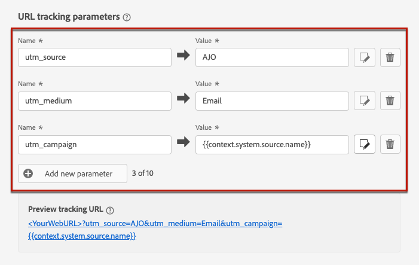
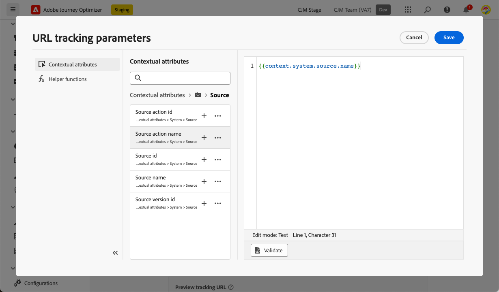

# URL-tracking {#url-tracking}

>[!CONTEXTUALHELP]
>id="ajo_admin_preset_utm"
>title="Parameters voor URL-tracking definiëren"
>abstract="Met deze sectie kunt u automatisch parameters voor bijhouden toevoegen aan de URL&#39;s in uw e-mailinhoud. Deze functie is optioneel."

>[!CONTEXTUALHELP]
>id="ajo_admin_preset_url_preview"
>title="Voorvertoning van parameters voor URL bijhouden"
>abstract="Bekijk hoe u parameters voor bijhouden toevoegt aan de URL&#39;s in uw e-mailinhoud."

Wanneer het vormen van een nieuwe [ configuratie van het e-mailkanaal ](email-settings.md), kunt u **[!UICONTROL URL tracking parameters]** bepalen om de doeltreffendheid van uw marketing inspanningen over kanalen te meten. U kunt deze functie ook activeren.

De parameters die in de corresponderende sectie worden gedefinieerd, worden toegevoegd aan het einde van de URL&#39;s die in de inhoud van uw e-mailbericht zijn opgenomen. Vervolgens kunt u deze parameters vastleggen in hulpprogramma&#39;s voor webanalyse, zoals Adobe Analytics of Google Analytics, en verschillende prestatierapporten maken.

>[!NOTE]
>
>De volgorde van URL-volgparameters die aan de URL zijn toegevoegd, is willekeurig en kan niet worden gecontroleerd. Als uw systeem parameters in een specifieke orde vereist, zult u hen op uw kant moeten ontleden en opnieuw in orde brengen.

Met de knop **[!UICONTROL Add new parameter]** kunt u maximaal 10 volgparameters toevoegen.

{width="80%"}

Als u een URL-volgparameter wilt configureren, kunt u de gewenste waarden rechtstreeks invoeren in de velden **[!UICONTROL Name]** en **[!UICONTROL Value]** .

U kunt elk **[!UICONTROL Value]** gebied ook uitgeven gebruikend de [ verpersoonlijkingsredacteur ](../personalization/personalization-build-expressions.md). Klik op het pictogram van de editie om de editor te openen. Vervolgens kunt u de beschikbare contextafhankelijke kenmerken selecteren en/of de tekst rechtstreeks bewerken.

De volgende vooraf gedefinieerde waarden zijn beschikbaar via de verpersoonlijkingseditor:

* **het profielidentiteitskaart van het Bericht**: Bericht-georiënteerd attribuut dat uniek elk bericht identificeert dat naar elk gericht profiel in een levering wordt verzonden.

* **identiteitskaart van de Aanbieding**: identiteitskaart van de aanbieding die in e-mail wordt gebruikt.

* **handelings identiteitskaart van Source**: identiteitskaart van de E-mailactie die aan de reis of de campagne wordt toegevoegd.

* **de actienaam van Source**: naam van de E-mailactie die aan de reis of de campagne wordt toegevoegd.

* **identiteitskaart van Source**: identiteitskaart van de reis of de campagne e-mail werd verzonden met.

* **naam van Source**: naam van de reis of de campagne e-mail werd verzonden met.

* **versie identiteitskaart van Source**: identiteitskaart van de reis of campagneversie e-mail werd verzonden met.

>[!NOTE]
>
>U kunt het typen van tekstwaarden en het gebruiken van contextafhankelijke attributen van de verpersoonlijkingsredacteur combineren. Elk **[!UICONTROL Value]** -veld kan een aantal tekens tot maximaal 5 kB bevatten.

<!--You can drag and drop the parameters to reorder them.-->

Hieronder staan voorbeelden van URL&#39;s die compatibel zijn met Adobe Analytics en Google Analytics.

* Met Adobe Analytics compatibele URL: `www.YourLandingURL.com?cid=email_AJO_{{context.system.source.id}}_image_{{context.system.source.name}}`

* Met Google Analytics compatibele URL: `www.YourLandingURL.com?utm_medium=email&utm_source=AJO&utm_campaign={{context.system.source.id}}&utm_content=image`

U kunt de resulterende URL voor bijhouden dynamisch voorvertonen. Elke keer dat u een parameter toevoegt, bewerkt of verwijdert, wordt de voorvertoning automatisch bijgewerkt.

>[!NOTE]
>
>U kunt ook dynamische parameters voor gepersonaliseerde reeksspatiëring toevoegen aan de koppelingen in uw e-mailinhoud. [Meer informatie](surface-personalization.md#personalize-url-tracking)
