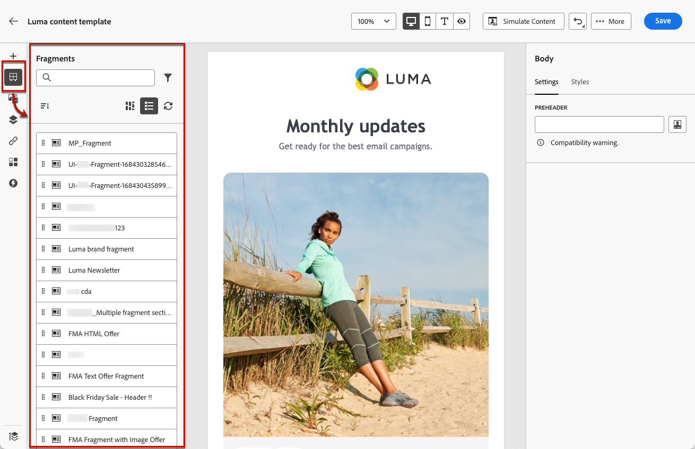

# Visuele fragmenten toevoegen aan uw e-mails {#use-visual-fragments}

U kunt een visueel fragment gebruiken in een [email](get-started-email-design.md) tijdens een reis, een campagne of [inhoudssjabloon](../content-management/content-templates.md).

>[!NOTE]
>
>Leer hoe u fragmenten maakt en beheert in [deze sectie](../content-management/fragments.md).

➡️ [Leer hoe u fragmenten beheert, ontwerpt en gebruikt in deze video](../content-management/fragments.md#video-fragments)

## Een fragment gebruiken {#use-fragment}

1. Open e-mail- of sjablooninhoud met de [E-mailDesigner](get-started-email-design.md).

1. Selecteer de **[!UICONTROL Fragments]** pictogram van de linkerrails.

   

1. De lijst met alle visuele fragmenten die in de huidige sandbox zijn gemaakt, wordt weergegeven. U kunt:

   * Zoek naar een specifiek fragment door zijn etiket te beginnen typen.
   * Sorteer fragmenten in oplopende of aflopende volgorde.
   * De manier wijzigen waarop de fragmenten worden weergegeven (kaarten of lijstweergave).

   >[!NOTE]
   >
   >Fragmenten worden gesorteerd op aanmaakdatum: recent toegevoegde visuele fragmenten worden als eerste weergegeven in de lijst.

1. U kunt de lijst doorzoeken en vernieuwen.

   >[!NOTE]
   >
   >Als sommige fragmenten zijn gewijzigd of toegevoegd terwijl u de inhoud bewerkt, wordt de lijst bijgewerkt met de meest recente wijzigingen.

1. Sleep een fragment uit de lijst naar het gebied waar u het wilt invoegen.

   

1. Net als bij andere componenten kunt u het fragment in de inhoud verplaatsen.

1. Selecteer het fragment om het corresponderende venster rechts weer te geven. Daarna kunt u het fragment uit de inhoud verwijderen of dupliceren. U kunt deze handelingen ook rechtstreeks uitvoeren vanuit het contextmenu dat boven op het fragment wordt weergegeven.

   

1. Van de **[!UICONTROL Settings]** kunt u:

   * Kies de apparaten waarop het fragment moet worden weergegeven.
   * Open het fragment op een nieuw tabblad om het zo nodig te bewerken. [Meer informatie](../content-management/fragments.md#edit-fragments)
   * Verken verwijzingen. [Meer informatie](../content-management/fragments.md#explore-references)

1. U kunt het fragment verder aanpassen met de opdracht **[!UICONTROL Styles]** tab.

1. Indien nodig, kunt u de overerving met het oorspronkelijke fragment verbreken. [Meer informatie](#break-inheritance)

1. Voeg zoveel fragmenten toe als u wilt en **[!UICONTROL Save]** uw wijzigingen.

## Overerving onderbreken {#break-inheritance}

Wanneer u een visueel fragment bewerkt, worden de wijzigingen gesynchroniseerd. Ze worden automatisch doorgegeven aan iedereen **[!UICONTROL Draft]** ritten/campagnes en inhoudssjablonen met dat fragment.

>[!NOTE]
>
>De wijzigingen worden niet doorgegeven aan e-mails die worden gebruikt in **[!UICONTROL Live]** reizen of campagnes.

Wanneer fragmenten aan een e-mail- of inhoudssjabloon worden toegevoegd, worden ze standaard gesynchroniseerd.

U kunt de overerving echter wel verbreken van het oorspronkelijke fragment. In dat geval wordt de inhoud van het fragment naar het huidige ontwerp gekopieerd en worden de wijzigingen niet meer gesynchroniseerd.

Volg onderstaande stappen om overerving te onderbreken:

1. Selecteer het fragment.

1. Klik op het ontgrendelingspictogram op de contextafhankelijke werkbalk.

   

1. Dat fragment wordt een zelfstandig element dat niet meer aan het oorspronkelijke fragment is gekoppeld. Bewerk de inhoud als elke andere inhoudscomponent in de inhoud. [Meer informatie](content-components.md)

