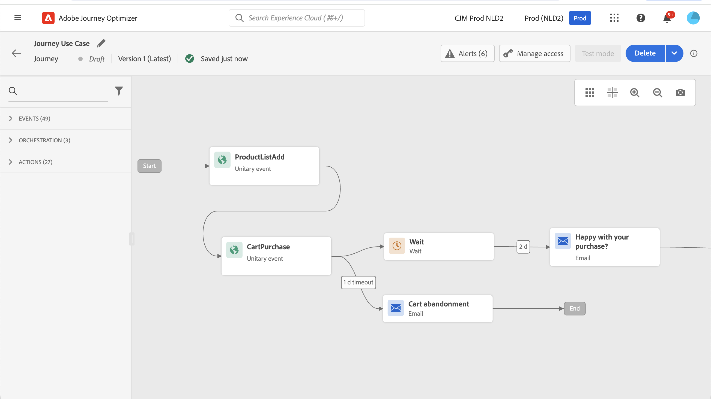

# Werken met Adobe Analytics-gegevens {#analytics-data}

U kunt alle webgedragsgebeurtenisgegevens benutten die u al vastlegt via Adobe Analytics of Web SDK en die streaming naar Adobe Experience Platform, om reizen te starten en ervaringen voor uw klanten te automatiseren.

Dit werkt alleen met Adobe Analytics als u:

1. Activeer de rapportsuite die u wilt gebruiken. [Meer informatie](#leverage-analytics-data)
1. Schakel Journey Optimizer in om uw Adobe Analytics-gegevensbron te gebruiken. [Meer informatie](#activate-analytics-data)
1. Voeg een specifieke gebeurtenis toe aan uw reis. [Meer informatie](#event-analytic)

>[!NOTE]
>
>Deze sectie is slechts op regel-gebaseerde gebeurtenissen en klanten van toepassing die de gegevens van Adobe Analytics of van het Web SDK moeten gebruiken.
> 
>Als u Adobe Customer Journey Analytics gebruikt, verwijs naar [&#x200B; deze pagina &#x200B;](../reports/cja-ajo.md).
>

## Adobe Analytics- of Web SDK-gegevens configureren {#leverage-analytics-data}

Gegevens die afkomstig zijn van Adobe Analytics of Adobe Experience Platform Web SDK moeten ingeschakeld kunnen worden voor uw reizen.

Hiervoor voert u de volgende stappen uit:

1. Blader naar het menu **[!UICONTROL Sources]** .

1. Selecteer **[!UICONTROL Add data]** in de sectie Adobe Analytics

   

1. Selecteer in de lijst met beschikbare Adobe Analytics-rapportsuites de **[!UICONTROL Report suite]** die u wilt inschakelen. Klik vervolgens op **[!UICONTROL Next]** .

   

1. Kies of u een standaardschema of een aangepast schema wilt gebruiken.

1. Kies een **[!UICONTROL Dataflow detail]** in het scherm **[!UICONTROL Dataflow name]** .

1. Klik op **[!UICONTROL Finish]** als de configuratie is voltooid.

   

Dit laat de bron van Analytics schakelaar voor die rapportreeks toe. Telkens wanneer de gegevens binnenkomen, worden ze omgezet in een Experience-gebeurtenis en verzonden naar Adobe Experience Platform.

Leer meer over de bronschakelaar van Adobe Analytics in [&#x200B; documentatie van Adobe Experience Platform &#x200B;](https://experienceleague.adobe.com/docs/experience-platform/sources/connectors/adobe-applications/analytics.html){target="_blank"} en [&#x200B; leerprogramma &#x200B;](https://experienceleague.adobe.com/docs/experience-platform/sources/ui-tutorials/create/adobe-applications/analytics.html){target="_blank"}.

## Deze configuratie activeren {#activate-analytics-data}

Zodra deze configuratie is voltooid, neemt u contact op met Adobe om uw Journey Optimizer-omgeving in staat te stellen deze gegevensbron te gebruiken. Deze stap is alleen vereist voor Adobe Analytics-gegevensbronnen. Dit doet u als volgt:

1. Haal de gegevensbron-id op. Deze informatie is beschikbaar in het gebruikersinterface: doorblader aan de gegevensbron u van het **Dataflows** lusje van het **Bronnen** menu creeerde. De eenvoudigste manier om dit te vinden is door te filteren op Adobe Analytics-bronnen.
1. Neem contact op met de klantenservice van Adobe voor de volgende informatie:

   * Betreft: Adobe Analytics-evenementen mogelijk maken voor reizen

   * Inhoud: schakel mijn omgeving in om AA-gebeurtenissen te gebruiken.

      * Organisatie-id: &quot;XXX@AdobeOrg&quot;

      * Gegevensbron-id: &quot;ID: xxxxx&quot;

1. Als u eenmaal hebt bevestigd dat uw omgeving gereed is, kunt u Adobe Analytics-gegevens tijdens uw reis gebruiken.

## Een reis maken met Adobe Analytics of Web SDK data {#event-analytics}

U kunt nu een gebeurtenis maken op basis van Adobe Analytics- of Adobe Experience Platform Web SDK-gegevens die u tijdens een reis wilt gebruiken.

In het onderstaande voorbeeld leert u hoe u gebruikers die een product aan hun winkelwagentjes hebben toegevoegd, kunt aanspreken:

* Als de bestelling is voltooid, ontvangen gebruikers twee dagen later een vervolgbericht om feedback te vragen.
* Als de bestelling niet is voltooid, ontvangen gebruikers een e-mail om hen eraan te herinneren de bestelling te voltooien.

1. Open vanuit Adobe Journey Optimizer het menu **[!UICONTROL Configuration]** .

1. Selecteer vervolgens **[!UICONTROL Manage]** op de **[!UICONTROL Events]** -kaart.

   

1. Klik op **[!UICONTROL Create event]**. Het deelvenster voor gebeurtenisconfiguratie wordt aan de rechterkant van het scherm geopend.

1. Vul de parameters **[!UICONTROL Event]** in:

   * **[!UICONTROL Name]**: pas de naam van uw **[!UICONTROL Event]** aan.
   * **[!UICONTROL Type]** : kies het **[!UICONTROL Unitary]** type. [Meer informatie](../event/about-events.md)
   * **[!UICONTROL Event ID type]**: Kies het type **[!UICONTROL Rule based]** gebeurtenis-id. [Meer informatie](../event/about-events.md#event-id-type)
   * **[!UICONTROL Schema]**: Selecteer Analytics of WebSDK die schema [&#x200B; vóór &#x200B;](#leverage-analytics-data) wordt gecreeerd.
   * **[!UICONTROL Fields]**: selecteer de velden Payload. [Meer informatie](../event/about-creating.md#define-the-payload-fields)
   * **[!UICONTROL Event ID condition]**: Bepaal de voorwaarde om de gebeurtenissen te identificeren die uw reis zullen teweegbrengen.

     Hier wordt de gebeurtenis geactiveerd wanneer klanten een item aan hun winkelwagentjes toevoegen.
   * **[!UICONTROL Profile Identifier]**: Kies een veld in uw payload-velden of definieer een formule om de persoon te identificeren die aan de gebeurtenis is gekoppeld.

   

1. Selecteer **[!UICONTROL Save]** wanneer dit is geconfigureerd.

Nu de gebeurtenis klaar is, maak een reis om het te gebruiken.

1. Open of maak een rit vanuit het menu **[!UICONTROL Journeys]** . Raadpleeg [deze sectie](../building-journeys/journey-gs.md) voor meer informatie.

1. Voeg uw eerder gevormde gebeurtenis van Analytics aan uw reis toe.

   

1. Voeg een gebeurtenis toe die wordt geactiveerd als een bestelling wordt voltooid.

1. Selecteer in uw **[!UICONTROL Event menu]** de opties **[!UICONTROL Define the event timeout]** en **[!UICONTROL Set a timeout path]** .

   

1. Voeg een handeling **[!UICONTROL Email]** toe vanaf het time-outpad. Dit pad wordt gebruikt om een e-mail te sturen naar klanten die geen bestelling hebben voltooid om hen eraan te herinneren dat hun winkelwagentjes nog steeds beschikbaar zijn.

1. Voeg een **[!UICONTROL Wait]** activiteit na uw belangrijkste weg toe en plaats het aan de gewenste duur.

   

1. Voeg vervolgens een **[!UICONTROL Email action]** toe. In deze e-mail worden de klanten gevraagd feedback te geven over de geplaatste bestelling.

U kunt nu uw reis testen en publiceren. [Meer informatie](../building-journeys/publish-journey.md)

