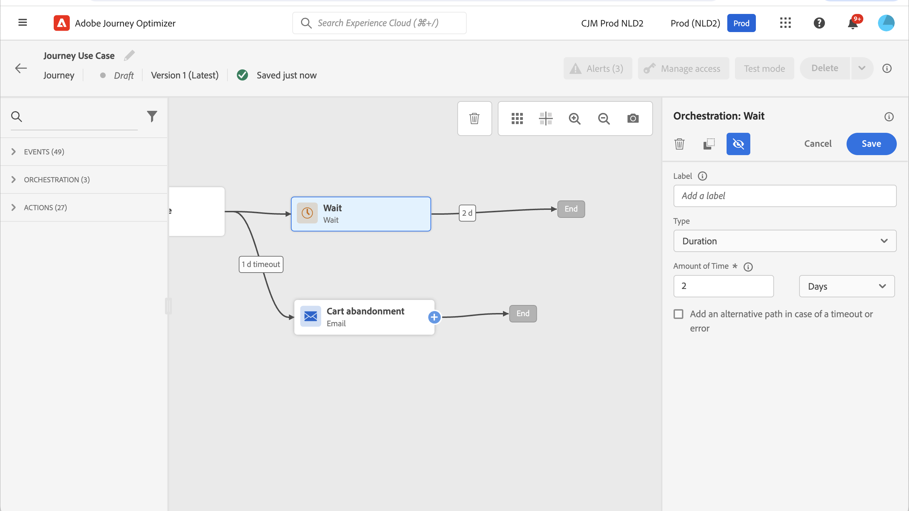

# Adobe Analytics-integratie {#analytics-data}

## Adobe Analytics- of Web SDK-gegevens gebruiken {#leverage-analytics-data}

U kunt alle webgedragsgebeurtenisgegevens (via Adobe Analytics of Web SDK) die u al vastlegt en streamt naar Adobe Experience Platform, benutten om reizen te starten en ervaringen voor uw klanten te automatiseren.

>[!NOTE]
>
>Deze sectie is slechts op regel-gebaseerde gebeurtenissen en klanten van toepassing die Adobe Analytics of gegevens moeten gebruiken WebSDK.

Als u dit wilt doen met Adobe Analytics, moet u in Adobe Experience Platform de rapportsuite activeren die u wilt gebruiken. Volg de onderstaande stappen om dit te doen:

1. Verbinding maken met Adobe Experience Platform en bladeren naar **[!UICONTROL Sources]**.

1. Selecteer in de sectie Adobe Analytics de optie **[!UICONTROL Add data]**

   

1. Selecteer in de lijst met beschikbare Adobe Analytics-rapportsuites de optie **[!UICONTROL Report suite]** om in te schakelen. Klik vervolgens op **[!UICONTROL Next]**.

   

1. Kies of u een standaardschema of een aangepast schema wilt gebruiken.

1. Van de **[!UICONTROL Dataflow detail]** scherm, kies een **[!UICONTROL Dataflow name]**.

1. Nadat de configuratie is voltooid, klikt u op **[!UICONTROL Finish]**.

   

Dit laat de bron van Analytics schakelaar voor die rapportreeks toe. Telkens wanneer de gegevens binnenkomen, worden ze omgezet in een Experience-gebeurtenis en verzonden naar Adobe Experience Platform.

Meer informatie over de Adobe Analytics-bronconnector in  [Adobe Experience Platform-documentatie](https://experienceleague.adobe.com/docs/experience-platform/sources/connectors/adobe-applications/analytics.html){target=&quot;_blank&quot;} en [zelfstudie](https://experienceleague.adobe.com/docs/experience-platform/sources/ui-tutorials/create/adobe-applications/analytics.html){target=&quot;_blank&quot;}.

## Een reis maken met een gebeurtenis met Adobe Analytics of Web SDK-gegevens {#event-analytics}

Nadat u uw integratie met Adobe Analytics met de [Adobe Analytics-bronnen](#leverage-analytics-data) of met de [Adobe Experience Platform Web SDK](https://experienceleague.adobe.com/docs/experience-platform/edge/home.html)kunt u een gebeurtenis maken die later tijdens een reis kan worden gebruikt.

In dit voorbeeld richten we ons op gebruikers die een product aan hun winkelwagentjes hebben toegevoegd:

* Als de bestelling is voltooid, ontvangen ze twee dagen later een vervolgbericht om feedback te vragen.
* Als de bestelling niet is voltooid, ontvangen zij een e-mail om hen eraan te herinneren de bestelling te voltooien.

1. Vanuit Adobe Journey Optimizer opent u de **[!UICONTROL Configuration]** -menu.

1. Selecteer vervolgens **[!UICONTROL Manage]** van de **[!UICONTROL Events]** kaart.

   

1. Klik op **[!UICONTROL Create event]**. Het deelvenster voor gebeurtenisconfiguratie wordt aan de rechterkant van het scherm geopend.

1. Vul de **[!UICONTROL Event]** parameters:

   * **[!UICONTROL Name]**: Pas de naam van uw **[!UICONTROL Event]**.
   * **[!UICONTROL Type]**: Kies de optie **[!UICONTROL Unitary]** Type. [Meer informatie](../event/about-events.md)
   * **[!UICONTROL Event ID type]**: Kies de optie **[!UICONTROL Rule based]** Type gebeurtenis-id. [Meer informatie](../event/about-events.md#event-id-type)
   * **[!UICONTROL Schema]**: Selecteer het Analytics- of WebSDK-schema dat in de bovenstaande sectie is gemaakt.
   * **[!UICONTROL Fields]**: Selecteer de velden Payload. [Meer informatie](../event/about-creating.md#define-the-payload-fields)
   * **[!UICONTROL Event ID condition]**: Bepaal de voorwaarde die door het systeem zal worden gebruikt om de gebeurtenissen te identificeren die uw reis zullen teweegbrengen.

      Hier wordt de gebeurtenis geactiveerd wanneer klanten een item aan hun winkelwagentjes toevoegen.
   * **[!UICONTROL Profile Identifier]**: Kies een veld in uw payload-velden of definieer een formule om de persoon te identificeren die aan de gebeurtenis is gekoppeld.

   

1. Indien geconfigureerd, selecteert u **[!UICONTROL Save]**. Uw gebeurtenis is nu klaar om op reis te worden gebruikt.

1. Van de **[!UICONTROL Journeys]**, kunt u nu beginnen uw reis te maken. Raadpleeg [deze sectie](../building-journeys/journey-gs.md) voor meer informatie.

1. Voeg uw eerder gevormde gebeurtenissen van Analytics aan uw reis toe.

   

1. Voeg een Gebeurtenis toe die zal teweegbrengen als een orde wordt voltooid.

1. Van uw **[!UICONTROL Event menu]**, selecteert u de **[!UICONTROL Define the event timeout]** en **[!UICONTROL Set a timeout path]** opties.

   

1. Voeg vanaf het time-outpad een **[!UICONTROL Email]** handeling. Dit pad wordt gebruikt om een e-mail te sturen naar klanten die geen bestelling hebben voltooid om hen eraan te herinneren dat hun winkelwagentjes nog steeds beschikbaar zijn.

1. Voeg een **[!UICONTROL Wait]** activiteit na uw belangrijkste weg en plaats het aan de gewenste duur.

   

1. Voeg vervolgens een **[!UICONTROL Email action]**. In deze e-mail worden de klanten gevraagd feedback te geven over de geplaatste bestelling.

U kunt uw reis nu publiceren nadat u de geldigheid ervan hebt getest. [Meer informatie](../building-journeys/publishing-the-journey.md)

