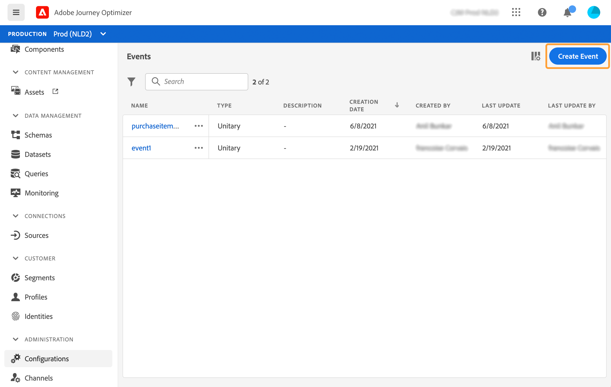
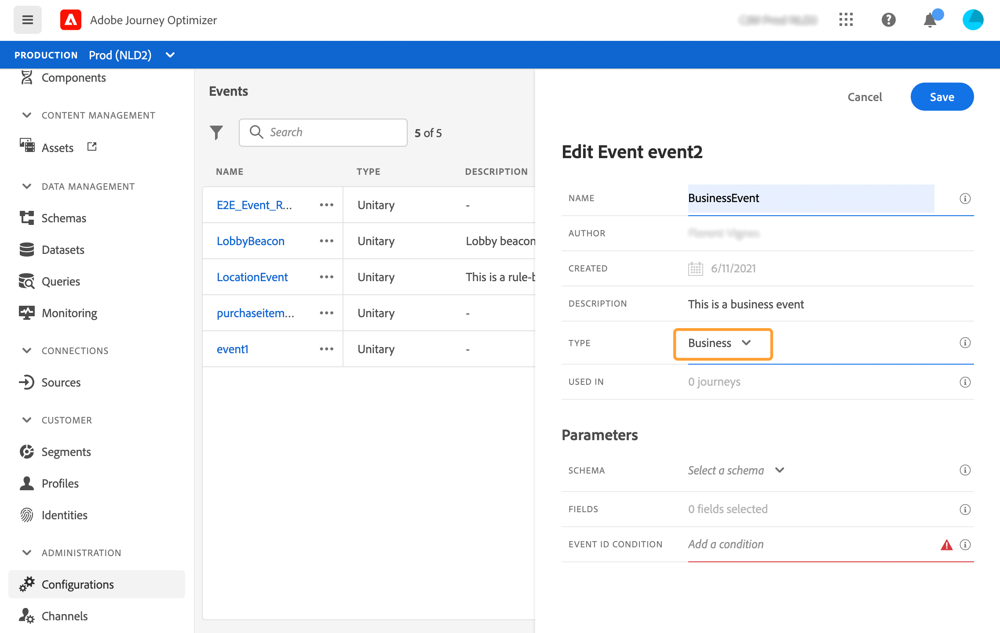

# Een bedrijfsgebeurtenis configureren {#configure-a-business-event}

In tegenstelling tot eenheidsgebeurtenissen zijn bedrijfsgebeurtenissen niet gekoppeld aan een specifiek profiel. Het type gebeurtenis-identiteitskaart is altijd op regel-gebaseerd. Lees meer over bedrijfsgebeurtenissen in [deze sectie](../event/about-events.md).

Leessegment gebaseerde reizen kunnen in één schot, door een planner op regelmatige basis of door een bedrijfsgebeurtenis worden teweeggebracht, wanneer de gebeurtenis voorkomt.

Bedrijfsevenementen kunnen &quot;een product is weer in voorraad&quot;, &quot;de aandelenprijs van een bedrijf bereikt een bepaalde waarde&quot;, enz. zijn.

## Belangrijke opmerkingen

* Het gebeurtenisschema moet een primaire identiteit bevatten.
* De bedrijfsgebeurtenissen kunnen slechts als eerste stap van een reis worden gelaten vallen.
* Wanneer het laten vallen van een bedrijfsgebeurtenis als eerste stap van een reis, zal het plannertype van de reis &quot;bedrijfsgebeurtenis&quot;zijn.
* Slechts kan een gelezen segmentactiviteit na een bedrijfsgebeurtenis worden gelaten vallen. Deze wordt automatisch toegevoegd als de volgende stap.
* Als u meerdere zakelijke gebeurtenisuitvoeringen wilt toestaan, activeert u de corresponderende optie in het gedeelte **[!UICONTROL Execution]** van de eigendommen van de rit.
* Nadat een bedrijfsgebeurtenis in werking wordt gesteld, zal er een vertraging zijn om het segment van 15 minuten naar tot één uur te hebben uitgevoerd.
* Wanneer het testen van een bedrijfsgebeurtenis, moet u de gebeurtenisparameters en het herkenningsteken van het testprofiel overgaan dat de reis in test zal ingaan. Bij het testen van een op zakelijke gebeurtenissen gebaseerde reis kunt u bovendien slechts één profielingang activeren. Zie [deze sectie](../building-journeys/testing-the-journey.md#test-business). In de testmodus is de modus &quot;Codeweergave&quot; niet beschikbaar.
* Wat gebeurt er met individuen die momenteel op reis zijn als een nieuw bedrijfsevenement aankomt? Het gedraagt zich op dezelfde manier als wanneer individuen zich nog steeds in een terugkerende reis bevinden wanneer zich een nieuwe terugkerende situatie voordoet. Hun pad is beëindigd. Als gevolg hiervan moeten marketeers aandacht besteden aan het vermijden van het bouwen van te lange reizen als ze veelvuldige bedrijfsgebeurtenissen verwachten.

## Meerdere bedrijfsgebeurtenissen

Hier zijn een paar belangrijke nota&#39;s die van toepassing zijn wanneer de veelvoudige bedrijfsgebeurtenissen in een rij worden ontvangen.

**Wat is het gedrag wanneer het ontvangen van een bedrijfsgebeurtenis terwijl de reis verwerkt?**

Bedrijfsgebeurtenissen volgen de regels voor herintreding op dezelfde manier als voor monitaire gebeurtenissen. Als een reis hertoegang toestaat, zal de volgende bedrijfsgebeurtenis worden verwerkt.

**Wat zijn de garanties om overbelasting van materialistische segmenten te voorkomen?**

Voor bedrijfsgebeurtenissen, wordt het onderwerp herbruikbaarheid geplaatst aan één uur. Dit betekent dat voor een bepaalde reis, in een tijdsperiode van 1 uur, geen nieuwe uitvoerbaan wordt gecreeerd. Gegevens die door de eerste gebeurtenistaak worden geduwd, worden opnieuw gebruikt. Voor geregelde reizen is er geen spoor.

## Aan de slag met bedrijfsgebeurtenissen

Hier zijn de eerste stappen om een bedrijfsgebeurtenis te vormen:

1. Selecteer **[!UICONTROL Configurations]** in de sectie van het menu BEHEER. Klik in de sectie **[!UICONTROL Events]** op **[!UICONTROL Manage]**. De lijst met gebeurtenissen wordt weergegeven.

   

1. Klik op **[!UICONTROL Create Event]** om een nieuwe gebeurtenis te maken. Het deelvenster voor gebeurtenisconfiguratie wordt aan de rechterkant van het scherm geopend.

   

1. Voer de naam van de gebeurtenis in. U kunt ook een beschrijving toevoegen.

   

   >[!NOTE]
   >
   >Gebruik geen spaties of speciale tekens. Gebruik niet meer dan 30 tekens.

1. Kies **[!UICONTROL Type]** in het veld **Zakelijk**.

   

1. Het aantal journey’s dat deze gebeurtenis gebruikt, wordt in het veld **[!UICONTROL Used in]** weergegeven. U kunt klikken op het pictogram **[!UICONTROL View journeys]** om de lijst weer te geven met journey’s die deze gebeurtenis gebruiken.

1. Definieer het schema en de payload velden: Hier selecteert u de gebeurtenisinformatie (gewoonlijk een lading genoemd) die reizen verwacht te ontvangen. U kunt deze informatie vervolgens gebruiken tijdens uw journey. Zie [deze sectie](../event/about-creating-business.md#define-the-payload-fields).

   

   Er zijn alleen tijdreeksschema&#39;s beschikbaar. Er zijn geen schema&#39;s beschikbaar voor ervaringsgebeurtenissen, beslissingsgebeurtenissen en trapsgewijze gebeurtenissen. Het gebeurtenisschema moet een primaire identiteit bevatten.

   

1. Klik in het veld **[!UICONTROL Event ID condition]**. Gebruikend de eenvoudige uitdrukkingsredacteur, bepaal de voorwaarde die door het systeem zal worden gebruikt om de gebeurtenissen te identificeren die uw reis zullen teweegbrengen.
   

   In ons voorbeeld schreven we een voorwaarde op basis van de id van het product. Dit betekent dat wanneer het systeem een gebeurtenis ontvangt die aan deze voorwaarde voldoet, het het aan reizen zal overgaan.

   >[!NOTE]
   >
   >In de eenvoudige expressie-editor zijn niet alle operatoren beschikbaar, maar zijn ze afhankelijk van het gegevenstype. Voor een tekenreekstype kunt u bijvoorbeeld &quot;contains&quot; of &quot;equal to&quot; gebruiken.

1. Klik op **[!UICONTROL Save]**.

   

   De gebeurtenis is nu geconfigureerd en klaar om in een journey worden gezet. Er zijn aanvullende configuratiestappen nodig om gebeurtenissen te ontvangen. Zie [deze pagina](../event/additional-steps-to-send-events-to-journey-orchestration.md).

## De laadvelden definiëren {#define-the-payload-fields}

De ladingsdefinitie staat u toe om de informatie te kiezen het systeem van de gebeurtenis in uw reis verwacht te ontvangen en de sleutel om te identificeren welke persoon aan de gebeurtenis wordt geassocieerd. De nuttige lading is gebaseerd op de Experience Cloud XDM gebiedsdefinitie. Voor meer informatie over XDM, verwijs naar [Adobe Experience Platform documentatie](https://experienceleague.adobe.com/docs/experience-platform/xdm/home.html?lang=nl){target=&quot;_blank&quot;}.

1. Selecteer een XDM-schema in de lijst en klik op het veld **[!UICONTROL Fields]** of op het pictogram **[!UICONTROL Edit]**.

   

   Alle velden die in het schema zijn gedefinieerd, worden weergegeven. De lijst met velden verschilt per schema. U kunt naar een specifiek veld zoeken of de filters gebruiken om alle knooppunten en velden of alleen de geselecteerde velden weer te geven. Volgens de schemadefinitie zijn sommige velden mogelijk verplicht en vooraf geselecteerd. U kunt de selectie niet opheffen. Alle velden die verplicht zijn voor een goede ontvangst van de gebeurtenis tijdens de reis, zijn standaard geselecteerd.

   

1. Selecteer de velden die u van de gebeurtenis wilt ontvangen. Dit zijn de gebieden die de bedrijfsgebruiker in de reis zal hefboomwerking hebben.

1. Wanneer u klaar bent met het selecteren van de benodigde velden, klikt u op **[!UICONTROL Save]** of drukt u op **[!UICONTROL Enter]**.

   Het aantal geselecteerde velden wordt weergegeven in het veld **[!UICONTROL Fields]**.

   

## Een voorvertoning van de lading weergeven {#preview-the-payload}

Met de voorvertoning van de lading kunt u de definitie van de lading valideren.

1. Klik op het pictogram **[!UICONTROL View Payload]** om een voorvertoning weer te geven van de lading die door het systeem wordt verwacht.

   

   U ziet dat de geselecteerde velden worden weergegeven.

   

1. Controleer de voorvertoning om de definitie van de payload te valideren.

1. Vervolgens kunt u de voorvertoning van de lading delen met de persoon die verantwoordelijk is voor het verzenden van de gebeurtenis. Deze lading kan hem helpen de opstelling van een gebeurtenis ontwerpen die aan [!DNL Journey Optimizer] duikt. Zie [deze pagina](../event/additional-steps-to-send-events-to-journey-orchestration.md).
