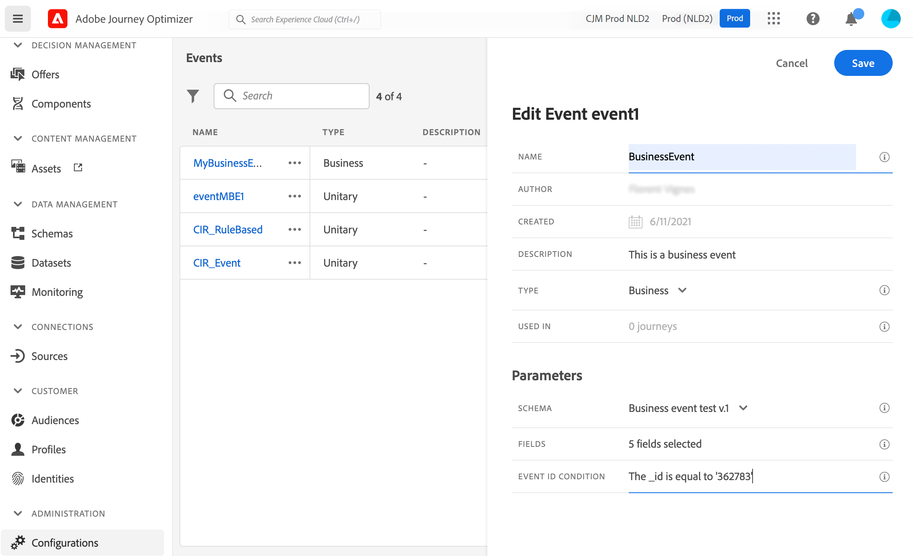
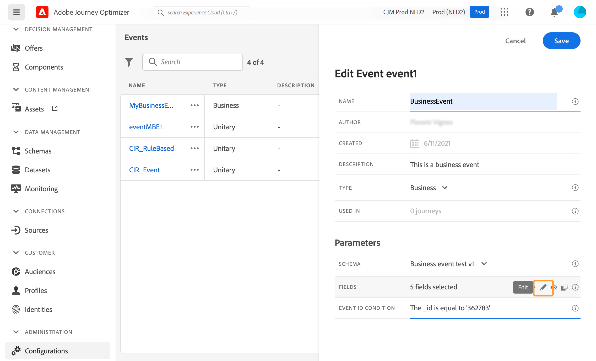
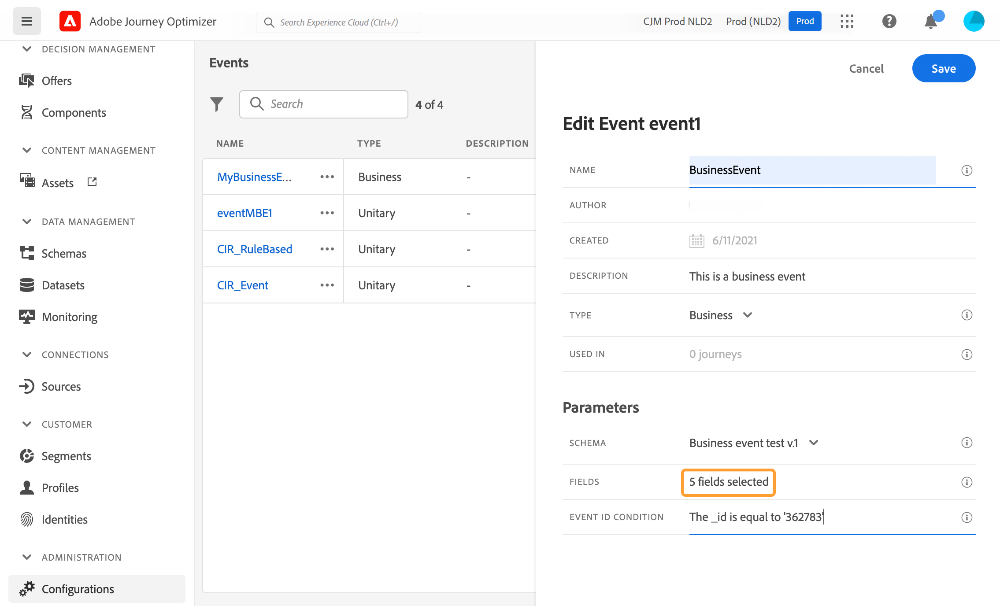
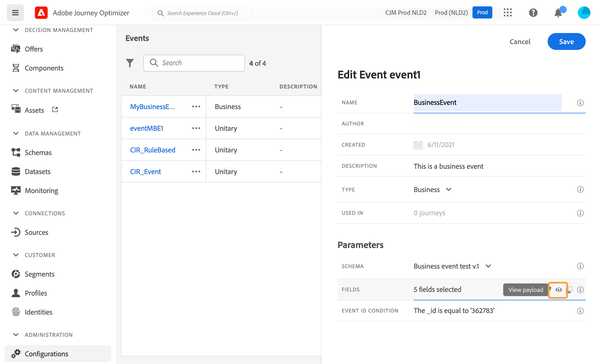

# Een bedrijfsgebeurtenis configureren {#configure-a-business-event}

>[!CONTEXTUALHELP]
>id="ajo_journey_event_business"
>title="Zakelijke gebeurtenissen"
>abstract="Met de gebeurtenisconfiguratie kunt u de informatie definiëren die Journey Optimizer ontvangt als gebeurtenissen. U kunt meerdere gebeurtenissen gebruiken (in verschillende stappen van een reis) en verschillende reizen kunnen dezelfde gebeurtenis gebruiken. In tegenstelling tot eenheidsgebeurtenissen zijn bedrijfsgebeurtenissen niet gekoppeld aan een specifiek profiel. Het type gebeurtenis-identiteitskaart is altijd op regel-gebaseerd."

In tegenstelling tot eenheidsgebeurtenissen zijn bedrijfsgebeurtenissen niet gekoppeld aan een specifiek profiel. Het type gebeurtenis-identiteitskaart is altijd op regel-gebaseerd. Lees meer over bedrijfsgebeurtenissen in [deze sectie](../event/about-events.md).

Leessegment gebaseerde reizen kunnen in één schot, door een planner op regelmatige basis of door een bedrijfsgebeurtenis worden teweeggebracht, wanneer de gebeurtenis voorkomt.

Bedrijfsevenementen kunnen &quot;een product is weer in voorraad&quot;, &quot;de aandelenprijs van een bedrijf bereikt een bepaalde waarde&quot;, enz. zijn.

>[!NOTE]
>
>U kunt ook naar de gebruiksscenario&#39;s van bedrijfsgebeurtenissen kijken [zelfstudie](https://experienceleague.adobe.com/docs/journey-optimizer-learn/tutorials/create-journeys/use-case-business-event.html). Merk op dat het schema niet voor profiel te hoeven worden toegelaten.

## Belangrijke opmerkingen {#important-notes}

* Er zijn alleen tijdreeksschema&#39;s beschikbaar. Er zijn geen schema&#39;s beschikbaar voor ervaringsgebeurtenissen, beslissingsgebeurtenissen en trapsgewijze gebeurtenissen.
* Het gebeurtenisschema moet een primaire identiteit bevatten die niet op personen is gebaseerd. De volgende velden moeten zijn geselecteerd wanneer u de gebeurtenis definieert: `_id` en `timestamp`
* De bedrijfsgebeurtenissen kunnen slechts als eerste stap van een reis worden gelaten vallen.
* Wanneer het laten vallen van een bedrijfsgebeurtenis als eerste stap van een reis, zal het plannertype van de reis &quot;bedrijfsgebeurtenis&quot;zijn.
* Slechts kan een gelezen segmentactiviteit na een bedrijfsgebeurtenis worden gelaten vallen. Deze wordt automatisch toegevoegd als de volgende stap.
* Als u meerdere bedrijfsgebeurtenissen wilt uitvoeren, activeert u de bijbehorende optie in het dialoogvenster **[!UICONTROL Execution]** sectie van de reiseigenschappen.
* Nadat een bedrijfsgebeurtenis in werking wordt gesteld, zal er een vertraging zijn om het segment van 15 minuten naar tot één uur te hebben uitgevoerd.
* Wanneer het testen van een bedrijfsgebeurtenis, moet u de gebeurtenisparameters en het herkenningsteken van het testprofiel overgaan dat de reis in test zal ingaan. Bij het testen van een op zakelijke gebeurtenissen gebaseerde reis kunt u bovendien slechts één profielingang activeren. Zie [deze sectie](../building-journeys/testing-the-journey.md#test-business). In de testmodus is de modus &quot;Codeweergave&quot; niet beschikbaar.
* Wat gebeurt er met individuen die momenteel op reis zijn als een nieuw bedrijfsevenement aankomt? Het gedraagt zich op dezelfde manier als wanneer individuen zich nog steeds in een terugkerende reis bevinden wanneer zich een nieuwe terugkerende situatie voordoet. Hun pad is beëindigd. Als gevolg hiervan moeten marketeers aandacht besteden aan het vermijden van het bouwen van te lange reizen als ze veelvuldige bedrijfsgebeurtenissen verwachten.

## Meerdere bedrijfsgebeurtenissen {#multiple-business-events}

Hier zijn een paar belangrijke nota&#39;s die van toepassing zijn wanneer de veelvoudige bedrijfsgebeurtenissen in een rij worden ontvangen.

**Wat is het gedrag wanneer het ontvangen van een bedrijfsgebeurtenis terwijl de reis verwerkt?**

Bedrijfsgebeurtenissen volgen de regels voor herintreding op dezelfde manier als voor monitaire gebeurtenissen. Als een reis hertoegang toestaat, zal de volgende bedrijfsgebeurtenis worden verwerkt.

**Wat zijn de garanties om overbelasting van materialistische segmenten te voorkomen?**

In het geval van on-shot bedrijfsgebeurtenissen, voor een bepaalde reis, worden de gegevens die door de eerste gebeurtenisbaan worden geduwd opnieuw gebruikt tijdens een tijdvenster van 1 uur. Voor geregelde reizen is er geen spoor. Meer informatie over segmenten in het dialoogvenster [Adobe Experience Platform Segmentation Service-documentatie](https://experienceleague.adobe.com/docs/experience-platform/segmentation/home.html).

## Aan de slag met bedrijfsgebeurtenissen {#gs-business-events}

Hier zijn de eerste stappen om een bedrijfsgebeurtenis te vormen:

1. Selecteer in de sectie van het menu ADMINISTRATIE de optie **[!UICONTROL Configurations]**. In de  **[!UICONTROL Events]** sectie, klikt u op **[!UICONTROL Manage]**. De lijst met gebeurtenissen wordt weergegeven.

   

1. Klik op **[!UICONTROL Create Event]** om een nieuwe gebeurtenis te maken. Het deelvenster voor gebeurtenisconfiguratie wordt aan de rechterkant van het scherm geopend.

   

1. Voer de naam van de gebeurtenis in. U kunt ook een beschrijving toevoegen.

   

   >[!NOTE]
   >
   >Gebruik geen spaties of speciale tekens. Gebruik niet meer dan 30 tekens.

1. In de **[!UICONTROL Type]** veld, kies **Zakelijk**.

   

1. Het aantal journey’s dat deze gebeurtenis gebruikt, wordt in het veld **[!UICONTROL Used in]** weergegeven. U kunt klikken op het pictogram **[!UICONTROL View journeys]** om de lijst weer te geven met journey’s die deze gebeurtenis gebruiken.

1. Definieer het schema en de payload velden: Hier selecteert u de gebeurtenisinformatie (of lading) die de reis verwacht te ontvangen. Deze gegevens gebruikt u later op de reis. Zie [deze sectie](../event/about-creating-business.md#define-the-payload-fields).

   

   Er zijn alleen tijdreeksschema&#39;s beschikbaar. `Experience Events`, `Decision Events` en `Journey Step Events` schema&#39;s zijn niet beschikbaar. Het gebeurtenisschema moet een primaire identiteit bevatten die niet op personen is gebaseerd. De volgende velden moeten zijn geselecteerd wanneer u de gebeurtenis definieert: `_id` en `timestamp`

   

1. Klik in het dialoogvenster **[!UICONTROL Event ID condition]** veld. Gebruik de eenvoudige uitdrukkingsredacteur om de voorwaarde te bepalen die door het systeem wordt gebruikt om de gebeurtenissen te identificeren die uw reis teweegbrengen.

   

   In ons voorbeeld schreven we een voorwaarde op basis van de id van het product. Dit betekent dat wanneer het systeem een gebeurtenis ontvangt die aan deze voorwaarde voldoet, het het aan reizen zal overgaan.

   >[!NOTE]
   >
   >In de eenvoudige expressie-editor zijn niet alle operatoren beschikbaar, maar zijn ze afhankelijk van het gegevenstype. Voor een tekenreekstype kunt u bijvoorbeeld &quot;contains&quot; of &quot;equal to&quot; gebruiken.

1. Klik op **[!UICONTROL Save]**.

   

   De gebeurtenis is nu geconfigureerd en klaar om in een journey worden gezet. Er zijn aanvullende configuratiestappen nodig om gebeurtenissen te ontvangen. Meer informatie in [deze pagina](../event/additional-steps-to-send-events-to-journey.md).

## De laadvelden definiëren {#define-the-payload-fields}

De ladingsdefinitie staat u toe om de informatie te kiezen het systeem van de gebeurtenis in uw reis verwacht te ontvangen en de sleutel om te identificeren welke persoon aan de gebeurtenis wordt geassocieerd. De nuttige lading is gebaseerd op de Experience Cloud XDM gebiedsdefinitie. Voor meer informatie over XDM, verwijs naar [Adobe Experience Platform-documentatie](https://experienceleague.adobe.com/docs/experience-platform/xdm/home.html){target=&quot;_blank&quot;}.

1. Selecteer een XDM-schema in de lijst en klik op de knop **[!UICONTROL Fields]** of op **[!UICONTROL Edit]** pictogram.

   

   Alle velden die in het schema zijn gedefinieerd, worden weergegeven. De lijst met velden verschilt per schema. U kunt naar een specifiek veld zoeken of de filters gebruiken om alle knooppunten en velden of alleen de geselecteerde velden weer te geven. Volgens de schemadefinitie zijn sommige velden mogelijk verplicht en vooraf geselecteerd. U kunt de selectie niet opheffen. Alle velden die verplicht zijn voor een goede ontvangst van de gebeurtenis tijdens de reis, zijn standaard geselecteerd.

   

   >[!NOTE]
   >
   > Controleer of de volgende velden zijn geselecteerd: `_id` en `timestamp`

1. Selecteer de velden die u van de gebeurtenis wilt ontvangen. Dit zijn de gebieden die de bedrijfsgebruiker in de reis zal hefboomwerking hebben.

1. Als u de gewenste velden hebt geselecteerd, klikt u op **[!UICONTROL Save]** of drukken **[!UICONTROL Enter]**.

   Het aantal geselecteerde velden wordt weergegeven in **[!UICONTROL Fields]**.

   

## Een voorvertoning van de lading weergeven {#preview-the-payload}

Gebruik de voorvertoning van de lading om de ladingsdefinitie te bevestigen.

1. Klik op de knop **[!UICONTROL View Payload]** pictogram voor een voorvertoning van de lading die door het systeem wordt verwacht.

   

   U ziet dat de geselecteerde velden worden weergegeven.

   

1. Controleer de voorvertoning om de definitie van de payload te valideren.

1. Vervolgens kunt u de voorvertoning van de lading delen met de persoon die verantwoordelijk is voor het verzenden van de gebeurtenis. Deze nuttige lading kan hen helpen de opstelling ontwerpen van een gebeurtenis die duikt aan [!DNL Journey Optimizer]. Zie [deze pagina](../event/additional-steps-to-send-events-to-journey.md).
