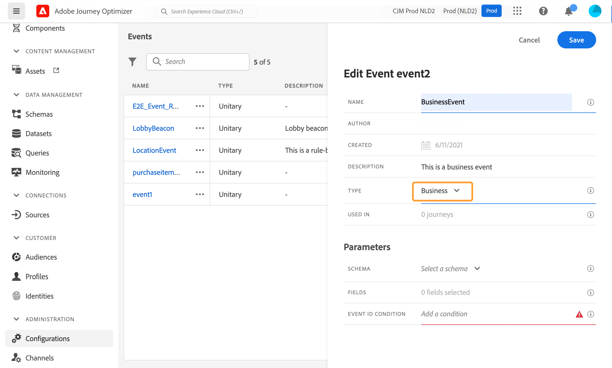

# Een bedrijfsgebeurtenis configureren {#configure-a-business-event}

>[!CONTEXTUALHELP]
>id="ajo_journey_event_business"
>title="Zakelijke gebeurtenissen"
>abstract="Met de gebeurtenisconfiguratie kunt u de informatie definiëren die Journey Optimizer ontvangt als gebeurtenissen. U kunt meerdere gebeurtenissen gebruiken (in verschillende stappen van een reis) en verschillende reizen kunnen dezelfde gebeurtenis gebruiken. In tegenstelling tot eenheidsgebeurtenissen zijn bedrijfsgebeurtenissen niet gekoppeld aan een specifiek profiel. Het type gebeurtenis-identiteitskaart is altijd op regel-gebaseerd."

In tegenstelling tot eenheidsgebeurtenissen zijn bedrijfsgebeurtenissen niet gekoppeld aan een specifiek profiel. Het type gebeurtenis-identiteitskaart is altijd op regel-gebaseerd. Lees meer op bedrijfsgebeurtenissen in [ deze sectie ](../event/about-events.md).

Op het publiek gebaseerde reizen kunnen in één opname, door een planner op een regelmatige basis of door een bedrijfsgebeurtenis worden geactiveerd, wanneer de gebeurtenis voorkomt.

Bedrijfsevenementen kunnen &quot;een product is weer in voorraad&quot;, &quot;de aandelenprijs van een bedrijf bereikt een bepaalde waarde&quot;, enz. zijn.

>[!NOTE]
>
>U kunt ook op het geval van het bedrijfsgebeurtenisgebruik [ leerprogramma ](https://experienceleague.adobe.com/en/docs/journey-optimizer-learn/tutorials/journeys/use-case-business-event){target="_blank"} letten. Merk op dat het schema niet voor profiel te hoeven worden toegelaten.

## Belangrijke opmerkingen {#important-notes}

* Er zijn alleen tijdreeksschema&#39;s beschikbaar. Er zijn geen schema&#39;s beschikbaar voor ervaringsgebeurtenissen, beslissingsgebeurtenissen en trapsgewijze gebeurtenissen.
* Het gebeurtenisschema moet een primaire identiteit bevatten die niet op personen is gebaseerd. De volgende velden moeten zijn geselecteerd wanneer u de gebeurtenis definieert: `_id` en `timestamp`
* De bedrijfsgebeurtenissen kunnen slechts als eerste stap van een reis worden gelaten vallen.
* Wanneer het laten vallen van een bedrijfsgebeurtenis als eerste stap van een reis, zal het plannertype van de reis &quot;bedrijfsgebeurtenis&quot;zijn.
* Na een zakelijke gebeurtenis kan alleen een activiteit voor een gelezen publiek worden neergezet. Deze wordt automatisch toegevoegd als de volgende stap.
* Als u meerdere bedrijfsgebeurtenissen wilt uitvoeren, activeert u de bijbehorende optie in het gedeelte **[!UICONTROL Execution]** van de eigenschappen van de gebeurtenis.
* Nadat een bedrijfsgebeurtenis in werking wordt gesteld, zal er een vertraging zijn om het publiek te hebben uitgevoerd van 15 minuten aan tot één uur.
* Wanneer het testen van een bedrijfsgebeurtenis, moet u de gebeurtenisparameters en het herkenningsteken van het testprofiel overgaan dat de reis in test zal ingaan. Bij het testen van een op zakelijke gebeurtenissen gebaseerde reis kunt u bovendien slechts één profielingang activeren. Zie [ deze sectie ](../building-journeys/testing-the-journey.md#test-business). In de testmodus is de modus &quot;Codeweergave&quot; niet beschikbaar.
* Wat gebeurt er met individuen die momenteel op reis zijn als een nieuw bedrijfsevenement aankomt? Het gedraagt zich op dezelfde manier als wanneer individuen zich nog steeds in een terugkerende reis bevinden wanneer zich een nieuwe terugkerende situatie voordoet. Hun pad is beëindigd. Als gevolg hiervan moeten marketeers aandacht besteden aan het vermijden van het bouwen van te lange reizen als ze veelvuldige bedrijfsgebeurtenissen verwachten.
* Zakelijke evenementen kunnen niet worden gebruikt in combinatie met monitaire evenementen of kwalificatieactiviteiten voor het publiek.

## Meerdere bedrijfsgebeurtenissen {#multiple-business-events}

Hier zijn een paar belangrijke nota&#39;s die van toepassing zijn wanneer de veelvoudige bedrijfsgebeurtenissen in een rij worden ontvangen.

**wat is het gedrag wanneer het ontvangen van een bedrijfsgebeurtenis terwijl de reis verwerkt?**

Zakelijke gebeurtenissen volgen op dezelfde manier als voor eenheidsgebeurtenissen. Als een reis terugkeer toestaat, zal de volgende bedrijfsgebeurtenis worden verwerkt.

**wat zijn de gidsen om overladende materialized publiek te vermijden?**

In het geval van on-shot bedrijfsgebeurtenissen, voor een bepaalde reis, worden de gegevens die door de eerste gebeurtenisbaan worden geduwd opnieuw gebruikt tijdens een tijdvenster van 1 uur. Voor geregelde reizen is er geen spoor. Leer meer over publiek in de [ documentatie van de Dienst van de Segmentatie van Adobe Experience Platform ](https://experienceleague.adobe.com/docs/experience-platform/segmentation/home.html){target="_blank"}.

## Aan de slag met bedrijfsgebeurtenissen {#gs-business-events}

Hier zijn de eerste stappen om een bedrijfsgebeurtenis te vormen:

1. Selecteer **[!UICONTROL Configurations]** in de sectie van het menu BEHEER. Klik in de sectie **[!UICONTROL Events]** op **[!UICONTROL Manage]** . De lijst met gebeurtenissen wordt weergegeven.

   

1. Klik op **[!UICONTROL Create Event]** om een nieuwe gebeurtenis te maken. Het deelvenster voor gebeurtenisconfiguratie wordt aan de rechterkant van het scherm geopend.

   

1. Voer de naam van de gebeurtenis in. U kunt ook een beschrijving toevoegen.

   

   >[!NOTE]
   >
   >Alleen alfanumerieke tekens en onderstrepingstekens zijn toegestaan. De maximumlengte is 30 tekens.

1. Op het **[!UICONTROL Type]** gebied, kies **Zaken**.

   

1. Het aantal journey’s dat deze gebeurtenis gebruikt, wordt in het veld **[!UICONTROL Used in]** weergegeven. U kunt klikken op het pictogram **[!UICONTROL View journeys]** om de lijst weer te geven met journey’s die deze gebeurtenis gebruiken.

1. Definieer het schema en de payload-velden: hier selecteert u de gebeurtenisgegevens (of de nuttige lading) die u wilt ontvangen. Deze gegevens gebruikt u later op de reis. Zie [deze sectie](../event/about-creating-business.md#define-the-payload-fields).

   

   Er zijn alleen tijdreeksschema&#39;s beschikbaar. schema&#39;s `Experience Events` , `Decision Events` en `Journey Step Events` zijn niet beschikbaar. Het gebeurtenisschema moet een primaire identiteit bevatten die niet op personen is gebaseerd. De volgende velden moeten zijn geselecteerd wanneer u de gebeurtenis definieert: `_id` en `timestamp`

   

1. Klik in het veld **[!UICONTROL Event ID condition]** . Gebruik de eenvoudige uitdrukkingsredacteur om de voorwaarde te bepalen die door het systeem wordt gebruikt om de gebeurtenissen te identificeren die uw reis teweegbrengen.

   

   In ons voorbeeld schreven we een voorwaarde op basis van de id van het product. Dit betekent dat wanneer het systeem een gebeurtenis ontvangt die aan deze voorwaarde voldoet, het het aan reizen zal overgaan.

   >[!NOTE]
   >
   >In de eenvoudige expressie-editor zijn niet alle operatoren beschikbaar, maar zijn ze afhankelijk van het gegevenstype. Voor een tekenreekstype kunt u bijvoorbeeld &quot;contains&quot; of &quot;equal to&quot; gebruiken.

1. Klik op **[!UICONTROL Save]**.

   

   De gebeurtenis is nu geconfigureerd en klaar om in een journey worden gezet. Er zijn aanvullende configuratiestappen nodig om gebeurtenissen te ontvangen. Leer meer op [ deze pagina ](../event/additional-steps-to-send-events-to-journey.md).

## De laadvelden definiëren {#define-the-payload-fields}

De ladingsdefinitie staat u toe om de informatie te kiezen het systeem van de gebeurtenis in uw reis verwacht te ontvangen en de sleutel om te identificeren welke persoon aan de gebeurtenis wordt geassocieerd. De nuttige lading is gebaseerd op de Experience Cloud XDM gebiedsdefinitie. Voor meer informatie over XDM, verwijs naar [ documentatie van Adobe Experience Platform ](https://experienceleague.adobe.com/docs/experience-platform/xdm/home.html?lang=nl){target="_blank"}.

1. Selecteer een XDM-schema in de lijst en klik op het veld **[!UICONTROL Fields]** of op het pictogram **[!UICONTROL Edit]** .

   

   Alle velden die in het schema zijn gedefinieerd, worden weergegeven. De lijst met velden verschilt per schema. U kunt naar een specifiek veld zoeken of de filters gebruiken om alle knooppunten en velden of alleen de geselecteerde velden weer te geven. Volgens de schemadefinitie zijn sommige velden mogelijk verplicht en vooraf geselecteerd. U kunt de selectie niet opheffen. Alle velden die verplicht zijn voor een goede ontvangst van de gebeurtenis tijdens de reis, zijn standaard geselecteerd.

   

   >[!NOTE]
   >
   > Controleer of de volgende velden zijn geselecteerd: `_id` en `timestamp`

1. Selecteer de velden die u van de gebeurtenis wilt ontvangen. Dit zijn de gebieden die de bedrijfsgebruiker in de reis zal hefboomwerking hebben.

1. Klik op **[!UICONTROL Save]** of druk op **[!UICONTROL Enter]** wanneer u klaar bent met het selecteren van de benodigde velden.

   Het aantal geselecteerde velden wordt weergegeven in **[!UICONTROL Fields]** .

   

## Een voorvertoning van de lading weergeven {#preview-the-payload}

Gebruik de voorvertoning van de lading om de ladingsdefinitie te bevestigen.

1. Klik op het pictogram **[!UICONTROL View Payload]** om een voorvertoning weer te geven van de lading die door het systeem wordt verwacht.

   

   U ziet dat de geselecteerde velden worden weergegeven.

   

1. Controleer de voorvertoning om de definitie van de payload te valideren.

1. Vervolgens kunt u de voorvertoning van de lading delen met de persoon die verantwoordelijk is voor het verzenden van de gebeurtenis. Deze lading kan hen helpen de opstelling van een gebeurtenis ontwerpen die aan [!DNL Journey Optimizer] duwt. Zie [deze pagina](../event/additional-steps-to-send-events-to-journey.md).
