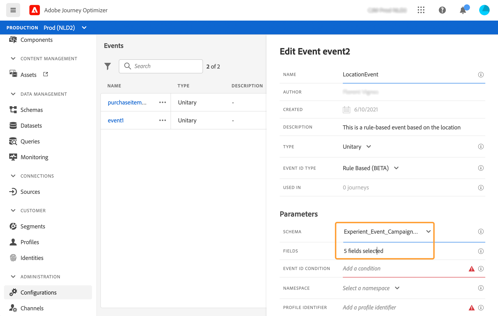
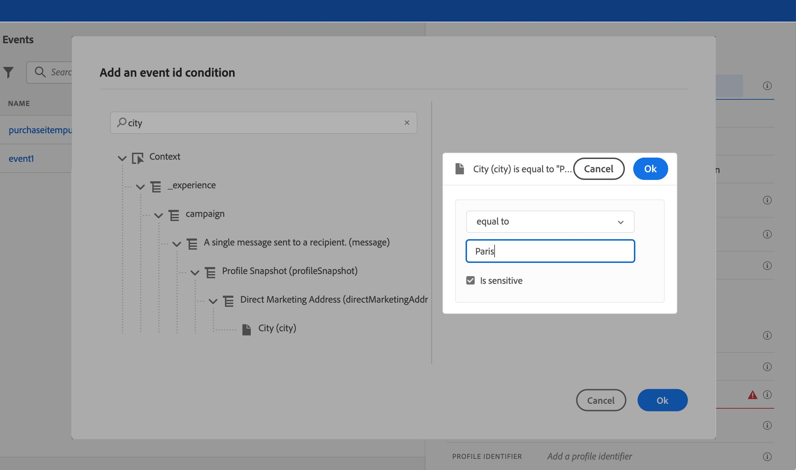

# Een eenheidsgebeurtenis configureren {#configure-an-event}

Eenheidsgebeurtenissen zijn gekoppeld aan een specifiek profiel. Zij kunnen op regel-gebaseerd of systeem-geproduceerd zijn.  Lees meer over eenheidsgebeurtenis [deze sectie](../event/about-events.md).

Hier volgen de eerste stappen voor het configureren van een nieuwe gebeurtenis:

1. Selecteer **[!UICONTROL Configurations]** in de sectie van het menu BEHEER. Klik in de sectie **[!UICONTROL Events]** op **[!UICONTROL Manage]**. De lijst met gebeurtenissen wordt weergegeven.

   

1. Klik op **[!UICONTROL Create Event]** om een nieuwe gebeurtenis te maken. Het deelvenster voor gebeurtenisconfiguratie wordt aan de rechterkant van het scherm geopend.

   

1. Voer de naam van de gebeurtenis in. U kunt ook een beschrijving toevoegen.

   

   >[!NOTE]
   >
   >Gebruik geen spaties of speciale tekens. Gebruik niet meer dan 30 tekens.

1. Kies **Eenheids** in het veld **[!UICONTROL Type]**.

   

1. Selecteer in het veld **[!UICONTROL Event ID type]** het type gebeurtenis-id dat u wilt gebruiken: **Op regel gebaseerd** of **Door systeem gegenereerd**. Lees meer over de types van gebeurtenisID in [deze sectie](../event/about-events.md#event-id-type).

   

1. Het aantal journey’s dat deze gebeurtenis gebruikt, wordt in het veld **[!UICONTROL Used in]** weergegeven. U kunt klikken op het pictogram **[!UICONTROL View journeys]** om de lijst weer te geven met journey’s die deze gebeurtenis gebruiken.

1. Definieer het schema en de payload velden: Hier selecteert u de gebeurtenisinformatie (gewoonlijk een lading genoemd) die reizen verwacht te ontvangen. U kunt deze informatie vervolgens gebruiken tijdens uw journey. Zie [deze sectie](../event/about-creating.md#define-the-payload-fields).

   

   >[!NOTE]
   >
   >Wanneer u het type **[!UICONTROL System Generated]** selecteert, zijn alleen schema&#39;s beschikbaar die het veld voor het type eventID hebben. Wanneer u het type **[!UICONTROL Rule Based]** selecteert, zijn alle schema&#39;s van de Gebeurtenis van de Ervaring beschikbaar.

1. Voor op regel-gebaseerde gebeurtenissen, klik binnen het **[!UICONTROL Event ID condition]** gebied. Gebruikend de eenvoudige uitdrukkingsredacteur, bepaal de voorwaarde die door het systeem zal worden gebruikt om de gebeurtenissen te identificeren die uw reis zullen teweegbrengen.
   

   In ons voorbeeld schreven we een voorwaarde op basis van de stad van het profiel. Dit betekent dat wanneer het systeem een gebeurtenis ontvangt die aan deze voorwaarde (**[!UICONTROL City]** gebied en **[!UICONTROL Paris]** waarde) aanpast, het het aan reizen zal overgaan.

   >[!NOTE]
   >
   >De geavanceerde uitdrukkingsredacteur is niet beschikbaar wanneer het bepalen van **[!UICONTROL Event ID condition]**.

1. Voeg een naamruimte toe. Deze stap is optioneel, maar wordt aangeraden, omdat u door het toevoegen van een naamruimte gegevens kunt gebruiken die zijn opgeslagen in de real-timeklantprofielservice. U definieert zo het type sleutel van de gebeurtenis. Zie [deze sectie](../event/about-creating.md#select-the-namespace).
1. Definieer de profiel-id: Kies een veld in uw payload-velden of definieer een formule om de persoon te identificeren die aan de gebeurtenis is gekoppeld. Deze sleutel wordt automatisch ingesteld (maar kan nog steeds worden bewerkt) als u een naamruimte selecteert. Reizen kiezen immers de sleutel die moet overeenkomen met de naamruimte (als u bijvoorbeeld een naamruimte voor e-mail selecteert, wordt de e-mailsleutel geselecteerd). Zie [deze sectie](../event/about-creating.md#define-the-event-key).

   

1. Voor door het systeem gegenereerde gebeurtenissen kunt u een voorwaarde toevoegen. Deze stap is optioneel. Hiermee stelt u het systeem in staat alleen gebeurtenissen te verwerken die aan de voorwaarde voldoen. De voorwaarde kan alleen worden gebaseerd op informatie in de gebeurtenis. Zie [deze sectie](../event/about-creating.md#add-a-condition).
1. Klik op **[!UICONTROL Save]**.

   De gebeurtenis is nu geconfigureerd en klaar om in een journey worden gezet. Er zijn aanvullende configuratiestappen nodig om gebeurtenissen te ontvangen. Zie [deze pagina](../event/additional-steps-to-send-events-to-journey-orchestration.md).

## De laadvelden definiëren {#define-the-payload-fields}

De ladingsdefinitie staat u toe om de informatie te kiezen het systeem van de gebeurtenis in uw reis verwacht te ontvangen en de sleutel om te identificeren welke persoon aan de gebeurtenis wordt geassocieerd. De nuttige lading is gebaseerd op de Experience Cloud XDM gebiedsdefinitie. Raadpleeg [deze pagina](https://experienceleague.adobe.com/docs/experience-platform/xdm/home.html?lang=nl) voor meer informatie over XDM.

1. Selecteer een XDM-schema in de lijst en klik op het veld **[!UICONTROL Fields]** of op het pictogram **[!UICONTROL Edit]**.

   

   Alle velden die in het schema zijn gedefinieerd, worden weergegeven. De lijst met velden verschilt per schema. U kunt naar een specifiek veld zoeken of de filters gebruiken om alle knooppunten en velden of alleen de geselecteerde velden weer te geven. Volgens de schemadefinitie zijn sommige velden mogelijk verplicht en vooraf geselecteerd. U kunt de selectie niet opheffen. Alle velden die verplicht zijn voor een goede ontvangst van de gebeurtenis tijdens de reis, zijn standaard geselecteerd.

   >[!NOTE]
   >
   >Voor systeem-geproduceerde gebeurtenissen, zorg ervoor dat u de &quot;orchestration&quot;gebiedsgroep aan het schema XDM hebt toegevoegd. Dit zal ervoor zorgen dat uw schema alle vereiste informatie bevat om met [!DNL Journey Optimizer] te werken.

   

1. Selecteer de velden die u van de gebeurtenis wilt ontvangen. Dit zijn de gebieden die de bedrijfsgebruiker in de reis zal hefboomwerking hebben. Zij moeten ook de sleutel omvatten die zal worden gebruikt om de persoon te identificeren verbonden aan de gebeurtenis (zie [deze sectie](../event/about-creating.md#define-the-event-key)).

   >[!NOTE]
   >
   >Voor door het systeem gegenereerde gebeurtenissen wordt het veld **[!UICONTROL eventID]** automatisch toegevoegd aan de lijst met geselecteerde velden, zodat [!DNL Journey Optimizer] de gebeurtenis kan identificeren. Het systeem dat de gebeurtenis duwt zou geen identiteitskaart moeten produceren, zou het moeten gebruiken beschikbaar in de voorproef van de lading. Zie [deze sectie](../event/about-creating.md#preview-the-payload).

1. Wanneer u klaar bent met het selecteren van de benodigde velden, klikt u op **[!UICONTROL Ok]** of drukt u op **[!UICONTROL Enter]**.

   Het aantal geselecteerde velden wordt weergegeven in het veld **[!UICONTROL Fields]**.

   

## De naamruimte selecteren {#select-the-namespace}

Met de naamruimte kunt u het type sleutel definiëren waarmee de persoon wordt geïdentificeerd die aan de gebeurtenis is gekoppeld. De configuratie is optioneel. Het is vereist als u, in uw reizen, extra informatie wilt terugwinnen die uit [Real-time Profiel van de Klant ](https://experienceleague.adobe.com/docs/experience-platform/profile/home.html) komt. De naamruimtedefinitie is niet nodig als u alleen gegevens gebruikt die afkomstig zijn van een systeem van derden via een aangepaste gegevensbron.

U kunt een van de vooraf gedefinieerde naamruimten gebruiken of een nieuwe naamruimte maken met de service Identiteitsnaamruimte. Zie deze [pagina](https://experienceleague.adobe.com/docs/experience-platform/identity/home.html).

Als u een schema met een primaire identiteit selecteert, worden de velden **[!UICONTROL Profiler identifier]** en **[!UICONTROL Namespace]** vooraf ingevuld. Als er geen identiteit wordt bepaald, selecteren wij _identityMap > id_ als primaire sleutel. Vervolgens moet u een naamruimte selecteren en wordt de sleutel vooraf ingevuld (onder het veld **[!UICONTROL Namespace]**) met _identityMap > id_.

Wanneer u velden selecteert, worden primaire identiteitsvelden gecodeerd.

Selecteer een naamruimte in de vervolgkeuzelijst.

Per reis is slechts één naamruimte toegestaan. Als u meerdere gebeurtenissen gebruikt op dezelfde reis, moeten ze dezelfde naamruimte gebruiken. Zie [deze pagina](../building-journeys/journey.md).

## De profiel-id definiëren {#define-the-event-key}

De sleutel is het veld of de combinatie van velden maakt deel uit van de ladingsgegevens van de gebeurtenis. Hierdoor kan het systeem de persoon identificeren die aan de gebeurtenis is gekoppeld. De sleutel kan bijvoorbeeld de Experience Cloud-id, een CRM-id of een e-mailadres zijn.

Als u gegevens wilt gebruiken die zijn opgeslagen in de realtime database van het klantprofiel, moet u, als de sleutel van de gebeurtenis, informatie selecteren die u hebt gedefinieerd als de identiteit van een profiel in de [Real-time service voor klantprofiel](https://experienceleague.adobe.com/docs/experience-platform/profile/home.html).

Hierdoor kan het systeem de afstemming tussen de gebeurtenis en het profiel van het individu uitvoeren. Als u een schema met een primaire identiteit selecteert, worden de velden **[!UICONTROL Profile identifier]** en **[!UICONTROL Namespace]** vooraf ingevuld. Als er geen identiteit wordt bepaald, selecteren wij _identityMap > id_ als primaire sleutel. Vervolgens moet u een naamruimte selecteren en wordt de sleutel vooraf ingevuld (onder het veld **[!UICONTROL Namespace]**) met _identityMap > id_.

Wanneer u velden selecteert, worden primaire identiteitsvelden gecodeerd.

Als u een andere sleutel, zoals een identiteitskaart van CRM of een e-mailadres moet gebruiken, moet u het manueel toevoegen:

1. Klik binnen het **[!UICONTROL Profile identifier]** gebied of op het potloodpictogram.

   

1. Selecteer het veld dat u als de sleutel hebt gekozen in de lijst met ladingsvelden. U kunt ook overschakelen naar de geavanceerde expressie-editor om complexere sleutels te maken (bijvoorbeeld een samenvoeging van twee velden met de gebeurtenissen). Zie hieronder in deze sectie.

   

Wanneer de gebeurtenis wordt ontvangen, zal de waarde van de sleutel het systeem toestaan om de persoon te identificeren verbonden aan de gebeurtenis. Gekoppeld aan een naamruimte (zie [deze sectie](../event/about-creating.md#select-the-namespace)), kan de sleutel worden gebruikt om query&#39;s uit te voeren op Adobe Experience Platform. Zie [deze pagina](../building-journeys/about-journey-activities.md#orchestration-activities).
De sleutel wordt ook gebruikt om te controleren of een persoon op reis is. Een persoon kan namelijk niet op twee verschillende plaatsen op dezelfde reis zijn. Als gevolg hiervan staat het systeem niet toe dat dezelfde sleutel, bijvoorbeeld de sleutel CRMID=3224, zich op verschillende plaatsen op dezelfde reis bevindt.

U hebt ook toegang tot de geavanceerde expressiefuncties (**[!UICONTROL Advanced mode]**) als u extra manipulaties wilt uitvoeren. Met deze functies kunt u de waarden manipuleren die worden gebruikt voor het uitvoeren van specifieke query&#39;s, zoals het wijzigen van de opmaak, het uitvoeren van veldsamenvoegingen, waarbij alleen rekening wordt gehouden met een deel van een veld (bijvoorbeeld de eerste 10 tekens). Zie [deze pagina](https://experienceleague.adobe.com/docs/journeys/using/building-advanced-conditions-journeys/expressionadvanced.html).

## Voeg een voorwaarde toe {#add-a-condition}

De voorwaarde is alleen beschikbaar voor door het systeem gegenereerde gebeurtenissen. U kunt een gebeurtenisvoorwaarde definiëren waarmee het systeem de verwerking van gebeurtenissen kan filteren. Als de voorwaarde waar is, wordt de gebeurtenis verwerkt. Als de voorwaarde niet waar is, wordt de gebeurtenis genegeerd.

De voorwaarde voor gebeurtenissen kan alleen worden gebaseerd op gegevens die worden doorgegeven in de gebeurtenislading. De voorwaarde die op gebeurtenisniveau is gedefinieerd, kan niet op het canvas worden gewijzigd door een markeerteken. Het doel is deze voorwaarde te verharden wanneer deze gebeurtenis wordt gebruikt. Als je bijvoorbeeld nooit wilt dat marketers gebeurtenissen voor het verlaten van winkelwagentjes gebruiken als de waarde van het winkelwagentje te klein is, kun je een voorwaarde maken voor het gebeurtenisveld &#39;waarde van winkelwagentje&#39; en een waarde van meer dan 100 dollar opleggen.

U kunt de eenvoudige uitdrukkingsredacteur of de geavanceerde uitdrukkingsredacteur aan opstellingsvoorwaarden op gebeurtenissen gebruiken. Zie [deze pagina](https://experienceleague.adobe.com/docs/journeys/using/building-advanced-conditions-journeys/expressionadvanced.html).

U kunt bijvoorbeeld een voorwaarde definiëren om alleen de gebeurtenissen van een specifiek gebeurtenistype te verwerken en de andere typen te negeren. Of als uw gebeurtenis een winkelwagentje is en de lading het waardegebied van het wagentje omvat, kunt u een gebeurtenisvoorwaarde bepalen om de gebeurtenissen te verwerken slechts als de kartwaarde groter is dan 100 dollars.

## Een voorvertoning van de lading weergeven {#preview-the-payload}

Met de voorvertoning van de lading kunt u de definitie van de lading valideren.

>[!NOTE]
>
>Wanneer u een gebeurtenis maakt die door het systeem wordt gegenereerd, slaat u de gebeurtenis op voordat u deze weergeeft. Deze stap is nodig om een gebeurtenis-id in de lading te produceren.

1. Klik op het pictogram **[!UICONTROL View Payload]** om een voorvertoning weer te geven van de lading die door het systeem wordt verwacht.

   

   U ziet dat de geselecteerde velden worden weergegeven.

   

1. Controleer de voorvertoning om de definitie van de payload te valideren.

1. Vervolgens kunt u de voorvertoning van de lading delen met de persoon die verantwoordelijk is voor het verzenden van de gebeurtenis. Deze lading kan hem helpen de opstelling van een gebeurtenis ontwerpen die aan [!DNL Journey Optimizer] duikt. Zie [deze pagina](../event/additional-steps-to-send-events-to-journey-orchestration.md).
