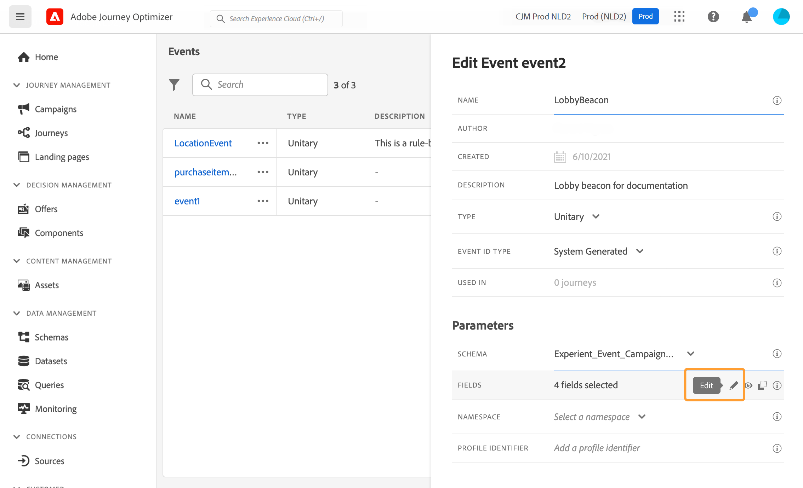
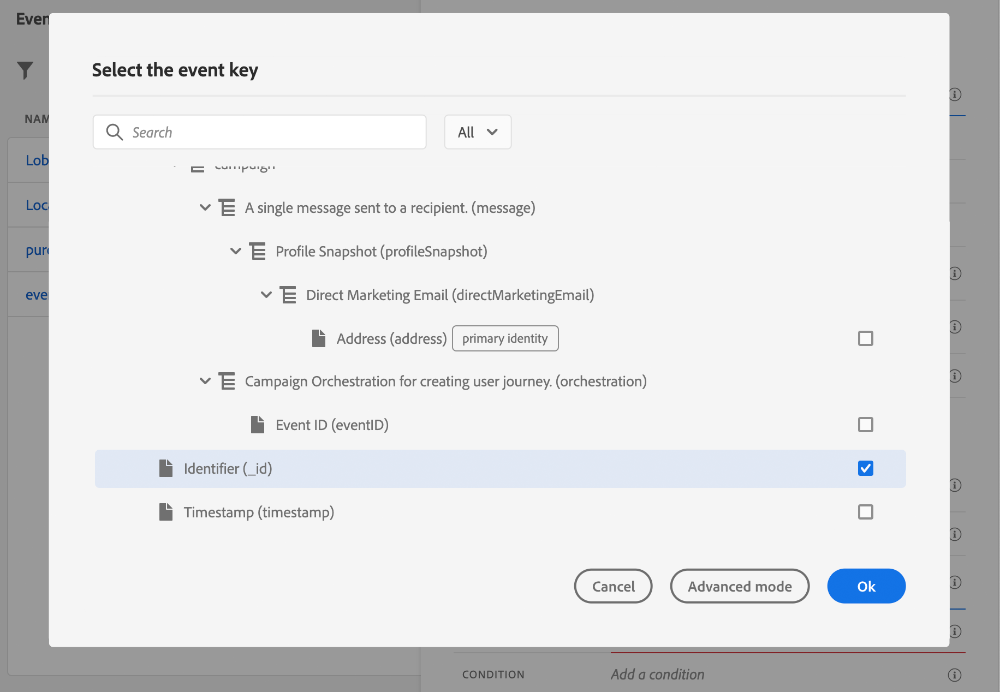

# Een eenheidsgebeurtenis configureren {#configure-an-event}

>[!CONTEXTUALHELP]
>id="ajo_journey_event_unitary"
>title="Unitaire gebeurtenissen"
>abstract="Met de gebeurtenisconfiguratie kunt u de informatie definiëren die Journey Optimizer ontvangt als gebeurtenissen. U kunt meerdere gebeurtenissen gebruiken (in verschillende stappen van een reis) en verschillende reizen kunnen dezelfde gebeurtenis gebruiken. Eenheidsgebeurtenissen zijn gekoppeld aan een specifiek profiel. Zij kunnen op regel-gebaseerd of systeem-geproduceerd zijn."

Eenheidsgebeurtenissen zijn gekoppeld aan een specifiek profiel. Zij kunnen op regel-gebaseerd of systeem-geproduceerd zijn.  Meer informatie over eenheidsgebeurtenissen [deze sectie](../event/about-events.md).

Hier volgen de eerste stappen voor het configureren van een nieuwe gebeurtenis:

1. Selecteer in de sectie van het menu ADMINISTRATIE de optie **[!UICONTROL Configurations]**. In de  **[!UICONTROL Events]** sectie, klikt u op **[!UICONTROL Manage]**. De lijst met gebeurtenissen wordt weergegeven.

   

1. Klik op **[!UICONTROL Create Event]** om een nieuwe gebeurtenis te maken. Het deelvenster voor gebeurtenisconfiguratie wordt aan de rechterkant van het scherm geopend.

   

1. Voer de naam van de gebeurtenis in. U kunt ook een beschrijving toevoegen.

   

   >[!NOTE]
   >
   >Gebruik geen spaties of speciale tekens. Gebruik niet meer dan 30 tekens.

1. In de **[!UICONTROL Type]** veld, kies **Unitair**.

   

1. In de **[!UICONTROL Event ID type]** Selecteer het type gebeurtenis-id dat u wilt gebruiken: **Op regel gebaseerd** of **Door systeem gegenereerd**. Meer informatie over id-typen gebeurtenissen in [deze sectie](../event/about-events.md#event-id-type).

   

1. Het aantal journey’s dat deze gebeurtenis gebruikt, wordt in het veld **[!UICONTROL Used in]** weergegeven. U kunt klikken op het pictogram **[!UICONTROL View journeys]** om de lijst weer te geven met journey’s die deze gebeurtenis gebruiken.

1. Definieer het schema en de payload velden: Hier selecteert u de gebeurtenisinformatie (gewoonlijk een lading genoemd) die reizen verwacht te ontvangen. U kunt deze informatie vervolgens gebruiken tijdens uw journey. Zie [deze sectie](../event/about-creating.md#define-the-payload-fields).

   

   >[!NOTE]
   >
   >Wanneer u **[!UICONTROL System Generated]** type, zijn alleen schema&#39;s beschikbaar die het veld eventID-type hebben. Wanneer u **[!UICONTROL Rule Based]** type, zijn alle schema&#39;s van de Gebeurtenis van de Ervaring beschikbaar.

1. Voor op regel-gebaseerde gebeurtenissen, klik binnen **[!UICONTROL Event ID condition]** veld. Gebruikend de eenvoudige uitdrukkingsredacteur, bepaal de voorwaarde die door het systeem zal worden gebruikt om de gebeurtenissen te identificeren die uw reis zullen teweegbrengen.
   

   In ons voorbeeld schreven we een voorwaarde op basis van de stad van het profiel. Dit betekent dat wanneer het systeem een gebeurtenis ontvangt die overeenkomt met deze voorwaarde (**[!UICONTROL City]** veld en **[!UICONTROL Paris]** waarde), zal het aan reizen doorgeven.

   >[!NOTE]
   >
   >De geavanceerde expressie-editor is niet beschikbaar bij het definiëren van de **[!UICONTROL Event ID condition]**. In de eenvoudige expressie-editor zijn niet alle operatoren beschikbaar, maar zijn ze afhankelijk van het gegevenstype. Voor een tekenreekstype kunt u bijvoorbeeld &quot;contains&quot; of &quot;equal to&quot; gebruiken.

1. Voeg een naamruimte toe. Deze stap is optioneel, maar wordt aangeraden, omdat u door het toevoegen van een naamruimte gegevens kunt gebruiken die zijn opgeslagen in de real-timeklantprofielservice. U definieert zo het type sleutel van de gebeurtenis. Zie [deze sectie](../event/about-creating.md#select-the-namespace).
1. Definieer de profiel-id: Kies een veld in uw payload-velden of definieer een formule om de persoon te identificeren die aan de gebeurtenis is gekoppeld. Deze sleutel wordt automatisch ingesteld (maar kan nog steeds worden bewerkt) als u een naamruimte selecteert. Reizen kiezen immers de sleutel die moet overeenkomen met de naamruimte (als u bijvoorbeeld een naamruimte voor e-mail selecteert, wordt de e-mailsleutel geselecteerd). Zie [deze sectie](../event/about-creating.md#define-the-event-key).

   

1. Klik op **[!UICONTROL Save]**.

   De gebeurtenis is nu geconfigureerd en klaar om in een journey worden gezet. Er zijn aanvullende configuratiestappen nodig om gebeurtenissen te ontvangen. Zie [deze pagina](../event/additional-steps-to-send-events-to-journey.md).

## De laadvelden definiëren {#define-the-payload-fields}

De ladingsdefinitie staat u toe om de informatie te kiezen het systeem van de gebeurtenis in uw reis verwacht te ontvangen en de sleutel om te identificeren welke persoon aan de gebeurtenis wordt geassocieerd. De nuttige lading is gebaseerd op de Experience Cloud XDM gebiedsdefinitie. Voor meer informatie over XDM, verwijs naar [Adobe Experience Platform-documentatie](https://experienceleague.adobe.com/docs/experience-platform/xdm/home.html?lang=nl){target=&quot;_blank&quot;}.

1. Selecteer een XDM-schema in de lijst en klik op de knop **[!UICONTROL Fields]** of op **[!UICONTROL Edit]** pictogram.

   

   Alle velden die in het schema zijn gedefinieerd, worden weergegeven. De lijst met velden verschilt per schema. U kunt naar een specifiek veld zoeken of de filters gebruiken om alle knooppunten en velden of alleen de geselecteerde velden weer te geven. Volgens de schemadefinitie zijn sommige velden mogelijk verplicht en vooraf geselecteerd. U kunt de selectie niet opheffen. Alle velden die verplicht zijn voor een goede ontvangst van de gebeurtenis tijdens de reis, zijn standaard geselecteerd.

   >[!NOTE]
   >
   >Voor systeem-geproduceerde gebeurtenissen, zorg ervoor dat u de &quot;orchestration&quot;gebiedsgroep aan het schema XDM hebt toegevoegd. Dit zal ervoor zorgen dat uw schema alle vereiste informatie bevat om met te werken [!DNL Journey Optimizer].

   

1. Selecteer de velden die u van de gebeurtenis wilt ontvangen. Dit zijn de gebieden die de bedrijfsgebruiker in de reis zal hefboomwerking hebben. Ze moeten ook de sleutel bevatten die wordt gebruikt om de persoon te identificeren die aan de gebeurtenis is gekoppeld (zie [deze sectie](../event/about-creating.md#define-the-event-key)).

   >[!NOTE]
   >
   >Voor door het systeem gegenereerde gebeurtenissen wordt de **[!UICONTROL eventID]** wordt automatisch toegevoegd aan de lijst met geselecteerde velden, zodat [!DNL Journey Optimizer] kan de gebeurtenis identificeren. Het systeem dat de gebeurtenis duwt zou geen identiteitskaart moeten produceren, zou het moeten gebruiken beschikbaar in de voorproef van de lading. Zie [deze sectie](../event/about-creating.md#preview-the-payload).

1. Als u de gewenste velden hebt geselecteerd, klikt u op **[!UICONTROL Ok]** of drukken **[!UICONTROL Enter]**.

   Het aantal geselecteerde velden wordt weergegeven in het dialoogvenster **[!UICONTROL Fields]** veld.

   

## De naamruimte selecteren {#select-the-namespace}

Met de naamruimte kunt u het type sleutel definiëren waarmee de persoon wordt geïdentificeerd die aan de gebeurtenis is gekoppeld. De configuratie is optioneel. Dit is vereist als u tijdens uw reizen aanvullende informatie wilt opvragen die afkomstig is van de [Klantprofiel in realtime](https://experienceleague.adobe.com/docs/experience-platform/profile/home.html?lang=nl){target=&quot;_blank&quot;}. De naamruimtedefinitie is niet nodig als u alleen gegevens gebruikt die afkomstig zijn van een systeem van derden via een aangepaste gegevensbron.

U kunt een van de vooraf gedefinieerde naamruimten gebruiken of een nieuwe naamruimte maken met de service Identiteitsnaamruimte. Zie [Adobe Experience Platform-documentatie](https://experienceleague.adobe.com/docs/experience-platform/identity/home.html?lang=nl){target=&quot;_blank&quot;}.

Als u een schema met een primaire identiteit selecteert, **[!UICONTROL Profiler identifier]** en **[!UICONTROL Namespace]** velden worden vooraf ingevuld. Als er geen identiteit is gedefinieerd, selecteren we _identityMap > id_ als primaire sleutel. Vervolgens moet u een naamruimte selecteren en wordt de sleutel vooraf ingevuld (onder de **[!UICONTROL Namespace]** veld) gebruiken _identityMap > id_.

Wanneer u velden selecteert, worden primaire identiteitsvelden gecodeerd.

Selecteer een naamruimte in de vervolgkeuzelijst.

Per reis is slechts één naamruimte toegestaan. Als u meerdere gebeurtenissen gebruikt op dezelfde reis, moeten ze dezelfde naamruimte gebruiken. Zie [deze pagina](../building-journeys/journey.md).

## De profiel-id definiëren {#define-the-event-key}

De sleutel is het veld, of de combinatie van velden, dat deel uitmaakt van de gegevens voor gebeurtenislading en waarmee het systeem de persoon kan identificeren die aan de gebeurtenis is gekoppeld. De sleutel kan bijvoorbeeld de Experience Cloud-id, een CRM-id of een e-mailadres zijn.

Als u gegevens wilt gebruiken die zijn opgeslagen in de Adobe Real-Time Customer Profile-database, moet de sleutel van de gebeurtenis de informatie zijn die u als profielidentiteit hebt gedefinieerd in het dialoogvenster [Real-time service voor klantprofiel](https://experienceleague.adobe.com/docs/experience-platform/profile/home.html){target=&quot;_blank&quot;}.

Met de profiel-id kan het systeem de afstemming tussen de gebeurtenis en het profiel van de persoon uitvoeren. Als u een schema met een primaire identiteit selecteert, **[!UICONTROL Profile identifier]** en **[!UICONTROL Namespace]** velden worden vooraf ingevuld. Als er geen identiteit is gedefinieerd, wordt _identityMap > id_ is de primaire sleutel. Vervolgens moet u een naamruimte selecteren en wordt de sleutel automatisch vooraf ingevuld met _identityMap > id_.

Wanneer u velden selecteert, worden primaire identiteitsvelden gecodeerd.

Als u een andere sleutel moet gebruiken, zoals een CRM-id of een e-mailadres, moet u deze handmatig toevoegen, zoals hieronder wordt uitgelegd:

1. Klik in het dialoogvenster **[!UICONTROL Profile identifier]** of op het potloodpictogram.

   

1. Selecteer het veld dat u als de sleutel hebt gekozen in de lijst met ladingsvelden. U kunt ook overschakelen naar de geavanceerde expressie-editor om complexere sleutels te maken (bijvoorbeeld een samenvoeging van twee velden van de gebeurtenissen).

   

Wanneer de gebeurtenis wordt ontvangen, laat de waarde van de sleutel het systeem toe om de persoon te identificeren verbonden aan de gebeurtenis. Gekoppeld aan een naamruimte (zie [deze sectie](../event/about-creating.md#select-the-namespace)), kan de sleutel worden gebruikt om vragen op Adobe Experience Platform uit te voeren. Zie [deze pagina](../building-journeys/about-journey-activities.md#orchestration-activities).
De sleutel wordt ook gebruikt om te controleren of een persoon op reis is. Een persoon kan namelijk niet op twee verschillende plaatsen op dezelfde reis zijn. Als gevolg hiervan staat het systeem niet toe dat dezelfde sleutel, bijvoorbeeld de sleutel CRMID=3224, zich op verschillende plaatsen op dezelfde reis bevindt.

U hebt ook toegang tot de geavanceerde expressiefuncties (**[!UICONTROL Advanced mode]**) als u aanvullende bewerkingen wilt uitvoeren. Met deze functies kunt u de waarden manipuleren die worden gebruikt voor het uitvoeren van specifieke query&#39;s, zoals het wijzigen van de opmaak, het uitvoeren van veldsamenvoegingen, waarbij alleen rekening wordt gehouden met een deel van een veld (bijvoorbeeld de eerste 10 tekens). Zie deze [pagina](../building-journeys/expression/expressionadvanced.md).

## Een voorvertoning van de lading weergeven {#preview-the-payload}

Met de voorvertoning van de lading kunt u de definitie van de lading valideren.

>[!NOTE]
>
>Wanneer u een gebeurtenis maakt die door het systeem wordt gegenereerd, slaat u de gebeurtenis op voordat u deze weergeeft. Deze stap is nodig om een gebeurtenis-id in de lading te produceren.

1. Klik op de knop **[!UICONTROL View Payload]** pictogram voor een voorvertoning van de lading die door het systeem wordt verwacht.

   

   U ziet dat de geselecteerde velden worden weergegeven.

   

1. Controleer de voorvertoning om de definitie van de payload te valideren.

1. Vervolgens kunt u de voorvertoning van de lading delen met de persoon die verantwoordelijk is voor het verzenden van de gebeurtenis. Deze nuttige lading kan hen helpen de opstelling ontwerpen van een gebeurtenis die duikt aan [!DNL Journey Optimizer]. Zie [deze pagina](../event/additional-steps-to-send-events-to-journey.md).
