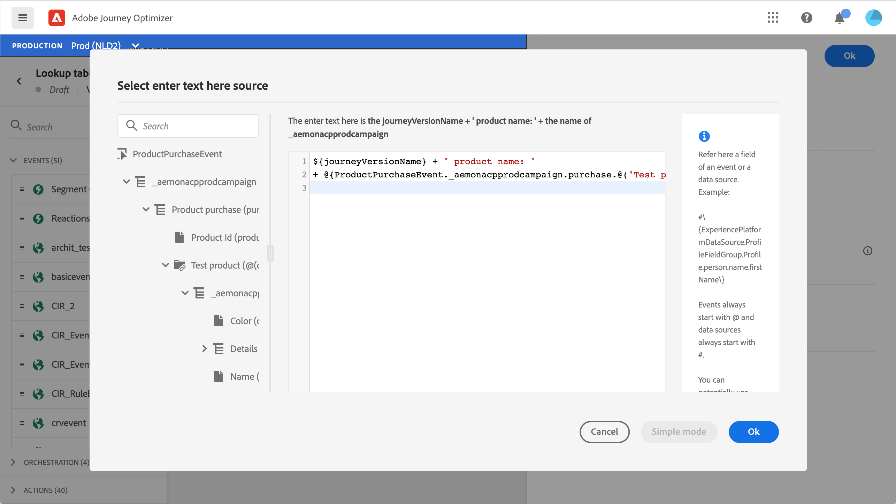

# Over ExperienceEvent-schema&#39;s voor [!DNL Journey Optimizer] Gebeurtenissen {#about-experienceevent-schemas}

[!DNL Journey Optimizer] Gebeurtenissen zijn XDM Experience Events die via Streaming Ingestie naar Adobe Experience Platform worden verzonden.

Een belangrijke voorwaarde voor het instellen van gebeurtenissen voor [!DNL Journey Optimizer] is dat u bekend bent met het gegevensmodel van de Ervaring van Adobe Experience Platform (of XDM) en hoe te om de schema&#39;s van de Gebeurtenis van de Ervaring XDM samen te stellen, evenals hoe te om XDM-Geformatteerde gegevens aan Adobe Experience Platform te stromen.

## Schemavereisten voor [!DNL Journey Optimizer] Gebeurtenissen  {#schema-requirements}

De eerste stap bij het instellen van een gebeurtenis voor [!DNL Journey Optimizer] moet ervoor zorgen dat u een XDM-schema hebt dat wordt bepaald om de gebeurtenis te vertegenwoordigen, en een dataset die wordt gecreeerd om instanties van de gebeurtenis op Adobe Experience Platform te registreren. Het hebben van een dataset voor uw gebeurtenissen is niet strikt noodzakelijk, maar het verzenden van de gebeurtenissen naar een specifieke dataset zal u toestaan om gebruikers&#39; gebeurtenisgeschiedenis voor toekomstige verwijzing en analyse te handhaven, zodat is het altijd een goed idee. Als u nog geen geschikt schema en een geschikte dataset voor uw gebeurtenis hebt, kunnen beide taken in de Webinterface van Adobe Experience Platform worden gedaan.

Om het even welk XDM schema dat voor zal worden gebruikt [!DNL Journey Optimizer] evenementen moeten aan de volgende eisen voldoen :

* Het schema moet van de klasse XDM ExperienceEvent zijn.

   

* Voor systeem-geproduceerde gebeurtenissen, moet het schema de Orchestration eventID gebiedsgroep omvatten. [!DNL Journey Optimizer] gebruikt dit veld om gebeurtenissen te identificeren die tijdens reizen worden gebruikt.

   

* Declareer een identiteitsveld voor het identificeren van het onderwerp van de gebeurtenis. Als er geen identiteit is opgegeven, kan een identiteitskaart worden gebruikt. Dit wordt niet aanbevolen.

   

* Als u deze gegevens voor raadpleging later in een Reis beschikbaar zou willen zijn, merk het schema en de dataset voor profiel.

   

   

* U kunt gegevensvelden vrij gebruiken om andere contextgegevens vast te leggen die u met de gebeurtenis wilt opnemen, zoals informatie over de gebruiker, het apparaat waaruit de gebeurtenis is gegenereerd, de locatie of andere betekenisvolle omstandigheden die met de gebeurtenis verband houden.

   

   

## Schema-relaties benutten{#leverage_schema_relationships}

Adobe Experience Platform staat u toe om verhoudingen tussen schema&#39;s te bepalen om één dataset als raadplegingslijst voor een andere te gebruiken.

Laten we zeggen dat uw model met merkgegevens een schema heeft voor het vastleggen van aankopen. U hebt ook een schema voor de productcatalogus. U kunt de product-id vastleggen in het aankoopschema en een relatie gebruiken om de volledige productdetails uit de productcatalogus op te zoeken. Hierdoor kunt u een segment maken voor alle klanten die bijvoorbeeld een laptop hebben gekocht, zonder dat u expliciet alle laptop-id&#39;s hoeft op te geven of elke productdetails in transactiesystemen hoeft vast te leggen.

Als u een relatie wilt definiëren, moet u een speciaal veld in het bronschema hebben, in dit geval het veld product-id in het aankoopschema. Dit gebied moet het gebied van productID in het bestemmingsschema van verwijzingen voorzien. De bron en bestemmingstabellen moeten voor profielen worden toegelaten en het bestemmingsschema moet dat gemeenschappelijke gebied hebben dat als zijn primaire identiteit wordt bepaald.

Hier volgt het productcatalogusschema dat is ingeschakeld voor profiel met de product-id die is gedefinieerd als de primaire identiteit.

Hier volgt het aankoopschema met de relatie die is gedefinieerd in het veld product-id.

>[!NOTE]
>
>Meer informatie over schema-relaties in het dialoogvenster [Documentatie Experience Platform](https://experienceleague.adobe.com/docs/platform-learn/tutorials/schemas/configure-relationships-between-schemas.html?lang=en).

In Journey Optimizer kunt u vervolgens alle velden uit de gekoppelde tabellen benutten:

* bij de configuratie van een bedrijfs- of monitaire gebeurtenis, [Meer informatie](../event/experience-event-schema.md#unitary_event_configuration)
* bij het gebruik van omstandigheden tijdens een reis, [Meer informatie](../event/experience-event-schema.md#journey_conditions_using_event_context)
* in berichtverpersoonlijking, [Meer informatie](../event/experience-event-schema.md#message_personalization)
* op maat van aangepaste handelingen, [Meer informatie](../event/experience-event-schema.md#custom_action_personalization_with_journey_event_context)

### Configuratie van gebeurtenissen{#unitary_event_configuration}

De gekoppelde schemavelden zijn beschikbaar in de configuratie van een eenheidsgebeurtenis en bedrijfsgebeurtenis:

* wanneer het doorbladeren door de gebieden van het gebeurtenisschema in het scherm van de gebeurtenisconfiguratie.
* wanneer het bepalen van een voorwaarde voor systeem-geproduceerde gebeurtenissen.

De gekoppelde velden zijn niet beschikbaar:

* in de sleutelformule voor gebeurtenissen
* in event id condition (op regel gebaseerde gebeurtenissen)

Als u wilt weten hoe u een eenheidsgebeurtenis configureert, raadpleegt u deze [page](../event/about-creating.md).

### Reisomstandigheden met gebeurteniscontext{#journey_conditions_using_event_context}

U kunt gegevens van een raadplegingslijst gebruiken verbonden met een gebeurtenis die in een reis voor voorwaardenbouw (uitdrukkingsredacteur) wordt gebruikt.

Voeg een voorwaarde toe in een reis, geef de uitdrukking uit en ontvouw de gebeurtenisknoop in de uitdrukkingsredacteur.

Als u wilt leren hoe u de reisvoorwaarden definieert, raadpleegt u deze [page](../building-journeys/condition-activity.md).

### Berichtpersonalisatie{#message_personalization}

De gekoppelde velden zijn beschikbaar wanneer u een bericht personaliseert. De verwante gebieden worden getoond in de context die van de reis tot het bericht wordt overgegaan.

Als u wilt leren hoe u een bericht kunt personaliseren met contextuele informatie over reizen, raadpleegt u deze [page](../personalization/personalization-use-case.md).

### Aangepaste actie-personalisatie met context van reisgebeurtenis{#custom_action_personalization_with_journey_event_context}

De verbonden gebieden zijn beschikbaar wanneer het vormen van de actieparameters van een actie van de reisdouane.

Raadpleeg deze voor meer informatie over het gebruik van aangepaste handelingen [page](../building-journeys/using-custom-actions.md).
